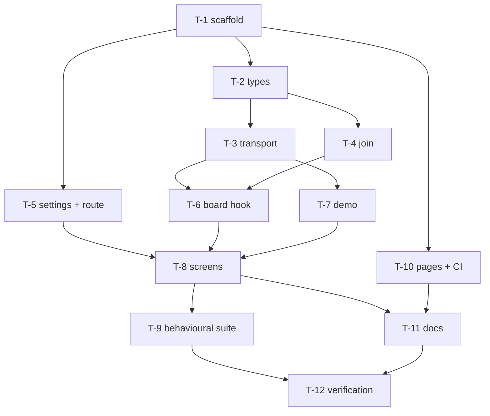

# Tasks: a control-plane dashboard over `/api/v1`

> The last spec artifact. Derived from [`design.md`](design.md) and
> [`testing-plan.md`](testing-plan.md).

## Task list

### T-1 — scaffold `ui/`

Vite + React + TypeScript, bun as the package manager, oxlint (type-aware) and vitest.
Strict compiler settings including `noUncheckedIndexedAccess` and
`exactOptionalPropertyTypes`. Vendor the design-system stylesheet as
`src/styles/industry.css` with a do-not-hand-edit header, and lift the prototype's inline
declarations into `src/styles/app.css`.

*Requirements:* NFR2, NFR3 · *Done when:* `bun run lint`, `bun run typecheck`, `bun run
build` all pass on an empty app.

### T-2 — the record types

`src/api/types.ts`, written against `docs/cli/state.md` and `graph/runtime.py`, with every
field a client did not put there optional.

*Requirements:* R1.1, R1.2 · *Depends on:* T-1

### T-3 — the transport

`src/api/client.ts`: `TheLoopApi`, `HttpApi`, `ApiError` with `advice`. Tests first (T2 in
the plan) — the cross-origin case is the one that matters.

*Requirements:* R3.1, R3.2, R3.3, R5.3, R5.4 · *Depends on:* T-2

### T-4 — the join

`src/api/model.ts` and its unit tests (T1). Ref parsing, spec-id derivation, rails,
`buildWorkItemViews`, `attentionEntries`, `transcriptPath`.

*Requirements:* R1.1–R1.5, R2.1, R2.3, R2.4, R4.1–R4.3 · *Depends on:* T-2

### T-5 — settings and routing

`src/state/settings.ts` (validated `localStorage`, tests) and `src/state/route.ts` (hash
router).

*Requirements:* R5.2, R5.6, abuse case 4 · *Depends on:* T-1

### T-6 — the board hook

`src/state/useControlPlane.ts`: two rounds, four-worker graph pool, per-job failure
swallowing, polling, abort on unmount and on target change.

*Requirements:* R1.2, R1.3, R3.4, NFR1 · *Depends on:* T-3, T-4

### T-7 — the demo transport

`src/demo/fixture.ts` + `src/demo/client.ts`, using the node ids the shipped graphs
actually use. Includes the `session.awaiting_input` event the proposed verb would emit, so
the disabled reply card is visible.

*Requirements:* R5.5 · *Depends on:* T-3

### T-8 — the screens

`src/components/*` (blueprint frame, node rail, session dot, nav, banners) and
`src/views/*` (dashboard, detail, attention, events, settings). The reply box and the
turns-and-tool-calls trace are rendered **disabled**, naming the missing route.

*Requirements:* R1.4, R1.5, R2.1, R2.2, R2.4, R2.5, R3.1, R3.2, R4.3, R5.3, R5.4, NFR3,
NFR4 · *Depends on:* T-5, T-6, T-7

### T-9 — the behavioural suite

`src/App.test.tsx` against the demo transport, selecting only by role and accessible name.

*Requirements:* R2.5, R5.5, R5.6, NFR4 (T4, T9) · *Depends on:* T-8

### T-10 — one Pages artifact for two apps

Rewrite `.github/workflows/docs.yml` to build the docs, build the dashboard with
`UI_BASE=/the-loop/ui/`, copy `ui/dist` into the VitePress output under `ui/`, and upload
the combined artifact. Add a `ui` job to `ci.yml` running lint, test and build on every
pull request.

*Requirements:* R5.1, NFR2 · *Depends on:* T-1

### T-11 — the paper trail

`ui/README.md` (how to run it, how to reach a service, where each screen's data comes
from, what is not served yet), and update
`docs/capabilities/control-plane.md` — the capability currently states that a UI is future
work.

*Requirements:* all · *Depends on:* T-8, T-10

### T-12 — verification

Execute every in-scope row of the testing plan, including the manual pass (T11) against a
real service, and commit evidence.

*Depends on:* T-9, T-10, T-11

## Dependency graph (DAG)

Two independent roots after T-1: the data path (T-2 → T-3/T-4 → T-6) and the deployment
path (T-10).

## Checkpoints

| After | What must be true |
|-------|-------------------|
| T-4 | The join is fully unit-tested with no React in the picture |
| T-8 | Every screen renders against the demo transport |
| T-10 | A Pages build produces `/the-loop/` **and** `/the-loop/ui/` from one artifact |
| T-12 | Every in-scope testing-plan row executed, gaps in § Coverage gaps still accurate |

## Review comments

<!-- Populated at review. -->
