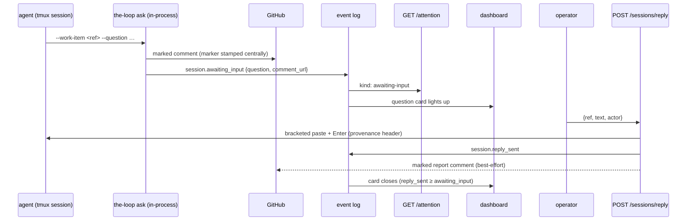

# Design: `the-loop ask` + `POST /api/v1/sessions/reply`

> Phase 2 of the chain. Derives from [`requirements.md`](requirements.md). Ticket:
> [#208](https://github.com/MadaraUchiha-314/the-loop/issues/208).

## Overview

**Two core functions, one route, one CLI verb, zero new machinery.** Both halves are
compositions of parts the codebase already trusts: `authz.mark_self_authored` (the
marker's one producer/consumer module), `comments.post_issue_comment` (the operator's
`gh`), `eventlog.emit` (the audit trail), `TmuxRunner.deliver` (bracketed paste — the
exact mechanism every webhook event already arrives by), and the `core/sessions.py`
facade every surface funnels through.



The deliberate absences:

- **No `POST /sessions/ask` route, no MCP tools.** The ticket scopes the reply route as
  the only new API surface. More substantively: `ask` is the escalation path — the one
  verb that must work when the service is down, half-configured, or absent (a cloud
  session has no daemon at all) — so it executes in-process, the same exception class as
  `sessions attach`/`reset`. It still lives in `core/sessions.py`, so a route/tool later
  is a two-line binding, not a port.
- **No respawn from the reply path.** `TmuxRunner.deliver` reporting `session_missing`
  is the dispatcher's cue to respawn; here it is a 404. A reply answers an agent that is
  waiting; it must never manufacture one to answer (abuse case 2).
- **No new close-the-wait plumbing for ticket answers.** An operator may still answer on
  the ticket; the poller forwards it as before, but no `session.reply_sent` is emitted,
  so the attention row/card stays lit until a control-plane reply happens. Recorded as a
  known gap (§ Error handling) rather than half-solved by teaching the poller to guess
  which forwarded comment was "the answer".

## Components & interfaces

### `core/sessions.py — ask_session(...)`

```python
def ask_session(ref, question, config=None) -> Dict[str, Any]
```

1. `WorkItemRef.parse(ref)` (`ValueError` → CLI exit 2, R1.4); refuse
   empty/whitespace `question` the same way.
2. `body = mark_self_authored(question)` — **the central stamp** (idempotent, so a
   question already carrying a marker is unchanged). The question is the agent's own
   composition; marking it is exactly the "text the-loop itself composed" case
   `authz.py` licenses.
3. `post_issue_comment(...)` with `routing.control`'s gh binary — extended (below) to
   also return the created comment's `html_url`.
4. `eventlog.emit("session.awaiting_input", work_item=…, question=…, actor=…,
   comment_url=…, comment_posted=…)` — emitted on the post-failure path too (R1.3),
   at level `warning` there so `attention`'s error scan does not double-report it.
5. Returns the `{messages, exitCode}` shape every session verb returns; exit 0 only
   when the comment posted.

The actor is `getpass.getuser()` — recorded for the audit trail, never trusted as auth
(the same stance as every `_local_actor()` call site).

### `comments.py` — returning the comment URL

`post_issue_comment` keeps its `(ok, error)` contract for its three existing callers; a
sibling `post_issue_comment_with_url` returns `(ok, error, html_url)` by parsing `gh`'s
JSON response, and the two share one private implementation so they cannot drift. An
unparsable response degrades to an empty URL, never to a failed post.

### `core/sessions.py — reply_session(...)`

```python
def reply_session(ref, text, actor="", comment=True, config=None,
                  registry_dir="", portable_dir="") -> Dict[str, Any]
```

1. Parse ref; refuse empty/whitespace `text` (`ValueError` → 400, R2.5).
2. `SessionRegistry.find_by_work_item` — `None` → `LookupError` → 404 (R2.3).
3. Paused → `ValueError` ("paused; resume it first") → 400 (R2.4).
4. `TmuxRunner().deliver(session, framed)` where `framed` is:

   ```text
   Reply from the operator via the-loop control plane[ (actor)] to your question on <ref>:

   <text>
   ```

   `session_missing` (no target recorded, session gone, pane dead) → `LookupError` →
   404 with "answer on the ticket, or start/resume the work item" guidance — the
   respawn machinery is not touched. Any other tmux failure → exit-code-1 result with
   the error in `messages` (transient; the caller may retry).
5. `eventlog.emit("session.reply_sent", work_item=…, actor=…)`.
6. `comment=True` (default): best-effort marked report on the ticket —
   `mark_self_authored("🗣️ **the-loop** delivered a reply … via the control plane" +
   the reply, blockquoted)`. The comment is the-loop's own *report of a delivery*
   (quoting the operator, as `control.command`'s comments quote the actor), which is
   what licenses the marker — and the marker is what stops the poller from delivering
   the same answer twice (abuse case 4). Failure to post is a warning in `messages`,
   never a failed reply — mirroring `_announce`.

### `api/app.py` — the route

```python
class SessionReplyBody(BaseModel):
    ref: str
    text: str
    actor: str = ""
    comment: bool = True

@app.post(f"{API_PREFIX}/sessions/reply", operation_id="replySession")
```

One delegation line, like every other route; the existing exception handlers do the
400/404 mapping; the `_audit` middleware records `api.request`. The authored contract
(`docs/api-specs/openapi/the-loop.v1.yaml`) gains the matching path — the parity test
enforces the pair.

### `commands/ask_cmd.py` — the CLI verb

`the-loop ask --work-item <ref> (--question <text> | --question-file <path>)`.
A renderer over `core.sessions.ask_session` invoked **in-process** (R1.5) — the module
docstring carries the why, since it breaks the "core capabilities route through the
service" default deliberately. `--question-file` exists because agents ask multi-line
markdown questions, and a shell-quoted argument is where those go to get mangled;
`-` reads stdin.

### `core/attention.py` — the `awaiting-input` kind

After the existing scans, query the event log for both event types (one query, same
`query_events` the error scan uses) and apply the open/answered rule: per work item,
the latest `awaiting_input` is open unless a `reply_sent` is at least as new — the
**same rule** `ui/src/api/model.ts::awaitingInput` implements, named in both places so
a change to one is a reviewable change to the other. Detail carries the question text.

### `interaction.py` — the directive

`_WORK_ITEM_DIRECTIVE` tells the agent to run
`the-loop ask --work-item <your work item ref> --question '…'` (constant text, no
interpolation — the no-payload-path invariant of issue-134 is preserved), explains that
the verb stamps the marker and records the wait, and keeps manual `gh` + marker as the
stated fallback when the CLI is unavailable. `_CLI_DIRECTIVE` is unchanged: a human on
the terminal answers there.

### `eventlog.py` — the catalog

`session.awaiting_input` and `session.reply_sent` join `EVENT_TYPES` (and the
observability reference that mirrors it; `test_docs_parity` and `events --types` read
from here).

### UI (`ui/src`) — the card's reply box goes live (R5)

- `api/client.ts`: `replySession(ref, text, actor)` → `POST /sessions/reply`.
- `demo/client.ts`: `replySession` emits `session.reply_sent` in-memory — the demo
  transport's stated convention is that control verbs *behave* (its pause/approve
  already mutate the fixture), and the card closing on reply is exactly the behaviour
  being demoed.
- `WorkItemDetail.tsx`: textarea/button enabled; submit posts, surfaces the error on
  failure, clears and refreshes on success (`onChanged`, so the events re-derive and
  the card closes). The `REPLY_BLOCKED` copy and stale docstrings go.
- `model.ts` / `useControlPlane.ts` / `App.tsx` / `ui/README.md`: the "nothing emits
  this yet" comments updated to name the shipped verb/route.

## Data models

Two event shapes (documented in `EVENT_TYPES`, queryable via `/events`):

```json
{"event": "session.awaiting_input", "work_item": "github:o/r#7",
 "question": "…", "actor": "onika", "comment_url": "https://…", "comment_posted": true}
{"event": "session.reply_sent", "work_item": "github:o/r#7", "actor": "onika"}
```

No registry, control-store or config schema change: the wait is **derived from the
event log**, exactly like `attention`'s existing kinds — a design the module's own
docstring ("derived, never stored") already mandates.

## Error handling

| Failure | Behaviour |
|---------|-----------|
| `ask`: malformed ref / empty question | exit 2, nothing posted, nothing emitted (R1.4) |
| `ask`: `gh` missing or failing | stderr reason, exit 1, event still emitted with `comment_posted: false` at level warning (R1.3) |
| `reply`: no session / dead or absent pane | 404, no respawn (R2.3) |
| `reply`: paused session | 400 "resume it first" (R2.4) |
| `reply`: transient tmux error | 200 with `exitCode: 1` and the tmux error in `messages` (same convention as control verbs' noop failures) |
| `reply`: report comment fails | reply already delivered; warning in `messages` (mirrors `_announce`) |
| answered on the ticket instead | **known gap**: no `reply_sent` is emitted, the attention row stays lit until a control-plane reply. Honest over clever — the poller cannot know which forwarded comment answered the question. |

## Security design

Each abuse case in the requirements, its mechanism, and where it is tested:

1. **Reply as injection** — posture unchanged in kind (NFR3): the loopback bind, the
   exposure guard and the CORS exact-origin allowlist already front `sessions/control`;
   the reply is framed with a provenance header; `session.reply_sent` plus
   `api.request` are the audit trail.
   *Test: T8 (the route is served under the same app/middleware as control — asserted
   by the contract test covering both).*
2. **No revive/spawn** — 404 on missing/dead sessions, dispatcher untouched.
   *Test: T2 negative scenarios.*
3. **Pause honoured** — 400 on paused. *Test: T2.*
4. **No double delivery** — the report comment is marked; router/poller drop marked
   bodies (existing, tested machinery). *Test: T2 asserts the posted body carries
   `SELF_COMMENT_MARKER`.*
5. **Central marker on questions** — `mark_self_authored` in `ask_session`, idempotent.
   *Test: T1/T2 assert marker + attribution on the posted body.*

## Testing strategy

Detailed in [`testing-plan.md`](testing-plan.md): unit tests over the two core
functions with injected `gh` runner and monkeypatched `TmuxRunner`; integration
(Gherkin) tests over the route via `TestClient`; contract parity; docs parity; UI unit
tests over the enabled reply box; lint/format/type gates.

## Minimalism notes

- Rejected: an `ask` API route + MCP tool (out of ticket scope; add when a consumer
  exists).
- Rejected: teaching the poller to emit `reply_sent` for ticket answers (guessing).
- Rejected: a config switch for the reply route (the origin/exposure posture already
  governs it; an off switch that `sessions/control` does not have would imply a
  privilege difference that does not exist).
- Reused: `mark_self_authored`, `post_issue_comment`, `TmuxRunner.deliver`,
  `query_events`, the `{messages, exitCode}` verb shape, the 400/404 exception mapping.
