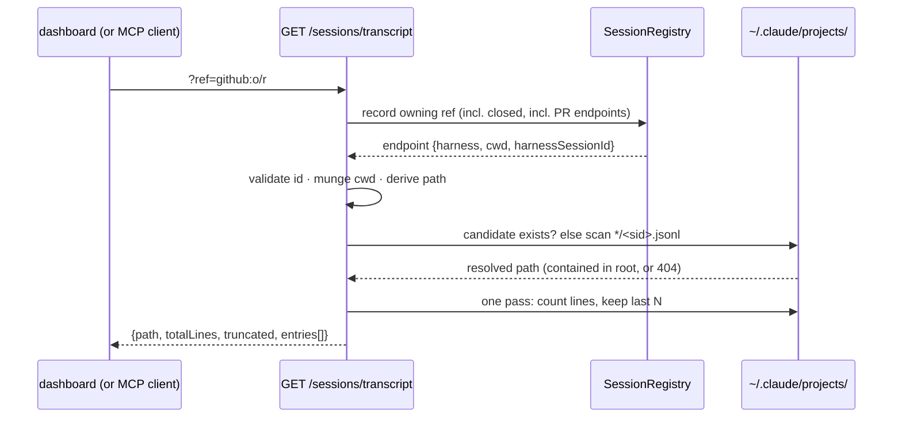

# Design: `GET /api/v1/sessions/transcript`

> Phase 2 of the chain. Derives from [`requirements.md`](requirements.md). Ticket:
> [#209](https://github.com/MadaraUchiha-314/the-loop/issues/209).

## Overview

**One core function, one route, one MCP tool, and the UI wiring — no new machinery.**
The session record already holds both halves of the path (`cwd`,
`harnessSessionId`); the new code is the resolution (munge → candidate → fallback
scan → containment check) and a bounded tail read. Everything else is existing
plumbing: the `core/sessions.py` facade, the 400/404 exception mapping, the
`api.request` audit middleware, the contract-parity test, and the UI's
client/`useAsync`/trace-panel scaffolding that issue-207 shipped disabled.



The deliberate absences:

- **No CLI verb.** The CLI runs on the machine the file is on; `the-loop sessions`
  already surfaces the session, the UI displays the path, and `tail -f`/`jq` are
  better transcript tools than anything a verb would print. The route exists for the
  clients that *cannot* open the file — the dashboard and MCP. A verb later is a
  three-line renderer over the same core function.
- **No redaction layer.** The JSONL is raw harness output and may carry whatever the
  agent read (abuse case 2). The service cannot know which substrings are secrets; a
  pattern-based half-redactor would be a promise the route cannot keep. The honest
  boundary is the network posture (loopback + exposure guard + CORS, decision-059)
  and the audit trail — stated, not implied.
- **No Cursor support.** Cursor keeps chats in an undocumented SQLite store; the
  route refuses with a 404 that says so (R2.4) rather than reverse-engineering
  another tool's private format. Same scope call as #207 and the ticket itself.
- **No streaming/range protocol.** `tail` answers the actual question ("what has it
  been doing lately") in one bounded response. A byte-range or SSE follow-mode is a
  live-tail feature with no consumer yet; the response shape (`totalLines`,
  `truncated`) leaves room for a `range` parameter later without breaking anyone.

## Components & interfaces

### `core/sessions.py — get_transcript(...)`

```python
def get_transcript(ref, tail=200, config=None, registry_dir="") -> Dict[str, Any]
```

1. `WorkItemRef.parse(ref)` (`ValueError` → 400); `tail < 0` is refused by the
   route's validation (`ge=0`) and by a `ValueError` here for non-HTTP callers.
2. **Endpoint resolution, closed included** (R1.4): `find_by_work_item(...,
   include_closed=True)`; when that misses, scan `list_sessions()` for the record
   whose `endpoint_for(ref)` answers — the same one-cheap-read-then-scan shape as
   `record_owning`, which is not reused verbatim only because it filters to live
   records. No endpoint → `LookupError` → 404 (R2.3).
3. **Harness gate** (R2.4): endpoint's `harness != "claude"` → `LookupError` naming
   the reason (Cursor's store is undocumented).
4. **Id validation** (R2.2): empty, `/` or `\`, or `..` anywhere →
   `LookupError` ("not a derivable transcript file name"). Registry data is
   API-writable; this fails closed before any filesystem touch.
5. **Path derivation** (R1.2): projects root =
   `($CLAUDE_CONFIG_DIR or ~/.claude)/projects`; directory = the **per-character**
   munge `re.sub(r"[^A-Za-z0-9]", "-", cwd)` — verified against a real Claude Code
   layout (`/home/user/the-loop` → `-home-user-the-loop`); candidate =
   `<root>/<munged>/<sid>.jsonl`. When the candidate is not a file, scan the root's
   immediate subdirectories for `<sid>.jsonl` (session ids are UUIDs — effectively
   unique — and the scan is over a listing of project dirs, not a recursive walk).
6. **Containment** (R2.1): `resolved = candidate.resolve()`; unless
   `resolved.is_relative_to(root.resolve())` and `resolved.is_file()`, the answer is
   the same `LookupError` as a missing file — a symlink escape reads as "no
   transcript", never as a different error that would leak what was probed.
7. **Bounded tail** (R1.3, NFR3): one pass over the open file counting every line
   and appending to `collections.deque(maxlen=tail or None)`. Each kept line is
   `json.loads`-parsed; a line that is not valid JSON **or not an object** comes
   back as `{"malformed": "<line>"}` (R1.1) — dropped data is worse than ugly data.
8. Returns:

   ```json
   {"workItem": "github:o/r#35", "harness": "claude",
    "harnessSessionId": "0f1c…", "path": "/home/op/.claude/projects/-home-…/0f1c….jsonl",
    "totalLines": 812, "truncated": true, "entries": [{"…": "…"}]}
   ```

   No `messages`/`exitCode` envelope: this is a read like `get_session`, not a verb.

### `api/app.py` — the route

```python
@app.get(f"{API_PREFIX}/sessions/transcript", operation_id="sessionTranscript")
def session_transcript(ref: str = Query(...), tail: int = Query(200, ge=0)) -> Dict[str, Any]
```

One delegation line; the ref travels as a query parameter (never a path segment —
refs contain `/` and `#`); the existing handlers map `ValueError`/`LookupError`; the
`_audit` middleware records every read as `api.request`. The authored contract
gains the matching path — the parity test enforces the pair (R3.1).

### `api/mcp.py` — the tool

`session_transcript(ref, tail=200)`, a one-liner over the core function, registered
beside the other reads (R3.2). The MCP exclusions are for destructive or
forgeable-attribution operations; a bounded read is squarely what the surface is for.

### UI (`ui/src`) — the trace panel goes live (R4)

- `api/types.ts`: `TranscriptEntry` (an object, fields unknown to the contract) and
  `TranscriptResponse` mirroring the core shape.
- `api/client.ts`: `transcript(ref, tail?)` on `TheLoopApi` + `HttpApi`.
- `demo/client.ts` / `demo/fixture.ts`: a small fixture transcript for the demo work
  item with a session — the demo transport's convention is that surfaces *behave*.
  Refs without one reject, which exercises the fallback.
- `api/model.ts`: `transcriptPath` switches to the per-character munge (R4.4, kept
  as the caption beside the panel); a new `transcriptTurns(entries)` projects
  Claude Code JSONL entries (`type`, `message.role`, `message.content[]` blocks of
  `text`/`tool_use`/`tool_result`) into render-ready rows `{kind, time, text,
  tools[]}` — tolerant of unknown shapes, `malformed` lines surfaced as their own
  kind, never a crash on a field that is not there.
- `views/WorkItemDetail.tsx`: `useAsync` keyed on the selected trace ref fetches the
  transcript; success renders turn rows (+ a "tail of N lines" note when
  `truncated`); failure renders the *why* (the route's own detail, or the network
  advice) above the event-log trail that is there today (R4.2). The
  "not served by /api/v1" block and the footer line in `App.tsx` go (R4.3).

## Data models

The response (also the OpenAPI schema, `additionalProperties` on entries — the
harness's line format is its own, deliberately untyped by the contract):

| Field | Type | Meaning |
|---|---|---|
| `workItem` | string | the ref the transcript was resolved for |
| `harness` / `harnessSessionId` | string | which conversation this is |
| `path` | string | the resolved file served — the same path the UI captions |
| `totalLines` | int | the whole file's line count |
| `truncated` | bool | whether `entries` is a strict tail |
| `entries` | object[] | parsed JSONL lines, oldest→newest; unparseable → `{"malformed": line}` |

No registry, control-store, config or event-schema change. No new event type: reads
are audited by the existing `api.request`, exactly like `/events` and `/sessions`.

## Error handling

| Failure | Behaviour |
|---------|-----------|
| malformed ref | 400 (R2.6) |
| negative `tail` | 422 from validation; `ValueError` for direct core callers |
| no session/endpoint for the ref | 404 "no session registered … so no transcript can be resolved" (R2.3) |
| harness without a documented location (cursor) | 404 naming the reason (R2.4) |
| id fails validation | 404 "not a derivable transcript file name" (R2.2) |
| no file at the derived path, fallback scan empty | 404 naming the derived path (R2.5) |
| resolved path escapes the projects root | the same 404 as a missing file (R2.1) |
| unreadable file (permissions, deleted mid-read) | `OSError` → 500; the service's log has the cause — not dressed up as a 404 that would misreport a real fault |
| a line that is not a JSON object | kept as `{"malformed": …}` in place (R1.1) |

## Security design

Each abuse case in the requirements, its mechanism, and where it is proved:

1. **File-read oracle** — id validated before any touch; munge collapses `cwd` into
   one segment; resolve-then-containment refuses escapes including symlinks planted
   in the root. *Test: T8 traversal/symlink/crafted-registration negatives.*
2. **Exfiltration surface** — posture unchanged in kind (NFR4): same bind, exposure
   guard, CORS allowlist and `api.request` audit as every read on the plane; the
   no-redaction call is written down here rather than implied. *Test: T3 asserts
   the route lives under the same app/middleware as the rest of the contract.*
3. **Post-completion reads** — R1.4 is the review use case, on purpose; the
   operator's lever is the file (`cleanup` / deletion), not route policy. *Test: T2
   closed-session scenario.*
4. **Exhaustion** — bounded default tail, bounded buffer. *Test: T1 tail-window
   unit cases.*
5. **Cross-session reads** — the plane's existing authorization model
   (decision-059), not widened, not narrowed. *No new test: nothing changed.*

## Testing strategy

Detailed in [`testing-plan.md`](testing-plan.md): unit tests over resolution,
validation, tail windows and malformed lines with a fake projects tree under
`tmp_path` (`CLAUDE_CONFIG_DIR` pointed there — the harness's own relocation
mechanism doubles as the test seam); integration (Gherkin) scenarios over the served
route via `TestClient`; contract + docs parity; UI unit tests over the live panel
and the projection; lint/format/type gates.

## Minimalism notes

- Rejected: a CLI verb, a redaction layer, Cursor support, a streaming/range
  protocol (each argued in § Overview).
- Rejected: caching or an index over transcripts — one bounded pass per request is
  the cost, and the poller's cadence is not pointed at this route.
- Reused: the registry's endpoint model (PR endpoints come free), the exception
  mapping, the audit middleware, `CLAUDE_CONFIG_DIR` as both contract and test
  seam, the UI's existing trace panel, tabs, `useAsync` and error-advice machinery.
