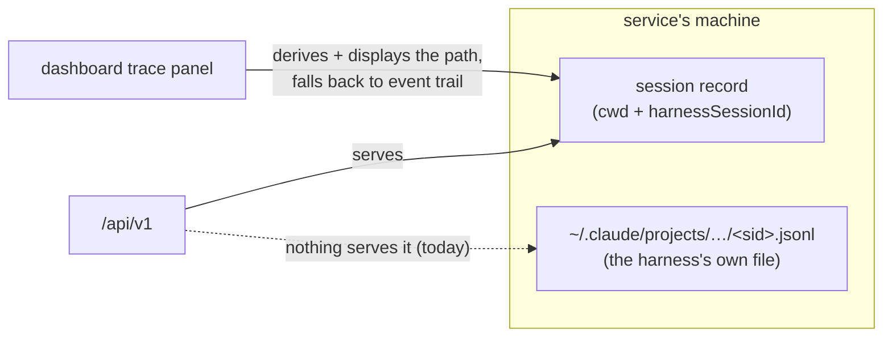

# Requirements: `GET /api/v1/sessions/transcript` — serve the harness's own JSONL

> Phase 1 of the chain. Ticket:
> [#209](https://github.com/MadaraUchiha-314/the-loop/issues/209).

## Introduction

**The structured record of what an agent actually did is a file no client can read.**
the-loop runs the harness as a CLI in tmux, so a session's turns and tool calls are not
something the service writes — they are the harness's own transcript. For Claude Code
that is:

```text
~/.claude/projects/<cwd, every character outside [A-Za-z0-9] replaced by "-">/<session-id>.jsonl
```

Both halves of that path are values the service already records at registration
(`cwd` and the pre-assigned `harnessSessionId` on the session record) — the path is
fully derivable, and issue-207's dashboard derives and *displays* it. But nothing
serves the file's contents, so the "Turns & tool calls" surface shipped built and
visibly disabled, falling back to the event-log trail, and a remote operator's only
way to read a transcript is a shell on the service's machine.



This work item adds the one missing read: a transcript route over `/api/v1` that
resolves the file from the session record and returns its tail, plus the UI wiring
that makes the shipped-disabled surface live.

## Requirements

### Requirement 1 — the transcript is served, resolved from what the service records

**User story:** As an operator (or the dashboard) looking at a work item, I want the
session's turns and tool calls served over the API, so that reading what the agent
did does not require a shell on the service's machine.

**Acceptance criteria (EARS):**

- **1.1** WHEN `GET /api/v1/sessions/transcript` names a work item whose registered
  session (the record's own, or any of its pull-request endpoints, live or closed)
  is a Claude Code session with a transcript file on disk THEN the system SHALL
  return the file's resolved path, the file's total line count, and its entries —
  each line parsed as a JSON object, with a line that does not parse returned as
  `{"malformed": "<raw line>"}` rather than dropped.
- **1.2** The route SHALL resolve the file **from the session record alone** — the
  per-character munge of the record's `cwd` under the harness's projects directory
  (`$CLAUDE_CONFIG_DIR` or `~/.claude`, then `projects/`), then
  `<harnessSessionId>.jsonl` — and WHEN the derived directory does not hold the file
  THEN the system SHALL fall back to searching the projects directory's immediate
  subdirectories for `<harnessSessionId>.jsonl`, so a munge-scheme drift between
  harness versions degrades to a scan, not a 404.
- **1.3** WHEN the request carries `tail: N > 0` THEN the system SHALL return only
  the last N lines (with `totalLines` still the whole file's count and `truncated`
  saying whether anything was omitted); `tail: 0` SHALL mean the whole file; the
  default SHALL be a bounded tail (200), because transcripts get long and the
  common question is "what has it been doing lately".
- **1.4** A closed session's transcript SHALL still be served: the file outlives the
  registration (that is why `routing.tmux.keepSessionOnClose` exists), and reading
  what a finished agent did is the review use case.

### Requirement 2 — the route is fail-closed: it serves transcripts, not the filesystem

**User story:** As the operator of a machine running the service, I want the new read
capability bounded to exactly the harness's transcript files, so that the route
cannot be turned into a general file-read oracle.

**Acceptance criteria (EARS):**

- **2.1** The system SHALL serve only regular files named `<harnessSessionId>.jsonl`
  that resolve to a real path **inside** the harness's projects directory: WHEN the
  fully-resolved candidate (symlinks followed) falls outside the resolved projects
  root THEN the system SHALL respond 404 as if no transcript existed.
- **2.2** WHEN the session record's `harnessSessionId` is empty, contains a path
  separator, or contains `..` THEN the system SHALL respond 404 without touching the
  filesystem — a registry record is writable through `POST /sessions/register`, and
  a crafted id must fail closed, never traverse.
- **2.3** WHEN the named work item has no registered session (as itself or as any
  record's pull-request endpoint) THEN the system SHALL respond 404 with guidance.
- **2.4** WHEN the session's harness has no documented transcript location (Cursor
  keeps chats in an undocumented SQLite store) THEN the system SHALL respond 404
  saying so — never guess at another tool's private storage.
- **2.5** WHEN no file exists at the derived path (and the fallback scan finds none)
  THEN the system SHALL respond 404 naming the derived path, so the operator can see
  *where* the service looked.
- **2.6** WHEN the ref is malformed or `tail` is negative THEN the system SHALL
  respond 400/422 respectively (the surfaces' existing `ValueError`/validation
  mapping).

### Requirement 3 — the contract and the MCP surface carry the read

**Acceptance criteria (EARS):**

- **3.1** The route SHALL be added to the authored OpenAPI contract
  (`docs/api-specs/openapi/the-loop.v1.yaml`) with `operationId:
  sessionTranscript`, and the contract-parity test SHALL hold.
- **3.2** The same core function SHALL be exposed as an MCP tool
  (`session_transcript`), consistent with every other core read (issue-161's
  one-implementation rule): an agent steering the loop may read a transcript by the
  same bounded mechanism the dashboard uses.

### Requirement 4 — the shipped-disabled UI surface goes live

**User story:** As an operator on the dashboard, I want the "Turns & tool calls"
panel to show the actual transcript, so the trace of a session is its real record
rather than only the event-log trail.

**Acceptance criteria (EARS):**

- **4.1** WHEN the trace panel's selected session yields a transcript from the route
  THEN the dashboard SHALL render its entries as turn rows (role/type, time, text,
  tool uses), newest last, and SHALL note when the view is a tail of a longer file.
- **4.2** WHEN the route answers 404 (no session, Cursor, no file yet, or an older
  service without the route) THEN the dashboard SHALL say why and fall back to the
  event-log trail it shows today — the fallback is kept, not replaced.
- **4.3** The "not served by /api/v1" copy SHALL be removed from the trace panel,
  the app footer, the module docstrings and `ui/README.md`; the demo transport SHALL
  answer the call from a fixture transcript, the same convention its control verbs
  follow.
- **4.4** The path shown beside the panel SHALL use the same per-character munge the
  harness uses (the current run-collapsing regex diverges for consecutive
  non-alphanumerics), so the displayed path and the served file cannot disagree.

## Non-functional requirements

- **NFR1 — no new dependency.** Path resolution, JSON parsing and a bounded tail are
  stdlib; the UI change uses the existing client/`useAsync` machinery.
- **NFR2 — no new configuration.** No schema key is added. The projects directory
  honours `CLAUDE_CONFIG_DIR` because that is the *harness's* own relocation
  mechanism, not a the-loop knob.
- **NFR3 — bounded memory on long transcripts.** The tail is computed in one pass
  with a bounded buffer; the whole file is never held in memory unless `tail: 0`
  explicitly asks for all of it.
- **NFR4 — the security posture is unchanged in kind, and the new read is bounded.**
  No in-app auth is added (decision-059); the route sits behind the same exposure
  guard and CORS allowlist as every `/api/v1` read. What *is* new is scoped by R2:
  file reads confined to `*.jsonl` under the projects root, fail-closed.

## Security considerations

Threat-model-lite. The untrusted actors: anyone who can reach the service's socket
(loopback processes by default; whatever the operator exposes otherwise), any page on
a CORS-allowed origin, and anyone who can write a session registration
(`POST /sessions/register` is on the same plane).

| # | Abuse case | Mechanism |
|---|-----------|-----------|
| 1 | **The route as a file-read oracle**: a crafted registration (`harnessSessionId: "../../.ssh/id_rsa"`, or a `cwd` chosen to collide) walks the read outside the transcripts. | Fail closed (R2.1, R2.2): the id is validated before any filesystem touch (no separators, no `..`); the munge maps `cwd` into a single path segment (every `/` becomes `-`); the final path is resolved and must sit inside the resolved projects root, which also refuses a symlink planted inside it that points elsewhere. Only `<id>.jsonl` names are ever formed. |
| 2 | **Transcript exfiltration**: whoever reaches the API reads whatever the agent read — the JSONL carries file contents, command output, possibly secrets the agent encountered. | Accepted and bounded, not new in kind (NFR4): the same plane already serves the event log (question text, error text), and the network boundary stays the loopback bind + exposure guard + exact-origin CORS (decision-059). The transcript is the operator's own file about the operator's own agent; every read lands in the audit trail as `api.request`. No redaction layer is added — the service cannot know which substrings are secrets, and a half-redactor is a false promise (recorded in the design's deliberate absences). |
| 3 | **A transcript readable after the work is done** longer than the operator expects. | By design (R1.4) — the review use case. The operator's lever is the file itself (`cleanup` removes tmux/transcripts per `routing.tmux`; deleting the JSONL ends servability), not a route-side policy. |
| 4 | **Resource exhaustion**: pointing the route at a multi-GB transcript. | The default is a bounded tail computed with a bounded buffer (R1.3, NFR3); only an explicit `tail: 0` reads everything, and only for a file already inside the projects root. |
| 5 | **Cross-session reads**: reading another work item's transcript by naming its ref. | In scope of the plane by design — the control plane already lists every session and can kill any of them; per-item authorization does not exist anywhere on `/api/v1` (decision-059) and is not invented here. |

**Risk tier: 3** (`human-approves-pr`). No schema or sensitive path is touched; the
new capability is a **read**, on the plane that already spawns, kills and types into
the same sessions — but it is the service's first route that returns file contents
from disk, which is why R2's boundary is spelled out and negatively tested rather
than implied. A named human security sign-off is not mandated
(`security.review.humanSignOffMinTier: 4`); the PR approval gate stands.
