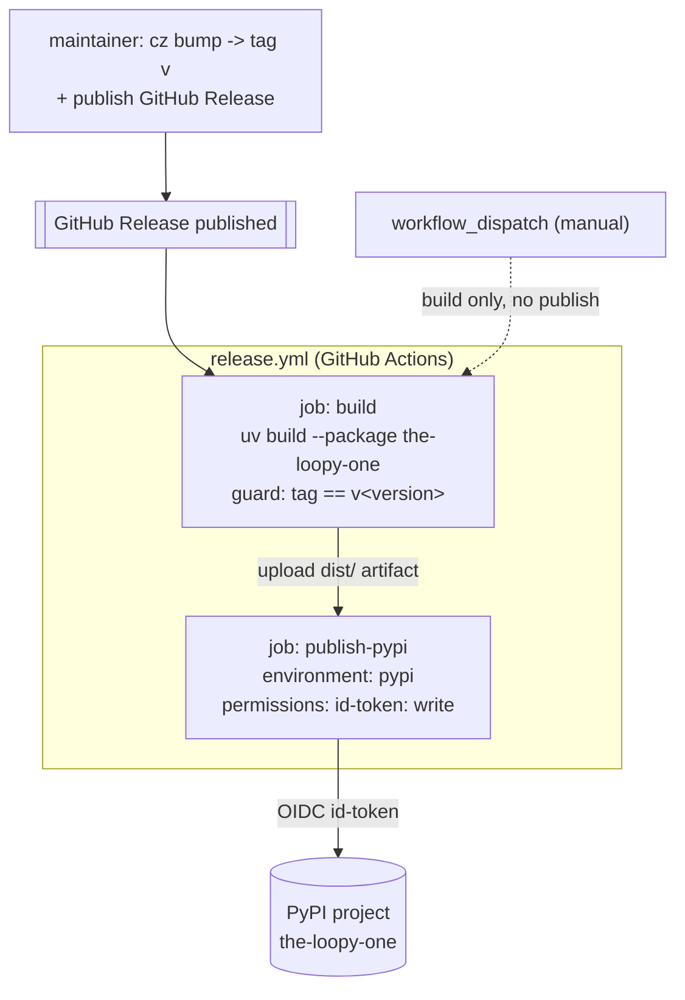

# Design: Publish the-loop to PyPI

> Phase 2 of 3 (requirements → design → tasks). Derives from the approved requirements.
> Durable choices are logged in `docs/decisions/decision-019.md`.

## Overview

Publish the `cli` workspace member to PyPI as the distribution **`the-loopy-one`** using
**GitHub Actions Trusted Publishing (OIDC)** — no stored token. A published GitHub Release
(tag `v<version>`) triggers a two-job workflow: `build` packages the member with `uv` and
guards the tag/version match; `publish-pypi`, gated by the `pypi` environment, uploads the
artifacts over OIDC. This satisfies R1–R4; the naming rationale and the future-proofing
convention (R5) are recorded in decision-019.

## Architecture

Three cooperating pieces, all already-existing surfaces plus one new workflow:

Trust is established once, out of band: PyPI's Trusted Publisher binds
`MadaraUchiha-314/the-loop` + workflow `release.yml` + environment `pypi` to the
`the-loopy-one` project, so the `publish-pypi` job authenticates with a short-lived OIDC
token instead of a secret.

## Components & interfaces

### 1. Distribution metadata — `cli/pyproject.toml`

- **Responsibility:** declare the published distribution.
- **Change:** `[project] name` `the-loop` → `the-loopy-one`; add trove `classifiers` and
  an `Issues` project URL. `[tool.hatch.build.targets.wheel] packages = ["the_loop"]` is
  unchanged — it names the *import* package, independent of the distribution name, so the
  console script (`the-loop`) and import (`the_loop`) are unaffected.
- **Three names, deliberately distinct:**

  | Name kind           | Value           | Surface                       |
  |---------------------|-----------------|-------------------------------|
  | distribution (PyPI) | `the-loopy-one` | `pip install the-loopy-one`   |
  | import package      | `the_loop`      | `import the_loop`             |
  | console script      | `the-loop`      | `the-loop --help`             |

### 2. Lockfile — `uv.lock`

- **Responsibility:** reproducibility (RULE: committed lock, no drift).
- **Change:** re-locked so the member renames `the-loop` → `the-loopy-one`
  (`uv lock`). CI's `uv sync` then resolves cleanly.

### 3. Release workflow — `.github/workflows/release.yml` (new)

- **Triggers:** `release: [published]` (publishes) and `workflow_dispatch` (build-only
  dry run).
- **`build` job (any trigger):** checkout → `astral-sh/setup-uv@v5` (same as CI) → tag
  guard (only on `release`: assert `GITHUB_REF_NAME == v$(uv version --package
  the-loopy-one --short)`) → `uv build --package the-loopy-one` → upload `dist/` artifact
  (`if-no-files-found: error`).
- **`publish-pypi` job (`if: github.event_name == 'release'`):** `needs: build`,
  `environment: { name: pypi, url: https://pypi.org/project/the-loopy-one/ }`,
  `permissions: id-token: write` → download `dist/` → `pypa/gh-action-pypi-publish@release/v1`
  (no `password`/token → it uses Trusted Publishing).
- **Contract with PyPI:** the file name (`release.yml`), the environment (`pypi`), and the
  owner/repo MUST match the pre-registered Trusted Publisher. They do.

## UI/UX design

N/A — this is CLI/infra packaging with no user-facing visual surface.

## Data models

None. The only structured change is `pyproject.toml`/`uv.lock` metadata (above).

## Error handling

- **Tag/version mismatch:** the guard step emits a `::error::` and exits non-zero before
  any build/publish (R3).
- **Empty build output:** `upload-artifact` with `if-no-files-found: error` fails fast
  rather than publishing nothing.
- **Duplicate version:** PyPI rejects re-uploading an existing version; the fix is a new
  version + Release (immutability is a feature, not a failure to mask).
- **Manual run safety:** `workflow_dispatch` never reaches `publish-pypi` (the `if` guard),
  so a manual run cannot publish by accident.

## Testing strategy

This is CI/infra, so "tests" are local build/packaging verification plus a guarded first
real Release (evidence in `execution-log.md`). No new unit/integration Python tests are
warranted (no runtime code changed); existing `cli` tests must stay green.

| Requirement | Verification |
|-------------|--------------|
| R1 | `uv build --package the-loopy-one` produces `the_loopy_one-<v>.tar.gz` + `.whl`; wheel METADATA `Name: the-loopy-one`, contains `the_loop/`, entry point `the-loop = the_loop.__main__:main`. |
| R2 | Workflow lint/parse; `release.yml` present with `environment: pypi` + `id-token: write` and no token reference; real publish on first Release. |
| R3 | Guard logic exercised locally: `v0.1.0` passes, a mismatched tag fails. |
| R4 | `uv lock` re-locks to `the-loopy-one`; `uv sync` + `make check` (existing gates) stay green. |
| R5 | decision-019 records scope + future-proofing convention. |

## Trade-offs & decisions

Logged durably in `docs/decisions/decision-019.md`. In brief:

- **Distribution-only rename.** Only `[project] name` changes; import/script keep the
  natural names — a PyPI collision shouldn't leak into user ergonomics.
- **Trusted Publishing over a stored token.** OIDC removes a standing credential; the
  Trusted Publisher was already registered by the issue author.
- **Release-triggered, environment-gated.** A published Release is an explicit human gate
  that pairs with the `pypi` environment; the tag guard enforces version integrity.
- **Future-proofing (answers issue #21 Q2):** the repo is already a `uv` workspace with a
  *virtual* (non-package) root and named members. Convention going forward: one
  distribution per publishable member (`uv build --package <name>`, added to a release
  matrix), a shared `the-loopy-one` prefix for siblings, and PEP 420 implicit namespace
  packages if/when the import surface is split. Nothing is split now (YAGNI); the workflow
  is written so a second package is additive.

## Open questions

None — see `requirements.md` (all resolved).
