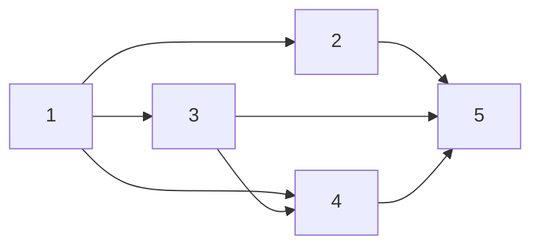

# Tasks: Publish the-loop to PyPI

> Phase 3 of 3 (requirements → design → tasks). A DAG derived from the approved design.
> This is CI/infra work with no new runtime code, so "tests" are build/packaging
> verification commands (recorded as evidence in `execution-log.md`) rather than new
> pytest cases; the existing `cli` suite must stay green (`tdd.mode: standard`).

## Task list

- [x] 1. Rename the distribution to `the-loopy-one`
  - `cli/pyproject.toml`: `[project] name` → `the-loopy-one`; add trove `classifiers` and
    an `Issues` URL; keep `packages = ["the_loop"]` and the `the-loop` console script.
  - _Depends on:_ none
  - _Requirements:_ R1
  - _Test:_ `uv build --package the-loopy-one` then inspect the wheel — METADATA
    `Name: the-loopy-one`, contains `the_loop/`, entry point
    `the-loop = the_loop.__main__:main`.

- [x] 2. Re-lock the workspace
  - `uv lock` so the member renames `the-loop` → `the-loopy-one`; commit `uv.lock`.
  - _Depends on:_ 1
  - _Requirements:_ R4
  - _Test:_ `uv sync` resolves clean; `grep 'the-loopy-one' uv.lock`.

- [x] 3. Add the release workflow
  - New `.github/workflows/release.yml`: `build` job (uv build + tag/version guard,
    upload artifact) and `publish-pypi` job (`environment: pypi`, `id-token: write`,
    `pypa/gh-action-pypi-publish`, `if: release`). `workflow_dispatch` builds only.
  - _Depends on:_ 1
  - _Requirements:_ R2, R3
  - _Test:_ YAML parses; guard logic verified locally
    (`uv version --package the-loopy-one --short` == `0.1.0`; matching tag passes,
    mismatch fails).

- [x] 4. Document install + the decision
  - `cli/README.md`: `pip install the-loopy-one` + release note. New
    `docs/decisions/decision-019.md` (scope + future-proofing convention) and index row.
    Update `docs/architecture/architecture.md` and `docs/roadmap.md`.
  - _Depends on:_ 1, 3
  - _Requirements:_ R5
  - _Test:_ `make lint` (markdownlint) passes; decision index links resolve.

- [x] 5. Full quality gate
  - Run the repo's CI-parity gate.
  - _Depends on:_ 2, 3, 4
  - _Requirements:_ R1–R5
  - _Test:_ `make check` (lint, format-check, typecheck, validate, test) green.

## Dependency graph (DAG)

## Checkpoints

- After task 1: build the wheel and assert distribution/import/script names (R1 evidence).
- After task 3: confirm `release.yml` structure + guard behaviour (R2/R3 evidence).
- After task 5: `make check` green — the pre-merge gate. First real publish is evidenced
  when a `v<version>` Release is cut (recorded in the execution log).
