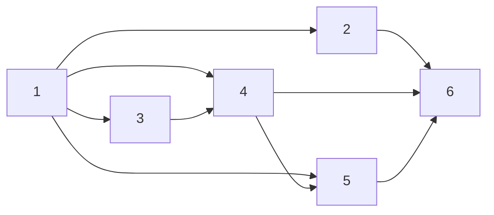

# Tasks: Publish the-loop to PyPI

> Phase 3 of 3 (requirements → design → tasks). A DAG derived from the approved design.
> This is CI/infra work with no new runtime code, so "tests" are build/packaging
> verification commands (recorded as evidence in `execution-log.md`) rather than new
> pytest cases; the existing `cli` suite must stay green (`tdd.mode: standard`).

## Task list

- [x] 1. Rename the distribution to `the-loopy-one`
  - `cli/pyproject.toml`: `[project] name` → `the-loopy-one`; add trove `classifiers` and
    an `Issues` URL; keep `packages = ["the_loop"]` and the `the-loop` console script.
  - _Depends on:_ none
  - _Requirements:_ R1
  - _Test:_ `uv build --package the-loopy-one` then inspect the wheel — METADATA
    `Name: the-loopy-one`, contains `the_loop/`, entry point
    `the-loop = the_loop.__main__:main`.

- [x] 2. Re-lock the workspace
  - `uv lock` so the member renames `the-loop` → `the-loopy-one`; commit `uv.lock`.
  - _Depends on:_ 1
  - _Requirements:_ R4
  - _Test:_ `uv sync` resolves clean; `grep 'the-loopy-one' uv.lock`.

- [x] 3. Configure commitizen for semantic version bumps
  - `.cz.toml`: add `version_files = ["cli/pyproject.toml:^version = "]` (so a bump
    rewrites the package version) and `update_changelog_on_bump = false`.
  - _Depends on:_ 1
  - _Requirements:_ R3
  - _Test:_ `uv run cz bump --yes` computes `0.1.0 → 0.2.0` and rewrites both `.cz.toml`
    and `cli/pyproject.toml` (verified locally, then reverted).

- [x] 4. Add the semantic-release workflow
  - New `.github/workflows/release.yml`: on `push: main`, `release` job runs `cz bump`
    (classify exit 0 / 21 / 3), push bump+tag to main, `gh release create`, `uv build`,
    upload artifact; `publish-pypi` job (`environment: pypi`, `id-token: write`,
    `pypa/gh-action-pypi-publish`, `if: released`). `concurrency: release`; skip on
    `bump:` commits.
  - _Depends on:_ 1, 3
  - _Requirements:_ R2, R3
  - _Test:_ YAML parses; jobs/env/permissions asserted; no token reference.

- [x] 5. Document install + the decision
  - `cli/README.md`: `pip install the-loopy-one` + semantic-release note. New
    `docs/decisions/decision-019.md` (scope + semantic release + future-proofing) and
    index row. Update `docs/architecture/architecture.md` and `docs/roadmap.md`.
  - _Depends on:_ 1, 4
  - _Requirements:_ R5
  - _Test:_ `make lint` (markdownlint) passes; decision index links resolve.

- [x] 6. Full quality gate
  - Run the repo's CI-parity gate.
  - _Depends on:_ 2, 3, 4, 5
  - _Requirements:_ R1–R5
  - _Test:_ `make check` (lint, format-check, typecheck, validate, test) green.

## Dependency graph (DAG)

## Checkpoints

- After task 1: build the wheel and assert distribution/import/script names (R1 evidence).
- After tasks 3–4: `cz bump` computes `0.2.0` + rewrites both version files; `release.yml`
  structure/env/permissions asserted (R2/R3 evidence).
- After task 6: `make check` green — the pre-merge gate. The first real publish is
  evidenced when this PR merges to `main` and the release job publishes `0.2.0` (recorded
  in the execution log).
