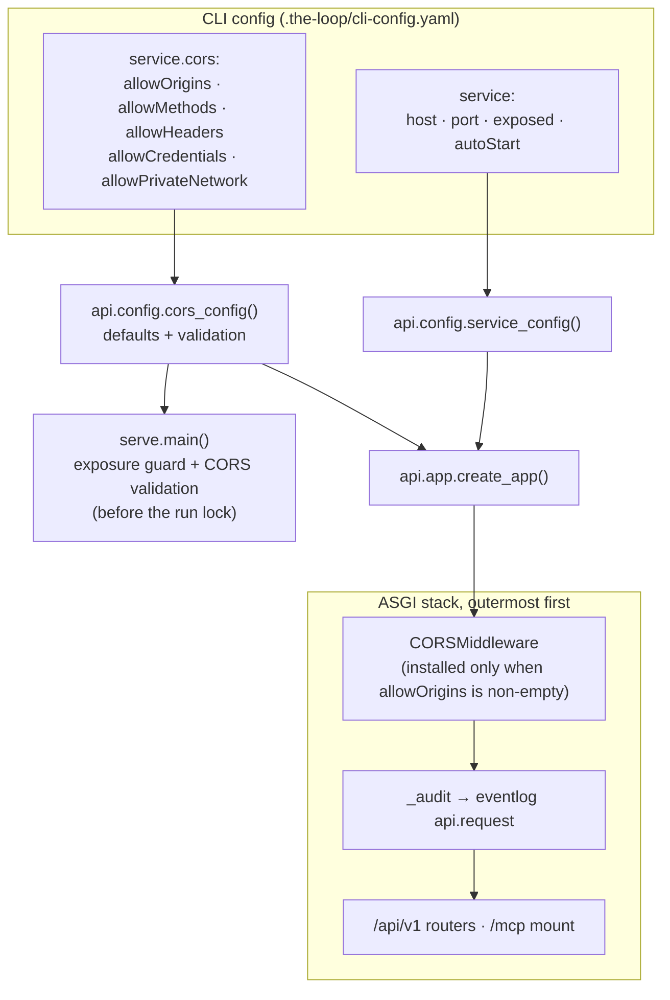

# Design: configurable CORS so the hosted dashboard can reach the service

> Phase 2 of the chain. Derives from [`requirements.md`](requirements.md). Ticket:
> [#211](https://github.com/MadaraUchiha-314/the-loop/issues/211).

## Overview

**One config block, one middleware, no new dependency.** `service.cors` joins the
`service` block of the CLI config; `the_loop.api.config` resolves it the same way it
already resolves `host`/`port`/`exposed`; `create_app` installs Starlette's
`CORSMiddleware` — which FastAPI already ships — when the resolved origin list is
non-empty. Nothing else in the request path changes.

The three interesting decisions are about what *isn't* there:

- **No `enabled` key.** An empty `allowOrigins` is the off switch, and it is the same
  switch the code branches on. A boolean that can disagree with the list it guards is a
  bug waiting for an operator to file it.
- **No origin regex.** Exact-string comparison only (R1.4). A regex is how origin
  allowlists get subverted, and Starlette's regex parameter is simply not wired up.
- **No new network boundary.** CORS governs what a *page* may read; `service.exposed`
  governs what may *connect*. The exposure guard in `serve.py` is untouched, and no CORS
  setting can loosen it.

## Architecture



**Middleware order is load-bearing.** Starlette wraps the most recently added middleware
outermost, so `CORSMiddleware` is added *after* `_audit` and therefore sits in front of
it. That is what makes a preflight cheap: `CORSMiddleware` answers `OPTIONS` itself and
never calls inward, so a preflight neither runs an operation nor emits an `api.request`
event. Real calls pass straight through and are audited exactly as before.

## Components & interfaces

### `the_loop.api.config.cors_config(cli_config) -> dict`

Sibling of the existing `service_config()`. Reads `service.cors`, applies the defaults
below, coerces types, and raises `ValueError` for the one combination that must never
serve (R3.1).

| Key | Type | Default | Maps to |
|-----|------|---------|---------|
| `allowOrigins` | `string[]` | `["https://madarauchiha-314.github.io"]` | `allow_origins` |
| `allowMethods` | `string[]` | `["GET", "POST", "OPTIONS"]` | `allow_methods` |
| `allowHeaders` | `string[]` | `["Accept", "Content-Type"]` | `allow_headers` |
| `allowCredentials` | `boolean` | `false` | `allow_credentials` |
| `allowPrivateNetwork` | `boolean` | `true` | `allow_private_network` |

The default origin is `https://madarauchiha-314.github.io` — the *origin* of the
published dashboard, not its URL. An origin is scheme + host + port; the browser sends
exactly that, so a trailing `/the-loop/ui/` in this value would match nothing.

`allowPrivateNetwork` exists because the flagship case is a **public HTTPS page reaching
a loopback address**, which Chromium gates behind a private-network preflight
(`Access-Control-Request-Private-Network`). Starlette answers it only when the origin is
already allowed, so the switch cannot widen the allowlist — it can only decline a request
the allowlist already admitted.

**Version compatibility.** `allow_private_network` is a newer Starlette parameter and the
package floor is `fastapi>=0.110`, which resolves to Starlette versions predating it. The
kwarg is therefore passed only when the installed `CORSMiddleware.__init__` accepts it,
and a configuration that asked for it on an older Starlette gets one warning naming the
upgrade. The alternative — writing the header from our own middleware — reimplements a
security-relevant response header the framework already gets right, and would emit it
twice on any modern install.

### `the_loop.api.app.create_app`

```python
cors = cors_config(cli_config)          # raises ValueError on the refused combination
if cors["allowOrigins"]:
    app.add_middleware(CORSMiddleware, **_cors_kwargs(cors))
```

Installed after `_audit` (see the ordering note), and not installed at all when the list
is empty — NFR2's "byte-identical to today" case is the absence of a middleware, not a
middleware configured to do nothing.

### `the_loop.api.serve.main`

One more guard beside the exposure guard, in the same shape and the same place — before
the run lock, before the bind:

```python
try:
    cors_config(cli_config)
except ValueError as exc:
    logger.error("%s", exc)
    return 2
```

`create_app` would raise the same error a few lines later; validating here is what makes
the failure a clean exit-2 with a log line instead of a traceback over a held lock.

## UI/UX design

N/A for the service change itself. The dashboard's *copy* changes — the cross-origin
error advice and the Settings note both currently assert that the service sends no CORS
headers, which R4.2 makes false — but the components, layout and tokens do not, so there
is no new visual artifact to lock. The affected strings:

| Surface | Today | After |
|---------|-------|-------|
| `ApiError.advice` (`ui/src/api/client.ts`) | "binds loopback-only and sends no CORS headers … needs an SSH tunnel plus a gateway" | names `service.cors.allowOrigins` first, then the tunnel/gateway route for a service that is not on this machine |
| Settings note (`ui/src/views/Settings.tsx`) | "carries no in-app auth and sends no CORS headers" | keeps the no-auth statement, replaces the CORS statement with the allowlist and its default |
| `ui/README.md` | same claim | same correction |

## Data models

The CLI config schema (`.the-loop/cli-config.schema.json`) gains `service.cors` with
`additionalProperties: false` and per-key descriptions — the schema *is* the data model,
and `scripts/validate_config.py` plus the docs-parity gate keep it honest. No persisted
state, no new file, no migration: an absent block resolves to the defaults, so
`CURRENT_CONFIG_VERSION` does not move (nothing was removed or renamed).

## Error handling

| Failure | Where | Behaviour |
|---------|-------|-----------|
| `"*"` origin with `allowCredentials: true` | `cors_config` | `ValueError`; `serve.main` logs it and exits 2 — no bind, no lock |
| Unknown key under `service.cors` | schema validation (`make validate`, `/the-loop:init`) | Rejected by `additionalProperties: false` |
| Non-list `allowOrigins` (hand edit) | `cors_config` | Coerced through `list(...)` of strings; a scalar becomes a one-entry list rather than an iterated string |
| Installed Starlette predates `allow_private_network` | `create_app` | Kwarg omitted, one `logger.warning` naming the upgrade; CORS still works for ordinary preflights |
| Disallowed origin at runtime | `CORSMiddleware` | No `Access-Control-Allow-Origin`; the browser blocks the read. Preflights get Starlette's 400 `Disallowed CORS origin` |

Observability is unchanged and deliberately so: preflights are not operations and are not
logged, and an allowed cross-origin call appears in the event log as the ordinary
`api.request` it is.

## Security design

- **AuthN/AuthZ:** unchanged — none in-app, by [decision-059](../../decisions/decision-059.md).
  CORS is not authentication and is not treated as any; it decides *readability by a
  page*, never *reachability by a client*.
- **Input validation & injection surfaces:** the untrusted ingress is the request's
  `Origin` header. It is never parsed, interpolated or logged by our code — it is
  compared exact-string against a configured list by Starlette, and echoed back only on a
  match. No SQL, no shell, no path, no prompt is built from it.
- **Secrets handling:** none. This block holds no secret and the middleware reads none;
  `allowCredentials` stays false by default precisely so a browser never attaches one.
- **Least privilege:** the default admits one origin, three methods and two headers —
  exactly what the shipped dashboard sends. `"*"` is expressible but never a default, and
  is refused outright in the one combination that leaks (R3.1).
- **Fail-closed behaviour:** unreadable config → built-in defaults (one origin, no
  credentials); empty list → no middleware; invalid combination → the process does not
  start. There is no state in which a check "could not be made" and the request is served
  permissively.
- **Abuse-case coverage:**

  | Abuse case | Mechanism | Negative test |
  |---|---|---|
  | 1 — any visited page reads the service | exact allowlist, one default origin | `test_unlisted_origin_gets_no_allow_origin` |
  | 2 — a sibling Pages site on the same host | documented, `allowOrigins: []` opt-out ([decision-077](../../decisions/decision-077.md)) | n/a — host-granular by the browser's own model; covered by docs review |
  | 3 — `"*"` plus credentials | start-up refusal before bind/lock | `test_wildcard_with_credentials_is_refused`, `test_serve_refuses_invalid_cors` |
  | 4 — private-network reach | answered only for an allowed origin; `allowPrivateNetwork: false` declines | `test_private_network_preflight_*` |
  | 5 — `/mcp` from a page | SDK transport-security `allowed_origins` unchanged (loopback only) | `test_mcp_origin_allowlist_unchanged` |
  | 6 — suffix-matched hostile origin | exact-string comparison, no regex wired | `test_unlisted_origin_gets_no_allow_origin` (`…github.io.evil.tld` case) |

## Testing strategy

R1 and R2 are pinned by `TestClient` assertions on response headers — an allowed origin
gets `Access-Control-Allow-Origin`, an unlisted one gets none, a preflight returns the
methods and (with the request header) `Access-Control-Allow-Private-Network`. R3 is pinned
twice: `cors_config` raising, and `serve.main` returning 2 without binding. R2.4 is the
regression guard that empty means *nothing installed*. R4.1 is already enforced by
`test_docs_parity.py`'s P4/P5 against the schema, so documenting the five keys is not
optional; R4.2's UI copy is covered by the existing `client.test.ts` assertion, retargeted
from `/CORS/` to the new advice.

The OpenAPI contract is unchanged, and `test_api_contract_parity.py` proves it: preflight
handling adds no path, method or operationId (NFR3).

`testing-plan.md` holds the executable detail.

## Trade-offs & decisions

- **Default-on for one origin, rather than default-off.** The ticket asks for it, and a
  default-off flag would leave the published dashboard broken for everyone who has not
  read this page. The cost is abuse case 2, which is real and is why this gets a decision
  record: [decision-077](../../decisions/decision-077.md).
- **Five keys, not one.** `allowOrigins` alone would force the methods and headers to be
  hardcoded, and the deployment decision-059 actually describes — a gateway terminating
  auth in front — is the one that needs `Authorization` in `allowHeaders` and possibly
  `allowCredentials: true`. Each key is a straight pass-through, so the surface is wide
  by one line each and narrow in behaviour.
- **App-wide middleware, including the `/mcp` mount.** Scoping the middleware to
  `/api/v1` would need a second mounted sub-app, and the MCP transport already refuses
  foreign origins on its own. Simpler stack, unchanged posture.

## Open questions

None. The one judgement call — shipping the Pages origin as the default — is the ticket's
own request and is recorded as a decision rather than left as a question.

## Review comments

<!-- Populated at review. -->
