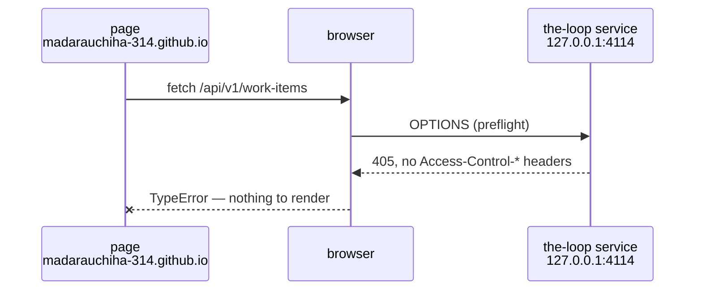

# Requirements: configurable CORS so the hosted dashboard can reach the service

> Phase 1 of the chain. Ticket:
> [#211](https://github.com/MadaraUchiha-314/the-loop/issues/211).

## Introduction

**We shipped a dashboard the browser refuses to let anyone use.**
[issue-207](https://github.com/MadaraUchiha-314/the-loop/issues/207) built the static
control-plane UI and publishes it to GitHub Pages at
`https://madarauchiha-314.github.io/the-loop/ui/`. The service it drives sends no CORS
headers at all, so every call that page makes is discarded by the browser before the
operator sees a byte of it — the read succeeded on the wire and died at the same-origin
check.

Both halves of that are ours. The service is ours, the page is ours, and the one origin
the page is served from is a constant we ship. Today the only supported answer is "put a
gateway in front of it that adds `Access-Control-Allow-Origin`" — which asks an operator
to stand up an HTTP proxy to talk to a service already listening on their own loopback
interface.

This work item makes the response headers **configuration**, and ships the origin we
already publish to as the default so the common case needs no configuration at all.

Two things it deliberately does not change. The **exposure guard** stays exactly as it
is: CORS decides which *page* may read the response, `service.exposed` decides which
*network* may connect, and neither substitutes for the other. And there is still **no
in-app authentication** ([decision-059](../../decisions/decision-059.md)) — which is
precisely why the origin list is an allowlist of exact origins rather than a wildcard,
and why what the default admits is stated in § Security considerations rather than
implied.

## Requirements

### Requirement 1 — the service answers cross-origin calls from configured origins

**User story:** As an operator running the service on my workstation, I want a browser
page I trust to read the API, so that the hosted dashboard works without me deploying a
proxy in front of my own loopback port.

#### Acceptance criteria

1. R1.1 — WHEN a request carries an `Origin` header matching an entry of
   `service.cors.allowOrigins` THEN the service SHALL include
   `Access-Control-Allow-Origin` for that origin in the response.
2. R1.2 — WHEN a preflight `OPTIONS` request arrives for an allowed origin with an
   allowed method THEN the service SHALL answer it with the allowed methods and headers,
   without invoking the underlying operation.
3. R1.3 — WHEN a request carries an `Origin` header that matches no configured entry
   THEN the service SHALL NOT include any `Access-Control-Allow-Origin` header in the
   response.
4. R1.4 — The origin comparison SHALL be exact-string on the serialized origin
   (scheme, host and port); no suffix, prefix or substring match SHALL admit an origin.
5. R1.5 — Cross-origin behaviour SHALL be independent of the bind host: an allowed
   origin is answered on a loopback bind, and a disallowed one is refused on an exposed
   bind.

### Requirement 2 — the shipped dashboard's origin works out of the box

**User story:** As an operator who has just installed the-loop, I want the published
dashboard to reach my service without editing config, so that the UI is usable at the
moment it is discovered.

#### Acceptance criteria

1. R2.1 — With no `service.cors` block present, `allowOrigins` SHALL resolve to
   `["https://madarauchiha-314.github.io"]` — the origin the-loop's own Pages site is
   served from.
2. R2.2 — The resolved methods and headers SHALL cover everything the dashboard sends:
   `GET`, `POST` and `OPTIONS`, with `Accept` and `Content-Type`.
3. R2.3 — WHEN a preflight carries `Access-Control-Request-Private-Network: true` — a
   public-origin page reaching a private/loopback address — THEN the service SHALL
   answer `Access-Control-Allow-Private-Network: true` for an allowed origin, unless
   `allowPrivateNetwork` is false.
4. R2.4 — Setting `allowOrigins: []` SHALL disable cross-origin access entirely, and the
   service SHALL then behave exactly as it did before this work item.

### Requirement 3 — a credential-bearing configuration cannot be made unsafe by accident

**User story:** As the operator responsible for this machine, I want an obviously
dangerous CORS combination to stop the service rather than be silently repaired, so that
I find out at start-up instead of after a browser has read something it should not have.

#### Acceptance criteria

1. R3.1 — WHEN `allowOrigins` contains `"*"` AND `allowCredentials` is true THEN the
   service SHALL refuse to start, naming both keys and the remedy.
2. R3.2 — The refusal SHALL happen before the service binds a port or takes the run
   lock, and SHALL exit non-zero.
3. R3.3 — A `service.cors` block with an unrecognised key SHALL fail schema validation
   (`additionalProperties: false`), like every other block of the CLI config.
4. R3.4 — `allowCredentials` SHALL default to false; the API mints and requires no
   credential, so nothing the-loop ships needs it.

### Requirement 4 — what the service does is what the documentation and the UI say

**User story:** As an operator debugging a blocked call, I want the docs, the schema
description and the dashboard's own error text to describe the behaviour I actually have,
so that I am not sent to build a gateway I no longer need.

#### Acceptance criteria

1. R4.1 — Every `service.cors.*` key SHALL be documented under `docs/config/cli/` with
   its type and default (the parity gate in `test_docs_parity.py` enforces presence).
2. R4.2 — The dashboard's cross-origin failure advice SHALL name the
   `service.cors.allowOrigins` remedy first, and SHALL NOT state that the service sends
   no CORS headers.
3. R4.3 — The control-plane capability doc SHALL state the new posture — allowlisted
   origins, default entry, unchanged exposure guard — in the same pull request.

## Non-functional requirements

1. NFR1 — No new runtime dependency: the middleware SHALL come from Starlette, which
   FastAPI already brings.
2. NFR2 — The response path for a same-origin request SHALL be unchanged when
   `allowOrigins` is empty; no middleware is installed in that case.
3. NFR3 — The served OpenAPI surface (paths, methods, operationIds) SHALL be unchanged —
   preflight handling adds no documented operation.

## Security considerations

**This work item widens a boundary on purpose, and the width is one origin.** The
service has no in-app auth, so anything that can both *reach* it and *read* its responses
can drive it. Until now the browser's same-origin policy stopped web pages from reading;
after this, pages on the configured origins can.

Trust boundaries, unchanged in number: the network reach boundary
(`service.host`/`service.exposed`) and the deployment's gateway
([decision-059](../../decisions/decision-059.md)). This adds a third, narrower one — the
**origin allowlist** — which only ever *reads*: no CORS configuration can widen who may
connect.

| # | Abuse case | Mitigation |
|---|---|---|
| 1 | Any web page the operator visits reads their loopback service and drives their sessions | Exact-origin allowlist. The default admits one origin, the-loop's own Pages site; no wildcard is configured, and `Origin`-less requests keep no `Access-Control-Allow-Origin` |
| 2 | A different project published under the same GitHub Pages user — `madarauchiha-314.github.io` serves every one of that account's Pages sites — carries a hostile script that now reads the operator's service | Accepted and documented, not mitigated in code: an origin is host-granular, and the-loop cannot make the browser distinguish two paths on one host. `allowOrigins: []` is the opt-out; an operator who does not use the hosted dashboard should take it. See [decision-077](../../decisions/decision-077.md) |
| 3 | An operator copies a `"*"` example from the internet and, with `allowCredentials: true`, hands every site on the internet an authenticated read | Start-up refusal (R3.1), before the bind and before the lock. `allowCredentials` defaults to false and the-loop's own client sends no credentials |
| 4 | An attacker's page reaches a *private-network* address from a public origin, using the private-network preflight the-loop now answers | The private-network answer is given only for an already-allowed origin — it never widens the origin allowlist — and `allowPrivateNetwork: false` refuses it outright |
| 5 | The browser MCP endpoint becomes drivable from a page, since the middleware is app-wide | `/mcp` keeps the SDK's DNS-rebinding protection, whose `allowed_origins` remain the loopback hosts the service answers on — a cross-origin MCP call is refused by the transport regardless of CORS |
| 6 | A hostile origin is admitted by a sloppy match (`https://madarauchiha-314.github.io.evil.tld`) | Exact-string comparison on the serialized origin (R1.4); no regex or suffix matching is configurable |

**Fail-closed positions.** An unparseable or absent CLI config resolves to the built-in
defaults (one origin, no credentials); an empty `allowOrigins` installs no middleware at
all; an invalid combination stops the process rather than being repaired in place.

## Out of scope

- **In-app authentication.** [decision-059](../../decisions/decision-059.md) places it in
  the gateway; a CORS header does not change that, and this work item does not revisit it.
- **Origin regexes and wildcard subdomains.** A regex is the classic way to get an origin
  allowlist wrong; if a real deployment needs one, it is a follow-up with its own review.
- **`expose_headers` / `max_age` tuning.** Nothing the-loop serves puts a value in a
  non-safelisted response header, and Starlette's 600-second preflight cache is fine.
- **Exposing `/mcp` to browsers.** It would need the SDK's own origin allowlist widened
  too; no browser MCP client exists here to justify it.
- **Serving the dashboard from the service itself** (which would make it same-origin and
  moot). A separate design question — the dashboard is deliberately a static artifact any
  workstation can point anywhere.

## Open questions

None blocking. The default origin is the owner's stated intent in the ticket ("make this
one as a default in the config"); abuse case 2 is the cost, recorded rather than
resolved.

## Review comments

<!-- Populated at review. -->
