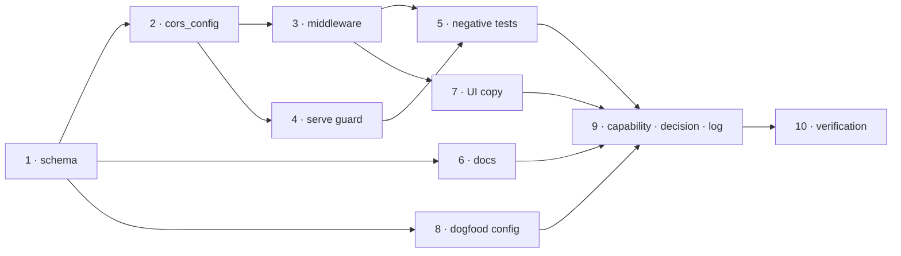

# Tasks: configurable CORS so the hosted dashboard can reach the service

> Derived from [`design.md`](design.md) and [`testing-plan.md`](testing-plan.md). Ticket:
> [#211](https://github.com/MadaraUchiha-314/the-loop/issues/211).

## Task list

- [x] 1. Declare `service.cors` in the CLI config schema
  - Five keys under `service.cors` with `additionalProperties: false`, each carrying the
    description an operator reads in `/the-loop:init`: `allowOrigins`, `allowMethods`,
    `allowHeaders`, `allowCredentials`, `allowPrivateNetwork`.
  - _Depends on:_ none
  - _Requirements:_ R2.1, R3.3
  - _Test:_ T13 — `make validate`
- [x] 2. Resolve and validate the block in `the_loop.api.config`
  - `cors_config()` beside `service_config()`: defaults, coercion, and the `ValueError`
    for `"*"` + `allowCredentials: true`.
  - _Depends on:_ 1
  - _Requirements:_ R2.1, R2.2, R3.1, R3.4
  - _Test:_ T1 — `pytest cli/tests/test_api_cors.py` (red→green)
- [x] 3. Install the middleware in `create_app`
  - `CORSMiddleware` added after `_audit` so it sits outermost; not installed at all when
    `allowOrigins` is empty; `allow_private_network` passed only when the installed
    Starlette accepts it, with one warning otherwise.
  - _Depends on:_ 2
  - _Requirements:_ R1.1–R1.5, R2.2, R2.3, R2.4
  - _Test:_ T2 — `pytest cli/tests/test_api_cors_integration.py` (red→green)
- [x] 4. Guard start-up in `serve.main`
  - Validate the CORS block beside the exposure guard: before the run lock, before the
    bind; log and exit 2.
  - _Depends on:_ 2
  - _Requirements:_ R3.1, R3.2
  - _Test:_ T2 — `Scenario: an invalid CORS configuration stops the service before it binds`
- [x] 5. Negative tests for every mechanism in §Security design
  - Unlisted origin, suffix-lookalike origin, wildcard+credentials at both layers,
    private-network decline, `/mcp` transport allowlist unchanged.
  - _Depends on:_ 3, 4
  - _Requirements:_ security considerations 1, 3, 4, 5, 6
  - _Test:_ T8 — the two new test files
- [x] 6. Document the block
  - `docs/config/cli/service-options.md` gains a `## Cross-origin access` section with
    Type/Default per key and the posture note; `docs/cli/commands/service.md` points at
    it from the hosted-dashboard paragraph.
  - _Depends on:_ 1
  - _Requirements:_ R4.1
  - _Test:_ T12 — `pytest cli/tests/test_docs_parity.py`
- [x] 7. Correct the dashboard's copy
  - `ApiError.advice`, the Settings note and `ui/README.md` stop asserting that the
    service sends no CORS headers; the existing advice assertion is retargeted.
  - _Depends on:_ 3
  - _Requirements:_ R4.2
  - _Test:_ T15 — `bun run test` in `ui/`
- [x] 8. Dogfood the block in this repo's own CLI config
  - `.the-loop/cli-config.yaml` carries the block explicitly, with the comment an
    operator copying this file needs.
  - _Depends on:_ 1
  - _Requirements:_ R2.1
  - _Test:_ T13 — `make validate`
- [x] 9. Capability doc, decision record and execution log
  - `docs/capabilities/control-plane.md` states the new posture and gains a history row;
    [decision-077](../../decisions/decision-077.md) records the default-origin call;
    `execution-log.md` carries the phase transitions and the documentation entry.
  - _Depends on:_ 3, 6, 7
  - _Requirements:_ R4.3
  - _Test:_ T14 — `make lint` (markdownlint over the docs)
- [x] 10. Execute the testing plan
  - Run every activity, record command/outcome/evidence, commit the evidence.
  - Ticked with one activity outstanding and named: **T11** (the hosted page in a real
    browser) needs a human, and is recorded as _not executed_ rather than passed.
  - _Depends on:_ 1–9
  - _Requirements:_ all
  - _Test:_ T1–T15

## Dependency graph (DAG)

## Checkpoints

After task 3 (the first point at which a browser could actually be served) and after
task 5 (the boundary tests) run the full `pytest cli` suite; after task 9 run
`make check`, which is what CI runs. Record the red→green transition for tasks 2, 3 and
4 in the execution log. Task 10 is the `verification` node: it fills
`testing-plan.md`'s results table and commits the evidence, and only then do the review
rounds and the security-review gate run — at risk tier 4 that gate needs a **named human
security sign-off**, which this session cannot give itself.
