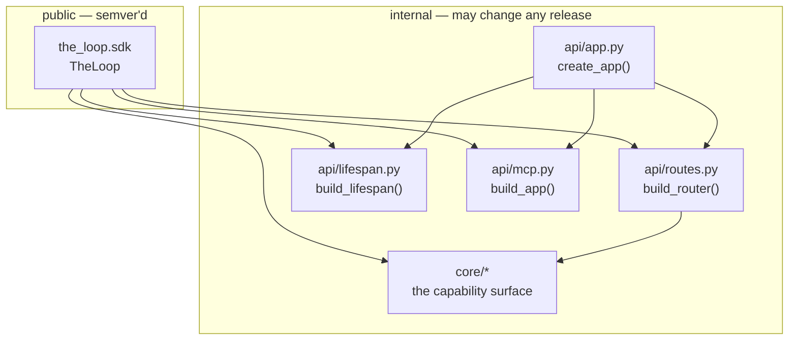
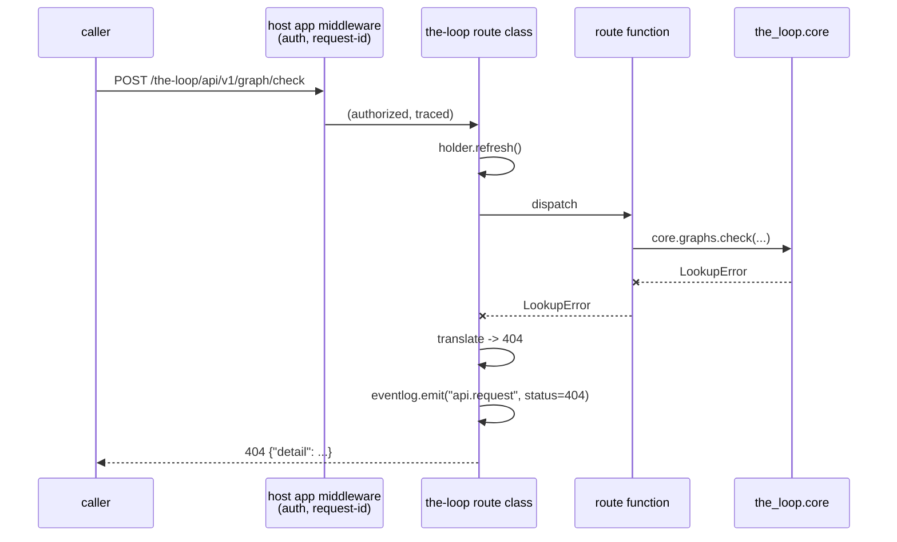

# Design: a Python SDK that embeds the-loop into somebody else's service

> Phase 2 of 3. Derived from [`requirements.md`](requirements.md); reviewed together with
> [`testing-plan.md`](testing-plan.md).

## Overview

The SDK is **a facade, not a layer**. Every capability it exposes already exists in
`the_loop.core`; every route it mounts already exists in `the_loop.api`. What this work item
builds is the seam that lets somebody else's process hold them — and one refactor that makes
the seam possible at all: the `/api/v1` routes move out of `create_app`'s body into an
`APIRouter` factory that `create_app` and the SDK both consume.

Five design points carry the whole change:

| # | Decision |
|---|----------|
| D1 | `/api/v1` becomes an `APIRouter` built by `api/routes.py`; `create_app` is one of its two consumers. |
| D2 | Per-request concerns that were middleware — config refresh, `api.request` audit — and the app-level exception handlers all move onto a **custom route class**, so they travel with the router into somebody else's app. |
| D3 | `TheLoop.mount()` **wraps** the host application's lifespan by default, because the alternative fails at runtime, invisibly. |
| D4 | The SDK reads the CLI config and nothing else, strictly, at construction. |
| D5 | The environment contract is a table in code (`sdk/environment.py`) that the docs and a test both read. |



The arrow that is *not* there is the point: nothing in `api/` imports `sdk/`. The SDK is a
consumer of the transport layer, the same way `create_app` is, so the standalone service
keeps working exactly as it does with no knowledge that an SDK exists.

## Architecture

### D1 — one router, two consumers

`create_app` today defines twenty-nine routes as closures inside its own body. They close
over `holder` (the live CLI config) and nothing else, which is why the extraction is
mechanical: move the body into `build_router(holder) -> APIRouter`, and let `create_app`
call `app.include_router(build_router(holder))`.

What this buys is R2.7 stated structurally rather than by discipline: there is no way to add
a route to the standalone service without adding it to the embeddable surface, because they
are the same object. The existing contract-parity test (`test_api_contract_parity.py`)
already asserts the served schema equals the authored OpenAPI document; a second assertion
now checks the router's operation set matches too, so a route that somehow reached one and
not the other is a red build.

The paths keep the `/api/v1` prefix **inside** the router rather than being applied at
include time. An embedder mounting at `/the-loop` gets `/the-loop/api/v1/health`, which is
the shape a reader expects: the API's version is the API's, and the namespace is the host's.

### D2 — the route class carries what the middleware used to

Three per-request behaviours live on the standalone app today and must survive the trip into
a host application that the SDK is forbidden to modify (R3.3):

| Behaviour | Today | After |
|-----------|-------|-------|
| Re-read the CLI config if the file changed (issue-222) | `@app.middleware("http")` | route class, before the handler |
| Emit `api.request` with method/path/status | the same middleware | route class, after the handler |
| `ValueError`→400, `LookupError`→404, `SpliceError`→500 | `@app.exception_handler(...)` | route class, around the handler |



A custom `APIRoute` is the right home for all three because a route class is *part of the
router*: it is carried by `include_router`, it applies under any prefix, and it needs no
cooperation from the host application. Middleware and app-level exception handlers are
properties of an application object, and an application object is exactly what an embedder
does not want a second of.

Two details are worth stating because they change behaviour slightly, both in the direction
of correctness:

- **Ordering.** Starlette's app-level exception handlers run *inside* the user middleware
  stack, so today's audit middleware sees the translated 400/404 and logs it. The route class
  sees the same thing for the same reason — it wraps the handler — so `api.request` still
  carries the real status code. What changes is that a host application's middleware now sees
  it too, which is the whole point of embedding.
- **`SpliceError` first.** It subclasses `RuntimeError`, not `ValueError`, so the except
  clauses do not shadow each other; the order in the code is nonetheless narrowest-first so a
  future re-parenting cannot silently reclassify a refused config write as a caller error.
- **`/health` stays audit-exempt** — it is the liveness probe the CLI's auto-start loop
  hammers, and an embedder's own probe will hammer it just as hard. Exemption is by
  `operation_id`, not by path, so it survives being mounted under a prefix.

CORS does **not** make this trip (R3.5). `service.cors` is an application-wide policy that
the standalone service resolves at boot and refuses to start on when it is dangerous
(`"*"` plus credentials). Installing it from a router would apply a the-loop config key to
every route in somebody else's app — including theirs. The docs say this in one line: your
app, your CORS.

### D3 — lifespan composition, and why `mount()` wraps by default

Two things need the process to be alive rather than merely importable: the MCP SDK's session
manager (without its lifespan, the first POST to `/mcp` fails) and the hosted ingresses
(issue-231). `create_app` gets both from its own `lifespan=`. A *mounted* sub-application
gets neither, because Starlette does not run a mounted app's lifespan — which is exactly the
trap an embedder falls into with today's `create_app`.

`build_lifespan(cli_config, mcp_app=…, host_ingresses=…)` moves that composition out of
`create_app` into `api/lifespan.py`, and `TheLoop.lifespan` re-exports it. An embedder has
two ways to use it:

```python
# explicit — you own the composition
@asynccontextmanager
async def lifespan(app):
    async with loop.lifespan(app):
        async with my_own_startup(app):
            yield

app = FastAPI(lifespan=lifespan)
loop.mount(app, lifespan=False)
```

```python
# default — mount() wraps whatever lifespan the app already has
app = FastAPI(lifespan=my_own_lifespan)
loop.mount(app)          # my_own_lifespan still runs, inside the-loop's
```

The default wraps because the failure mode of *not* composing is silent at import time,
silent at startup, and surfaces as a confusing session-manager error on the first MCP call —
in production, from a client. Wrapping preserves the host's lifespan (R3.4: it is entered
inside the-loop's, and both run), touches no other application attribute, and is one keyword
away from being opt-out. R2.6 backs it up for the manual path: mounting with `lifespan=False`
arms a flag that the MCP mount checks, so an un-composed lifespan produces a message naming
the omission rather than an SDK stack trace.

`mount()` must therefore be called during application construction, before the app starts
serving. That is stated in the docs and is the only ordering constraint the SDK has.

### The MCP endpoint under a prefix

The MCP app is mounted at the SDK's **prefix**, not at `<prefix>/mcp`, and it is mounted
*after* the router is included. This is the same arrangement `create_app` uses at the root,
for the same documented reason: the MCP SDK's app serves `streamable_http_path="/mcp"`
internally, so mounting it one level up makes `<prefix>/mcp` answer exactly, with no
trailing-slash redirect for a client to refuse on a POST. Because Starlette matches routes in
order, the `/api/v1` routes included first still win.

The consequence is a rule worth stating plainly: **the SDK owns `<prefix>/**` when MCP is
enabled.** Two things follow.

1. `prefix` may not be empty when MCP is enabled — a root mount would shadow every host route
   registered after `mount()`. The SDK raises `ValueError` naming the reason rather than
   producing an app whose routes disappear depending on declaration order. `prefix` defaults
   to `/the-loop`.
2. `mcp_allowed_hosts` becomes a parameter. `api/mcp.py` derives the SDK's DNS-rebinding
   allowlist from `service.host`/`service.port` — the standalone service's bind, which an
   embedded deployment does not use. `build_app` gains an optional `allowed_hosts` argument
   (defaulting to today's derivation, so the standalone path is byte-for-byte unchanged), and
   the SDK surfaces it. An embedder who serves on `loop.example.com` passes it; one who does
   not gets the loopback allowlist and a 421 that the docs explain.

### D4 — construction reads the CLI config, strictly

```python
TheLoop(config_path="/etc/the-loop/cli-config.yaml")   # explicit, the ticket's shape
TheLoop()                                              # the standard resolution order
TheLoop(config={...})                                  # a document, for tests/secret stores
```

`config_path` and `config` are mutually exclusive; passing both is a `ValueError`. Everything
downstream — routes, capability calls, the MCP app, the environment report — reads from one
`ConfigHolder`, which is the class `api/app.py` already has for hot reload (issue-222) and
which moves to `api/routes.py` beside the router that drives it.

Strictness at construction (R4.5) is the one place the SDK deliberately diverges from the
CLI. `load_cli_config(path, strict=False)` degrades a missing file to `{}` because a
short-lived command with no config should still run; a long-lived service that starts on `{}`
has an empty `routing.authorizedUsers`, which fails closed — correctly, and *invisibly*,
looking exactly like a healthy start until somebody wonders why no comment ever triggers
anything. So the SDK loads with `strict=True` and lets the failure reach the embedder's
startup, where it belongs. A parse error is re-raised as `ValueError` naming the path, so the
SDK's exception contract stays the two-exception one `core` already has.

Hot reload after construction is unchanged and comes free: the holder re-hashes the file once
per request (D2), so a config edited on disk — or through `POST /api/v1/config` — is live on
the next call.

### The capability facade

`TheLoop` exposes eight namespaces, each a thin object pre-bound to the resolved config:

| Namespace | Backing module | Operations |
|-----------|----------------|------------|
| `work_items` | `core.workitems` | `list`, `get` |
| `sessions` | `core.sessions` | `list`, `get`, `transcript`, `control`, `reply`, `ask`, `register`, `close` |
| `graph` | `core.graphs` | `show`, `check`, `complete`, `advance`, `force`, `skip` |
| `events` | `core.events` | `query`, `types` |
| `daemons` | `core.daemons` | `list`, `control` |
| `attention` | `core.attention` | `list` |
| `repo` | `core.repo` | `scenarios`, `instructions`, `critics`, `critic_run` |
| `settings` | `core.config` | `get`, `schema`, `update` |

Each method is a one-line delegation. That is deliberate duplication of *signature*, not of
behaviour, and it is what makes the surface a contract: `core` stays free to change (it is
internal), while `the_loop.sdk` changes under semantic versioning. A parity test asserts every
namespace method reaches a real `core` function, so a rename in `core` cannot leave a dangling
SDK method.

**`core.lifecycle` is deliberately absent.** `start_all`/`stop_all`/`schedule_restart` manage
a *standalone* deployment's processes: they spawn `python -m the_loop.api.serve`, they stop
daemons by pidfile, and `schedule_restart` detaches a `the-loop restart` that replaces the
running deployment. Inside somebody's web service none of that is meaningful, and
`schedule_restart` reaching the installer through `--with-upgrade` is actively wrong. The
read half is useful, so `TheLoop.status()` exposes `core.lifecycle.status_all` and nothing
else. The REST router still carries `POST /api/v1/restart` — dropping it would break the
contract parity D1 exists to guarantee — and the embedding docs name it as one of two
operations that mean something different when embedded (the other being the daemon controls),
with `dependencies` as the way to gate them.

### D5 — the environment contract, in code

`sdk/environment.py` holds one table of `_Requirement` records — binary name, how it is
resolved from config, which capability it serves, and the predicate that decides whether *this*
configuration needs it:

| Binary | Resolved from | Required when | Serves |
|--------|---------------|---------------|--------|
| `gh` | `integrations.github.cli.binary` | always | ticket reads/writes: comments, reactions, announcements, polling, the graph's GitHub integration |
| `claude` | fixed (adapter `default_binary`) | `routing.defaultHarness == "claude"` (the default) | spawning, resuming and one-shot critic runs of Claude Code |
| `cursor-agent` | fixed (adapter `default_binary`) | `routing.defaultHarness == "cursor"` | the same, for Cursor |
| `tmux` | fixed | `routing.enabled` | hosting harness sessions — the only runner since issue-156 |
| `ttyd` | fixed | `routing.webTerminal.enabled` | the browser terminal |
| `git` | `routing.workspace.gitBinary` | `routing.enabled` | workspace checkouts for spawned sessions |

`check_environment()` walks the table, resolves each name with `shutil.which`, and returns
`{"ok": bool, "checks": [...]}`. It never executes what it finds (R5.4) — a preflight that
runs `--version` on whatever the `PATH` yields is a way to *become* the vulnerability it is
checking for. It is a report, never a gate (R5.5): a missing binary keeps producing the same
runtime failure it produces today, which is already reported by the code that needs it
(`check_dependencies`, `check_gh_dependency`).

The table is the single source for the docs too: a test asserts every binary in it appears in
`docs/sdk/environment.md`, so the environment page cannot rot the way the `ghBinary` docs did
in issue-117.

## Components & interfaces

```
cli/the_loop/api/routes.py     NEW  ConfigHolder, request bodies, build_router(holder)
cli/the_loop/api/lifespan.py   NEW  build_lifespan(cli_config, *, mcp_app, host_ingresses)
cli/the_loop/api/app.py        MOD  create_app() = router + CORS + MCP + lifespan
cli/the_loop/api/mcp.py        MOD  build_app(cli_config, *, allowed_hosts=None)
cli/the_loop/sdk/__init__.py   NEW  public surface: TheLoop, EnvironmentReport, __all__
cli/the_loop/sdk/client.py     NEW  TheLoop and its capability namespaces
cli/the_loop/sdk/environment.py NEW the requirement table and check_environment()
```

The public surface, in full:

```python
from the_loop.sdk import TheLoop

loop = TheLoop(config_path="/etc/the-loop/cli-config.yaml")

loop.config                      # -> dict, the live CLI config
loop.config_path                 # -> Path
loop.check_environment()         # -> {"ok": bool, "checks": [...]}
loop.status()                    # -> core.lifecycle.status_all

loop.work_items.list()           # …and the seven other namespaces

loop.router(dependencies=None)   # -> fastapi.APIRouter
loop.mcp_app()                   # -> ASGI app | None (None when MCP is disabled)
loop.lifespan(app=None)          # -> async context manager
loop.mount(app, prefix="/the-loop", dependencies=None, lifespan=True,
           mcp=True, host_ingresses=None, mcp_allowed_hosts=None)  # -> dict report
```

`mount()` returns a report — the prefix used, the operations included, whether MCP was
mounted and whether the lifespan was wrapped — because a mount that silently does less than
the embedder expected (MCP disabled in config, ingresses declined) is the failure the report
makes visible at startup. It is a plain dict, logged or asserted as the embedder likes.

## UI/UX design

**None.** `design.uiArtifacts` applies to user-facing work; this is a library surface with no
rendered output. The one reader-facing artifact is documentation, covered by R6 and written
per the `the-loop:writing` skill.

## Data models

Two new shapes, both plain JSON-able dicts (no dataclasses on the public surface — the report
is data an embedder logs, serializes or asserts on, and a dict does that with no import):

```jsonc
// check_environment()
{
  "ok": false,
  "checks": [
    {
      "binary": "gh",           // the name resolved on PATH
      "present": false,
      "path": "",               // shutil.which result, "" when absent
      "required": true,         // required by THIS configuration
      "capability": "GitHub ticket reads and writes (comments, reactions, polling)",
      "configKey": "integrations.github.cli.binary",
      "hint": "macOS: `brew install gh` · …"
    }
  ]
}

// mount()
{
  "prefix": "/the-loop",
  "operations": 29,
  "mcp": {"mounted": true, "path": "/the-loop/mcp"},
  "lifespan": "wrapped",        // "wrapped" | "caller"
  "hostIngresses": false
}
```

`ok` is `not any(check["required"] and not check["present"])` — optional binaries missing
keeps the report ok (R5.3).

## Error handling

| Condition | Response |
|-----------|----------|
| `config_path` missing at construction | `FileNotFoundError`, message names the path (R4.5) |
| `config_path` unparseable at construction | `ValueError`, message names the path and the parse error |
| both `config_path` and `config` given | `ValueError` |
| `prefix=""` with MCP enabled | `ValueError` naming the shadowing hazard |
| MCP requested but the MCP SDK cannot be imported | `RuntimeError` naming the package |
| `mount(lifespan=False)` and the lifespan never entered, then an MCP request | `RuntimeError` naming the omission (R2.6) |
| a route raises `ValueError` / `LookupError` / `SpliceError` | 400 / 404 / 500 (R2.3) |
| a capability call raises | the exception propagates to the SDK caller unchanged (R1.4) |

The asymmetry in the last two rows is the design: over HTTP the edge translates, in-process
the exception is the contract. An SDK that swallowed `LookupError` into a `None` would force
every caller to re-derive whether the resource was missing or empty.

## Security design

The requirements' §Security considerations names one boundary change; this section says what
enforces it.

1. **Authorization is the host's, and the SDK makes attaching it a parameter.**
   `router(dependencies=…)` and `mount(dependencies=…)` pass FastAPI dependencies straight to
   `include_router`, so they run for every the-loop operation before any handler executes
   (abuse case 2). No in-app auth is added (decision-059 stands).
2. **The SDK mutates the host application in exactly two ways, both requested.**
   `include_router` and — unless `lifespan=False` — `app.router.lifespan_context`. It installs
   no middleware, registers no exception handlers, and touches no other attribute (R3.3). The
   CORS refusal (R3.5) is a case of the same rule.
3. **The config path is not the caller's to redirect.** `settings.update()` reaches
   `core.config.update_config`, whose destination is the resolved path; the SDK exposes no
   parameter that names a file (abuse case 4, inherited from issue-222).
4. **The preflight resolves, never executes** (abuse case 5). `shutil.which` and nothing more.
5. **Fail closed at construction, not at first use.** A missing config raises where the
   embedder's process is still starting. An MCP surface whose session manager was never
   started refuses rather than serving.
6. **No new attack surface in the standalone service.** The refactor moves route definitions
   and per-request behaviour between modules; the served paths, methods, operation ids, error
   mapping and audit events are asserted unchanged by the contract-parity and existing API
   tests. The exposure guard and CORS resolution in `serve.py` are untouched.

The residual risk is the one no library can close: an embedder who mounts on a public app with
no dependency has published a session-spawning API. The mitigations are documentary and
structural — the embedding page leads with it, `dependencies` is in the first example rather
than an appendix, and `mount()`'s report states what was exposed.

## Testing strategy

Summarised here; the matrix, environment and evidence are
[`testing-plan.md`](testing-plan.md).

- **Refactor safety first.** The existing suite (`test_api_routers_integration.py`,
  `test_api_contract_parity.py`, `test_api_config_integration.py`, `test_api_cors*.py`,
  `test_api_auth.py`) is the regression net for D1/D2 and must pass unchanged — not adapted.
- **Integration tests with Gherkin docstrings** (`testing.gherkinDocstrings: required`) for
  the embedded paths: a host app with auth middleware and a request-id middleware, a rejecting
  dependency, prefix routing, lifespan composition in both orders, and MCP under a prefix.
- **Unit tests** for the environment table, the strict-construction failures, the
  mutual-exclusion errors and the `mount()` report.
- **Parity tests** as gates: router operations == served app operations == authored contract;
  every SDK namespace method resolves to a `core` callable; every binary in the requirement
  table appears in the environment doc.

## Trade-offs & decisions

- **A custom route class instead of asking embedders to install handlers.** Rejected the
  alternative (`loop.install_exception_handlers(app)`) because it is a second, forgettable
  step whose omission produces 500s in production instead of 404s, and because it mutates the
  host app — the thing R3.3 forbids.
- **Explicit namespace methods instead of `__getattr__` forwarding.** Forwarding would be
  fewer lines and no contract: no signatures, no docstrings, no discoverability, and a typo
  becomes an `AttributeError` at runtime rather than a red test. The parity test buys back the
  drift risk that duplication introduces.
- **`prefix` defaults to `/the-loop` rather than `""`.** A namespace inside somebody's app is
  the behaviour an embedder wants, and it is the only default under which MCP can mount safely.
- **No new dependency.** The minimalism ladder (`reference/minimalism.md`) applied to the three
  candidates: `httpx` — not needed, the SDK is in-process; `pydantic-settings` — the config
  loader exists and is YAML-first; `typing-extensions` — the floor is 3.10, `typing` suffices.
- **Vendor SDKs stay out.** Analysed in [`docs/reports/vendor-sdk-analysis.md`](../../reports/vendor-sdk-analysis.md)
  and raised as tickets (R7). decision-016's reasoning — the CLI is the surface reachable from
  a dependency-light Python process — still holds for the binaries, and swapping either
  harness adapter is a behaviour change that deserves its own spec chain rather than a rider on
  a packaging work item.

## Open questions

None. Both judgements flagged in `requirements.md` §Open questions are settled above (D3, and
the ingress default in `mount(host_ingresses=None)` → follow the config, per the ticket).

## Review comments

*None yet.*
