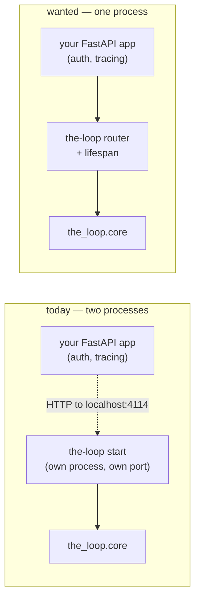

# Requirements: a Python SDK that embeds the-loop into somebody else's service

> Phase 1 of 3 (requirements → design → tasks). Following the Kiro spec approach
> (<https://kiro.dev/docs/specs/>). This phase MUST be reviewed and approved by the
> required collaborators before moving to design.

## Introduction

the-loop's control plane is reachable exactly one way today: run `the-loop start`, get a
whole process, talk to it over `http://127.0.0.1:4114`. That is the right default for an
operator on a laptop and the wrong one for the deployment
[#212](https://github.com/MadaraUchiha-314/the-loop/issues/212) describes — a team that
*already* runs a Python web service and wants the-loop **inside** it: their FastAPI app,
their auth middleware, their transaction-id logging, their observability, one process,
one deployment unit.

Everything that deployment needs is already built and is already correctly layered. The
`core` facade (issue-161, decision-058) is transport-free by construction, and `api/app.py`
already proves an HTTP surface can be built on top of it. What is missing is not
capability — it is a **supported, importable seam**. Today an embedder has three bad
options:

1. call `the_loop.api.app.create_app()` and get a *whole* `FastAPI` app, complete with its
   own title, its own `/api/docs`, its own lifespan and a `/mcp` mount at the root — a
   second application to run beside theirs, not a component of theirs;
2. mount that app as a sub-application, where Starlette does not run a mounted app's
   lifespan, so the MCP session manager never starts and the hosted ingresses never run;
3. reach into `the_loop.core` directly — undocumented, unversioned, and forcing them to
   re-derive config resolution, error mapping and JSON shaping that `api/app.py` already
   has.

So the ask is a **seam**, and the ticket is unusually specific about its shape:

| The ticket asks | Requirement |
|-----------------|-------------|
| "expose a python SDK … embedded with an existing hosted python service say using FastAPI" | R1 |
| "Do we expose an FastAPI app from the SDK that can be mounted into an existing FastAPI app?" | R2 |
| "How do users customize … add their own middlewares etc"; "shouldn't restrict … Auth middleware or transaction id logging middleware" | R3 |
| "initializing the SDK means providing a path to this config file" | R4 |
| "Clearly call out the expectations from the environment … claude and/or cursor binary … gh cli binary" | R5 |
| "Add docs on how users can use this SDK" | R6 |
| "add feature requirements (as gh issue) to integrate with Claude Code SDK and/or Cursor SDK and with github SDK" | R7 |
| "even without the SDK approach to claude/cursor/gh, the SDK for the-loop should be able to leverage the binaries present" | R5, and the non-goal in §Out of scope |



The layering that makes this cheap is the one decision-058 already committed to: **one
implementation in `core`, transports on top**. This work item adds a *third* transport
consumer beside the CLI and the standalone service — an in-process one — and it must add
it without becoming a fourth implementation of anything.

## Requirements

### Requirement 1 — an importable SDK entry point over the whole capability surface

**User story:** As a Python developer running my own service, I want to `import` the-loop
and call its capabilities as functions, so that I can drive work items, sessions, the
process graph and the event log without shelling out to a CLI or making HTTP calls to
myself.

#### Acceptance criteria (EARS)

1. WHEN a developer imports `the_loop.sdk` THEN the system SHALL expose a `TheLoop` class
   that is constructible without any HTTP service running.
2. WHEN a `TheLoop` instance is constructed THEN the system SHALL expose the capabilities
   of `the_loop.core` — work items, sessions, process graph, events, daemons, attention,
   repository queries, CLI-config reads/writes and service status — as methods grouped by
   capability.
3. WHEN an SDK method is called THEN the system SHALL delegate to the corresponding
   `the_loop.core` function and SHALL NOT reimplement its behaviour.
4. WHEN an SDK method is given a malformed input THEN the system SHALL raise `ValueError`,
   and WHEN it names a resource that does not exist THEN the system SHALL raise
   `LookupError` — the same exception contract the HTTP edge translates to 400 and 404.
5. WHEN `the_loop.sdk` is imported THEN the system SHALL NOT require FastAPI, uvicorn or
   the MCP SDK to be importable for the non-HTTP capabilities to work.

### Requirement 2 — a mountable HTTP surface, not a second application

**User story:** As a developer with an existing FastAPI app, I want the-loop's REST and MCP
surfaces as components I include in *my* app, so that I ship one process, one port and one
OpenAPI document.

#### Acceptance criteria (EARS)

1. WHEN a developer calls `TheLoop.router()` THEN the system SHALL return a
   `fastapi.APIRouter` carrying every `/api/v1` operation the standalone service serves,
   with the same paths, methods and `operationId`s.
2. WHEN that router is included in a host application under a prefix THEN the system SHALL
   serve every operation under that prefix, and the host application's generated OpenAPI
   document SHALL contain them.
3. WHEN a route raises `ValueError`, `LookupError` or `SpliceError` THEN the system SHALL
   answer 400, 404 and 500 respectively **without** requiring the host application to
   register exception handlers of its own.
4. WHEN a developer calls `TheLoop.mount(app)` THEN the system SHALL include the router and,
   IF the CLI config enables MCP, mount the MCP endpoint at `<prefix>/mcp`.
5. WHEN the MCP endpoint is mounted THEN the system SHALL run the MCP session manager for
   the host application's lifetime, so that a POST to `<prefix>/mcp` succeeds on the first
   call rather than failing with a session-manager error.
6. IF the host application starts without the SDK's lifespan having been composed THEN the
   system SHALL fail with a message naming the omission, and SHALL NOT serve MCP requests
   against an unstarted session manager.
7. WHEN the standalone `the-loop start` service is built THEN the system SHALL build it
   from the same router, so the embedded and standalone surfaces cannot drift.

### Requirement 3 — the host application keeps its own middleware, auth and lifespan

**User story:** As a developer whose service already has authentication, request-id logging
and a lifespan, I want the-loop's surface to be subject to all of it, so that embedding it
does not create an unauthenticated hole in my service or a second, uninstrumented stack.

#### Acceptance criteria (EARS)

1. WHEN the router is included in a host application that has middleware installed THEN the
   system SHALL let every the-loop request pass through that middleware, in the host's
   order.
2. WHEN a developer includes the router with FastAPI `dependencies` THEN the system SHALL
   apply those dependencies to every the-loop operation, and IF a dependency rejects the
   request THEN the operation SHALL NOT execute.
3. WHEN the SDK is used THEN the system SHALL NOT install middleware on the host
   application, SHALL NOT register application-level exception handlers on it, and SHALL
   NOT alter its `title`, `docs_url` or `openapi_url`.
4. WHEN the SDK's lifespan is composed with a host lifespan THEN the system SHALL run the
   host's lifespan as well, in either composition order.
5. WHEN the SDK mounts into a host application THEN the system SHALL NOT apply the
   standalone service's CORS policy, because cross-origin policy on the host application is
   the host's to declare (and its scope is the whole app, not one router).
6. IF the CLI config enables the ingresses AND the embedder does not want them in their web
   process THEN the system SHALL let the embedder disable ingress hosting at the call site
   without editing the shared config file.

### Requirement 4 — one configuration source: the CLI config path

**User story:** As an operator, I want the embedded the-loop to read the same
`cli-config.yaml` my CLI and daemons read, so that there is one place to say who may
command the loop, where sessions are checked out and which binaries are run.

#### Acceptance criteria (EARS)

1. WHEN a developer constructs `TheLoop(config_path=...)` THEN the system SHALL read that
   file as its CLI config and SHALL use it for every capability call and every route.
2. IF no `config_path` is given THEN the system SHALL resolve the path by the same rules
   every other the-loop process uses (`$THE_LOOP_CLI_CONFIG`, `./.the-loop/cli-config.yaml`,
   `~/.the-loop/cli-config.yaml`).
3. WHEN the configured file changes on disk THEN the system SHALL serve the new content
   without a process restart, for the keys that are not resolved at boot.
4. WHEN a config write is made through the SDK THEN the system SHALL write the same file it
   reads, and SHALL NOT accept a caller-supplied destination path.
5. IF the configured file is missing or unparseable at construction time THEN the system
   SHALL raise, naming the path — an embedded service must fail its own startup rather than
   silently run on defaults nobody chose.
6. WHEN a developer constructs `TheLoop(config=<dict>)` THEN the system SHALL use that
   document instead of reading a file, for tests and for deployments that assemble config
   from their own secret store.

### Requirement 5 — the environment contract is stated and checkable

**User story:** As somebody deploying a service with the-loop inside it, I want to know
exactly which external binaries the-loop needs and which capability breaks without each one,
so that my container image is right before production tells me it is not.

#### Acceptance criteria (EARS)

1. WHEN the documentation is read THEN the system SHALL state, per external binary
   (`claude`, `cursor-agent`, `gh`, `tmux`, `git`), which the-loop capabilities require it
   and what degrades when it is absent.
2. WHEN a developer calls `TheLoop.check_environment()` THEN the system SHALL return a
   report naming each binary, whether it was found, its resolved path, whether the *current
   configuration* requires it, and which capability it serves.
3. WHEN a required binary is missing THEN the report SHALL be marked not-ok and SHALL name
   the missing binary, and WHEN only optional binaries are missing THEN the report SHALL be
   ok.
4. WHEN `check_environment()` runs THEN the system SHALL resolve binaries by the same names
   the runtime uses, including the operator's `integrations.github.cli.binary` override, and
   SHALL NOT execute the binaries it finds.
5. WHEN a capability whose binary is absent is invoked THEN the system SHALL keep the
   existing runtime behaviour (a reported failure), and `check_environment()` SHALL NOT
   become a gate that blocks calls.

### Requirement 6 — documentation an embedder can follow end to end

**User story:** As a developer evaluating the SDK, I want copy-runnable documentation, so
that I can mount the-loop into my own app without reading the-loop's source.

#### Acceptance criteria (EARS)

1. WHEN the docs site is built THEN it SHALL contain an SDK section covering: what the SDK
   is and when to use it instead of the standalone service; mounting into an existing
   FastAPI app; middleware, auth and lifespan composition; the environment contract; and a
   reference for every public SDK symbol.
2. WHEN the SDK documentation shows an example THEN the example SHALL be complete enough to
   run — imports, construction, mounting and lifespan included.
3. WHEN this work item ships THEN the affected capability docs SHALL be updated in the same
   PR, and a capability doc for the SDK SHALL exist and be indexed.
4. WHEN a public SDK symbol is added or renamed THEN the documentation SHALL be updated in
   the same change, enforced by a parity test rather than by review alone.

### Requirement 7 — the vendor-SDK integrations are analysed and raised as tickets

**User story:** As the maintainer, I want the "should we use the vendors' SDKs instead of
their binaries" question answered in writing and tracked as tickets, so that this work item
ships a seam rather than an open-ended rewrite.

#### Acceptance criteria (EARS)

1. WHEN this work item completes THEN a written analysis SHALL exist for each of the Claude
   Agent SDK, the Cursor programmatic surface and PyGithub, covering what it would replace,
   what it would cost, and what it would break.
2. WHEN the analysis is complete THEN one GitHub issue per integration SHALL be raised,
   carrying that integration's requirements, and linked from this work item.
3. WHEN this work item ships THEN the binary-based adapters SHALL remain the shipped
   implementation, unchanged.

## Non-functional requirements

1. **No new runtime dependency.** The SDK is assembled from what
   `the-loopy-one` already installs (`fastapi`, `uvicorn`, `mcp`, `pyyaml`, `slack-sdk`) —
   §Minimalism of `design.md` argues each candidate down. The no-extras rule (PR #162)
   holds: one `pip install the-loopy-one` yields the SDK.
2. **Import cost.** Importing `the_loop.sdk` MUST NOT import FastAPI or the MCP SDK; those
   are imported when the HTTP seam is actually asked for, so a batch script paying for the
   SDK pays for `core` only.
3. **Python floor unchanged** (3.10+).
4. **Observability parity.** An operation invoked through the SDK's HTTP seam SHALL emit the
   same `api.request` event the standalone service emits, so an embedded deployment is as
   auditable as a standalone one.
5. **Public surface is a contract.** Everything under `the_loop.sdk.__all__` is public and
   changes under semantic versioning; everything else (`the_loop.core`, `the_loop.api`,
   the rest of the package) stays internal and may change in any release.

## Security considerations

> Threat-model-lite (`security.threatModel.required`). See `reference/security.md`.

- **Actors & trust.** Unchanged from issue-161: the *caller* of the control plane is trusted
  by whoever put it behind a gateway; the *content* it returns (ticket text, transcripts,
  webhook payloads) is untrusted. This work item adds one actor — the **embedding
  application** — which is trusted code the operator wrote and deployed.

- **Trust boundaries & data.** The boundary moves, and that is the whole security story of
  this work item. The standalone service defends its boundary with two mechanisms it owns:
  the **exposure guard** (`serve.py` refuses a non-loopback bind without
  `service.exposed: true`) and **CORS** (`service.cors`). Neither exists in an embedded
  deployment: the bind is the host application's, and so is the browser policy. The API can
  spawn harness sessions with the operator's credentials, so an embedder who mounts the
  router on a public app with no dependency of their own has published exactly that.

  ```mermaid
  graph TD
    subgraph standalone["standalone — guards are the-loop's"]
      EG["exposure guard<br/>loopback unless exposed:true"] --> SR["/api/v1"]
      CO["service.cors allowlist"] --> SR
    end
    subgraph embedded["embedded — guards are the host's"]
      GW["your gateway / auth dependency"] --> RT["the-loop router"]
      MW["your CORS middleware"] --> RT
    end
  ```

  The mitigation is *explicitness*, not a new in-app auth layer (decision-059 stands: auth
  belongs to the deployment, and adding a second, weaker one here would be worse than
  none). Concretely: R3.2 makes per-router `dependencies` a first-class, documented
  argument; the docs lead the embedding page with the authorization requirement rather than
  burying it; and the SDK never installs CORS on somebody else's app (R3.5), because
  silently widening a host application's cross-origin policy is precisely the failure this
  section exists to prevent.

- **Abuse cases (EARS):**
  1. WHEN an embedder mounts the router with no authorization dependency on a
     publicly-reachable application THEN the documentation SHALL have stated the consequence
     at the top of the embedding page, and the SDK SHALL offer `dependencies` at the mount
     call site so that adding authorization is a one-argument change.
  2. WHEN a request reaches a mounted the-loop route THEN the system SHALL apply the host
     application's middleware and the router's dependencies **before** the operation
     executes, so an authorization dependency cannot be bypassed by choosing a the-loop path.
  3. WHEN an embedder passes a config document containing a path to a file they do not own
     THEN the system SHALL behave exactly as the CLI does with the same file — no new
     privilege is conferred by being embedded.
  4. WHEN a caller attempts a config write through the SDK THEN the system SHALL write only
     the resolved config path, and SHALL reject any attempt to name a destination
     (inherited from `core.config`, R4.4).
  5. WHEN `check_environment()` runs on a hostile `PATH` THEN the system SHALL only resolve
     names to paths and SHALL NOT execute the binaries it finds (R5.4), so a preflight
     cannot itself be the exploit.

- **Fail closed.** A missing or unparseable config path raises at construction (R4.5)
  rather than degrading to `{}` — the lenient CLI behaviour is right for a short-lived
  command and wrong for a long-lived service, where an empty `routing.authorizedUsers`
  silently means "nobody may command the loop" and looks identical to a healthy start. The
  MCP session-manager check (R2.6) is the same posture: refuse rather than serve a surface
  that is not actually running.

## Out of scope

- **Replacing the harness/GitHub binaries with vendor SDKs.** Analysed and raised as
  tickets (R7); the binary adapters ship unchanged (decision-016 stands until one of those
  tickets is worked).
- **In-app authentication.** decision-059: the deployment owns auth. The SDK makes the
  host's authorization easy to attach; it does not implement one.
- **Non-FastAPI web frameworks.** The router is a FastAPI `APIRouter`. A Django/Flask
  embedder can run the SDK's non-HTTP capabilities today and reach the HTTP surface through
  the standalone service; a WSGI/ASGI-generic surface is a separate work item if asked for.
- **An async-native capability surface.** `core` is synchronous and FastAPI runs sync
  handlers in a threadpool, which is what the standalone service already does. An async
  rewrite of `core` is not this work item.
- **A hosted, multi-tenant the-loop.** One `TheLoop` reads one CLI config and drives one
  state root, exactly as one `the-loop` process does.

## Open questions

None blocking. Two judgements were made and are recorded in `design.md` rather than parked
here, because both had a defensible default and neither is reversible-expensive:

1. Whether `mount()` may wrap the host application's lifespan (design D3: yes, opt-out,
   because the alternative is a footgun whose failure mode is a broken MCP endpoint at
   runtime).
2. Whether ingress hosting follows the config or defaults off when embedded (design D4:
   follows the config, per the ticket's "everything STILL runs through the cli-config.yaml",
   with a documented call-site override).

## Risk tier

**Tier 3** (`autonomy.defaultTier`) — human approves the PR. The change is additive to the
package and refactor-only inside `api/app.py`, but it publishes a new public contract and it
moves a security boundary from the-loop's guards to the embedder's, which is a review
judgement, not an autonomous one. No `autonomy.sensitivePaths` entry is touched: no schema
file, no `.github/workflows/**`, no `harness-config.yaml`. Below
`security.review.humanSignOffMinTier` (4), so no separate named security sign-off.

## Review comments

*None yet.*
