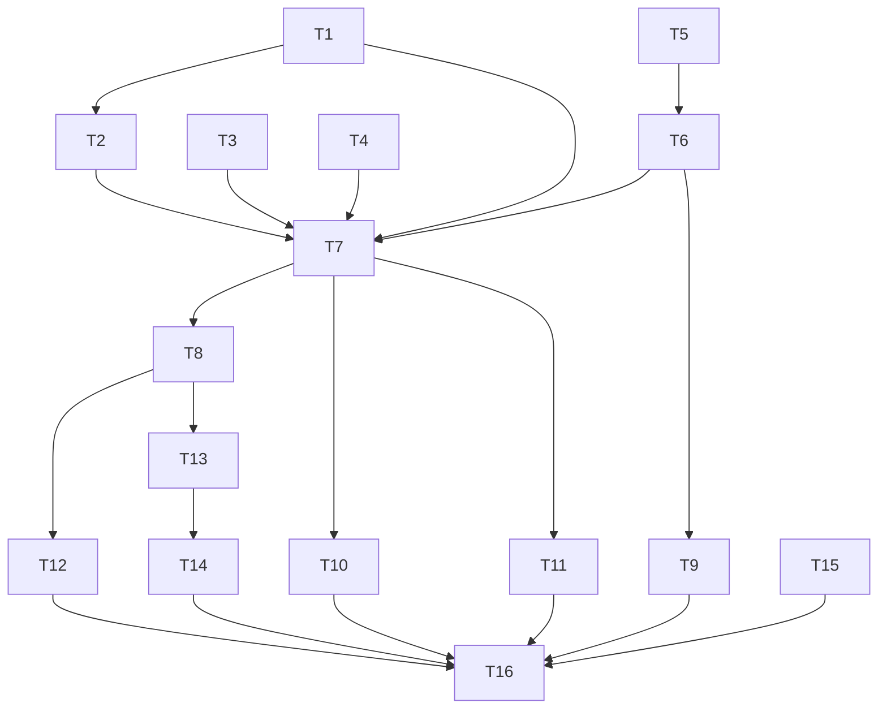

# Tasks: a Python SDK that embeds the-loop into somebody else's service

> Phase 3 of 3. A DAG of small, verifiable tasks derived from
> [`requirements.md`](requirements.md), [`design.md`](design.md) and
> [`testing-plan.md`](testing-plan.md). Each task names the requirements it satisfies and the
> testing-plan row that proves it.

## Task list

- [x] **T1 — Extract `/api/v1` into `api/routes.py`.** Move `ConfigHolder` and the request
      bodies out of `api/app.py`; add `build_router(holder) -> APIRouter` carrying every
      operation, prefix included. `create_app` includes it and keeps CORS, the MCP mount and
      its lifespan.
      _Requirements:_ R2.1, R2.7 · _Test:_ T3, T4

- [x] **T2 — Move the per-request behaviour onto a route class.** Config refresh, the
      `api.request` audit (exempting `health` by operation id) and the
      `ValueError`/`LookupError`/`SpliceError` translation move from middleware and app-level
      handlers into the router's `route_class`. `create_app` drops all four.
      _Requirements:_ R2.3, R4.3, NFR4 · _Test:_ T2, T4, T10

- [x] **T3 — Extract `build_lifespan` into `api/lifespan.py`.** The hosted-ingress and
      MCP-session-manager composition `create_app` performs becomes a function both consumers
      call; `create_app` calls it with its own arguments.
      _Requirements:_ R2.5, R3.6 · _Test:_ T4

- [x] **T4 — Let `api/mcp.build_app` take an explicit host allowlist.** Optional
      `allowed_hosts`; absent keeps today's `service.host`/`port` derivation byte-for-byte.
      _Requirements:_ R2.5 · _Test:_ T2, T4

- [x] **T5 — `sdk/environment.py`: the requirement table and `check_environment()`.**
      One record per binary (name, config key, capability, install hint, per-config
      predicate); resolution by `shutil.which` only.
      _Requirements:_ R5.2, R5.3, R5.4, R5.5 · _Test:_ T1, T10

- [x] **T6 — `sdk/client.py`: `TheLoop` construction and the capability namespaces.**
      Strict config load, `config`/`config_path` mutual exclusion, the eight namespaces,
      `status()`, `config`/`config_path` properties.
      _Requirements:_ R1.1–R1.5, R4.1, R4.2, R4.4, R4.5, R4.6 · _Test:_ T1, T5

- [x] **T7 — `TheLoop.router()`, `.mcp_app()`, `.lifespan()`, `.mount()`.** Deferred imports
      of FastAPI/MCP; the empty-prefix refusal; the un-composed-lifespan refusal; the mount
      report.
      _Requirements:_ R2.2, R2.4, R2.6, R3.1–R3.6 · _Test:_ T1, T2, T10

- [x] **T8 — `sdk/__init__.py`: the public surface.** `__all__` as the semver'd contract
      (NFR5), with the module docstring stating what is and is not public.
      _Requirements:_ R1.1, NFR5 · _Test:_ T5

- [x] **T9 — Unit tests.** `tests/test_sdk_client.py`, `tests/test_sdk_environment.py`.
      _Requirements:_ R1.4, R4.5, R5.3 · _Test:_ T1

- [x] **T10 — Embedding integration tests.** `tests/test_sdk_embedding_integration.py`, each
      with a Gherkin docstring naming its scenario and the requirement it traces.
      _Requirements:_ R2.1–R2.6, R3.1–R3.4, R4.3, NFR4 · _Test:_ T2

- [x] **T11 — Security/abuse-case tests.** `tests/test_sdk_security_integration.py` — one per
      abuse case this code can be made to fail.
      _Requirements:_ §Security abuse cases 2 and 5, R3.3, R3.5 · _Test:_ T10

- [x] **T12 — Parity tests.** `tests/test_sdk_docs_parity.py`: public symbols ↔ docs,
      environment table ↔ environment page, namespace methods ↔ `core` callables. Extend
      `tests/test_api_contract_parity.py` with the router-level assertion.
      _Requirements:_ R6.4, R2.1 · _Test:_ T3, T5

- [x] **T13 — The SDK documentation.** `docs/sdk/index.md`, `embedding.md`,
      `environment.md`, `reference.md`; VitePress nav; links from `docs/cli/service.md` and
      the README.
      _Requirements:_ R6.1, R6.2 · _Test:_ T5, T13

- [x] **T14 — Capability doc and decision record.** `docs/capabilities/sdk.md` plus its index
      row; the control-plane capability doc gains the embedded consumer; `decision-085`.
      _Requirements:_ R6.3 · _Test:_ T5

- [x] **T15 — Vendor-SDK analysis and the three follow-up issues.**
      `docs/reports/vendor-sdk-analysis.md`; one GitHub issue each for the Claude Agent SDK,
      the Cursor programmatic surface and PyGithub; linked from the ticket.
      _Requirements:_ R7.1, R7.2, R7.3 · _Test:_ reviewed as documentation (no code path)

- [x] **T16 — Verification.** Execute the testing plan, tick each activity only once run,
      commit evidence under `evidence/`.
      _Requirements:_ all · _Test:_ T1–T5, T10, T13, T14

## Dependency graph (DAG)

T15 is independent of the code path and can run at any point; everything else funnels through
T7, which is where the seam actually exists.

## Checkpoints

- **After T4** — the refactor is complete and behaviour-neutral: the whole existing suite
  must pass with no test adapted. If a test needed changing, the refactor was not neutral;
  stop and say why in the execution log.
- **After T8** — the public surface is frozen for this work item; T12's parity tests are what
  keep it honest from here.
- **After T12** — all gates green before documentation is written, so the docs describe what
  exists rather than what was planned.

## Review comments

_None yet._
