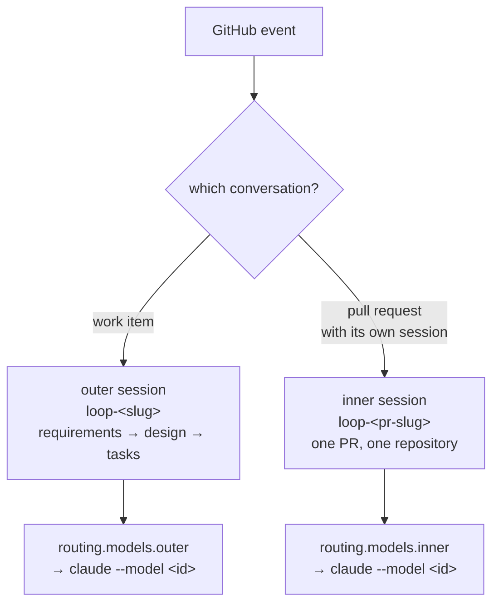

# Requirements: choose the model per loop — outer vs inner

> Phase 1 of 3 (requirements → design → tasks). Following the Kiro spec approach
> (https://kiro.dev/docs/specs/). This phase MUST be reviewed and approved by the
> required collaborators before moving to design.

## Introduction

[Issue #213](https://github.com/MadaraUchiha-314/the-loop/issues/213): the outer loop
writes the requirements, the design and the task DAG for a whole work item and wants the
strongest model available; the inner loop is scoped to one pull request in one repository
and does not. Today both get the same model — whatever the operator's `claude`/`cursor`
default is — because nothing in the spawn path ever passes a model.

The two loops are already distinct in the dispatcher: `_spawn_for` starts the **work
item's** session, `_spawn_endpoint` starts a **pull request's** own session, and the
delivery path calls the difference `inner` (`dispatcher.py:1851`). This work item lets an
operator name a model for each in `.the-loop/cli-config.yaml`, and passes it on the harness
argv when either session is spawned or respawned.

The mechanism to carry a model already exists and is unused for interactive sessions:
`HarnessAdapter.model_flag` (`--model` for Claude Code, `-m` for cursor-agent) is applied
only by `oneshot_argv`, the critic-review surface. The interactive argv builders
(`interactive_argv` / `interactive_resume_argv`) take no model at all.



Note what this is **not**: `harness-config.yaml`'s `tokenEconomy.modelRouting` is advice
*to the agent already running inside a session* about which model to use per stage. This
work item is about the argv the daemon spawns that session with. The two are left
unreconciled on purpose (see Out of scope).

## Requirements

### Requirement 1 — declare a model per loop

**User story:** As an operator, I want to name one model for outer-loop sessions and
another for inner-loop sessions in `cli-config.yaml`, so that the expensive model is spent
on whole-work-item reasoning and the cheaper one on scoped PR work.

The declaration is flat and harness-agnostic — `routing.defaultHarness` is a single value,
so one deployment spawns sessions with exactly one harness and a per-harness map would be
speculative:

```yaml
routing:
  models:
    outer: ""    # model id for a work item's own session; "" = the harness's own default
    inner: ""    # model id for a pull request's own session; "" = the harness's own default
```

#### Acceptance criteria (EARS)

1. WHEN `routing.models.outer` is a non-empty string THEN the system SHALL pass it to the
   harness on the argv of every session spawned for a **work item**, using that harness's
   own model flag.
2. WHEN `routing.models.inner` is a non-empty string THEN the system SHALL pass it to the
   harness on the argv of every session spawned for a **pull-request endpoint**, using that
   harness's own model flag.
3. IF a key is absent or empty THEN the system SHALL spawn with no model flag at all — the
   harness's own default, which is the behaviour of every deployment written before this
   change.
4. IF `routing.models` is absent entirely THEN the system SHALL load the configuration
   without error and behave as in criterion 3.
5. WHEN `routing.models` carries a key that is not `outer` or `inner` THEN the system SHALL
   reject the configuration as a schema violation, rather than silently ignoring a typo
   that would leave an expensive model selected.

### Requirement 2 — the model reaches the session that was asked for

**User story:** As an operator, I want the model I declared to be the model the tmux session
actually runs, so that the setting is a fact about the deployment and not a hint.

#### Acceptance criteria (EARS)

1. WHEN a work item's session is spawned fresh THEN the system SHALL build its interactive
   argv with the outer model.
2. WHEN a pull request's own session is spawned (`_spawn_endpoint`) THEN the system SHALL
   build its interactive argv with the inner model.
3. WHEN a dead session is respawned — resuming its conversation (`--resume`) or starting a
   fresh one — THEN the system SHALL apply the same model that loop's kind is configured
   with, so a crash never silently changes the model a work item is being worked with.
4. WHILE `sessionPerPr` resolves to a mode that gives a pull request no session of its own,
   the system SHALL deliver that PR's events into the work item's session unchanged — that
   session keeps the **outer** model, because it is the outer session.
5. IF the resolved harness declares no model flag (`HarnessAdapter.model_flag` is empty)
   THEN the system SHALL spawn without a model and SHALL log that the configured model was
   ignored, rather than guessing at a flag.
6. IF the operator's `routing.harnessArgs.<harness>` already carries that harness's model
   flag THEN the system SHALL spawn with the operator's own argument and SHALL NOT add a
   second one, and SHALL warn that `routing.models` was overridden — two model flags on one
   argv is a parse the-loop must never produce.

### Requirement 3 — the model is visible in the trail

**User story:** As an operator reading the event log after the fact, I want to see which
model a session was started with, so that a cost or quality difference between two sessions
is attributable.

#### Acceptance criteria (EARS)

1. WHEN a session is spawned or respawned THEN the system SHALL record the model that was
   applied — and which loop it was applied for — on the `session.spawned` event, empty when
   none was applied.

## Non-functional requirements

- **Backwards compatible by omission.** A `cli-config.yaml` written before this change is
  valid and behaves identically; no migration is required (`the-loop migrate-config` gains
  nothing here).
- **One owner for the argv.** The model is applied where `model_flag` already lives — the
  harness adapter — not by each of the four dispatcher spawn sites assembling flags of its
  own.

## Security considerations

> Threat-model-lite (`security.threatModel.required`). See `reference/security.md`.

- **Actors & trust:** the only writer of `routing.models` is the **operator**, in the same
  file that already declares `routing.harnessArgs` — executable configuration, reviewed like
  code. Work-item authors, commenters and webhook payloads are untrusted and have no path to
  this value.
- **Trust boundaries & data:** the value crosses one boundary — from YAML into an argv the
  daemon executes. There is no shell (`subprocess.run` with a list), so quoting is not the
  exposure; **flag injection** is: a value that begins with `-` is read by the harness as
  another option, not as a model id, which is how `--dangerously-skip-permissions` would
  reach a spawn nobody meant to widen. No secrets or PII are involved, and no new network
  surface is opened.
- **Abuse cases (EARS):**
  1. WHEN a configured model id begins with `-` THEN the system SHALL reject it and spawn
     with no model flag, logging the refusal — the-loop never widens the harness's
     permissions on behalf of a value that was supposed to name a model.
  2. WHEN any ticket, comment, PR body or webhook payload contains text asking for a
     different model THEN the system SHALL ignore it — the model is read from operator
     configuration only, never from work-item content.
- **Fail closed:** an unreadable, malformed or rejected model value results in **no model
  flag**, never in a guessed one and never in a second flag alongside the operator's own.

## Out of scope

- **Reconciling `tokenEconomy.modelRouting`** (harness-config.yaml) with this setting. That
  block advises the agent inside a session per stage; this one chooses the process the
  daemon starts. Both may stand.
- **Standing sessions** (`standingSessions.sessions[]`), which already declare their own
  `harnessArgs` and can carry `--model` there today.
- **Critic one-shots**, which already take a model (`reviews.critics[].model`).
- **Per-work-item or per-phase model choice**, including anything selectable at
  `phase-selection`. Two knobs, operator-set.
- **A `--model` flag on `the-loop sessions start`.**

## Open questions

Raised on the ticket as comments (paper trail) and answered there:

1. **Naming.** `routing.models.{outer,inner}` — or `routing.harnessModels`, mirroring
   `routing.harnessArgs`? The proposal above is the flat one.
2. **Should the announcement comment show the model** alongside the harness and tmux
   session name, or is the event log enough?

## Review comments

> Appended by the-loop's `record-feedback` hook when a human gate approves with
> comments (issue-109). Append-only and attributed.
