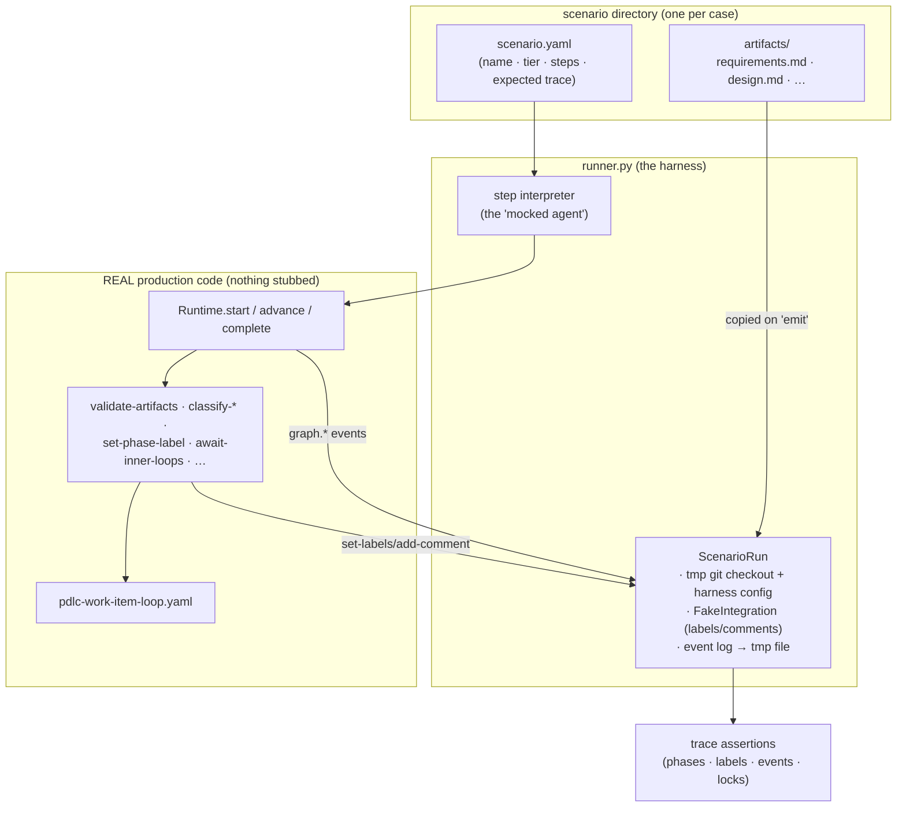

# Design: end-to-end PDLC scenario tests against a mocked agent harness

> Phase 2 of the chain. Derives from [`requirements.md`](requirements.md). Ticket:
> [#217](https://github.com/MadaraUchiha-314/the-loop/issues/217).

## Overview

**A data-driven scenario runner over the real runtime, with a scripted agent whose
"work" is fixture playback.** The harness under test is the shipped one:
`build_runtime`/`Runtime.start`/`advance`/`complete` walk the real
`pdlc-work-item-loop`, real hooks gate real files in a `tmp_path` git checkout, and
the only fakes are the two transports every existing integration test already
fakes — the `integrations.resolve` seam (labels/comments) and the event log pointed
at a temp file. The mocked agent is a **step interpreter**: a scenario's manifest
lists steps (`emit` a fixture artifact, `complete` a node, `comment` as a user,
`ask` a question, `reply` to it, …), and the runner executes them in order,
recording the observable trace as it goes.



Why an interpreter and not per-scenario test functions: R2's whole point is that a
new case costs a fixture set. The step vocabulary is a **closed enum** deliberately
(security consideration 1) — a scenario cannot express "run this shell command",
only "hand the process this artifact / this comment / this claim".

The deliberate absences:

- **No inner-loop tmux/dispatcher simulation.** The seam between the loops is
  `await-inner-loops` reading `pr-loops/*/graph-state.json`; scenarios exercise it
  by writing inner state files (the `inner-loop` step), not by simulating the
  dispatcher's PR-session routing — which `test_graph_multirepo_integration.py`
  already covers per-seam. An e2e re-test of the dispatcher would duplicate that
  suite, not extend it.
- **No golden-file event dumps.** Expected traces name the events that *matter* in
  order (subsequence assertion, R1.3); asserting the full log verbatim would make
  every unrelated new event type a scenario-breaking change.
- **No new CLI verb** (`the-loop e2e …`). This is a pytest suite; CI parity comes
  from `make test`, which already runs it.
- **No fixture-driven graph mutation.** Scenarios always walk the shipped graphs;
  a scenario cannot supply its own YAML. Process conformance against the *shipped*
  process is the subject (the graph compiler caches by path anyway).

## Architecture

### Suite layout (R2.1, R4.3)

```text
cli/tests/test_pdlc_e2e_integration.py   # the scenario tests (one per scenario,
                                         #   Gherkin docstrings, + format meta-tests)
cli/tests/test_pdlc_e2e/                 # helper package + fixtures (no test modules)
├── __init__.py
├── README.md               # the fixture-set format, for scenario authors
├── runner.py               # Scenario + ScenarioRun + step interpreter + trace asserts
└── scenarios/
    ├── happy-path/
    │   ├── scenario.yaml
    │   └── artifacts/…     # requirements.md, design.md, testing-plan.md, tasks.md,
    │                       #   execution-log.md variants (per step)
    ├── trivial-tier/…
    ├── ask-reply/…
    ├── gate-rejection/…
    ├── review-rejection/…
    ├── gh-unreachable/…
    └── loop-prevention/…
```

Two repo constraints place the test module *beside* the fixture directory rather
than inside it: `testing.integrationTestGlobs` pins scenario discovery to the
non-recursive `cli/tests/test_*_integration.py`, so a module inside the directory
would be invisible to `the-loop scenarios` (R4.1) without touching the harness
config — a sensitive path this work item has no reason to edit; and `cli/tests/`
has no packages, so pytest requires unique module basenames tree-wide. A
consistency test parametrized over `sorted(scenarios/*)` asserts every scenario
directory has a named test and vice versa, so a dropped-in fixture set without its
one-line test function fails loudly rather than silently not running (R2.1, R2.2).

### `ScenarioRun` — the hermetic world (R3)

Composes only existing seams:

- **Checkout**: `tmp_path` git repo (`git init` + one commit), carrying
  `.the-loop/harness-config.yaml` scaffolded via the same helper the drive
  integration tests use, so `workflow.specDir`/`phaseLabelPrefix` are real config
  reads. Spec dir `docs/specs/<id>/`.
- **Runtime**: `build_runtime(root, authorized_users=["owner"])`-shaped config;
  `config["originRepo"]` set so refs derive; nothing routed — pure in-process
  (`_local_execution` autouse fixture already sets `THE_LOOP_SERVICE_LOCAL`).
- **FakeIntegration** at `the_loop.graph.integrations.resolve` (the seam every
  graph test patches): implements `add-comment`, `set-labels`, `get-labels`,
  `list-comments`; records every call; serves posted comments back to
  `list-comments` (which is how the phase-selection checklist's tick state and
  marked comments round-trip). A `fail_ops` knob makes named operations raise —
  the `gh`-unreachable scenario (R3.3). Any unknown operation raises (hermeticity
  asserted structurally, security consideration 3).
- **Event log**: `eventlog.configure("e2e", path=tmp)` + `reset()` teardown; the
  trace assertions read it with `read_events`.
- **Ask/reply**: `ask_session`/`reply_session` with their comment poster patched to
  the fake and `TmuxRunner` replaced by the conftest `FakeTmux` double (the
  ask-reply integration tests' own pattern).

### The step vocabulary (the mocked agent)

| Step | Meaning | Real code it drives |
|------|---------|---------------------|
| `comment: {author, body[, fixture]}` | a human (or marked agent) comment arrives at the current gate | `Runtime.advance(event={comments:[…]})` — the dispatcher's consult path |
| `emit: {artifact, fixture}` | the agent "produces" an artifact | copy `artifacts/<fixture>` → spec dir, commit |
| `complete: {node}` | the session claims its node | `Runtime.complete(...)` — the `graph complete` envelope |
| `advance: {}` | a non-comment event nudges the gate | `Runtime.advance(event=None)` |
| `ask: {question}` | the agent escalates | `core.sessions.ask_session` |
| `reply: {text, actor}` | the operator answers | `core.sessions.reply_session` |
| `inner-loop: {pr, node[, repo]}` | an inner loop's pointer stands at `<node>` | write `pr-loops/…/graph-state.json` |
| `fail-github: {ops}` / `restore-github` | GitHub becomes (un)reachable | FakeIntegration knob |
| `expect: {…}` | mid-run checkpoint | assertions against state/label/events *now* |

An unknown step kind or a step naming a missing fixture fails the scenario naming
the manifest field (R2.2). Steps never run subprocesses (except git plumbing the
existing tests already use) and never take strings into a shell.

### Expected-trace assertions (R1.3, R1.4)

`scenario.yaml`'s `expect:` block declares, and the runner asserts after the final
step (plus at every `expect` step):

- `nodes`: the walked node sequence — compared against the transition record
  derived from `graph.started`/`graph.advanced`/`graph.node_skipped`/
  `graph.completed` events, with skips distinguished from passes;
- `labels`: the ordered `set-labels` calls (`loop:<phase>` progression — the label
  trail, exactly as GitHub would have seen it);
- `events`: an ordered subsequence of `{event[, fields…]}` matchers over the log;
- `finalNode`, `status`, `lockedBeforeImplementation` (spec-chain artifacts carry
  `status: approved` before `implementation` is entered — checked live at entry
  via the transition record + front-matter reads);
- `executionLog`: sections the shared log must carry at the end.

First divergence reporting: the trace comparator walks expected vs. actual and
raises one `ScenarioAssertionError` naming the index, the expectation and what
stood in its place, followed by the full observed trace for context.

## Components & interfaces

`runner.py` exposes three things (kept private to the suite — nothing is exported
from the package):

```python
@dataclass
class Scenario:          # parsed + validated scenario.yaml
    name: str; tier: int; steps: list[Step]; expect: Expect
    @classmethod
    def load(cls, directory: Path) -> "Scenario"   # raises ScenarioFormatError

class ScenarioRun:       # the world; context manager
    def __init__(self, scenario, tmp_path, monkeypatch): ...
    def execute(self) -> Trace                     # interpret steps, collect trace
    # .runtime, .integration, .events(), .state() for ad-hoc assertions

def assert_trace(trace: Trace, expect: Expect) -> None
```

`runner.py` also provides `scenario_dirs()` discovery; the test module binds
`tmp_path`/`monkeypatch` into a `run_scenario(name)` helper each named test calls.

### How each required scenario maps (R2.3)

| Scenario | Walk | The conformance it pins |
|----------|------|-------------------------|
| `happy-path` | full outer loop, tier 3: authorized `the-loop execute` (no skips) → emit+complete each spec phase → approvals via authorized comments → implementation/verification → review-chain log sections → human approval → complete | phase order, label trail `loop:phase-selection → … → loop:complete`, artifacts locked before `implementation`, events in order, execution-log mirror |
| `trivial-tier` | tier 1: selection reply unticks `spec-chain` + `review-chain` boxes → implementation/verification → human approval | skipped nodes recorded `graph.node_skipped` with provenance (never `pass`), label trail contains only walked phases and still never regresses |
| `ask-reply` | happy walk to implementation; agent `ask`s; run parks awaiting input; operator `reply` resumes; completes | `session.awaiting_input` → `session.reply_sent` ordering; attention surface opens and clears; marked question comment posted |
| `gate-rejection` | requirements emitted **unlocked** (`status: draft`) → `complete` refused (block) → emit locked fixture → passes | a malformed artifact blocks (label does not move, `graph.blocked` recorded), repair advances — never a silent pass |
| `review-rejection` | design-approval answers `changes-requested` → pointer returns to `design` → re-emit → approved | the backward edge routes (label re-enters `loop:design`), regression is explicit (`graph.advanced` with `to: design`), and the loop converges |
| `gh-unreachable` | happy segment with `fail-github: [set-labels, add-comment]` across one transition | node verdict unchanged, `graph.hook_degraded` emitted, event log still written (R3.3) |
| `loop-prevention` | at a human gate, a comment carrying `SELF_COMMENT_MARKER` from the authorized author arrives → gate stays waiting; unmarked authorized comment then releases it | self-authored input is never classified as human feedback (the `_authorized_comments` filter), pinned e2e |

The **agent-session-dies** error case from the ticket is covered at its seam by
the reply path: `reply` with the FakeTmux `session_missing` knob asserts the
fail-closed `LookupError` (404 contract — never a respawn), inside `ask-reply` as
a mid-run `expect`. Full dispatcher-respawn choreography stays in the existing
drive-integration suite (deliberate absence 1).

## Data models

`scenario.yaml` (the whole fixture-set contract, documented in README.md):

```yaml
name: happy-path
description: tier-3 item walks the full outer loop with no interventions
tier: 3
workItem: issue-42          # spec dir name; ref derives as github:e2e/e2e#42
steps:
  - comment: {author: owner, body: "the-loop execute"}
  - emit: {artifact: requirements.md, fixture: requirements.md}
  - complete: {node: requirements-definition}
  - comment: {author: owner, body: "approved"}
  # …
expect:
  finalNode: complete
  status: complete
  nodes:                    # walked sequence; "~node" marks an expected skip
    [phase-selection, brainstorming~, requirements-definition, …]
  labels: ["loop:phase-selection", "loop:requirements-definition", …]
  events:
    - {event: graph.started}
    - {event: graph.advanced, node: phase-selection, outcome: selected}
    - {event: session.awaiting_input}     # ask-reply scenario only
    # …
  lockedBeforeImplementation: [requirements.md, design.md, testing-plan.md, tasks.md]
  executionLog: {sections: [Review cycles, "Security review (gate)"]}
```

No production data model changes. No new event types, config keys, or schema
changes.

## Error handling

| Failure | Behaviour |
|---------|-----------|
| scenario dir without `scenario.yaml` | `ScenarioFormatError` naming the dir (test fails, never skips) |
| unknown step kind / missing step field | `ScenarioFormatError` naming file + field |
| `emit` naming an absent fixture | `ScenarioFormatError` naming the fixture path |
| trace divergence | `ScenarioAssertionError`: first divergence (index, expected, found) + observed trace |
| FakeIntegration op not in its table | `AssertionError` (hermeticity tripwire) |
| a step's runtime call raises unexpectedly | propagates — a crash is a finding, not a trace mismatch |

## Security design

Each abuse case from the requirements, its mechanism, and where it is proved:

1. **Fixture playback as injection** — steps are a closed vocabulary interpreted
   by `runner.py`; fixtures are copied bytes and YAML parsed with `safe_load`;
   nothing is `exec`'d or shell-interpolated. *Test: the malformed-scenario format
   tests (unknown step kind refused).*
2. **Fakes masking authorization regressions** — fakes sit at transport seams
   only; `classify-feedback`'s authorized-author check, `is_self_authored`
   filtering and gate logic run production code in every scenario. Two scenarios
   positively assert the boundary: `loop-prevention` (marked comment never
   advances a gate) and the unauthorized-author case inside it (an unauthorized
   "approved" leaves the gate waiting). *Test: the scenarios themselves.*
3. **Hermeticity erosion** — FakeIntegration raises on unknown operations;
   no scenario step can name a URL or a command; the suite runs under plain
   pytest in CI's sandbox. *Test: structural (the fake's op table) + CI.*

## Testing strategy

The work item **is** tests; the plan ([`testing-plan.md`](testing-plan.md))
therefore distinguishes the scenarios (the deliverable) from the meta-tests that
prove the runner itself (format validation, first-divergence reporting,
subsequence matcher edge cases) and the repo gates (lint/type/docs parity,
`the-loop scenarios` discovery).

## Minimalism notes

- Reused: conftest's autouse hermeticity fixtures, `FakeTmux`, the
  `integrations.resolve` patch pattern, `eventlog.configure/read_events`,
  `build_runtime`, the shipped graphs and templates. New code is one runner
  module, one conftest, one test module, and inert fixtures.
- Rejected: a generic BDD framework dependency (pytest parametrization suffices,
  NFR1); scenario-supplied graphs (see deliberate absences); full-log golden
  files (brittle); a CLI verb (no consumer).
- The step interpreter is the one new abstraction, justified by R2: seven
  scenarios × bespoke test functions would each re-plumb the same world, and the
  eighth scenario would too.
