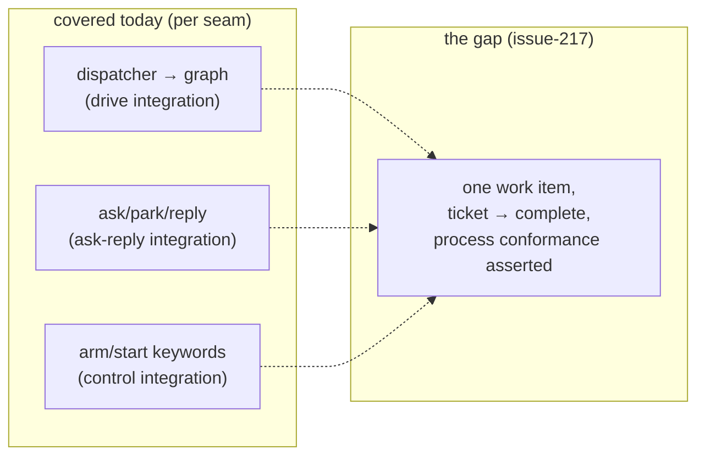

# Requirements: end-to-end PDLC scenario tests against a mocked agent harness

> Phase 1 of the chain. Ticket:
> [#217](https://github.com/MadaraUchiha-314/the-loop/issues/217).

## Introduction

**Every seam of the loop is tested; the loop itself is not.** The suite proves each
part in isolation — the dispatcher enters and advances the graph
(`test_graph_drive_integration.py`), `the-loop ask` parks a session and the reply
route resumes it (`test_ask_reply_integration.py`), control keywords arm and start
work items (`test_control_integration.py`) — but no test walks **one work item**
from ticket to completion and asserts that the *process* held: phases entered in
order, labels advanced at every transition, the spec chain locked before
implementation, the expected events in the expected order.

That matters because the process is the product: the-loop's promise is that work is
*done a particular way*, and a regression that lets a phase be skipped silently, a
label stagnate, or a self-authored comment resume its own session is invisible to
per-seam tests — each seam still behaves. This work item adds a **scenario-driven
end-to-end harness**: the agent is a scripted fake whose artifacts come from
fixtures, and each scenario asserts the full observable trace (phases, labels,
events, artifacts) against expectations, not just the final state.

## Requirements

### Requirement 1 — a scenario runner that walks one work item end to end

**User story:** As a maintainer of the-loop, I want a single test to drive a work
item through the outer loop against a scripted agent, so that a change anywhere in
the harness that breaks the *process* fails a test that names the transition it
broke.

**Acceptance criteria (EARS):**

- **1.1** WHEN a scenario runs THEN the system SHALL create a work item in a
  hermetic checkout (a `tmp_path` git repository carrying the-loop's harness
  config), enter it into the shipped `pdlc-work-item-loop`, and drive it by the
  same runtime entry points the daemon and CLI use (`Runtime.start`, `advance`,
  `complete`) — never by a test-only re-implementation of the walk.
- **1.2** WHEN the process expects the agent to produce an artifact
  (`requirements.md`, `design.md`, `testing-plan.md`, `tasks.md`, execution-log
  sections, code) THEN the mocked agent SHALL emit it by copying the scenario's
  fixture file into the work item's spec directory — the "agent" is playback, not
  a model.
- **1.3** WHEN a scenario completes THEN the runner SHALL assert **process
  conformance**, each against the scenario's expected trace:
  - phases were entered in the configured order, and no phase was entered whose
    gate had not passed;
  - the `loop:<phase>` label advanced at every transition — never skipped a
    configured phase, never regressed without an explicit event;
  - spec-chain artifacts existed and were locked (`status: approved`) before
    `implementation` was entered, scaled to the scenario's autonomy tier;
  - the expected events appeared in the event log **in order** (subsequence
    match: expected events in order, unrelated events permitted between them);
  - the execution log mirrors the transitions that actually happened.
- **1.4** The runner SHALL fail with a message naming the first divergence (the
  expected transition/event and what was found), so a broken scenario reads as a
  process regression report rather than an assertion dump.

### Requirement 2 — scenarios are fixture sets, not test plumbing

**User story:** As a contributor adding coverage for a new process behaviour, I
want to add a scenario by dropping in a fixture directory, so that the cost of a
new end-to-end case is authoring fixtures rather than writing bespoke test code.

**Acceptance criteria (EARS):**

- **2.1** Each scenario SHALL be one directory under the e2e suite containing a
  scenario manifest (name, tier, the scripted agent steps) plus its artifact
  fixtures and expected trace; the runner SHALL discover scenarios from the
  directory listing, and a test SHALL exist per discovered scenario
  (parametrization over the listing).
- **2.2** WHEN a scenario directory is malformed (missing manifest, step naming a
  missing fixture, unknown step kind) THEN the runner SHALL fail that scenario
  with a message naming the file and field — never silently skip it.
- **2.3** The suite SHALL include at least these scenarios:
  - **happy path** — a tier-3 item walks spec → design → test-planning → tasks →
    implementation → verification → review chain → complete with no intervention;
  - **trivial tier** — a tier-1/2 item completes autonomously with the phases a
    declared skip removes actually skipped, labels still advancing correctly and
    skips reported as declarations, never passes;
  - **ask/reply mid-flight** — the agent escalates via the ask seam, the run
    parks awaiting input, the operator's reply resumes it (asserting the
    `session.awaiting_input` / reply-delivered events land in order);
  - **error: gate rejection** — a phase gate blocks on a malformed/missing
    artifact and the run does not advance (the label does not move) until the
    fixture is repaired;
  - **error: review rejection loops back** — a `changes-requested` verdict at a
    human gate routes back to the earlier phase rather than forward;
  - **loop prevention** — a comment carrying the self-authorship marker
    (`<!-- the-loop:agent-comment -->`) is never classified as human input at a
    gate and never advances it.

### Requirement 3 — hermetic: every external system is faked at an existing seam

**User story:** As anyone running CI, I want the e2e scenarios to run with no
network, no tmux and no GitHub, so that the suite is deterministic and runs
anywhere the unit tests do.

**Acceptance criteria (EARS):**

- **3.1** The scenarios SHALL fake externals only at the seams the existing
  integration tests already use (the integrations/comments layer, the event log's
  target directory, tmux-runner substitution, `tmp_path` checkouts) — no new
  parallel mocking layer, and no monkeypatching of the-loop's internal logic
  (faking a *boundary* is in scope; stubbing the *unit under test* is not).
- **3.2** WHEN the scenarios run THEN they SHALL make no network call, spawn no
  tmux session and touch nothing outside the test's temporary directories; the
  suite SHALL pass under plain `pytest` with no environment beyond what the
  existing integration tests require.
- **3.3** WHEN the faked GitHub layer is told to fail (the `gh`-unreachable error
  scenario) THEN the run SHALL degrade exactly as the production contract says:
  the event is still recorded, the side effect is reported as degraded
  (`graph.hook_degraded`), and the node's verdict is unchanged.

### Requirement 4 — the suite is discoverable and documented like the rest

**Acceptance criteria (EARS):**

- **4.1** Every scenario test SHALL carry the repo's Gherkin docstring
  (`Feature:` / `Scenario:` / Given-When-Then) with a `Requirement:` link to this
  file, and SHALL be discovered by `testing.integrationTestGlobs` so
  `the-loop scenarios` lists it.
- **4.2** The affected capability docs (`docs/capabilities/testing-and-contracts.md`;
  `process-graph.md` if graph behaviour notes change) SHALL be updated in the same
  PR, with history rows citing issue-217.
- **4.3** A `README.md` in the scenario suite SHALL document the fixture-set
  format well enough that adding a scenario requires reading nothing else.

## Non-functional requirements

- **NFR1 — no new dependency.** The runner is pytest + stdlib (yaml already ships
  with the CLI); fixtures are plain files.
- **NFR2 — no production code change required.** The harness under test is the
  shipped one; if a seam proves untestable without a change, that change is its
  own justified, minimal commit — the default is zero.
- **NFR3 — bounded runtime.** The whole scenario suite SHALL add no more than a
  few seconds to the test run (fixture playback, no sleeps, no subprocess spawns
  beyond what existing integration tests do — git init/commit).
- **NFR4 — deterministic.** No wall-clock dependence, no ordering dependence
  between scenarios; each scenario builds its own isolated checkout.

## Security considerations

Threat-model-lite. This work item adds **test code and fixtures only**; it ships
no production capability, route, or config key. The untrusted-actor analysis is
correspondingly narrow:

| # | Abuse case | Mechanism |
|---|-----------|-----------|
| 1 | **Fixture playback as an injection vector**: a scenario fixture is executed rather than copied, so a malicious-looking fixture in a PR runs code at test time. | Fixtures are inert data — copied into the checkout, parsed as YAML/markdown, never `exec`'d, never shell-interpolated. The scenario manifest's step vocabulary is a closed enum; an unknown step kind fails the scenario (R2.2). |
| 2 | **The e2e suite masks a real-security regression** by faking the authorization boundary: a fake that auto-authorizes would let a gate-bypass regression pass. | The fakes sit at transport seams (comments/labels/tmux/event-sink), not at decision seams: `classify-feedback`'s authorized-author check, the loop-prevention marker filter and the gate logic run **real** production code paths in every scenario — the loop-prevention and unauthorized-input behaviours are positively asserted (R2.3). |
| 3 | **Hermeticity erosion**: a later scenario quietly adds a network call or real `gh` invocation, and CI starts depending on externals. | R3.2 is asserted structurally where cheap (fakes raise on unexpected calls rather than no-op), and the suite runs in CI's default sandbox where such a call fails loudly. |

No new attack surface: no production code path changes (NFR2), no new
externally-reachable input. **Risk tier: 3** (`human-approves-pr`) — the change is
test-only, but it is large, it becomes the reference for how the process is
allowed to behave, and a wrong expected-trace fixture would *entrench* a process
bug; a human should approve the traces.
