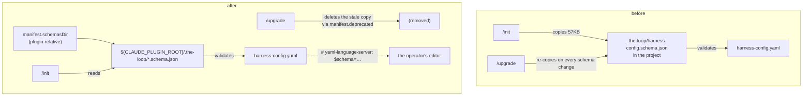

# Design: the-loop's JSON schemas ship with the plugin, not with your repo

> Phase 2 of 3 (requirements → design → tasks). Derives from the approved
> requirements. MUST be reviewed and approved before moving to tasks breakdown.

## Overview

The schemas already live in the plugin. The only thing that puts a copy in somebody's
repository is **a line of prose in `commands/init.md` and three entries in
`.the-loop/manifest.yaml`** — there is no code to change, because no code copies them.
So the change is small and almost entirely declarative:

1. **The manifest stops calling schemas project files** and starts declaring where they
   live in the plugin (`schemasDir`, exactly like `templatesDir`). The three paths move
   from `meta` to `deprecated`, which is what makes `/upgrade` delete the copies already
   out there — that machinery exists and needs no new step (issue-36 built it).
2. **`init.md` and `upgrade-the-loop.md` stop instructing the agent to copy**, and start
   naming `${CLAUDE_PLUGIN_ROOT}` when they name a schema.
3. **The scaffolded config files carry a `# yaml-language-server: $schema=` modeline**, so
   an operator loses a 57 KB file and keeps editor validation. This is the one place with
   real code: `harness_config.scaffold()` prepends a header to the packaged default, and
   the modeline only works from line 1.
4. **A parity test** holds the manifest, the schema directory and the modelines to each
   other, so the arrangement cannot silently rot (NFR4).



## Architecture

Three consumers resolve a the-loop schema, and after this change all three resolve it from
the same declared place:

| Consumer | Resolves the schema… | Changes? |
|----------|----------------------|----------|
| `/the-loop:init`, `/the-loop:upgrade-the-loop` (agent-executed markdown) | `${CLAUDE_PLUGIN_ROOT}/.the-loop/<name>.schema.json`, declared once as `manifest.schemasDir` | **yes** — today they name a project-relative path and copy the file |
| This repository's CI (`scripts/validate_config.py`, `.github/workflows/ci.yml`) | `<repo>/.the-loop/<name>.schema.json` | **no** — this repository *is* the plugin root, so the path it already uses is the plugin path |
| The Python CLI at runtime | it doesn't — `harness_config.READS` reads keys, never a schema | **no** (NFR1) |
| An operator's editor | the `$schema` modeline URL, over the network | **new**, and deliberately outside the loop |

The fourth row is the only new dependency in the design, and it is a dependency of the
*editor*, not of the-loop: nothing in the loop reads that line (R4.3, R4.4).

## Components & interfaces

### `.the-loop/manifest.yaml` — the declaration

The manifest already models exactly this distinction; issue-36 established the shape when
templates became internal. Three edits:

```yaml
# meta:  ← the three `*.schema.json` entries are DELETED from this list

# new, mirroring the existing `templatesDir`:
schemasDir: .the-loop        # relative to ${CLAUDE_PLUGIN_ROOT}

deprecated:
  - path: .the-loop/harness-config.schema.json
    role: config-schema
    reason: >-
      Schemas are internal to the-loop (issue #220) and ship with the plugin under
      ${CLAUDE_PLUGIN_ROOT}/.the-loop/; they are no longer copied into each project.
      Safe to delete: the file is a verbatim copy of the plugin's own schema and holds
      no project data.
    removeIn: "10.0.0"
  # …the same for collaborators.schema.json and cli-config.schema.json
```

The wording of `reason` is load-bearing, not decoration: `/upgrade`'s step 3 reads it to
decide between *delete* and *migrate* (`.the-loop/config.schema.json`, the pre-rename name,
is deliberately phrased as a migration and stays one). "Safe to delete" plus "holds no
project data" is the phrasing that routes these three to deletion (R3.1).

Note what does **not** change: `.the-loop/config.schema.json`'s existing deprecated entry.
It describes a *rename* migration handled in step 4. After this work item that migration's
outcome is "delete the old file, write nothing" rather than "replace it with the new
name" — a wording change in `upgrade-the-loop.md`, not a manifest change.

### `commands/init.md` — stop copying

| Location | Today | After |
|----------|-------|-------|
| Header paragraph | "Templates are **internal to the-loop** and are **not** copied into the project" | the same sentence covers **templates and schemas**, naming `manifest.templatesDir` and `manifest.schemasDir` |
| Step 2 (onboarding) | "The schema's `x-onboarding.groups` (in `harness-config.schema.json`)" | "…in the plugin's `harness-config.schema.json` (`manifest.schemasDir`)" |
| Step 3 (reconcile) | creates `.the-loop/harness-config.schema.json`; creates `cli-config.schema.json` alongside `cli-config.yaml` | both bullets **removed**; the CLI-config bullet scaffolds `cli-config.yaml` alone |
| Step 5 (validate) | validates against `.the-loop/*.schema.json` | validates against the plugin's schemas, with the note that a project-local copy is not expected and not required |

### `commands/upgrade-the-loop.md` — shed and migrate

Step 3's cleanup already walks `manifest.deprecated`; it gains the schemas in its "notably"
list and one sentence for R3.3: report a copy that differs from the plugin's shipped
schema rather than deleting it quietly. Step 4 is retitled from **"Migrate schemas"** to
**"Migrate configs to the current schemas"**, and every "update the project's copy of that
schema file" instruction becomes "read the plugin's schema" — the migrations themselves
(issue-63's CLI-config extraction, issue-82's rename, issue-106/109's key moves) are
untouched.

### The scaffolded configs — a modeline, first line

Three templates and the CLI's packaged default gain line 1:

```yaml
# yaml-language-server: $schema=https://raw.githubusercontent.com/MadaraUchiha-314/the-loop/main/.the-loop/harness-config.schema.json
```

`main`, not a release tag: a project's config moves *forward* with the plugin, and a tag
pinned at `/init` time would freeze the operator's editor at whichever version happened to
run first — the exact staleness this work item is removing. The cost is that an editor may
briefly know a key the installed plugin does not; the loop's own validation, which is the
one that gates anything, always reads the installed plugin's file.

**Why line 1 is a design constraint, not a style choice.** `yaml-language-server` reads the
modeline from the document's first comment; anywhere else it is an ordinary comment and
R4.2 silently does not hold. That collides with `harness_config.scaffold()`, which writes
`_SCAFFOLD_HEADER + <the packaged default>` when the-loop adopts a repository that never
ran `/init` (issue-193) — the header would displace the modeline to line 7.

So `scaffold()` gains one small rule: **a leading modeline stays leading.**

```python
def _with_header(body: str) -> str:
    """`_SCAFFOLD_HEADER` above the body, but never above the modeline.

    The `# yaml-language-server:` directive is only honoured on the first line, so
    adoption keeps it there and puts the header underneath it.
    """
```

It is string surgery on one line, not a parser: if the body does not start with the
modeline the function is exactly today's concatenation. Byte parity between the packaged
default and the template (`test_the_packaged_default_is_the_shipped_template`) is
preserved because the modeline is added to both.

### `cli/tests/test_manifest_schemas.py` — the parity test

New module, four assertions, all mechanical (NFR4):

1. `schemasDir` is declared, resolves inside the repository, and contains the three schemas
   (R2.1, R2.2).
2. No `meta` entry names a `*.schema.json` path (R2.3).
3. Each of the three schema paths appears under `deprecated` (R3.1).
4. Every scaffolded config's **first line** is a modeline whose URL ends in a schema file
   that actually exists under `schemasDir` (R4.1, R4.2, R2.4) — this is the assertion that
   catches a renamed schema, a moved directory, or a template that lost its modeline.

## UI/UX design

N/A — no user-facing surface. The change is files on disk, command prose, and a comment
line an editor reads.

## Data models

No schema content changes. The three schema documents are byte-identical before and after;
only who holds a copy of them changes. `manifest.yaml` gains one scalar key
(`schemasDir: string`, plugin-root-relative) and moves three list entries between two
existing lists.

## Error handling

| Failure | Surfaced as |
|---------|-------------|
| `${CLAUDE_PLUGIN_ROOT}` cannot be resolved (broken install) | init/upgrade report it and stop — the same posture they already take for templates, which have had no project copy since issue-36 |
| A project's schema copy differs from the plugin's | reported to the operator with the difference named, and (per R3.3 / abuse case 2) not deleted quietly |
| A deprecated path resolves outside the project's `.the-loop/` | refused and reported, never deleted (abuse case 1) |
| The modeline URL 404s (renamed schema, moved repository) | the operator's editor loses completion; **nothing else** — and the parity test fails in CI first, which is the point of asserting the URL's tail against the shipped filenames |
| No network | nothing at all fails in the loop (NFR2) |

## Security design

- **AuthN/AuthZ:** unchanged. No new actor, credential or permission; `/init` and
  `/upgrade` run as the operator who invoked them.
- **Input validation & injection surfaces:** the untrusted input is *a project's existing
  `.the-loop/` directory*, now read by a step that may delete from it. The defence is that
  deletion is **name-driven and closed**: only the exact paths enumerated under
  `manifest.deprecated` are candidates, the manifest is plugin-owned and reviewed like
  code, and a candidate whose resolved path escapes the project's `.the-loop/` (symlink,
  `..`, absolute) is refused. No path is derived from user text, so there is no injection
  surface to encode against.
- **Secrets handling:** none involved. Schemas are public documents; configs were already
  checked in; nothing is read from or written to an environment variable.
- **Least privilege:** the new `$schema` modeline grants the loop nothing — it is a comment
  the loop never reads. It grants an editor an outbound GET to a public, read-only raw URL.
- **Fail-closed behaviour:** an upgrade that cannot establish that a path is a plugin
  schema copy reports it under **needs-user** and leaves it on disk. Deleting the wrong
  file is unrecoverable for the operator; leaving a stale one costs 57 KB.
- **Abuse-case coverage:**

| Abuse case | Mechanism | Proof |
|-----------|-----------|-------|
| 1 — deletion escapes `.the-loop/` | closed candidate list from `manifest.deprecated`; refuse a path that resolves outside the project | T8 (documented refusal in `upgrade-the-loop.md`) + T2 (manifest holds only the three literal paths) |
| 2 — a hand-edited copy is deleted silently | R3.3's report-the-difference rule, written into step 3 | T8 |
| 3 — the loop needs the network | the loop reads schemas from `${CLAUDE_PLUGIN_ROOT}`; the URL appears only inside a comment | T1/T2 run offline; T2 asserts no non-comment use of the URL |
| 4 — a tampered modeline redirects validation | the loop never reads the modeline; validation resolves via `schemasDir` | T2 (`schemasDir` is the declared resolver) |

## Testing strategy

Unit and static-parity tests carry this work item, because the deliverable is
*declarations*: a manifest that says where schemas live, command prose that reads them
there, and four files whose first line is a modeline. `test_manifest_schemas.py` proves
R2/R3/R4 mechanically — schemasDir resolves, `meta` is clean, the three paths are
deprecated, and every scaffolded config's modeline names a schema that exists. One unit
test on `harness_config.scaffold()` proves the modeline survives adoption (R4.2 on the
issue-193 path), and the existing byte-parity test keeps the template and the packaged
default identical. Requirements 1, 3 and 5 land in agent-executed markdown and
documentation, which no runner executes; they are verified by review against the
acceptance criteria and recorded as evidence, and the testing plan says so with a reason
rather than claiming coverage it does not have.

The executable detail is in [`testing-plan.md`](testing-plan.md).

## Trade-offs & decisions

- **The schemas stay in `.the-loop/` inside this repository** rather than moving to a
  dedicated `schemas/` directory. This repository's `.the-loop/` is simultaneously the
  plugin's shipped directory and this project's own config, every existing reference and
  test resolves there, and `schemasDir` makes the location explicit without moving a byte.
  Moving them would be a large rename diff with no user-visible benefit.
- **`main` over a pinned tag in the modeline URL** — argued above; recorded as
  decision-080.
- **A modeline at all.** The alternative is to remove the copies and offer nothing back,
  which is a strict loss for anyone who had editor validation. One comment line is a
  cheaper replacement than 57 KB of JSON, and it degrades to a no-op.
- **No new `/upgrade` step.** Reusing `manifest.deprecated` means projects initialized by
  older versions clean up through the mechanism they already have; a bespoke step would be
  a second way to do one thing.

## Open questions

None.

## Review comments

None yet.
