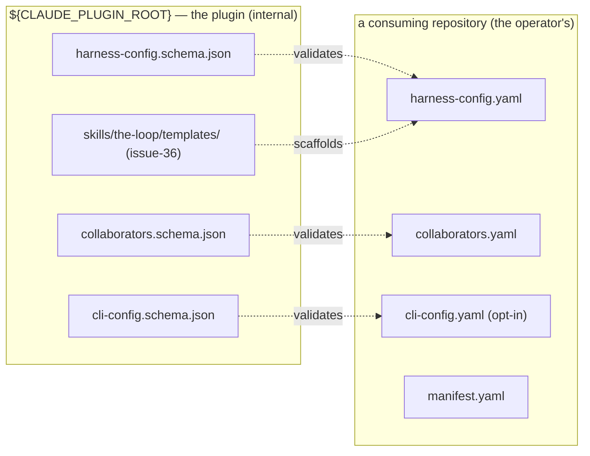

# Requirements: the-loop's JSON schemas ship with the plugin, not with your repo

> Phase 1 of 3 (requirements → design → tasks). Following the Kiro spec approach
> (https://kiro.dev/docs/specs/). This phase MUST be reviewed and approved by the
> required collaborators before moving to design.

## Introduction

`/the-loop:init` copies the-loop's own JSON schemas into every repository it
initializes. A freshly initialized project gets `.the-loop/harness-config.schema.json`
(57 KB) and `.the-loop/collaborators.schema.json` (5 KB), plus
`.the-loop/cli-config.schema.json` (56 KB) if the operator tracks the CLI config there —
up to **118 KB of the-loop's internals** checked into somebody else's repository, as
[#220](https://github.com/MadaraUchiha-314/the-loop/issues/220) observed on
[Konoha-14/morsel](https://github.com/Konoha-14/morsel/tree/main/.the-loop).

Those copies are not the operator's data. They are the plugin's contract, and the plugin
already ships them: the-loop resolves everything else it owns from
`${CLAUDE_PLUGIN_ROOT}` — commands, the skill, and, since
[issue-36](../issue-36/requirements.md), the artifact templates. The schemas are the last
internal asset still materialized per project, and they carry the cost every duplicated
asset carries: they go stale the moment the plugin upgrades, they force `/upgrade` to
re-copy bytes nobody edited, and they put a 57 KB machine-generated diff in front of a
human reviewing what the-loop did to their repo.

This work item finishes what issue-36 started: **the-loop's schemas become plugin-internal,
resolved from `${CLAUDE_PLUGIN_ROOT}/.the-loop/`, and projects shed the copies they were
given.** What the operator keeps is what the operator wrote — `harness-config.yaml`,
`collaborators.yaml`, optionally `cli-config.yaml`.

The dotted edges are the change: today they are solid — the schema is *copied across* the
boundary before it validates anything.

## Requirements

### Requirement 1 — init leaves no schema behind

**User story:** As a maintainer adopting the-loop, I want `/the-loop:init` to write only
the files I own, so that my repository carries my configuration and not the plugin's
internals.

#### Acceptance criteria (EARS)

1. WHEN `/the-loop:init` scaffolds a project THEN it SHALL NOT create
   `.the-loop/harness-config.schema.json`, `.the-loop/collaborators.schema.json` or
   `.the-loop/cli-config.schema.json` in that project.
2. WHEN `/the-loop:init` scaffolds `.the-loop/cli-config.yaml` (the opt-in CLI-config
   answer) THEN it SHALL scaffold that file alone, with no accompanying schema copy.
3. WHEN `/the-loop:init` validates the config files it wrote THEN it SHALL validate them
   against the schemas under `${CLAUDE_PLUGIN_ROOT}`, and the absence of a project-local
   schema copy SHALL NOT weaken or skip that validation.
4. WHEN `/the-loop:init` runs the guided onboarding THEN it SHALL read
   `x-onboarding`, defaults, enums and examples from the plugin's schema, so onboarding
   quality is independent of what the project has on disk.

### Requirement 2 — one declared home for the schemas

**User story:** As an agent (or a tool) that needs to validate a the-loop config, I want a
single declared location for the schemas, so that I resolve them the same way every
command does instead of guessing a path.

#### Acceptance criteria (EARS)

1. `.the-loop/manifest.yaml` SHALL declare a `schemasDir`, relative to
   `${CLAUDE_PLUGIN_ROOT}`, naming the directory that holds the-loop's schemas — the same
   shape `templatesDir` already uses for templates.
2. The directory named by `schemasDir` SHALL contain `harness-config.schema.json`,
   `collaborators.schema.json` and `cli-config.schema.json`.
3. `.the-loop/manifest.yaml` SHALL NOT list any schema under `meta` (the section that
   enumerates what the-loop creates **in a project**).
4. WHEN a command or document needs to name a schema THEN it SHALL name it under
   `${CLAUDE_PLUGIN_ROOT}` (or `manifest.schemasDir`), never as a project-relative
   `.the-loop/*.schema.json` path.

### Requirement 3 — upgrade sheds the copies already out there

**User story:** As an operator who initialized the-loop months ago, I want
`/the-loop:upgrade-the-loop` to clean up the schema copies my repository was given, so
that upgrading actually removes the duplication rather than refreshing it.

#### Acceptance criteria (EARS)

1. `.the-loop/manifest.yaml` SHALL list the three schema paths under `deprecated`, each
   with a `reason` that marks it **safe to delete** (not a migration to preserve), so the
   existing cleanup step in `/the-loop:upgrade-the-loop` acts on them.
2. WHEN `/the-loop:upgrade-the-loop` runs against a project holding a schema copy THEN it
   SHALL delete that copy and report it under **removed (deprecated)**.
3. WHEN a project's schema copy differs from the plugin's shipped schema THEN the
   deletion SHALL still be reported, and the difference SHALL be surfaced to the operator
   rather than discarded silently — a hand-edited schema is a signal that somebody was
   relying on it.
4. WHEN `/the-loop:upgrade-the-loop` migrates a config to a new schema shape THEN it
   SHALL read the plugin's schema and SHALL NOT write a schema file into the project.
5. WHEN `/the-loop:upgrade-the-loop` runs with `--dry-run` THEN it SHALL report the
   removals it would make and write nothing.

### Requirement 4 — a config that still says where its schema is

**User story:** As an operator editing `harness-config.yaml` in my editor, I want the file
to point at its schema, so that removing the local copy does not cost me completion and
validation while I type.

#### Acceptance criteria (EARS)

1. Each scaffolded config file (`harness-config.yaml`, `collaborators.yaml`,
   `cli-config.yaml`) SHALL carry, in its header comment, the plugin-root location of the
   schema that validates it.
2. Each scaffolded config file SHALL carry a `# yaml-language-server: $schema=<url>`
   directive naming the published schema, so an editor validates the file with no local
   copy present.
3. The directive SHALL be a comment: WHEN the-loop's CLI or an agent parses the file THEN
   the directive SHALL have no effect on the parsed configuration, and an operator who
   deletes the line SHALL lose editor support only.
4. Neither the CLI nor any command SHALL fetch that URL: the loop's own validation SHALL
   read the schema from disk under `${CLAUDE_PLUGIN_ROOT}`.

### Requirement 5 — the documentation tells the new truth

**User story:** As a reader of the-loop's docs, I want the configuration reference and the
guide to describe where schemas actually live, so that I am not sent to a file my
repository no longer has.

#### Acceptance criteria (EARS)

1. WHEN a user-facing document (`README.md`, the guide, the configuration reference) names
   the schema that validates a config THEN it SHALL name the plugin-root location or the
   published URL, not a project-relative path.
2. `docs/capabilities/distribution.md` SHALL state the current behaviour — schemas are
   plugin-internal, init does not copy them, upgrade removes them — with a history row for
   this work item.
3. The decision and its rationale SHALL be recorded as a decision record and indexed.

## Non-functional requirements

- **NFR1 — no behavioural change to the CLI.** `the-loop` (the Python CLI) does not read
  the JSON schemas at runtime; this work item SHALL keep it that way, and SHALL NOT add a
  schema-loading dependency to any runtime path.
- **NFR2 — offline-safe.** The loop SHALL remain fully functional with no network: every
  validation the loop performs reads a file that ships with the plugin.
- **NFR3 — idempotent and non-clobbering.** The changed `/init` and `/upgrade` steps keep
  the guarantees they already advertise: safe to re-run, never overwriting a user-owned
  file, never deleting a user's own content without confirmation.
- **NFR4 — self-consistency is enforced by a test, not by review.** The manifest's claims
  about where schemas live SHALL be checked against the repository, in both directions, so
  a moved or renamed schema fails the suite rather than the next operator's upgrade.

## Security considerations

> Threat-model-lite, captured with the requirements (`security.threatModel.required`).

- **Actors & trust:** the operator running `/init` or `/upgrade` in their own repository
  (trusted, but their *files* are theirs — the loop may not destroy them); the plugin's
  shipped schemas (trusted, read-only, checked into this repository and reviewed like
  code); an editor's YAML language server (an untrusted network client, acting on the
  `$schema` URL); the contents of a project's existing `.the-loop/` (untrusted input to
  the upgrade — it may have been hand-edited or replaced).
- **Trust boundaries & data:** two boundaries move in this work item. (1) **Deletion** —
  `/upgrade` gains the authority to remove three named paths from somebody's repository;
  the boundary is the *name*, and nothing outside those three exact paths may be touched.
  (2) **A URL in a scaffolded file** — the `$schema` directive causes an editor, not the
  loop, to make an outbound request to `raw.githubusercontent.com`. No secret, token or
  PII is involved on either side: schemas are public documents and configs are already
  checked in.
- **Abuse cases (EARS):**
  1. WHEN the deprecated-path cleanup runs against a path that resolves outside the
     project's `.the-loop/` directory (a symlink, `..`, an absolute path) THEN the loop
     SHALL refuse to delete it and SHALL report it instead.
  2. WHEN a project's schema copy has been modified relative to the plugin's THEN the
     loop SHALL surface the difference before deleting, so an operator who was
     deliberately relying on a local edit finds out at upgrade time rather than later.
  3. WHEN an operator's environment has no network access THEN every the-loop validation
     SHALL still succeed, proving the `$schema` URL is decoration and not a dependency
     (NFR2).
  4. WHEN a config file's `$schema` directive is edited to point at an attacker-chosen
     URL THEN the-loop's own validation SHALL be unaffected, because it never reads that
     directive — the blast radius is confined to the editor of whoever made the edit.
- **Fail closed:** an upgrade that cannot determine whether a path is a the-loop schema
  copy or an operator's own file **does not delete it** — it reports it under
  **needs-user**. Removal is never inferred; it happens only for the exact paths declared
  `deprecated` in the manifest.

## Out of scope

- **Moving the schemas out of `.the-loop/` inside this repository.** They stay where they
  are; this repository's `.the-loop/` doubles as the plugin's shipped directory, every
  reference and test already resolves there, and moving them would be churn with no user
  benefit.
- **`.the-loop/manifest.yaml` itself.** It is arguably as internal as the schemas, but it
  is also how `/upgrade` knows what a project has and at which version — a separate
  question, not settled here.
- **Runtime JSON-Schema validation in the Python CLI.** The CLI validates by reading keys,
  not by loading a schema (`harness_config.READS`); this work item does not change that.
- **Publishing the schemas to a schema registry** (SchemaStore or similar). The published
  raw URL is enough for editor support today.

## Open questions

None blocking. One judgement call is recorded in the decision record rather than left
open: the `$schema` URL tracks `main` rather than pinning a released tag, because a
pinned URL freezes at whichever plugin version happened to run `/init` and a project's
config drifts *forward* with upgrades, not backward.

## Review comments

None yet — authored in a single unattended session (see `execution-log.md`).
