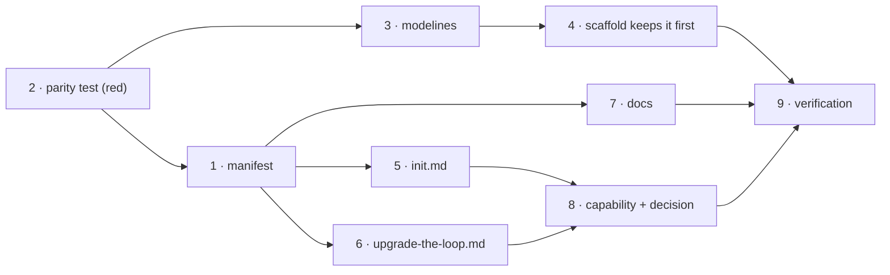

# Tasks: the-loop's JSON schemas ship with the plugin, not with your repo

> The last spec artifact (requirements → design → testing plan → tasks). MUST be
> reviewed/approved before implementation begins.

## Task list

- [x] 1. Declare the schemas as plugin assets in `.the-loop/manifest.yaml`
  - Delete the three `*.schema.json` entries from `meta`.
  - Add `schemasDir: .the-loop` beside the existing `templatesDir`, with the same
    "internal to the-loop, resolved from `${CLAUDE_PLUGIN_ROOT}`" comment.
  - Add the three paths to `deprecated`, each with a `reason` that marks it **safe to
    delete** (verbatim copy, no project data) so `/upgrade`'s step 3 deletes rather than
    migrates, and `removeIn: "10.0.0"`.
  - _Depends on:_ none
  - _Requirements:_ R2.1, R2.2, R2.3, R3.1
  - _Test:_ `T2 — uv run pytest cli/tests/test_manifest_schemas.py` (red→green: the module
    is written first, in task 2, and fails against today's manifest)
- [x] 2. Write the parity test first (`cli/tests/test_manifest_schemas.py`)
  - Four assertions per `design.md`: `schemasDir` resolves and holds the three schemas;
    no `meta` entry names a `*.schema.json`; all three paths are `deprecated`; every
    scaffolded config's first line is a `# yaml-language-server: $schema=` modeline whose
    URL ends in a schema present under `schemasDir`.
  - Gherkin docstrings per `testing.gherkinDocstrings`, with `Requirement:` links.
  - Run it against the **unchanged** repository and record the failures — this is the red
    half of tasks 1 and 3.
  - _Depends on:_ none
  - _Requirements:_ R2, R3.1, R4.1, NFR4
  - _Test:_ `T2 — uv run pytest cli/tests/test_manifest_schemas.py` (red→green)
- [x] 3. Add the `$schema` modeline to every scaffolded config
  - Line 1 of `skills/the-loop/templates/harness-config.yaml`,
    `templates/collaborators.yaml`, `templates/cli-config.yaml` and
    `cli/the_loop/harness-config.default.yaml`; update the existing header comments to name
    the plugin-root schema path instead of a project-relative one.
  - Keep the packaged default byte-identical to its template.
  - _Depends on:_ 2
  - _Requirements:_ R4.1, R4.2, R4.3, R5.1
  - _Test:_ `T2 — uv run pytest cli/tests/test_manifest_schemas.py`; `T1 — uv run pytest
    cli/tests/test_harness_config.py::test_the_packaged_default_is_the_shipped_template`
- [x] 4. Keep the modeline first when the-loop adopts a repository
  - `harness_config.scaffold()` currently writes `_SCAFFOLD_HEADER + body`; make it place
    the header **below** a leading modeline, degrading to today's concatenation when
    there is none.
  - _Depends on:_ 3
  - _Requirements:_ R4.2, NFR1 (no schema loading enters the runtime — this is string
    handling only)
  - _Test:_ `T1 — uv run pytest cli/tests/test_harness_config.py -k modeline` (red→green:
    the assertion is written first and fails on today's concatenation)
- [x] 5. Stop `/the-loop:init` from copying schemas
  - `commands/init.md`: extend the header paragraph to cover schemas
    (`manifest.schemasDir`); drop the `harness-config.schema.json` bullet and the
    `cli-config.schema.json` half of the CLI-config bullet from step 3; point step 2's
    onboarding and step 5's validation at the plugin's schemas.
  - _Depends on:_ 1
  - _Requirements:_ R1.1, R1.2, R1.3, R1.4, R2.4
  - _Test:_ `T11 — read-through against R1's criteria` (no runner executes this file;
    verified by review, per `testing-plan.md`)
- [x] 6. Make `/the-loop:upgrade-the-loop` shed the copies
  - Step 3: add the schemas to the cleanup's "notably" list and the rule that a copy
    differing from the plugin's is reported, not deleted quietly.
  - Step 4: retitle to "Migrate configs to the current schemas"; every "update the
    project's copy of the schema" becomes "read the plugin's schema"; the issue-82 rename
    migration deletes the stale `config.schema.json` instead of replacing it.
  - _Depends on:_ 1
  - _Requirements:_ R3.2, R3.3, R3.4, R3.5, abuse cases 1–2
  - _Test:_ `T10 — review against R3 + uv run python scripts/validate_config.py`
- [x] 7. Update the docs that name a project-local schema path
  - `docs/guide/quickstart.md`, `docs/guide/how-it-works.md`, `docs/config/index.md`,
    `docs/config/harness-config.md`, `docs/config/cli/index.md`, and the skill's
    `SKILL.md` / `reference/onboarding.md` where they name the schema's location.
  - _Depends on:_ 1
  - _Requirements:_ R5.1
  - _Test:_ `T11 — read-through` + `make check` (markdownlint)
- [x] 8. Record the capability and the decision
  - `docs/capabilities/distribution.md`: current behaviour + an issue-220 history row.
  - `docs/decisions/decision-080.md` + an index row in `docs/decisions/decisions.md`.
  - _Depends on:_ 1, 5, 6
  - _Requirements:_ R5.2, R5.3
  - _Test:_ `T11 — read-through` + `make check` (markdownlint)
- [x] 9. Verify: execute `testing-plan.md` and commit the evidence
  - Tick each activity only once run; write `evidence/verification.md`; fill
    §Verification results.
  - _Depends on:_ 1–8
  - _Requirements:_ all
  - _Test:_ `make check`

## Dependency graph (DAG)

## Checkpoints

After task 2 (the red run — captured, since it is the evidence that tasks 1, 3 and 4 were
motivated by a failing test), after task 4 (the whole Python surface is green), and after
task 8 (`make check` over the docs). The `verification` node then executes
`testing-plan.md` in task 9, and only then do the self-review rounds and the security
review gate run.

## Review comments

None yet.
