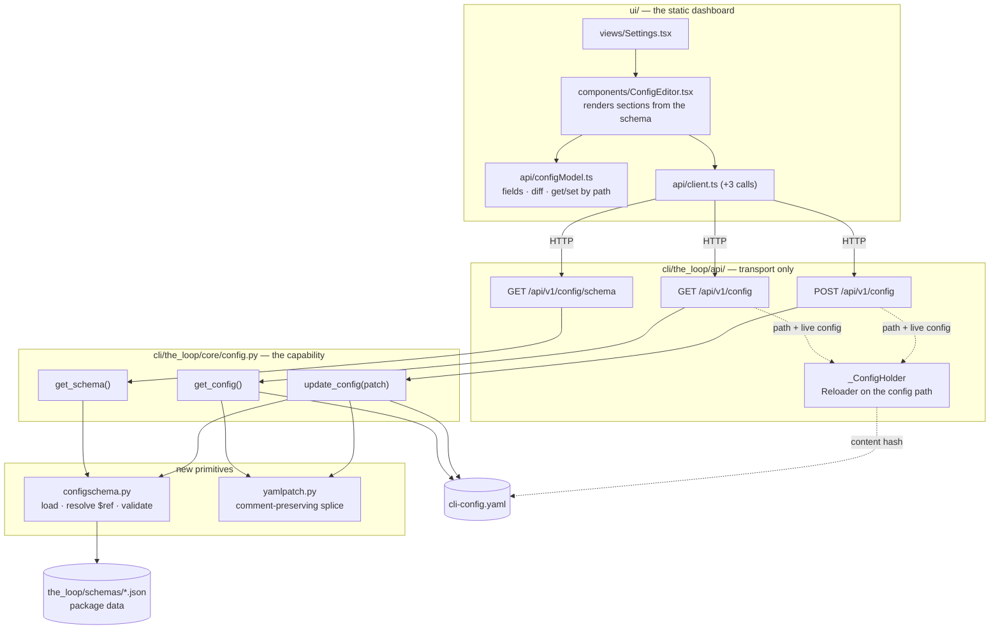
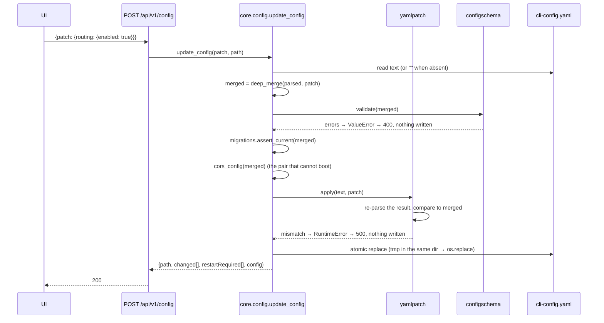
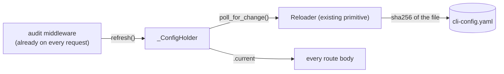

# Design: the CLI config is editable from the Control Plane UI

> Phase 2 of 3. Derived from [`requirements.md`](requirements.md); reviewed together with
> [`testing-plan.md`](testing-plan.md).

## The shape of the change

Three routes, one new core module, two new primitives underneath it, and one Settings tab
that renders itself from the schema rather than from hand-written field lists.



Everything below `core/` is transport-agnostic and importable without FastAPI, per
decision-058.

## Where the schema comes from

The UI cannot render the config without the schema, and the service cannot validate a
write without it. Both run from `pip install the-loopy-one`, where no plugin checkout
exists — so the schema has to be **package data**, resolved relative to the module, for
exactly the reason `graph/model.py::shipped_graph_path` gives for the process graphs:

> It previously lived under `skills/the-loop/graph/`, which meant
> `pip install the-loopy-one` produced a runtime with no process to run.

So `cli/the_loop/schemas/` gains `cli-config.schema.json` and
`collaborators.schema.json` (the second because the first `$ref`s it — one reference,
`collaborators[].` → `collaborators.schema.json#/$defs/collaborator`).

This does not reopen issue-220. That work item's rule is about **projects**: the-loop
stops copying its schemas into repositories it initializes, and `manifest.schemasDir`
names the plugin-side home. A copy inside the-loop's own distributed package is not a
project copy — it is the same distribution, and `.the-loop/` stays the single authored
home. The copy is kept honest the way `harness-config.default.yaml` already is:

| Guard | Mechanism |
|-------|-----------|
| The package copy drifts from the authored schema | byte-parity test (`test_config_schema.py`), the idiom of `test_harness_config.py::test_the_packaged_default_is_the_shipped_template` |
| The authored schema grows a construct the validator cannot check | keyword-guard test — every keyword in both schemas must be in `configschema.SUPPORTED` |
| The validator disagrees with real JSON Schema | differential test against `jsonschema` (a dev dependency, so CI has it) over a corpus of valid and invalid configs |

### Why not depend on `jsonschema`

NFR1 says no new runtime dependency, and the ladder in `reference/minimalism.md` puts
"existing dep / inline" ahead of "new dep". The concrete costs decided it: `jsonschema`
pulls `attrs`, `referencing` and `rpds-py` (a compiled extension) into a CLI whose whole
dependency argument is that it is lightweight, and it would be imported by every
`the-loop poll` process to validate nothing. Against that, the schemas being validated are
**ours**, and they use sixteen keywords in total:

```text
$defs  $id  $ref  $schema  additionalProperties  default  description  enum
examples  items  maximum  minItems  minimum  properties  required  title
type  uniqueItems
```

`configschema.validate()` implements the ten that constrain data (`type`, `enum`,
`properties`, `additionalProperties`, `required`, `items`, `minimum`, `maximum`,
`minItems`, `uniqueItems`) plus `$ref`/`$defs` resolution, and ignores the six that
document it. The keyword guard turns "the schema grew a construct we do not check" from a
silent hole into a failing test, and the differential test proves the ten agree with the
real implementation. That is the trade: ~120 lines we test two ways, against a
transitive compiled dependency for every install.

`scripts/validate_config.py` (the Makefile / pre-commit / CI path) keeps using real
`jsonschema` and is untouched.

## Reading: `GET /api/v1/config`

```json
{
  "path": "/home/op/.the-loop/cli-config.yaml",
  "exists": true,
  "version": "0.4.0",
  "config": { "...": "the parsed file, verbatim" }
}
```

Loaded with `load_cli_config(path, strict=True)` so a broken file raises instead of
degrading to `{}` (R1.5) — the daemon's lenient path is right for keeping ingress alive
and wrong for a screen that would render "everything is at its default". `ValueError` maps
to 400 through the app's existing handler; `strict=True` raises `FileNotFoundError` for a
missing file, which is *not* an error here, so the missing case is answered before the
load (R1.2).

`config` is the document as authored, **without** the private `_ghBinary` keys
`load_cli_config` fans out from `integrations.github.cli.binary` into `routing.control`,
`routing.reactions` and `routing.announce`. Those are a runtime convenience, are not in
the schema, and would come straight back on the next save as "unknown key". Since
`apply_integrations` mutates the loaded dict in place, `core.config` takes
`load_cli_config`'s two other steps itself — `yaml.safe_load` on the file text, then
`migrations.assert_current` — and skips the fan-out.

## Writing: `POST /api/v1/config`



Three validations, in this order and all before any write: the schema (R3.1), the
migration gate (R3.2), and the one CORS pairing the service refuses to boot on (R3.3 —
reusing `api.config.cors_config`, so the write-time rule and the boot-time rule are one
function and cannot drift).

`changed` is the list of dotted key paths whose value the patch actually altered; a patch
that sets a key to the value it already has contributes nothing, which is what makes R2.5
("an empty patch writes nothing") fall out of the same computation rather than needing a
special case.

`restartRequired` is `changed ∩ {service.host, service.port, service.exposed,
service.cors.*}` — the values read once at boot: the bind in `serve.py`, and the CORS
middleware installed in `create_app`. Everything else is read per use, from the config the
holder refreshes.

### `yamlpatch` — why the file survives

PyYAML can compose a document into a node tree whose every node carries `start_mark` and
`end_mark` with absolute character offsets into the source. That is enough to rewrite one
value **in the original text**, leaving every comment, blank line and quoting choice
alone. The whole module is that idea plus the care its edges need:

| Case | What is spliced |
|------|-----------------|
| Existing scalar leaf | the scalar's own span |
| Existing sequence/mapping | from its **first child's start** to its **last child's end** — the node's own `end_mark` overshoots into trailing comments (measured: it swallows a `# comment after the block` that follows a block sequence) |
| Empty `[]` / `{}` | the flow token's span |
| Missing key, parent block exists | a new line appended after the parent's last child, at the parent's child indent |
| Missing parent chain | the chain is created at the deepest existing ancestor |
| File absent | modeline + `version:` + the whole patch, dumped |

Re-emission keeps the original style: a block sequence stays a block sequence at its
original indentation, a flow sequence stays on one line. Values are rendered with
`yaml.safe_dump` and re-indented, so quoting and escaping are PyYAML's problem, not ours.

The edge cases are the reason for the **verification step**: `apply()` re-parses the text
it produced and compares it to the merged document it was asked to produce. A mismatch
raises, and the caller writes nothing (R2.8). A hand-written text splicer that can prove
its own result is a different proposition from one that cannot, and this is the whole of
that difference — every future edge case we have not thought of fails closed rather than
corrupting an operator's config.

### The write itself

`tempfile.mkstemp` in the **same directory** (so `os.replace` is a rename within one
filesystem, hence atomic), write, `os.replace` (R2.7). The file mode is copied from the
existing file when there is one, and is `0o600` for a file this code creates — the config
names authorized users and paths, and a fresh one has no reason to be world-readable.

## Staying live: the service's own config

Today `create_app(cli_config)` closes over a dict captured at boot. Daemons hot-reload via
`Reloader`; the service does not, which R4.2/R4.3 make untenable.



- The holder is baselined to the config the process booted with, so an unchanged file
  never triggers a rebuild — and `create_app({})` in the existing test suite keeps
  behaving exactly as before.
- Refresh happens **once per request**, in the middleware that already runs on every
  request, not per attribute read: one `sha256` of a ~10 KB file per API call.
- The rebuilt value is assigned to one attribute (atomic in CPython), and each route body
  reads it once. Routes run in Starlette's threadpool while the middleware runs on the
  event loop, so this is the ordinary "swap a reference, never mutate in place" discipline
  rather than a lock.
- A file that becomes unparseable keeps the previous config (that is `Reloader`'s
  documented behaviour) — the service does not fall back to defaults because somebody is
  mid-edit.

`create_app` grows one keyword-only argument, `config_path`, so a test can point a whole
app at a temp file. It defaults to `default_cli_config_path()`, which is what `serve.py`
already resolved.

Two things stay boot-time on purpose: the CORS middleware (Starlette builds the middleware
stack once) and the bind address (uvicorn owns the socket). Hence `restartRequired`.

## The Settings tab

```mermaid
graph TB
  SCHEMA["GET /config/schema"] --> FIELDS["configModel.fieldsOf(schema)"]
  VALUES["GET /config"] --> DRAFT["draft: a deep copy"]
  FIELDS --> SEC["one <section> per top-level property"]
  SEC --> GRP["nested object → nested group"]
  GRP --> CTRL{"leaf kind"}
  CTRL -->|string / integer / number| INPUT["<input>"]
  CTRL -->|boolean| CHECK["<input type=checkbox>"]
  CTRL -->|enum| SELECT["<select>"]
  CTRL -->|array of strings| LIST["one-per-line <textarea>"]
  CTRL -->|"anything else"| YAMLBOX["structured text field (JSON)"]
  DRAFT --> DIFF["configModel.diff(original, draft)"]
  DIFF -->|"sparse patch"| SAVE["POST /config"]
```



- **Sections come from the schema's own nesting** (R5.1/R5.2) — the ticket's fourth
  bullet, answered by not inventing a second taxonomy. Section title = the schema `title`
  when present, else the property name; section prose = its `description`.
- **The escape hatch is a rendered field, not a gap** (R5.4). `collaborators` (array of
  objects), `polling.sources` (array of objects), `notifications.events` and
  `routing.harnessArgs` (free-form objects) get a JSON text field for the subtree, parsed
  on change and reported inline when it does not parse. Every key stays reachable, which
  is what "completely configurable" has to mean.
- **Defaults are placeholders, never values** (R5.5). A field the operator has not set
  shows the schema default greyed out and contributes nothing to the patch; typing into it
  is what makes it a value. This is the difference between "unset, so the built-in default
  applies" and "pinned to today's default", and a config editor that blurs it silently
  freezes defaults into the file.
- **Save sends the diff, not the document** (R5.6), so two operators editing different
  sections do not overwrite each other, and the file keeps every key the UI chose not to
  render as a control.
- **Demo mode answers from the fixture** (R5.7), like every other screen: `DemoApi` gains
  the same three calls over an in-memory config and the real schema, so the hosted page
  demonstrates the editor with no service in reach.

`configModel.ts` holds the pure parts — `fieldsOf`, `getIn`, `setIn`, `diff` — so they are
unit-tested without rendering, in the idiom `model.test.ts` already sets.

## Interfaces

```python
# the_loop/configschema.py
SUPPORTED: frozenset[str]                    # every keyword the validator understands
def load_schema(name: str = "cli-config") -> dict:  ...   # $refs resolved, cached
def validate(data: Mapping, schema: Mapping) -> list[str]: ...  # "path: message", empty = valid

# the_loop/yamlpatch.py
def apply(text: str, patch: Mapping, merged: Mapping) -> str: ...   # raises on unverifiable splice
def changed_paths(current: Mapping, patch: Mapping) -> list[str]: ...
def deep_merge(base: Mapping, patch: Mapping) -> dict: ...

# the_loop/core/config.py
def get_config(path: str | Path | None = None) -> dict: ...
def get_schema() -> dict: ...
def update_config(patch: Mapping, path: str | Path | None = None) -> dict: ...
```

```ts
// ui/src/api/client.ts — added to TheLoopApi
config(signal?: AbortSignal): Promise<ConfigDocument>;
configSchema(signal?: AbortSignal): Promise<JsonSchema>;
saveConfig(patch: Record<string, unknown>): Promise<ConfigSaveResult>;
```

## Error handling

| Condition | Response | File on disk |
|-----------|----------|--------------|
| Config file absent (`GET`) | `200` with `exists: false`, empty config | untouched |
| Config file unparseable (`GET`) | `400` with the YAML error | untouched |
| Patch is not an object | `400` | untouched |
| Merged config fails the schema | `400`, one line per violation, key paths named | untouched |
| Merged config fails `assert_current` | `400` with that message (it names the fix) | untouched |
| `allowOrigins: ["*"]` + credentials | `400` | untouched |
| Splice cannot be verified | `500` naming the key path | untouched |
| Write fails (permissions, disk) | `500` | untouched (the temp file is removed) |

## Security design

The requirements' trust boundaries are enforced as follows.

- **No path parameter.** `update_config` resolves the path itself; the request body has
  one field, `patch`. The only file this route can write is the one this process already
  reads. (Abuse case 1.)
- **Executable config stays visible.** Every successful write emits
  `config.updated` into the event log with `path` and the **changed key paths** —
  never the values, which name people and hosts. The Attention/Events screens already
  surface that log, so `routing.authorizedUsers` growing an entry is a visible act.
  (Abuse case 2.)
- **The guard rails a save could remove are re-checked at write time.** `cors_config` is
  called on the merged document, so the one pairing the service refuses to boot on cannot
  be saved (abuse case 3); `exposed` remains writable, restart-required, and still subject
  to the boot guard.
- **Nothing is written until the whole document is proven.** Schema, migration gate, CORS
  pairing, then a splice that re-parses to the intended data, then an atomic replace.
  (Abuse case 4.)
- **No secret is served or accepted.** The schema models credentials as env var *names*;
  this work item adds no key that holds a value. (Abuse case 5.)
- **The write is not offered to agents.** No MCP tool is registered for any of the three
  operations, matching the existing exclusion policy in `api/mcp.py` (`graph force`
  requires a human-attributed reason an agent must not forge; a daemon config an agent can
  rewrite is the same problem with a longer half-life). The module docstring states it, so
  the next person adding tools finds the rule where the tools are.

The boundary this work item does **not** move: the service still has no in-app auth, and a
caller who reaches it can already spawn harness sessions. `docs/capabilities/control-plane.md`
states the config route's authority beside the exposure guard, so the posture is written
where an operator reads about deploying the service.

## Testing strategy

Detailed in [`testing-plan.md`](testing-plan.md). The shape: unit tests for the two
primitives (splice fidelity, comment preservation, validator agreement with `jsonschema`),
integration tests through the FastAPI `TestClient` for the three routes and the
restart-required and hot-reload behaviours, parity tests for the packaged schema and the
OpenAPI contract, and vitest units for the field model plus a render test for the editor.

## Minimalism ladder

| Considered | Verdict |
|------------|---------|
| `ruamel.yaml` for round-trip comment preservation | rejected — a new runtime dependency for one write path; PyYAML's composer already exposes the marks, and the verification step covers the risk that buys |
| `jsonschema` as a runtime dependency | rejected — see above; kept as the dev/CI validator |
| Full-document PUT instead of a sparse patch | rejected — it makes comment loss inevitable and turns two operators editing two sections into a lost update |
| A hand-written TSX form per config key | rejected — a second copy of a ~100-key schema, guaranteed to rot |
| A `the-loop config` CLI verb | deferred — not asked for; the core facade is there when it is |
| Reusing `Reloader` for the service | adopted — the primitive exists and the daemons already prove it |
| Reusing `cors_config` for the write-time check | adopted — one rule, two call sites |
