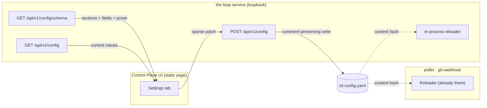

# Requirements: the CLI config is editable from the Control Plane UI

> Phase 1 of 3 (requirements → design → tasks). Following the Kiro spec approach
> (<https://kiro.dev/docs/specs/>). This phase MUST be reviewed and approved by the
> required collaborators before moving to design.

## Introduction

The CLI config (`cli-config.yaml`) is the operator's whole control surface for the daemon:
who may command the loop, where sessions are checked out, which harness is spawned, what
the receiver listens on, where state is written. Today it is editable in exactly one way —
open the file in an editor and hand-edit YAML. The Control Plane UI already reads
everything the daemon *does* (work items, sessions, events, daemons, attention) and its
Settings tab configures only the browser's own two knobs: which base URL this page points
at, and how often it polls.

[#222](https://github.com/MadaraUchiha-314/the-loop/issues/222) closes that gap: the
Settings tab becomes the place the CLI config is **read and changed**, over an endpoint
the service exposes for the purpose, with the change hot-reloading the way a hand-edit
already does.

Three facts about the existing system shape every requirement below.

1. **The config is heavily commented, and those comments are the documentation.** The
   shipped template is ~270 lines, of which about half are prose explaining *why* a knob
   exists and what the fail-closed default protects. A save that round-trips the file
   through a YAML dumper deletes all of it. That is silent, irreversible, operator-visible
   damage, so "the file survives a save" is a requirement, not a nicety.
2. **Hot reload already exists, and it is file-driven.** `the_loop.reload.Reloader`
   content-hashes the config path and rebuilds on change; the poller checks it each cycle
   and the receiver each event. Any writer that lands bytes at that path inherits reload
   for free — but the **service process itself** has no such reloader: it captures the
   config dict once, at `create_app()`. An endpoint that writes the file and leaves the
   service serving the old values would be a config UI that lies about the current config.
3. **The schema is already the documentation.** `cli-config.schema.json` carries the type,
   default, enum, range and a written description for ~100 keys, and it already nests them
   into the logical groups the ticket asks the UI to present (`webhooks`, `routing`,
   `polling`, `service`, `eventLog`, `integrations`, `notifications`, `collaborators`,
   `state`). A UI that hand-lists those fields in TSX would be a second copy of the schema
   that rots; a UI that renders *from* the schema cannot drift from it.

The dotted edges are what already works. The solid ones are this work item.

## Requirements

### Requirement 1 — the service serves the CLI config it is running on

**User story:** As an operator with the dashboard open, I want to see the CLI config the
daemon is actually running on, so that I can check a value without SSH-ing to the
workstation and opening a file.

#### Acceptance criteria (EARS)

1. WHEN a client issues `GET /api/v1/config` THEN the service SHALL respond with the
   parsed contents of the resolved CLI config, the absolute path it was read from, and
   whether that file exists on disk.
2. WHEN the resolved config file does not exist THEN the service SHALL respond `200` with
   an empty config, `exists: false` and the path it *would* be written to — a workstation
   that has never been configured is a normal state, not an error.
3. WHEN a client issues `GET /api/v1/config/schema` THEN the service SHALL respond with
   the shipped `cli-config.schema.json`, with every `$ref` it contains already resolved,
   so a client needs exactly one call to render the whole surface.
4. The config the service serves SHALL be resolved by the same rules every other the-loop
   process uses (`--config`/`-c`, `$THE_LOOP_CLI_CONFIG`, `./.the-loop/cli-config.yaml`,
   `~/.the-loop/cli-config.yaml`), and the client SHALL NOT be able to name a different
   path.
5. WHEN the config file exists but cannot be parsed THEN `GET /api/v1/config` SHALL
   respond `400` naming the parse error, rather than reporting an empty config that would
   read to a human as "everything is at its default".

### Requirement 2 — a save changes the named keys and nothing else

**User story:** As an operator who has hand-annotated my config, I want a save from the UI
to change the values I changed, so that my comments, key order and formatting survive.

#### Acceptance criteria (EARS)

1. WHEN a client issues `POST /api/v1/config` with a sparse patch (a nested object naming
   only the keys it changes) THEN the service SHALL apply exactly those leaves and SHALL
   leave every other byte of the file — comments, blank lines, key order, quoting style,
   indentation — unchanged.
2. WHEN a patched key already exists in the file THEN the service SHALL rewrite that
   key's value in place.
3. WHEN a patched key is absent from the file THEN the service SHALL insert it under its
   parent block, creating any missing intermediate blocks.
4. WHEN the file does not exist THEN the service SHALL create it, with the schema modeline
   as its first line, containing the patched keys and the config `version`.
5. WHEN the patch is empty — or names only values the file already carries — THEN the
   service SHALL respond `200`, write nothing, and report that nothing changed.
6. WHEN a patch leaf is `null` THEN the service SHALL **remove** that key, so the built-in
   default applies again. `null` is free to mean this because no key in the-loop's config
   schemas is typed to accept it: a key whose value is nothing is a key that is not there.
   This is what lets the UI's structured (JSON) fields express a removal instead of
   silently re-adding what the operator deleted.
7. The write SHALL be atomic: a reader concurrent with a save SHALL see either the whole
   old file or the whole new one, never a partial one.
8. WHEN the spliced result does not re-parse to exactly the intended data THEN the service
   SHALL respond `500`, write nothing, and name the key path it could not apply — a
   text-level edit that cannot prove it produced the intended document SHALL NOT be
   committed to disk.

### Requirement 3 — an invalid config is refused, not written

**User story:** As an operator, I want the service to refuse a change my daemon could not
run on, so that a typo in the UI cannot take my ingress down.

#### Acceptance criteria (EARS)

1. WHEN a patch would produce a config that violates `cli-config.schema.json` — an unknown
   key, a wrong type, a value outside an `enum` or a numeric range — THEN the service
   SHALL respond `400` naming the offending key path and the constraint, and SHALL NOT
   write the file.
2. WHEN a patch would produce a config that `the_loop.migrations.assert_current` refuses
   (a removed key, a version below `CURRENT_CONFIG_VERSION`) THEN the service SHALL
   respond `400` with that refusal's message, and SHALL NOT write the file.
3. WHEN a patch would produce `service.cors.allowOrigins: ["*"]` together with
   `service.cors.allowCredentials: true` THEN the service SHALL respond `400` and SHALL
   NOT write the file — the combination the service already refuses to *boot* on SHALL not
   be reachable by a save that would leave the operator with a service that cannot restart.
4. Validation SHALL run against the **merged** result (current file + patch), never
   against the patch alone.
5. WHEN validation fails for any reason THEN the file on disk SHALL be byte-identical to
   what it was before the request.

### Requirement 4 — a saved change takes effect without a restart, and says when it cannot

**User story:** As an operator, I want a change I save to be live, and to be told
explicitly about the ones that are not, so that I never think a setting is applied when it
is not.

#### Acceptance criteria (EARS)

1. WHEN a config is written through `POST /api/v1/config` THEN the poller and the webhook
   receiver SHALL pick the change up through their existing `Reloader`, with no additional
   signalling.
2. WHEN a config is written through `POST /api/v1/config` THEN the **service process**
   SHALL serve subsequent requests against the new config without being restarted.
3. WHEN the CLI config file is changed by any other means (a hand-edit, `git checkout`)
   THEN the service SHALL pick that change up too, on the next request.
4. WHEN a saved patch touches a key that cannot take effect until the service is restarted
   (`service.host`, `service.port`, `service.exposed`, anything under `service.cors`) THEN
   the response SHALL name those key paths under `restartRequired`.
5. WHEN a patch touches no such key THEN `restartRequired` SHALL be empty — an
   always-present warning is a warning nobody reads.

### Requirement 5 — the Settings tab presents the whole config, grouped as the schema groups it

**User story:** As an operator, I want every CLI-config knob reachable from the Settings
tab, organised the way the config is organised, so that the UI is a real alternative to
hand-editing YAML rather than a shortcut for three popular fields.

#### Acceptance criteria (EARS)

1. The Settings tab SHALL render one section per top-level property of the schema, using
   the schema's own titles and descriptions as the section headings and prose.
2. Nested objects SHALL render as nested groups, so a key's position in the UI matches its
   position in the file.
3. Every leaf the schema types as `string`, `integer`, `number`, `boolean` or an array of
   strings SHALL render as an editable control of the matching kind, and an `enum` SHALL
   render as a chooser over exactly the declared values.
4. WHEN a subtree's shape is not expressible as those controls (an array of objects, a
   free-form object) THEN the UI SHALL render an editable structured (YAML/JSON) field for
   that subtree, so that no part of the config is unreachable from the UI.
5. Every rendered control SHALL show the schema's `description` for that key, and a value
   left unset SHALL show the schema's `default` as its placeholder rather than as a value.
6. WHEN the operator saves THEN the UI SHALL send only the keys whose values it changed,
   and SHALL report the outcome — saved (with the path), refused (with the message), or
   restart-required (with the key paths).
7. WHEN the UI is in demo mode THEN the config screens SHALL work against the bundled
   fixture and SHALL NOT attempt a network call.

## Non-functional requirements

1. **No new runtime dependency.** The reader, the validator and the writer SHALL be built
   on PyYAML and the standard library — the CLI's dependency set does not grow for this.
2. **One implementation.** The behaviour SHALL live in `the_loop.core` and the HTTP layer
   SHALL add transport and serialization only (decision-058).
3. **Contract-first.** The three routes SHALL be authored in
   `docs/api-specs/openapi/the-loop.v1.yaml`, which `test_api_contract_parity.py` asserts
   the served schema matches.
4. **The schema resolves from the installed package.** Serving and validating SHALL work
   from a bare `pip install the-loopy-one`, with no plugin checkout and no network.
5. **Silence is not a pass.** Any part of the config the UI cannot render as a typed
   control SHALL be visibly rendered as structured text, never hidden.

## Security considerations

### Untrusted actors and trust boundaries

| Actor | Reaches | Boundary |
|-------|---------|----------|
| A browser page on an allowed origin | every `/api/v1` route, including this one | `service.cors.allowOrigins` + the loopback bind |
| A local process on the workstation | every `/api/v1` route | the loopback bind |
| A remote client | nothing, unless `service.exposed: true` | the exposure guard in `serve.py`, then the operator's gateway |
| An agent inside a harness session | the MCP tools only | the MCP tool registry |

The service carries **no in-app authentication** by design (decision-059): a gateway owns
auth, and locally the bind is loopback-only. This work item does not change that boundary,
and it must not be read as safe *because* of that: the honest statement is that a caller
who can already `POST /api/v1/sessions/control` can start a harness session with the
operator's credentials, so the API's authority is already "this workstation".

What the config route adds is **durability and reach**: session control acts once, whereas
a config write persists and is then executed by daemons the caller never touched.
`integrations.github.cli.binary`, `routing.spawnWorkdir`, `routing.harnessArgs` and
`routing.workspace.root` are executable or execution-shaping config — the same class as
`reviews.critics[]` in the harness config, which the harness config's own comment says to
"review like code".

### Abuse cases

1. **A caller names a path.** *Mitigation:* the path is resolved server-side by the
   existing resolver; no request field selects a file. Writing to an arbitrary path SHALL
   not be expressible (R1.4).
2. **A caller widens who may command the loop** by patching `routing.authorizedUsers`, or
   swaps `integrations.github.cli.binary` for a trojan. *Mitigation:* not preventable at
   this layer — it is the same authority `sessions/control` already has — so it is made
   **visible** instead: every config write emits an event-log record naming the changed key
   paths (never the values, which may name people), and the capability doc states the
   route's authority next to the exposure guard.
3. **A caller disables its own guard rails**, e.g. `service.cors.allowOrigins: ["*"]` with
   credentials, or `exposed: true`. *Mitigation:* the pairing the service refuses to boot
   on is refused at write time (R3.3); `exposed` is writable but restart-required and
   reported as such, and the boot guard still applies.
4. **A malformed patch corrupts the config** and takes the daemon down. *Mitigation:*
   validate the merged document before writing (R3.4), verify the spliced text re-parses
   to the intended data (R2.8), write atomically (R2.7), and leave the file untouched on
   any failure (R3.5).
5. **Secrets leak into the config, or out of it.** *Mitigation:* none needed for secrets
   *into* the file — the schema models credentials as **env var names**
   (`secretEnv`, `tokenEnv`, `urlEnv`), never values, and this work item adds no key that
   holds one. `GET /api/v1/config` therefore serves no secret. It does serve handles,
   paths and hostnames, which is the same class of data `GET /api/v1/sessions` already
   serves.

### Fail-closed posture

Every failure path in this work item leaves the previous config in force: a parse failure
serves `400` rather than an empty config (R1.5), a validation failure writes nothing
(R3.5), a splice that cannot prove itself writes nothing (R2.8). The one thing that is
*not* fail-closed by construction is the authority of the route itself, and that is stated
above rather than implied.

## Risk tier

**Tier 4.** The change is a new write path into executable daemon configuration, reachable
from a browser origin the service allows by default. It touches no secret and adds no
dependency, but "wrong" here means an operator's ingress stops, or runs something they did
not choose. Per `autonomy.tiers`, tier 4 is `human-approves-pr`; per
`security.review.humanSignOffMinTier: 4`, it also needs a named human security sign-off
before it is complete.

## Out of scope

- **The harness config** (`.the-loop/harness-config.yaml`). It is per-repository policy
  read by the plugin and the skill; the ticket names the CLI config, and a repo-scoped
  editor is a different work item with a different resolution story (which checkout?).
- **A CLI verb** (`the-loop config get/set`). Hand-editing is already the CLI's answer, and
  the ticket asks for the UI. The core facade this work item adds is what a future verb
  would call.
- **MCP tools for config.** Deliberately excluded, in the same spirit as `graph force`:
  an agent inside a session must not silently rewrite the operator's daemon config.
- **A "reset to default" control in the UI.** The protocol can express a removal (R2.7),
  and the JSON fields use it; a per-field reset button on every control is a UI affordance
  this work item does not add.
- **Versioning or undo of the config file.** The file is the operator's, and is commonly
  in git.
