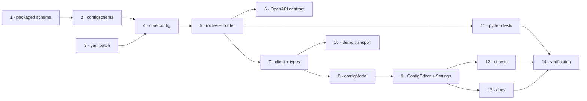

# Tasks: the CLI config is editable from the Control Plane UI

> Phase 3 of 3. A DAG, not a list: tasks with the same dependencies can run in any order.
> Each `_Test:_` names a row of [`testing-plan.md`](testing-plan.md).

## Tasks

- [x] **1. Ship the schemas as package data.** Copy `.the-loop/cli-config.schema.json` and
  `.the-loop/collaborators.schema.json` to `cli/the_loop/schemas/`, with a module docstring
  in `configschema.py` stating why the copy exists and that `.the-loop/` is the authored
  home. Add the byte-parity test.
  _Requirements: NFR4_ · _Test: T7_

- [x] **2. `the_loop/configschema.py`.** `load_schema()` (package data, `$ref` resolved,
  cached), `validate(data, schema) -> list[str]` over the ten constraining keywords, and
  `SUPPORTED` for the keyword guard.
  _Requirements: R3.1, NFR1, NFR4_ · _Test: T2_

- [x] **3. `the_loop/yamlpatch.py`.** `deep_merge`, `changed_paths`, and `apply(text,
  patch, merged)` — mark-based splicing with style preservation, insertion of missing
  keys and parents, creation of an absent file, and the re-parse verification that makes
  an unprovable splice raise.
  _Requirements: R2.1–R2.4, R2.8_ · _Test: T1_

- [x] **4. `the_loop/core/config.py`.** `get_config`, `get_schema`, `update_config`: read
  strictly, merge, validate (schema → `assert_current` → `cors_config`), splice, atomic
  replace, compute `changed` and `restartRequired`, emit `config.updated`.
  _Requirements: R1.1–R1.5, R2.5, R2.7, R3.1–R3.5, R4.4, R4.5_ · _Test: T3_

- [x] **5. Routes and the in-process holder.** `GET /api/v1/config`,
  `GET /api/v1/config/schema`, `POST /api/v1/config`; `_ConfigHolder` refreshed once per
  request by the existing audit middleware; `create_app(..., config_path=…)`;
  `serve.py` passes the resolved path; a note in `api/mcp.py` recording that config is
  deliberately not an MCP tool.
  _Requirements: R1.4, R4.1–R4.3, security design_ · _Test: T4, T5_

- [x] **6. Author the contract.** Add the three operations to
  `docs/api-specs/openapi/the-loop.v1.yaml`.
  _Requirements: NFR3_ · _Test: T6_

- [x] **7. UI transport.** `ConfigDocument`, `JsonSchema`, `ConfigSaveResult` in
  `api/types.ts`; `config()`, `configSchema()`, `saveConfig()` on `TheLoopApi` and
  `HttpApi`.
  _Requirements: R5.6_ · _Test: T8_

- [x] **8. `ui/src/api/configModel.ts`.** `fieldsOf` (schema → sections → groups → typed
  leaves), `getIn`/`setIn`, `diff` (draft → sparse patch), and the leaf-kind decision
  including the structured fallback.
  _Requirements: R5.1–R5.4, R5.6_ · _Test: T8_

- [x] **9. `ui/src/components/ConfigEditor.tsx` + Settings.** Render sections with the
  schema's prose, typed controls, defaults as placeholders, structured fields for
  unsupported subtrees, save/refuse/restart-required reporting, and the styles.
  _Requirements: R5.1–R5.6_ · _Test: T9, T11_

- [x] **10. Demo transport.** The three calls answered from an in-memory config plus the
  real schema, so the hosted page demonstrates the editor.
  _Requirements: R5.7_ · _Test: T9_

- [x] **11. Python tests.** `test_yamlpatch.py`, `test_configschema.py`,
  `test_core_config.py`, `test_api_config_integration.py`,
  `test_config_schema_parity.py` — Gherkin docstrings on the integration tests, each
  naming its requirement.
  _Requirements: all_ · _Test: T1–T5, T7, T10, T14_

- [x] **12. UI tests.** `configModel.test.ts` and a render test for the editor.
  _Requirements: R5.1–R5.7_ · _Test: T8, T9, T11_

- [x] **13. Documentation.** `docs/capabilities/control-plane.md` (the routes and their
  authority), `docs/config/cli/index.md` (the config is editable from the UI),
  `docs/cli/commands/service.md` if it enumerates routes, `ui/README.md`, `CHANGELOG.md`,
  the decision record, and the execution log's `## Documentation` section.
  _Requirements: skill §capability docs, §user-facing docs_ · _Test: T16 review_

- [x] **14. Verification.** Execute `testing-plan.md`, record results and evidence under
  `evidence/`, tick each activity only once it has actually run.
  _Requirements: all_ · _Test: the plan itself_
