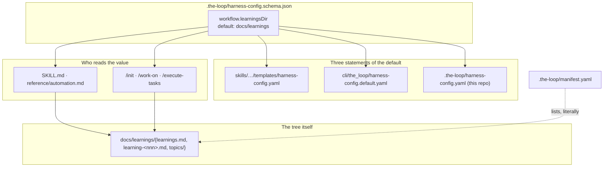

# Design: the learnings tree is a configured location, and it defaults into `docs/`

> Phase 2 of 3. Derived from [`requirements.md`](requirements.md); reviewed together with
> [`testing-plan.md`](testing-plan.md).

## The shape of the change

There is no runtime to build here. The learnings lifecycle is implemented by the **skill**
(`reference/automation.md` §Self-improvement says so in as many words: "The skill
implements this today; the Python CLI can harden it later"), so the whole of this work item
is: one schema property, three config files that state its default, six documents that
stop naming a literal path, one manifest, and a `git mv`.

That makes the design questions the interesting part, and there are exactly two.



## Question 1: where does the key live — `workflow` or `selfImprovement`?

Both have a claim. `selfImprovement` already holds every other learnings knob (`enabled`,
`maxIndexLines`, `writeGateOccurrences`) and its descriptions already name the topic-overflow
path, so a directory key there keeps one feature's configuration in one block. `workflow`
already holds `specDir` and `capabilitiesDir` — the other two "where the-loop's checked-in
knowledge lives in your repository" keys.

**Decision: `workflow.learningsDir`** (decision-082). Three reasons, in order of weight:

1. **The question an operator is answering is "where do the-loop's documents go?", not
   "how does self-improvement behave?"** A project relocating its documentation tree sets
   all three keys in one sitting; splitting one of them into another block means the
   operator has to already know the learnings are a self-improvement feature to find it.
2. **The onboarding groups make the split expensive.** `x-onboarding` puts `workflow` in
   the `confirm` group (init proposes values and asks the operator to confirm them) and
   `selfImprovement` in the `advanced` group (defaults applied silently, walked only on the
   full tour). A directory that determines the project's layout belongs in the group that
   is actually shown; under `selfImprovement` the majority of adopters would never see it.
3. **`capabilitiesDir` is the precedent.** Capability docs are no more a "workflow" concept
   than learnings are — they are a knowledge tree, and they live under `workflow` because
   that is where this schema puts directory locations. A second convention would be the
   drift, not the consistency.

The cost is that `selfImprovement`'s descriptions now point at a key in another block. That
is paid in prose: the two descriptions that name the overflow path say
`<workflow.learningsDir>/topics/<category>.md`, so the reader is one hop from the answer
either way.

## Question 2: what happens to a project that already has `learnings/`?

The default moves. For a project already adopted under the old default, the honest
statements are:

- **the-loop never silently relocates project data.** The `manifest.deprecated` mechanism
  is the wrong tool: `/the-loop:upgrade-the-loop` *deletes* those paths, and every existing
  entry says so explicitly ("SAFE TO DELETE, not a migration" — a verbatim copy of a
  plugin file holding no project data). Learnings are the operator's data.
- **The upgrade command already has the right shape for this**: it reconciles, reports and
  asks. So this is a paragraph in `commands/upgrade-the-loop.md`, not a new mechanism —
  present the two outcomes (move the tree, or pin the old location with
  `workflow.learningsDir: learnings`) and do neither without confirmation (R5).
- **No runtime fallback.** A "use `learnings/` if it exists, else `docs/learnings`" rule
  would give the project two answers to one question, resolved by whichever directory
  happens to exist — the same class of defect issue-123 produced when two modules each
  carried a copy of the spec-directory literal. The configured value, defaulted, is the
  single answer.

Nothing is versioned or migrated: the key is optional and additive, so an existing config
stays valid (NFR-1) and `CURRENT_CONFIG_VERSION` — which is the *CLI* config's version
anyway — is untouched.

## Components & changes

| # | File | Change |
|---|------|--------|
| 1 | `.the-loop/harness-config.schema.json` | Add `workflow.learningsDir` (string, default `docs/learnings`) with a description naming the three paths it governs and the repo-relative rule; re-point the two `selfImprovement` descriptions at it; extend the `workflow` onboarding group's `explain` to mention learnings. |
| 2 | `skills/the-loop/templates/harness-config.yaml` | `learningsDir: docs/learnings` under `workflow`, with the inline comment the block's other keys carry. |
| 3 | `cli/the_loop/harness-config.default.yaml` | The same line — the file is a byte-for-byte copy of (2), pinned by `test_harness_config.py`. |
| 4 | `.the-loop/harness-config.yaml` | This repository's own declaration, stated explicitly rather than defaulted (R3.3). |
| 5 | `skills/the-loop/SKILL.md` | §Knowledge the loop maintains names `<learningsDir>/…`; the `workflow` key list in §Configuration is unchanged (it lists blocks, not keys). |
| 6 | `skills/the-loop/reference/automation.md` | §Self-improvement's four stages name `<learningsDir>/…` and state the key and its default once. |
| 7 | `commands/init.md`, `commands/work-on.md`, `commands/execute-tasks.md` | Scaffold/write against the configured directory. |
| 8 | `commands/upgrade-the-loop.md` | The relocation paragraph from question 2. |
| 9 | `.the-loop/manifest.yaml` | `knowledge` entries move to `docs/learnings/…`, matching the literal style already used for `docs/specs/<id>/…`. |
| 10 | `docs/config/harness-config.md`, `docs/guide/how-it-works.md`, `docs/architecture/architecture.md` | The documented key and the repository-layout trees. |
| 11 | `learnings/` → `docs/learnings/` | `git mv`, plus the relative links inside `topics/README.md` and the moved records. |
| 12 | `docs/decisions/decision-082.md` + index row | The placement and default-relocation decision. |
| 13 | `docs/capabilities/spec-workflow.md` | The capability doc that owns `workflow.*` directory keys gains the third one (ready-to-ship gate item). |

## Data model

One new property. Its resolution rule is stated once, in the schema, and mirrored in the
skill:

```text
learningsDir := config.workflow.learningsDir  if truthy
             := "docs/learnings"              otherwise      # unset, null or ""

<learningsDir>/learnings.md               the injected index (capped by maxIndexLines)
<learningsDir>/learning-<nnn>.md          one durable learning
<learningsDir>/topics/<category>.md       consolidated overflow, read on demand
.the-loop/learnings-pending/              unchanged: the git-ignored write-gate queue
```

The pending queue stays under `.the-loop/` and is deliberately **not** moved or made
configurable. It is git-ignored scratch state belonging to the harness, not checked-in
project knowledge, and it lives beside the other harness-internal state for the same reason
the config does.

## Error handling

There is no new code, so there is no new failure path. The two degenerate inputs and their
answers:

| Input | Answer |
|-------|--------|
| Key absent / `null` / `""` | `docs/learnings` — the documented default, not the repository root (R1.2). |
| A path that does not exist yet | Created on first write, as `/the-loop:init` already does for the index. |

## Security design

The requirements' one trust boundary — repository config → agent filesystem write — is
enforced by *not crossing it in code*: no CLI module reads `learningsDir`, so
`harness_config.READS` does not grow and the enumerable read surface decision-044 pins
stays exactly as it is. The schema description states the repo-relative rule so the
contract is written down where the value is defined.

**Condition on a future change:** if the CLI ever resolves this path (a `the-loop learnings`
verb, say), it must apply the containment check `graphlink._is_contained` already applies to
`specDir` — resolve the path and prove it is inside the checkout, failing closed when it
cannot be resolved. Recorded here rather than implemented now, because a guard written for
a caller that does not exist is a guard nothing tests.

Abuse cases 1–3 from `requirements.md` are unchanged by the design; case 3 (the default
placing learnings inside a published `docs/` tree) is answered by the schema description
and the config reference calling it out, so the choice is visible at adoption time.

## Testing strategy

Mechanical, because the change is mechanical: the schema validates (`make validate`), the
template and the packaged default stay byte-identical (`test_harness_config.py`), the
manifest's schema mapping still resolves (`test_manifest_schemas.py`), the docs↔code parity
suite still passes, markdownlint passes, and a repository-wide search finds no surviving
reference to the pre-move path. Detail in [`testing-plan.md`](testing-plan.md).

## Minimalism ladder

- **YAGNI** — no CLI reader, no migration, no runtime fallback, no new mechanism in the
  upgrade command. Each was considered above and rejected with a reason.
- **Reuse** — the key reuses the shape, the default-resolution rule and the onboarding
  group of `specDir`/`capabilitiesDir`; the upgrade path reuses the reconcile-and-ask
  behaviour the command already has.
- **No new dependency.** No new file of code at all: the only new files are documents.
