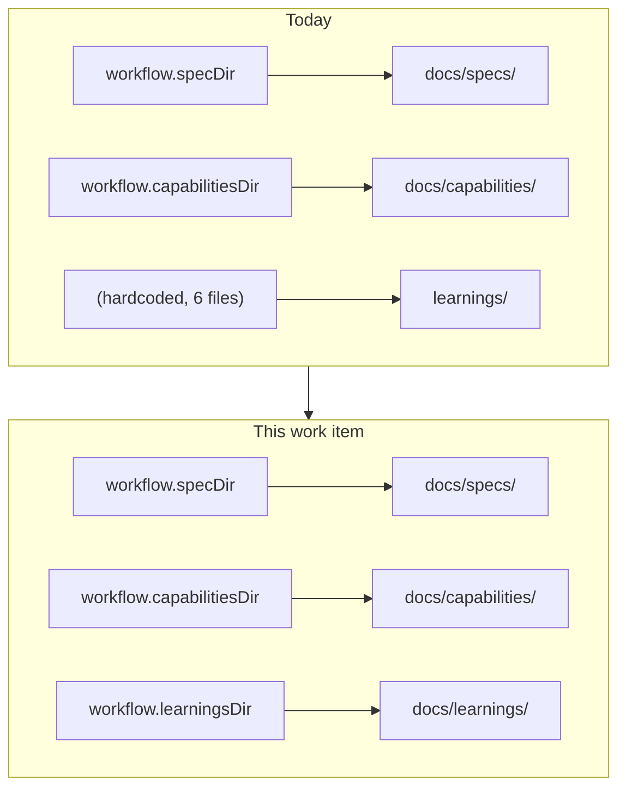

# Requirements: the learnings tree is a configured location, and it defaults into `docs/`

> Phase 1 of 3 (requirements → design → tasks). Following the Kiro spec approach
> (<https://kiro.dev/docs/specs/>). This phase MUST be reviewed and approved by the
> required collaborators before moving to design.

## Introduction

the-loop maintains four trees of checked-in knowledge inside a project: the per-work-item
specs, the living capability docs, the decision log, and the learnings. Three of them the
project can place where it wants — `workflow.specDir` and `workflow.capabilitiesDir` are
config keys, and the decision log sits inside the `docs/` tree everything else uses. The
learnings are the exception. They are hardcoded at `learnings/` in the repository root by
the skill, by `reference/automation.md`, by two commands, and by the manifest, and there
is no key that moves them.

[#224](https://github.com/MadaraUchiha-314/the-loop/issues/224) closes that gap and takes
the second step the ticket asks for: the default stops being a top-level directory and
becomes `docs/learnings`, and the-loop's own learnings move there.

Two consequences follow from the current state, and they are the reason this is worth a
work item rather than a comment:

1. **An adopting project gets a root-level directory it did not choose.** A project that
   keeps every document under `docs/`, or under `documentation/`, or inside one package of
   a monorepo, still gets `learnings/` planted beside its `src/` — and can only fix it by
   editing the files the-loop writes, which the next run overwrites the shape of.
2. **the-loop's own repository has the same directory.** `docs/` holds the architecture
   index, the capability docs, the decision log, the specs, the API contract and the site
   itself; `learnings/` sits outside it at the root, which is exactly the layout this
   ticket says is wrong.

## Requirements

### Requirement 1 — the learnings tree is named by the harness config

**User story:** As an operator adopting the-loop, I want to say where the learnings tree
lives, so that the-loop's knowledge lands inside my project's documentation layout instead
of beside it.

#### Acceptance criteria (EARS)

1. WHEN the harness config declares `workflow.learningsDir` THEN the harness SHALL read
   and write the learnings index, the per-learning records and the topic overflow files
   under that directory.
2. WHEN `workflow.learningsDir` is absent, empty or null THEN the harness SHALL use
   `docs/learnings` — the same "unset means the default" reading `workflow.specDir`
   already has, so a project that writes `learningsDir: ""` has chosen nothing rather than
   the repository root.
3. WHEN the value is validated THEN the schema SHALL accept any string, carry the default
   `docs/learnings`, and describe the paths it governs
   (`<learningsDir>/learnings.md`, `<learningsDir>/learning-<nnn>.md`,
   `<learningsDir>/topics/<category>.md`).
4. WHERE the value is a path, it SHALL be interpreted relative to the repository root, as
   `specDir` and `capabilitiesDir` are.

### Requirement 2 — the default is `docs/learnings`, in all three places that state it

**User story:** As a contributor reading any one of the-loop's three statements of "the
default config", I want the same answer, so that I never have to work out which copy is
authoritative.

#### Acceptance criteria (EARS)

1. WHEN the schema, the shipped template (`skills/the-loop/templates/harness-config.yaml`)
   and the packaged default (`cli/the_loop/harness-config.default.yaml`) are compared THEN
   all three SHALL state `docs/learnings`.
2. WHEN the template and the packaged default are compared THEN they SHALL remain
   byte-for-byte identical, as `test_harness_config.py` already requires.
3. WHEN a project's config is validated against the schema THEN a config that omits
   `learningsDir` entirely SHALL remain valid — the key is additive and optional, so no
   config version bump and no migration is required.

### Requirement 3 — the-loop's own learnings live under `docs/`

**User story:** As a maintainer of this repository, I want the learnings inside the `docs/`
tree with every other artifact the loop maintains, so that the repository's root is the
product and not the project's meta.

#### Acceptance criteria (EARS)

1. WHEN this work item lands THEN `learnings/learnings.md`, `learnings/learning-<nnn>.md`
   and `learnings/topics/` SHALL be at `docs/learnings/`, moved with `git mv` so file
   history follows them.
2. WHEN the moved files are read THEN every relative link inside them SHALL resolve, and
   no file anywhere in the repository SHALL still link to the old location.
3. WHEN `.the-loop/harness-config.yaml` is read THEN it SHALL declare
   `workflow.learningsDir: docs/learnings` explicitly rather than relying on the default,
   so this repository's own config states the layout it uses.

### Requirement 4 — every statement of the path names the configured one

**User story:** As an agent working a ticket under the-loop, I want one statement of where
learnings go, so that I do not write them to a path the project did not choose.

#### Acceptance criteria (EARS)

1. WHEN the skill (`SKILL.md`), the automation reference, `/the-loop:init`,
   `/the-loop:work-on` and `/the-loop:execute-tasks` name the learnings tree THEN they
   SHALL name it as `<learningsDir>` (or `workflow.learningsDir`) and SHALL NOT restate a
   literal path as the rule.
2. WHEN `.the-loop/manifest.yaml` lists the learnings artifacts under `knowledge` THEN the
   listed paths SHALL be the new default location, in the same literal style the manifest
   already uses for `docs/specs/<id>/…`.
3. WHEN the documentation site describes the repository layout
   (`docs/guide/how-it-works.md`, `docs/architecture/architecture.md`,
   `docs/config/harness-config.md`) THEN it SHALL show the new location and document the
   new key.

### Requirement 5 — a project that already carries `learnings/` is told what to do

**User story:** As an operator upgrading an already-adopted project, I want to know that
the default moved, so that my existing learnings do not become an orphaned directory the
loop stops reading.

#### Acceptance criteria (EARS)

1. WHEN `/the-loop:upgrade-the-loop` reconciles a project that carries a root-level
   `learnings/` and no `workflow.learningsDir` THEN it SHALL present the two supported
   outcomes — move the tree to `docs/learnings`, or pin the old location by setting
   `workflow.learningsDir: learnings` — and SHALL NOT move or delete the tree without the
   operator's confirmation.
2. WHERE the operator does not answer, the existing tree SHALL be left exactly as it is;
   learnings are project data and no reconciliation step may silently relocate them.

## Non-functional requirements

| # | Requirement |
|---|-------------|
| NFR-1 | **Additive schema change.** `learningsDir` is optional with a default; the harness config `version` stays `0.2.0` and no migration code is added. |
| NFR-2 | **No new CLI read.** The CLI does not read the learnings tree today and gains no reason to; `harness_config.READS` is unchanged, so the enumerable read surface (decision-044) stays as it is. |
| NFR-3 | **Green gates.** `make check` (ruff lint + format, pyright, `scripts/validate_config.py`, pytest) and `markdownlint` pass, including the docs↔code parity and manifest/schema tests. |
| NFR-4 | **History preserved.** The move is a rename in git, not a delete-and-add. |
| NFR-5 | **No dead links.** No file in the repository references the pre-move path after this work item, and the moved files' own relative links resolve from their new depth. |

## Security considerations

**Untrusted actors.** None new. `workflow.learningsDir` is read from
`.the-loop/harness-config.yaml`, a committed, code-reviewed file in the repository being
worked — the same trust boundary `specDir` and `capabilitiesDir` sit behind. No inbound
webhook payload, ticket comment or PR body reaches this value, and no CLI code path reads
it (NFR-2), so there is no new parser, no new writer and no new process boundary.

**Trust boundaries crossed.** One, and it already exists: repository-config → the agent's
filesystem writes. A value like `../../etc` or `/tmp/x` is a *path* the agent would then
write learnings to. The mitigations are the ones already in force for the other directory
keys: the value is repo-relative by definition (R1.4, stated in the schema description),
the config is reviewed like code, and the CLI — the only component that resolves such a
path programmatically — does not resolve this one. Should a CLI reader ever be added, it
must apply the containment check `graphlink._is_contained` already applies to `specDir`;
that is recorded in the design as a condition on a future change, not as code written now
for a caller that does not exist.

**Abuse cases.**

| # | Abuse case | Mitigation |
|---|------------|------------|
| 1 | A contributor sets `learningsDir` to a path outside the checkout (`../shared/learnings`) so the loop writes outside the repository. | The key is repo-relative by contract and the value is a reviewed diff in a committed config; no CLI code resolves it, so there is no unreviewed path to a filesystem write. A future CLI reader inherits `specDir`'s containment guard. |
| 2 | `learningsDir` is pointed at an existing source directory so learnings collide with code. | Same review boundary; the-loop only creates its own named files (`learnings.md`, `learning-<nnn>.md`, `topics/<category>.md`) and never deletes files it did not write. |
| 3 | The new default puts learnings inside a `docs/` tree a project **publishes**, exposing internal feedback the operator assumed was repo-only. | This is precisely what the key now buys: a project that publishes `docs/` and does not want learnings on the site points `learningsDir` elsewhere. Called out in the schema description and in the config reference so the choice is visible at adoption time rather than discovered after a deploy. For this repository the answer is deliberate — the learnings are already public in a public repo, and `docs/specs/` is published the same way. |

**Fail-closed.** Not applicable in the usual sense — there is no gate here to open. The
degenerate input (unset/empty) resolves to the documented default rather than to the
repository root, which is the conservative reading: a mistyped key writes into a
predictable subdirectory, never scattered across the project root.

**Nothing is weakened.** No authentication, authorization, redaction or gate behaviour is
touched by this change.

## Risk tier

**Tier 3 — human-approves-pr** (`autonomy.tiers."3"`).

`autonomy.sensitivePaths` matches two files this work item edits
(`.the-loop/harness-config.schema.json` via `**/*schema*`, and
`.the-loop/harness-config.yaml`), which is what keeps this off tier 1–2 and out of
autonomous completion. It stays at 3 rather than 4 because the schema edit is a single
additive optional property with a default, `reviews.critics[]` — the executable part of
that file — is untouched, and no runtime code path is added or changed. Tier 3 is below
`security.review.humanSignOffMinTier` (4), so a named human **security** sign-off is not
required; a human PR approval is.
