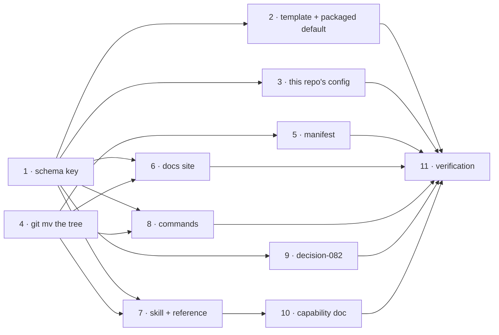

# Tasks: the learnings tree is a configured location, and it defaults into `docs/`

> Phase 3 of 3. A DAG, not a list: tasks with the same dependencies can run in any order.
> Each `_Test:_` names a row of [`testing-plan.md`](testing-plan.md).

## Tasks

- [x] **1. Add `workflow.learningsDir` to the schema.** String, default `docs/learnings`,
  described in the register `specDir`/`capabilitiesDir` use: the three paths it governs and
  the repo-relative rule. Re-point the two `selfImprovement` descriptions that name the
  overflow path at `<workflow.learningsDir>`, and extend the `workflow` onboarding group's
  `explain` so the guided init mentions learnings alongside specs and capability docs.
  _Requirements: R1.1–R1.4, R2.1_ · _Test: T1_

- [x] **2. State the default in the template and the packaged default.** Add
  `learningsDir: docs/learnings` under `workflow` in
  `skills/the-loop/templates/harness-config.yaml` with the inline comment style its
  siblings carry, then copy the file to `cli/the_loop/harness-config.default.yaml` so the
  two stay byte-identical.
  _Requirements: R2.1, R2.2_ · _Test: T1, T2, T3_

- [x] **3. Declare it in this repository's own config.** `learningsDir: docs/learnings` in
  `.the-loop/harness-config.yaml`, stated rather than defaulted.
  _Requirements: R3.3_ · _Test: T1, T3_

- [x] **4. Move the tree.** `git mv learnings docs/learnings`, then fix the relative links
  inside the moved files (`topics/README.md` points at the skill reference; the index points
  at its records).
  _Requirements: R3.1, R3.2, NFR-4, NFR-5_ · _Test: T8, T10, T18_

- [x] **5. Update the manifest.** The three `knowledge` entries become
  `docs/learnings/learnings.md`, `docs/learnings/learning-<nnn>.md` and
  `docs/learnings/topics/<category>.md`.
  _Requirements: R4.2_ · _Test: T3, T8_

- [x] **6. Update the documentation site.** The `workflow` row of
  `docs/config/harness-config.md` names the new key; the layout trees in
  `docs/guide/how-it-works.md` and `docs/architecture/architecture.md` show the new
  location.
  _Requirements: R4.3_ · _Test: T5, T7, T8_

- [x] **7. Update the skill and the automation reference.** `SKILL.md` §Knowledge the loop
  maintains and `reference/automation.md` §Self-improvement name `<learningsDir>/…` and
  state the key and its default once.
  _Requirements: R4.1_ · _Test: T7, T8_

- [x] **8. Update the commands.** `/the-loop:init` scaffolds the index under the configured
  directory; `/the-loop:work-on` and `/the-loop:execute-tasks` write there;
  `/the-loop:upgrade-the-loop` gains the relocation paragraph — present both outcomes, move
  nothing without confirmation.
  _Requirements: R4.1, R5.1, R5.2_ · _Test: T8, T9_

- [x] **9. Record decision-082.** The placement question (`workflow` over
  `selfImprovement`) and the default relocation, with the alternatives and their costs;
  add the index row.
  _Requirements: R4.3_ · _Test: T7_

- [x] **10. Fold into the capability doc.** `docs/capabilities/spec-workflow.md` — the doc
  that owns the `workflow.*` directory keys — gains `learningsDir` and a history row.
  _Requirements: R4.3_ · _Test: T5, T7_

- [x] **11. Execute the testing plan.** Run every activity, record command, outcome and
  evidence in `evidence/verification.md`, tick each row only once it has actually run, and
  complete `testing-plan.md` as the record.
  _Requirements: all_ · _Test: T1–T10, T15, T18_
