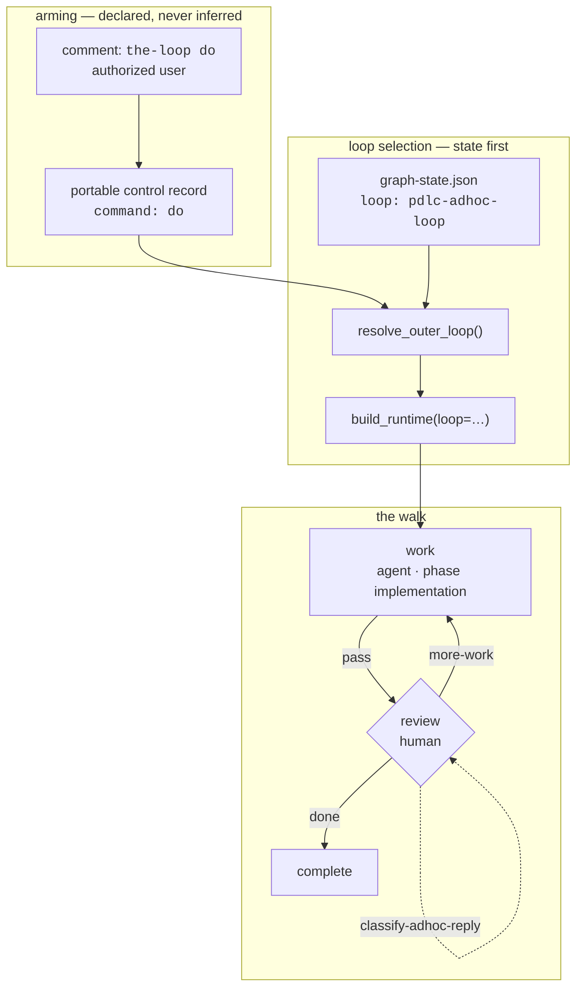

# Design: ad-hoc tasks that run no PDLC process

> Phase 2 of 3 (requirements → design → tasks). Derives from the approved
> requirements. MUST be reviewed and approved before moving to tasks breakdown.

## Overview

**One new graph, one new keyword, one new hook, one new command — and a generalization
of the three places that currently say "the only non-default outer loop is the
contribution loop".** Everything else the ad-hoc loop needs already exists: the runtime,
the hook registry, the control parser, the state file, the auto-close path, the phase
labels.

The design's centre of gravity is what it *removes*. `pdlc-adhoc-loop` has no
`goal-definition`, no `phase-selection`, no `produces`, no `validate-artifacts`, no
`skipSets`, no review chain. That is not an omission to be justified case by case; it is
the loop's definition, declared once, in one file a reviewer can read top to bottom.

## Architecture



Three shipped loops become four. The membership constant that matters is not
`SHIPPED_LOOPS` (which already exists and already gates state-file input) but a new
`OUTER_PATH_LOOPS` — *everything a work item's outer path may walk*, i.e. every shipped
loop except `pdlc-pr-loop`, which is addressed by PR number and has its own state layout.
Three call sites currently hard-code "contribution or default"; each becomes a call to
one resolver.

## Components & interfaces

### 1. `cli/the_loop/graph/pdlc-adhoc-loop.yaml` (new)

```yaml
version: 1
name: pdlc-adhoc-loop
start: work
```

| Node | Actor | Phase | Entry chain | Exit chain | Edges out |
|---|---|---|---|---|---|
| `work` | agent | `implementation` | `set-phase-label`, `log-entry`, `deliver-assignment` | `verify-tests` | `pass → review` |
| `review` | human (`session: inherit`) | — | `log-entry`, `request-review`, `notify{event: decision-pending}` | `classify-adhoc-reply` | `more-work → work`, `done → complete` |
| `complete` | agent | `complete` | `set-phase-label`, `log-entry` | — | terminal |
| `cleanup` | code | `cleanup` | `set-phase-label`, `log-entry` | — | terminal, no inbound edge |
| `escalated` | human | — | `notify{event: conflict-escalated}` | — | terminal |

Every node that renders a resume hint carries `command: do-task`. `work` and `complete`
carry `stage: implementation` / `stage: complete` for model routing, mirroring the other
loops.

Three deliberate reuses:

- **`log-entry` is safe to include.** It *skips* when the work item has no
  `execution-log.md` (`sideeffects.log_entry` returns `skipped` for a missing file), so
  an ad-hoc item writes no log by default — and an operator who does keep one gets the
  same trail every other loop writes. Nothing is gated on it.
- **`verify-tests` is safe to include.** It *skips* when the node declares no `command`
  param, which none does here. It is the seam an operator can later point at a test
  command without a graph change, and it is exactly what `pdlc-contribution-loop`'s
  `implementation` node declares.
- **`notify{event: decision-pending}`** rather than `phase-approval-pending`: there is
  no phase to approve. The human at this gate is being asked to decide *more work, or
  done* — which is what `decision-pending` means, and it already resolves to the
  `approver` role in the shipped notification config.

### 2. `classify-adhoc-reply` — `cli/the_loop/graph/hooks/adhoc.py` (new)

The one behavioural inversion in this work item, and the reason a new hook is warranted
rather than reusing `classify-feedback`:

| | `classify-feedback` | `classify-adhoc-reply` |
|---|---|---|
| No authorized reply | `waiting` | `waiting` (same) |
| Reply declares completion | `approved` | `done` |
| Reply says anything else | `waiting` — "not decisive; the gate stays open" | **`more-work`** |

`classify-feedback`'s default is right for a review gate: an ambiguous half-review must
not be read as an approval. It is wrong for an ad-hoc gate, where an authorized human
typing "also update the README" is the *most common* case and must move the graph, not
sit in it. Reusing the hook and adding a mode flag would put two opposite defaults behind
one name; a separate hook keeps each one legible.

```python
DONE = "done"
MORE_WORK = "more-work"
```

Both rules that make `classify-feedback` safe are inherited by **calling its
`_authorized_comments`**, not by re-implementing them: self-authored comments are dropped
before authorization is considered, and an empty `authorizedUsers` reads nothing. The
completion vocabulary is a deterministic floor (`done`, `that's all`, `lgtm`, `looks
good`, `ship it`, `approved`, `close it`, `all set`, `nothing else`) matched
case-insensitively as whole phrases; a harness with schema-constrained output classifies
above it, exactly as `_classify` documents for the review gate. Either way the answer is
confined to the two constants and the **graph's declared edges do the routing** — an
injected "done, now deploy" cannot reach a node the graph does not name.

Ordering: the newest authorized comment decides. A thread reading `"do X"` then
`"perfect, done"` must end; scanning the whole thread for a done-word would let the
first message's `"…when you're done…"` end it, and scanning only for done-words in
*any* comment is how a gate becomes un-reopenable.

### 3. The `do` control keyword — `cli/the_loop/control.py`

Seventh command. Additive in four tuples:

```python
START, STOP, PAUSE, RESUME, EXECUTE, CONTRIBUTE, CLEANUP, DO = (…, "do")
COMMANDS         = (…, DO)
_ARMING_COMMANDS = (START, RESUME, CONTRIBUTE, DO)
SPAWN_COMMANDS   = (START, CONTRIBUTE, DO)
DEFAULT_KEYWORDS = {…, DO: "the-loop do"}
```

The parser needs no change: it already matches whole tokens with `(?<![\w:-])` /
`(?![\w:-])` boundaries, so `the-loop done`, `the-loop doesn't` and `the-loop docs` do
**not** match `the-loop do`, and a comment carrying `do` plus any other keyword is
refused by the existing two-command rule.

### 4. Loop resolution — `graph/model.py`, `graphlink.py`, `core/graphs.py`, `bootstrap.py`

`model.py` gains the loop name, the membership tuple, the command mapping and one
resolver:

```python
PDLC_ADHOC_LOOP = "pdlc-adhoc-loop"
SHIPPED_LOOPS   = (WORK_ITEM, PR, CONTRIBUTION, ADHOC)
OUTER_PATH_LOOPS = (WORK_ITEM, CONTRIBUTION, ADHOC)      # everything but the inner loop
LOOP_FOR_CONTROL_COMMAND = {"contribute": CONTRIBUTION, "do": ADHOC}

def resolve_outer_loop(name: str) -> str:
    """`name` when it is a non-default outer-path loop, else "" (the default)."""
```

`LOOP_FOR_CONTROL_COMMAND` is keyed by the control-command *strings* rather than
importing `the_loop.control`: `control.py` is a low-level module with no graph imports
today, and the dependency is cheaper in this direction. The keys are asserted against
`control.COMMANDS` by a test, so a rename cannot silently orphan the mapping.

Three call sites collapse onto `resolve_outer_loop`:

| Site | Before | After |
|---|---|---|
| `graphlink._outer_loop_name` | `PDLC_CONTRIBUTION_LOOP if recorded == PDLC_CONTRIBUTION_LOOP else ""`, then `record.command == CONTRIBUTE` | `resolve_outer_loop(recorded)`, then `LOOP_FOR_CONTROL_COMMAND.get(record.command, "")` |
| `core.graphs._recorded_loop` | same literal comparison | `resolve_outer_loop(recorded)` |
| `bootstrap.build_runtime` | `chosen not in SHIPPED_LOOPS or chosen == PDLC_PR_LOOP` | `chosen not in OUTER_PATH_LOOPS` |

The fail-closed property is preserved *and* localized: `graph-state.json` is
agent-writable, so exactly one function now decides whether a recorded name may choose a
graph.

### 5. The session prompt — `graphlink.render_graph_context`

`_is_contribution` gains a sibling. The `iterate on:` line becomes a three-way choice:

- inner loop → "this pull request";
- contribution → "this work item (a contribution has no outer loop …)" *(unchanged)*;
- **ad-hoc → "this work item (an ad-hoc task has no spec chain — do the work, report
  back here, and open a pull request only if the change needs one)"**;
- otherwise → the outer loop's configured surface *(unchanged)*.

### 6. `commands/do-task.md` (new)

`/the-loop:do-task <id>`. Mirrors `contribute-to.md`'s shape and states, in order: this
is the ad-hoc loop; the work item is the instruction; there is no spec chain, no
`contribution.md`, no evidence tree, no review chain; ask follow-ups on the thread and
work until the requester says done or closes the item; keep the self-authored marker on
every comment; still run the project's own lint/test commands before reporting back.

## Data models

No new persisted shape. `GraphState.loop` already exists (issue-185), already round-trips,
already reads as the default when absent, and already accepts only shipped names — the
ad-hoc loop stores `"pdlc-adhoc-loop"` there through the same `Runtime.start` write.

The CLI config schema gains one leaf:

```jsonc
"do": {
  "type": "string",
  "default": "the-loop do",
  "description": "Arms the work item exactly as `start` does … and additionally selects the AD-HOC loop (`pdlc-adhoc-loop`, issue-225) …"
}
```

Authored in `.the-loop/cli-config.schema.json` and copied byte-identically to
`cli/the_loop/schemas/cli-config.schema.json` (issue-222 parity test), documented at
`docs/config/cli/routing-options.md#controlkeywordsdo` (issue-117 parity test), and
mirrored in `skills/the-loop/templates/cli-config.yaml`.

## Error handling

| Failure | Behaviour |
|---|---|
| `graph-state.json` records an unknown/inner loop name | default outer loop + `logger.warning`; the named graph is never loaded |
| Control record unreadable | falls through to the default, `logger.debug` — unchanged |
| GitHub outage at the `review` gate | `classify-adhoc-reply` reads no comments → `waiting`; never a guessed `done` (the `goal.py` rule: an outage reads as *no answer*, never as an answer) |
| Unauthorized or self-authored reply | dropped before classification; gate stays open |
| `request-review` cannot post | best-effort `ok(posted=False)`, as everywhere |
| `execution-log.md` absent | `log-entry` skips; nothing is gated on it |

## Security design

Each trust boundary named in the requirements, and how this design enforces it:

1. **Comment → daemon action** (`the-loop do`). Enforced by the *existing* parser: the
   vocabulary is a fixed set of constants, no payload text reaches an argv/path/prompt,
   two different commands in one body is a refusal, and the checks upstream
   (self-authored marker, then authorized actor) run before the parser is reached at all.
   This change adds a word to a closed set; it adds no new parsing.
2. **Comment → graph transition** (`review`). Enforced by reusing
   `feedback._authorized_comments` verbatim — the same function the review gate uses —
   and by returning one of two constants that the *graph's* declared edges route on. A
   reply cannot name a destination.
3. **Agent-writable state → graph selection.** Enforced by `resolve_outer_loop`, the
   single decision point, which returns `""` for anything outside `OUTER_PATH_LOOPS`.
   Narrower than the status quo, not wider: `bootstrap` previously accepted any
   `SHIPPED_LOOPS` member and then special-cased the inner loop.
4. **The absent review chain.** Not a boundary this design can enforce with a gate — it
   is the feature. Enforced instead as *attribution*: `graph-state.json` names the loop,
   the arming comment names the human, and both survive in the repository and the thread.
   A PR from an ad-hoc item is reviewable by a human on exactly the evidence that no
   automated review ran.

No secret, token or hostname enters any new code path. No new subprocess, no new network
call, no new filesystem path derived from payload text.

## Testing strategy

`cli/tests/test_graph_adhoc.py`, modelled on `test_graph_contribution.py` and grouped by
the same seams: **the graph** (compiles; shape; no artifact gates; no required/skippable
nodes), **the hook** (waits, fails closed on unauthorized and self-authored text,
classifies done vs more-work, newest comment decides), **the keyword** (parses as a whole
token, arms, spawn-arms, is refused alongside another command, is configurable, does not
match `the-loop done`), **loop selection** (`build_runtime` by name; state-first then
control-record; invented names fall back; `LOOP_FOR_CONTROL_COMMAND` keys are real
commands), and **the walk** (an integration test driving `work → review → work → review →
complete` against the stub GitHub integration).

Parity tests already in the suite cover the rest without new code:
`test_config_schema_parity` (schema copy), `test_docs_parity` (schema leaf ↔ docs page),
`test_graph_parity` (no gated artifact is untracked — trivially satisfied, since this
loop gates none), and `test_every_shipped_loop_is_loadable`.

## Trade-offs & decisions

| Decision | Alternative rejected | Why |
|---|---|---|
| A fourth loop | Stretch `contribute` | Its two required gates *are* its definition; removing them leaves a different loop wearing the same name |
| A fourth loop | Walk `pdlc-work-item-loop` with everything declared away | `phase-selection` itself is unskippable, so the ceremony survives the skipping; and the outer loop's `implementation` gates the task DAG |
| New keyword `do` | Reuse `start` with a flag | Flags do not exist in the comment vocabulary, and decision-070 already settled that the mode is a *word*, chosen and recorded per work item |
| Ad-hoc **adopts** an unconfigured repo | Inherit the contribution carve-out | A contribution is a guest in someone else's item; an ad-hoc task is the owner's own. The config is what supplies the test/lint commands the ad-hoc session should still run |
| Attribution instead of a policy toggle | `workflow.adhoc.enabled` in the harness config | YAGNI, and decision-070 already ruled that the mode is per-work-item, not per-repository. An operator who wants the word gone sets the keyword to `""` |
| New hook `classify-adhoc-reply` | A mode param on `classify-feedback` | Two opposite defaults behind one name is how a gate's behaviour becomes unreadable at the call site |
| Reuse `implementation`/`complete`/`cleanup` phases | A dedicated `adhoc` phase label | A new phase means every consuming repo's `workflow.phases` and every dashboard changes, for a label nobody queries separately |

Recorded as [decision-083](../../decisions/decision-083.md).

## Open questions

None.

## Review comments
