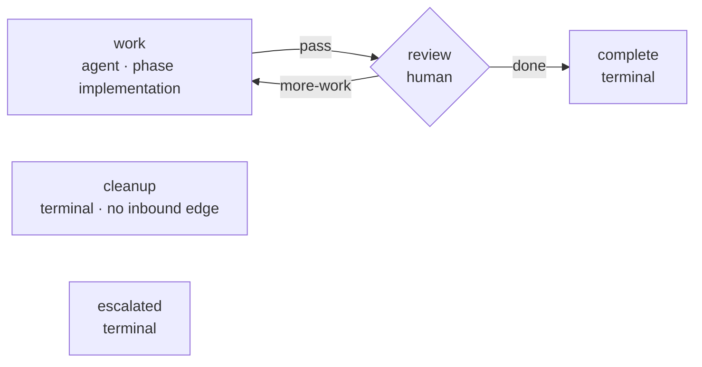

# Requirements: ad-hoc tasks that run no PDLC process

> Phase 1 of 3 (requirements → design → tasks). Following the Kiro spec approach
> (https://kiro.dev/docs/specs/). This phase MUST be reviewed and approved by the
> required collaborators before moving to design.

## Introduction

[Issue #225](https://github.com/MadaraUchiha-314/the-loop/issues/225): *"Sometimes a
user needs to just trigger an ad-hoc task that doesn't require an elaborate PDLC
outer/inner loop … these tasks are mostly tactical and just require the agent harness
to do the task, ask any follow up (on the work item) and continue until the user closes
the work item and declares it as done. Does the 'contribute' feature fit for these
use-cases? or do we need to define another command for these ad-hoc tasks?"*

**The answer to the question the issue asks: `contribute` does not fit, and the gap is
a fourth loop.** `pdlc-contribution-loop` is defined by exactly the two things an
ad-hoc task does not have.

| | `contribute` (`pdlc-contribution-loop`) | an ad-hoc task |
|---|---|---|
| Start condition | `goal-definition` is `required: true` — refuses to begin without `Goal:` + a `Success criteria:` bullet list from an authorized comment | the work item *is* the instruction |
| Definition of done | `verification` blocks until every frozen criterion is ticked and proved | the requester says so, or closes the item |
| Phase choice | `phase-selection` is `required: true` — a checklist and a `the-loop execute` reply before any work | there are no phases to choose between |
| Artifacts | `contribution.md`, locked and human-approved at `plan-approval` | none |
| Ownership | a **guest** in someone else's in-progress item (hence the no-adopt, spec-tree-exclusion and `publish-artifact` carve-outs) | the requester's own item, in their own repository |

Routing ad-hoc work through `contribute` forces one of two bad outcomes: invent success
criteria for "fix this typo" so the gate releases, or declare every skippable phase away
and *still* stop at two required gates before the agent touches anything. Both put
ceremony exactly where the issue says ceremony must not be.

So this work item ships a fourth shipped graph, `pdlc-adhoc-loop`, armed by a new
control keyword and driven by a new command. It is the smallest loop the-loop can
express: do the work, talk to the human, stop when the human says stop.

## Requirements

### Requirement 1 — a fourth shipped loop, sized for a tactical task

**User story:** As a requester with a tactical task, I want the-loop to do the work
without a spec chain, phase gates or a review chain, so that the process costs less
than the task.

#### Acceptance criteria (EARS)

1. The system SHALL ship a fourth process graph, `pdlc-adhoc-loop`, as package data
   beside the other three, compiled and validated by the same runtime, with the same
   hook vocabulary and the same state files.
2. The graph SHALL declare exactly three walkable nodes — `work`, `review`, `complete` —
   plus the terminal `cleanup` and `escalated` nodes every work-item-level loop declares.
3. The graph SHALL declare **no** artifact gate: no node SHALL name `produces`, and no
   `validate-artifacts` entry SHALL appear in any chain.
4. The graph SHALL declare **no** `goal-definition` node and **no** `phase-selection`
   node, and SHALL therefore declare no `skipSets` and mark no node `skippable`.
5. The graph SHALL reuse the existing phase vocabulary — `work` carries phase
   `implementation`, `complete` carries `complete`, `cleanup` carries `cleanup` — so
   that adopting it requires no change to `workflow.phases` in any repository's harness
   config.
6. WHEN a repository supplies its own `pdlc-adhoc-loop.yaml` THEN the system SHALL
   ignore it with a warning, exactly as it does for the other shipped loops.

### Requirement 2 — the mode is declared by an authorized human, never inferred

**User story:** As a repository owner, I want running a work item without the PDLC to be
an explicit, attributable act, so that "no process ran here" is a recorded decision
rather than an accident.

#### Acceptance criteria (EARS)

1. The system SHALL define a seventh control keyword, `do` (default `the-loop do`,
   configurable at `routing.control.keywords.do`), which arms and spawns exactly as
   `start` does — same durable record, same named-actor authorization, same refusal of a
   comment carrying two different commands — and additionally selects `pdlc-adhoc-loop`
   for the work item's outer walk.
2. The system SHALL NOT infer the ad-hoc mode from any property of the work item (its
   size, its labels, the absence of a spec directory, or the text of its body).
3. The choice SHALL be recorded durably and resolved **state-first**: `GraphState.loop`
   once the walk has started, then the portable control record's command, then the
   default. A walk in progress SHALL NOT be re-shaped by a later control command.
4. IF `graph-state.json` records a loop name that is not a shipped **outer-path** loop
   THEN the system SHALL fall back to the default outer loop with a warning, and SHALL
   NOT load the named graph.
5. `the-loop check`, `the-loop graph` and the daemon SHALL address an ad-hoc work item
   through its recorded loop with no new flags.

### Requirement 3 — the conversation is the loop

**User story:** As a requester, I want to reply on the ticket with "also do X" and have
the agent pick it up, and to end the item by saying it is done, so that I steer the work
in the surface I am already in.

#### Acceptance criteria (EARS)

1. The `review` node SHALL be a human gate whose exit chain classifies the requester's
   reply into exactly two outcomes, `done` and `more-work`, both routed by the graph's
   own declared edges.
2. WHEN an authorized human's reply declares the work finished THEN the classification
   SHALL be `done` and the graph SHALL advance to `complete`.
3. WHEN an authorized human replies with anything else THEN the classification SHALL be
   `more-work` and the graph SHALL route back to `work` — the ad-hoc default is *more
   work*, the inverse of `classify-feedback`'s *wait until decisive*.
4. WHILE no authorized, non-self-authored reply exists the gate SHALL stay open and the
   node SHALL report `waiting`.
5. The system SHALL NOT require new machinery for "the user closes the work item": the
   existing close path (a closed issue, or a merged/closed PR) already ends the session,
   and this loop SHALL inherit it unchanged.

### Requirement 4 — a command that drives it

**User story:** As an agent session spawned for an ad-hoc item, I want one command that
tells me how this loop works, so that I do not fall back on `work-on`'s spec chain.

#### Acceptance criteria (EARS)

1. The plugin SHALL ship a `/the-loop:do-task <id>` command, and every node of
   `pdlc-adhoc-loop` that renders a resume hint SHALL name it — so a session spawned for
   an ad-hoc item is steered to it rather than to the spawn template's default `work-on`.
2. The `$graph_context` block for an ad-hoc item SHALL state that the item has no spec
   chain and that the work is iterated on the work item itself, rather than naming an
   outer-loop surface.
3. The command SHALL state what this loop deliberately omits and SHALL NOT instruct the
   agent to author a spec chain, a `contribution.md`, or an evidence tree.

### Requirement 5 — an ad-hoc item is not a guest

**User story:** As a requester, I want the ad-hoc session to know my project's test and
lint commands, so that a tactical change is still checked the way the project checks
things.

#### Acceptance criteria (EARS)

1. WHEN an ad-hoc work item's checkout carries no `.the-loop/harness-config.yaml` THEN
   the system SHALL adopt it exactly as the outer loop does (issue-193) — the ad-hoc
   carve-outs of the contribution loop (no adoption, spec-tree exclusion, thread
   publishing) SHALL NOT apply.
2. The system SHALL keep the contribution loop's carve-outs pointed at the contribution
   loop alone; adding a fourth loop SHALL NOT change any behaviour of the other three.

## Non-functional requirements

- **No new configuration surface beyond one keyword.** One new property in the CLI
  config schema (`routing.control.keywords.do`), documented on the routing options page.
  No harness-config change, no new phase, no new label.
- **Observability unchanged.** The ad-hoc loop emits the same `graph.*` events, writes
  the same `graph-state.json`, and reports through the same `the-loop check`.
- **Cost.** An ad-hoc item's only filesystem footprint in the repository is
  `<specDir>/<id>/graph-state.json` — a cache, never an authority (decision-041).

## Security considerations

- **Actors & trust.** The untrusted input is the same as every other loop's: comment
  bodies on a public work item, reaching the gate through the webhook/poller. The
  trusted actors are the users in `routing.authorizedUsers`.
- **Trust boundaries & data.** Two boundaries, both pre-existing and both reused
  unchanged: (1) the control-keyword parser, which returns one of a fixed set of
  constants and never a substring of the body — adding `do` widens the *vocabulary* by
  one word, not the *shape* of what a comment can cause; (2) the human-gate classifier,
  which drops self-authored comments before authorization is even considered and reads
  no unauthorized text at all. `classify-adhoc-reply` SHALL reuse `feedback.py`'s
  `_authorized_comments` rather than re-implementing either rule.
- **The real new risk, stated plainly.** This loop runs no self-review, no critic
  review, and no security-review gate. That is its purpose, and it is a genuine
  reduction in guardrails. The mitigation is **attribution, not a gate**: the mode is
  selected only by an authorized user's explicit keyword, the choice is frozen in
  `graph-state.json` with the loop's name, and the arming comment stays on the thread.
  A reviewer of any resulting PR can see, from the record, that no review chain ran and
  who decided that. No config toggle is added to disable the loop per repository —
  an operator who does not want it does not configure the keyword (an empty string
  disables one command, which is documented behaviour).
- **Abuse cases (EARS).**
  1. WHEN an unauthorized user comments `the-loop do` THEN the system SHALL neither arm
     the work item nor select the ad-hoc loop, exactly as it refuses `start`.
  2. WHEN a comment carries `the-loop do` **and** another control keyword THEN the
     system SHALL refuse the comment outright rather than resolving by precedence.
  3. WHEN a self-authored (marker-carrying) comment declares the work done THEN the
     `review` gate SHALL NOT read it, so the harness cannot end its own work item.
  4. WHEN `graph-state.json` names an invented loop THEN the system SHALL walk the
     default outer loop and log a warning, never load a path derived from that value.
  5. WHEN an unauthorized reply arrives at the `review` gate THEN the gate SHALL stay
     open and SHALL NOT classify it as `more-work`.
- **Fail closed.** An empty `authorizedUsers` accepts no arming command and no gate
  reply, so an unconfigured deployment runs no ad-hoc work at all.

## Out of scope

- **A CLI-side `the-loop sessions do` verb.** `sessions start` still arms only the outer
  loop; a CLI verb for `contribute` was deliberately deferred in decision-070 and this
  loop follows the same call.
- **Turning an ad-hoc item into a full work item mid-walk** (promotion to
  `pdlc-work-item-loop`). If the tactical task turns out to need the PDLC, the honest
  move is a new work item; a mid-walk graph swap is not modelled.
- **`pdlc-project-management-loop`**, still anticipated by the naming and still not
  shipped.
- **Per-repository policy to forbid the ad-hoc loop.** Not built: YAGNI, and the empty
  keyword already disables the word.

## Open questions

None outstanding. The issue's own question — *contribute, or a new command?* — is
answered above and on the
[thread](https://github.com/MadaraUchiha-314/the-loop/issues/225#issuecomment-5297046053).

## Review comments
