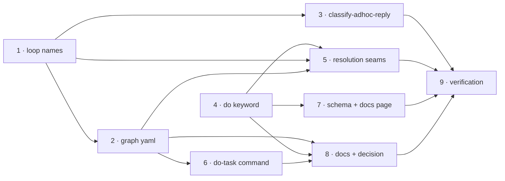

# Tasks: ad-hoc tasks that run no PDLC process

> The last spec artifact (requirements → design → testing plan → tasks). A DAG of
> implementation tasks derived from the approved design and testing plan.

## Task list

- [x] 1. Name the fourth loop and localize loop resolution
  - `cli/the_loop/graph/model.py`: add `PDLC_ADHOC_LOOP`, extend `SHIPPED_LOOPS`, add
    `OUTER_PATH_LOOPS`, `LOOP_FOR_CONTROL_COMMAND` and `resolve_outer_loop`; export them.
  - _Depends on:_ none
  - _Requirements:_ R1.1, R2.3, R2.4
  - _Test:_ `T1 — pytest tests/test_graph_adhoc.py -k "resolve_outer_loop or control_command"` (red→green)

- [x] 2. Ship `pdlc-adhoc-loop.yaml`
  - Three walkable nodes (`work`, `review`, `complete`) plus terminal `cleanup` and
    `escalated`; no `produces`, no `validate-artifacts`, no `skipSets`, no
    `required`/`skippable`; `command: do-task` on every node that renders a resume hint.
  - _Depends on:_ 1
  - _Requirements:_ R1.1–R1.6
  - _Test:_ `T1 — pytest tests/test_graph_adhoc.py -k "compiles or gates_nothing or no_selection"` (red→green)

- [x] 3. Add the `classify-adhoc-reply` hook
  - New `cli/the_loop/graph/hooks/adhoc.py`, registered from `hooks/__init__.py`; reuses
    `feedback._authorized_comments`; newest authorized comment decides; outcomes `done`
    and `more-work`; `waiting` when nothing authorized has arrived.
  - Security-relevant (trust boundary 2, `design.md` §Security design): the negative
    tests are the unauthorized-reply and self-authored-"done" cases.
  - _Depends on:_ 1
  - _Requirements:_ R3.1–R3.4
  - _Test:_ `T1/T8 — pytest tests/test_graph_adhoc.py -k "reply or self_authored or unauthorized"` (red→green)

- [x] 4. Add the `do` control keyword
  - `cli/the_loop/control.py`: `DO`, `COMMANDS`, `_ARMING_COMMANDS`, `SPAWN_COMMANDS`,
    `DEFAULT_KEYWORDS`; no parser change.
  - Security-relevant (trust boundary 1): the negative tests are the unauthorized-arming
    and two-keyword-refusal cases, plus `the-loop done` not matching.
  - _Depends on:_ none
  - _Requirements:_ R2.1, R2.2
  - _Test:_ `T1/T8 — pytest tests/test_graph_adhoc.py -k "keyword or whole_token or refused"` (red→green)

- [x] 5. Route the new loop through the four resolution seams
  - `graph/bootstrap.py` (`OUTER_PATH_LOOPS` membership), `graphlink.py`
    (`_outer_loop_name`, and the ad-hoc `iterate on:` line in `render_graph_context`),
    `core/graphs.py` (`_recorded_loop`).
  - _Depends on:_ 1, 2, 4
  - _Requirements:_ R2.3–R2.5, R4.2, R5.2
  - _Test:_ `T1/T10 — pytest tests/test_graph_adhoc.py tests/test_graph_contribution.py tests/test_graphlink.py tests/test_core_graphs.py` (red→green)

- [x] 6. Ship `/the-loop:do-task`
  - `commands/do-task.md`, modelled on `contribute-to.md`; states what the loop omits and
    forbids authoring a spec chain.
  - _Depends on:_ 2
  - _Requirements:_ R4.1, R4.3
  - _Test:_ T1 — `pytest tests/test_graph_adhoc.py -k command` asserts every node's
    `command:` names `do-task`

- [x] 7. Config surface: schema, template, docs page
  - `.the-loop/cli-config.schema.json` → copied byte-identically to
    `cli/the_loop/schemas/cli-config.schema.json`; `skills/the-loop/templates/cli-config.yaml`;
    `docs/config/cli/routing-options.md`.
  - _Depends on:_ 4
  - _Requirements:_ R2.1
  - _Test:_ `T1 — pytest tests/test_config_schema_parity.py tests/test_docs_parity.py`

- [x] 8. Documentation and the decision record
  - `skills/the-loop/SKILL.md`, `skills/the-loop/reference/workflow.md`,
    `docs/capabilities/process-graph.md`, `docs/capabilities/webhook-triggers.md`,
    `docs/reference/commands.md`, `docs/decisions/decision-083.md` (+ the decisions index).
  - _Depends on:_ 2, 4, 6
  - _Requirements:_ R1, R2, R3, R4, R5
  - _Test:_ `T1 — pytest tests/test_docs_parity.py`

- [x] 9. Verification
  - Execute `testing-plan.md`; record results and commit redacted evidence under
    `docs/specs/issue-225/evidence/`.
  - _Depends on:_ 1–8
  - _Requirements:_ all
  - _Test:_ `T1, T2, T3, T8, T10`

## Dependency graph (DAG)

## Checkpoints

After tasks 2, 5 and 8: run `uv run --project cli pytest` and append an execution-log
entry. After task 9 the verification results and evidence are committed, then the review
phases run.

## Review comments
