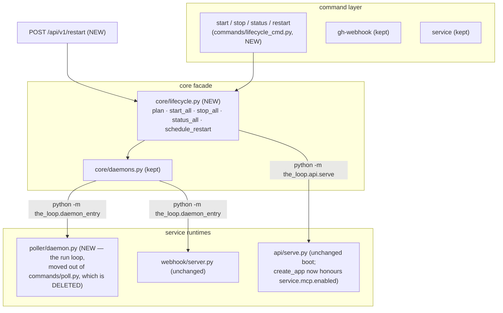

# Design: one `the-loop start` for every service the config enables

> Derived from the (draft) [`requirements.md`](requirements.md). Decision record:
> [decision-084](../../decisions/decision-084.md).

## The shape of the change

Nothing about *how* the poller polls, the receiver receives or the service serves
changes. What changes is who composes them:

## D1 — the `enabled` flags and their defaults

Four new boolean keys, all additive (no migration, NFR/R5.3):

| Key | Default | Why this default |
|-----|---------|------------------|
| `service.enabled` | `true` | The service is the CLI's only execution path for core capabilities (decision-058); defaulting it off would break every routed command on upgrade. |
| `service.mcp.enabled` | `true` | `/mcp` has been unconditionally mounted since issue-161; the flag adds the ability to *narrow*, not a new behaviour to opt into. |
| `webhooks.ghWebhook.enabled` | `false` | A receiver needs a reachable bind, a secret and GitHub-side configuration; starting one because a config *block* exists would turn "I once looked at webhooks" into an open port. Explicit opt-in. |
| `polling.enabled` | `false` | Same argument as the receiver: `polling.sources` describes *how* to poll, not *that* polling is wanted on this host. Inferring "enabled" from a non-empty list is the one-question-two-answers trap issue-123 taught; `start` names the key when it skips, so discovery costs one run. |

Existing single-service commands are unaffected by the flags: `the-loop service start`
and `the-loop gh-webhook start` are explicit acts and keep working regardless of
`enabled` (an operator typing the granular verb *is* the enablement). The one
deliberate coupling is R5.2: `client.ensure_service` refuses to **auto**-start a
service whose `enabled` is false — implicit resurrection is what fail-closed forbids —
while `the-loop service start` still obeys the operator's explicit word.

## D2 — the poller run loop moves; the poll command dies

`commands/poll.py` is deleted. Its three concerns land in two places:

- **The run loop** (`_start`/`_run_poller`, minus the double-fork) becomes
  `the_loop/poller/daemon.py`: `default_options()` (the config-derived defaults the old
  parser computed), `run(options) -> int` (lock, dependency checks, heartbeat, hot
  reload — verbatim), `status_report(...)`/`render_status(...)` (for `the-loop status`),
  and `stop(...)` (for `the-loop stop`). Messages that named `the-loop poll stop` now
  name `the-loop stop`.
- **The entry point**: `the_loop.daemon_entry poller` calls `poller.daemon` directly
  instead of re-parsing a command parser, and gains `--once` — the cron/systemd
  foreground form the removed `poll start --once` provided (R2.3). `gh-webhook` keeps
  its parser-derived path (its command survives).

**`daemonize()` (the issue-191 double-fork) is removed with the command.** It existed
solely for `poll start --daemon`; every remaining detached start is a
`Popen(start_new_session=True)` with the logfile on fds 1/2 — same detachment outcome,
one mechanism instead of two. `open_logfile` survives (core.daemons uses it). What the
ready-handshake used to prove — "the daemon actually came up" — `start` proves instead
by waiting briefly for the daemon's pidfile lock to be held (D3).

## D3 — `core/lifecycle.py`, the one composition point

All four verbs are pure composition over what exists:

- `plan(config)` — resolve the four `enabled` flags plus per-service facts (poller with
  no `polling.sources` is reported as *misconfigured* at plan time, rather than a spawn
  whose failure lands only in a logfile).
- `start_all(config)` — in order **service → gh-webhook → poller** (the service first,
  so anything the daemons spawn can reach it): service via the existing spawn +
  `/health` wait (the `service_cmd` logic, moved here so command and API share it);
  daemons via `core.daemons.control_daemon(..., "start")`, then a short wait for the
  daemon's `RunLock` to be held — the honest-start property the removed handshake
  provided. Each service yields `{service, enabled, outcome, detail}` with outcome ∈
  `started | already-running | disabled | misconfigured | failed`.
- `stop_all(config)` — reverse order, ignoring `enabled` (R3.1), via
  `control_daemon(..., "stop")` and the service's SIGTERM + wait-until-free.
- `status_all(config)` — `core.daemons.daemon_status` for the two daemons, the service
  lock + `/health` probe, the MCP flag; plus `ok`: every enabled service running.
- `schedule_restart(config, with_upgrade)` — spawn, detached, the CLI itself:
  `[sys.executable, "-m", "the_loop", "restart"] (+ ["--with-upgrade"])`, stdout/stderr
  to `<state.root>/logs/restart.out`, and return `{"scheduled": True, "pid", "withUpgrade",
  "logfile"}`. Fixed argv, no shell, nothing caller-supplied (requirements §Security).

`commands/lifecycle_cmd.py` registers `start`, `stop`, `status` (`--format text|json`)
and `restart` (`--with-upgrade`), each a thin renderer over these functions. They are
**bootstrap commands** — the same decision-058 exception `service` already holds: the
process manager cannot route through the process it manages. `restart` runs
synchronously in the CLI: `stop_all` → (upgrade) → `start_all`.

## D4 — `--with-upgrade` reuses the issue-152 installer

Between stop and start, `restart --with-upgrade` builds and executes the existing
planner: `install.plan(components=["cli"], upgrade=True, ...)` — the same plan
`the-loop upgrade --component cli` renders, with the same argv-only execution and the
same table rendering. Scope is deliberately the CLI distribution only: the plugin
component edits harness settings files, which no service restart needs, and the
narrower plan keeps the API-triggered path (R4.4) from touching Claude's config.
A failed upgrade is reported and **does not abort the start half** (R4.3): the old
version restarts, and the failure is in the report and the event log. The upgraded
install lands in-place (same interpreter/venv, per `install.cli_method`), so the
processes `start_all` then spawns run the new code even though the restart process
itself still runs the old.

## D5 — the API route, and what is deliberately not exposed

`POST /api/v1/restart` (body `{"withUpgrade": bool}`, default false) calls
`schedule_restart` and answers immediately — the service cannot stop itself and still
answer (requirements §Introduction). The route is added to the OpenAPI contract
(`docs/api-specs/openapi/the-loop.v1.yaml`) and audited like every `/api/v1` operation.

**Not an MCP tool**, stated as policy next to the existing exclusions in `api/mcp.py`:
restarting tears down the transport the MCP client is talking over mid-call, and
`--with-upgrade` reaches the installer — an agent should not be able to replace the
code it is judged by. A client that legitimately needs it has the REST route.

`service.mcp.enabled: false` makes `create_app` skip building and mounting the MCP app
entirely (no route, `/mcp` → 404) and skip adopting its lifespan; `service_config`
carries the resolved flag.

## Error handling

- A CLI config that fails to load (unparseable / pre-migration): `start`/`restart`
  refuse with the loader's message — composing services against defaults the operator
  did not write is how a disabled webhook gets started.
- Per-service failure isolation (R1.4): each start/stop is try/except'd into its report
  row; one failed service never hides the others' outcomes.
- `status` degrades like `poll status` did: an absent heartbeat loses the progress
  lines, never the liveness answer (the lock is the truth).

## Touched files

Code: `commands/lifecycle_cmd.py` (new), `core/lifecycle.py` (new),
`poller/daemon.py` (new), `commands/poll.py` (deleted), `commands/__init__.py`,
`cli.py` (`_refresh_cli_config_paths` loses the poll import), `daemon_entry.py`,
`daemonize.py` (shrinks to `open_logfile`), `core/daemons.py` (unchanged API; reused),
`api/app.py` + `api/config.py` + `api/mcp.py` (mcp flag, restart route),
`client/__init__.py` (R5.2), both `cli-config.schema.json` copies,
`skills/the-loop/templates/cli-config.yaml`. On owner review (PR #229):
`commands/gh_webhook.py` and `commands/service_cmd.py` deleted,
`webhook/daemon.py` added, and the dashboard (`ui/src`) gained the restart client
method, the Settings Service card and the config editor's "Restart now"
follow-through (R4.6).

Tests and docs: see [`testing-plan.md`](testing-plan.md) and the Documentation section
of the execution log.

## Minimalism check

No new dependency, no new process mechanism (one detach idiom instead of two — net
deletion of the double-fork), no new config block — four booleans in existing blocks.
The one genuinely new runtime behaviour is the restart endpoint; everything else is
composition of existing parts. Rejected alternatives: a `[Unit]`-style declarative
supervisor (YAGNI — three fixed services), folding `service`/`gh-webhook` commands away
(not asked; R5.1), inferring `polling.enabled` from `sources` (D1).
