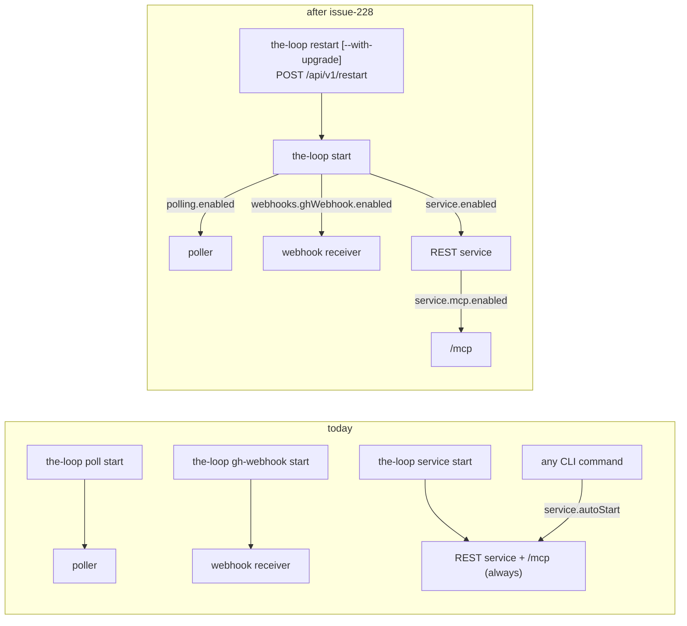

# Requirements: one `the-loop start` for every service the config enables

> Phase 1 of 3 (requirements → design → tasks). Following the Kiro spec approach
> (<https://kiro.dev/docs/specs/>). This phase MUST be reviewed and approved by the
> required collaborators before moving to design.

## Introduction

the-loop began as a poller. The commands still say so: the way an operator brings the
system up today is `the-loop poll start`, and everything that has grown since — the
GitHub webhook receiver, the control-plane REST service, the MCP layer mounted on it —
starts either from its own sibling command (`gh-webhook start`, `service start`) or
implicitly, when any CLI command auto-starts a service it finds unreachable
(`service.autoStart`). [#228](https://github.com/MadaraUchiha-314/the-loop/issues/228)
names the consequence: the entry point describes the 2026-June system, not the current
one, and "start the-loop" is four different commands whose composition lives in the
operator's head.

The ticket asks for four things, quoted here so scope is checkable:

1. a dedicated `the-loop start` that "look[s] at the cli-config and start[s] the
   appropriate services needed" — poller if enabled, webhook if enabled, REST service if
   enabled, MCP endpoints exposed from the service if enabled;
2. removal of "all the poll related commands";
3. `the-loop restart`, as "a command an[d] an API";
4. `the-loop restart --with-upgrade`.

Three facts about the existing system shape the requirements:

1. **There is no `enabled` anywhere in the CLI config.** `polling`, `webhooks.ghWebhook`
   and `service` configure *how* each service runs, never *whether* it should. The
   "appropriate services needed" the ticket wants `start` to read do not exist as
   config yet, so this work item adds them — per-service `enabled` flags — and their
   defaults are decisions to argue, not to assume (see `design.md`).
2. **The poller's run loop lives inside its command.** `commands/poll.py` is both the
   argparse surface being removed *and* the only implementation of "run the poller":
   `the_loop.daemon_entry` (what the control plane spawns) works by re-parsing that
   command's own parser. Removing the command without first moving the run loop would
   remove the poller itself, which the ticket does not ask for.
3. **A service cannot synchronously restart itself over its own API.** The REST `restart`
   the ticket asks for is served by the very process a restart must stop, so the API's
   contract has to be "restart scheduled", with the work done by a detached process that
   outlives the service.

## Requirements

### R1 — `the-loop start` starts every enabled service

**User story:** As an operator, I want one command that brings up exactly the services my
config enables, so that starting the-loop does not require knowing its process anatomy.

Acceptance criteria (EARS):

- R1.1 WHEN `the-loop start` runs THEN the system SHALL read the CLI config (the
  standard resolution order: `--config`, `$THE_LOOP_CLI_CONFIG`,
  `./.the-loop/cli-config.yaml`, `~/.the-loop/cli-config.yaml`) and start, detached,
  each service whose `enabled` flag resolves true: the control-plane service
  (`service.enabled`), the webhook receiver (`webhooks.ghWebhook.enabled`), and the
  poller (`polling.enabled`).
- R1.2 WHEN a service is disabled THEN `start` SHALL say so, naming the config key that
  enables it, and SHALL NOT start it.
- R1.3 WHEN a service is already running THEN `start` SHALL report it as already running
  and leave it untouched (idempotent start, the issue-159 discipline).
- R1.4 WHEN an enabled service fails to come up THEN `start` SHALL report the failure
  per service, still attempt the others, and exit non-zero.
- R1.5 WHEN every enabled service is up THEN `start` SHALL exit 0, having printed one
  line per service with its outcome (started | already running | disabled | failed).
- R1.6 WHEN `service.mcp.enabled` is false THEN the control-plane service SHALL NOT
  mount the MCP endpoint (`/mcp` answers 404); WHEN it is true (the default) THEN the
  MCP endpoints SHALL be exposed from the service exactly as today.

### R2 — the poll commands are removed; the poller is not

**User story:** As an operator, I want the command surface to match the system's shape,
so that the poller is one ingress among several rather than the front door.

- R2.1 WHEN `the-loop poll …` is invoked THEN the CLI SHALL reject it as an unknown
  command (the `poll` command and all its actions are removed).
- R2.2 WHEN the control plane (or `the-loop start`) starts the poller THEN the same run
  loop that `poll start` ran SHALL run — lock acquisition, dependency checks, heartbeat,
  hot reload — relocated out of the command layer, not reimplemented.
- R2.3 WHEN an operator needs the foreground/cron form (`--once`) THEN
  `python -m the_loop.daemon_entry poller [--once]` SHALL provide it, and the docs SHALL
  say so where they used to say `poll start --once`.
- R2.4 WHEN the poller must be stopped or its liveness queried THEN `the-loop stop` /
  `the-loop status` SHALL cover it (see R3), so no capability of `poll stop` /
  `poll status` is lost with the command.

### R3 — `the-loop stop` and `the-loop status` complete the lifecycle surface

**User story:** As an operator, I want the inverse and the probe of `start` from the same
vocabulary, so that `restart` composes from parts I can also run myself.

- R3.1 WHEN `the-loop stop` runs THEN the system SHALL stop, idempotently, every
  the-loop service that is running (poller, webhook receiver, control-plane service),
  regardless of `enabled` flags — a service disabled *after* it was started must still
  be stoppable.
- R3.2 WHEN `the-loop status` runs THEN the system SHALL report, per service: enabled or
  not, running or not, pid, and — for the poller — heartbeat facts (started, last
  cycle); and for MCP whether it is exposed.
- R3.3 WHEN every enabled service is running THEN `status` SHALL exit 0; otherwise
  non-zero — so `the-loop status` is scriptable as a health check.
- R3.4 WHEN `--format json` is passed to `status` THEN the report SHALL be a JSON
  document with the same facts.

### R4 — `the-loop restart`, as a command and as an API

**User story:** As an operator (or a dashboard), I want to bounce the whole system —
optionally onto a new version — with one verb.

- R4.1 WHEN `the-loop restart` runs THEN the system SHALL stop every running service
  (R3.1), then start every enabled one (R1), and report both halves.
- R4.2 WHEN `the-loop restart --with-upgrade` runs THEN the system SHALL, between stop
  and start, upgrade the-loop's own CLI using the existing installer planner
  (`the_loop.install`, issue-152 — the plan/execute machinery `the-loop upgrade`
  already uses), and SHALL report the upgrade steps with the same rendering.
- R4.3 WHEN the upgrade step fails THEN `restart` SHALL still start the (un-upgraded)
  enabled services — a failed upgrade must not leave the system down — and exit
  non-zero.
- R4.4 WHEN `POST /api/v1/restart` is called (body: `{"withUpgrade": bool}`) THEN the
  service SHALL spawn a detached restart process and answer immediately with
  `{"scheduled": true, "pid": <int>, "withUpgrade": <bool>}` — it cannot restart itself
  synchronously and stay able to answer.
- R4.5 WHEN the detached restart runs THEN its output SHALL go to a logfile under the
  state root (`logs/restart.out`), and the event log SHALL record the restart request
  and completion.
- R4.6 *(added on owner review, PR #229: "do it")* WHEN an operator uses the
  dashboard THEN it SHALL offer the restart: a Service card on the Settings tab
  calling `POST /api/v1/restart` (with the upgrade as an option), and a "Restart now"
  follow-through when a config save reports `restartRequired` keys. The UI SHALL
  present the response as a *schedule* — the service drops and comes back — never as
  a completed restart.

### R5 — existing surfaces keep working

- R5.1 ~~WHEN `the-loop gh-webhook …` or `the-loop service …` is invoked THEN they
  SHALL behave as before~~ **Superseded on owner review** (PR #229: *"Why is there a
  need for this? It should all fold into `the-loop start`"*): the `gh-webhook` and
  `service` commands SHALL be removed too. The receiver's run loop moves to
  `the_loop.webhook.daemon` exactly as the poller's did (R2.2 applies to it verbatim),
  `python -m the_loop.daemon_entry gh-webhook` is its foreground form, and the
  lifecycle surface is the only operator surface.
- R5.2 WHEN a CLI command needs the service and `service.enabled` is true THEN
  `service.autoStart` SHALL keep its existing meaning; WHEN `service.enabled` is false
  THEN auto-start SHALL refuse (fail closed) with a message naming the key — a service
  the operator disabled must not resurrect implicitly.
- R5.3 WHEN an existing config (no `enabled` keys anywhere) is read THEN behaviour SHALL
  be: service and MCP enabled, webhook and poller disabled — defaults argued in
  `design.md`. No config migration is required (keys are added, none removed).

### R6 — single-process mode (added on owner review round 2, issue-231)

**User story:** As an operator, I want `the-loop start` to give me **one process** —
the service hosting the enabled ingresses — so that all functionality survives the
poll-command removal without my machine sprouting a process per feature.

*(Added when the owner flagged that merging as-was would regress the "everything in
one place" experience and filed
[issue-231](https://github.com/MadaraUchiha-314/the-loop/issues/231): implement it
in PR #229 "so that all functionality will remain".)*

- R6.1 WHEN `service.hostIngresses` is true (the **default**) and the service is
  enabled THEN `start` SHALL run each enabled ingress (poller per `polling.enabled`,
  receiver per `webhooks.ghWebhook.enabled`) as a background thread inside the
  service process — one pid, one logfile — instead of spawning it.
- R6.2 WHILE hosted, each ingress SHALL hold its own pidfile flock, under the
  service's pid, so the single-instance guarantee, `the-loop status`/`stop` and the
  daemons API keep answering from the lock unchanged. Hosted-ness SHALL be
  *detected* (lock holder pid equals the service's pid), never recorded in a file.
- R6.3 WHEN an ingress's lock is already held by another process THEN the service
  SHALL skip hosting it with a warning — never fight a standalone daemon for its
  lock — and `start` SHALL report that ingress as already running (standalone).
- R6.4 WHEN a hosted ingress cannot start (an enabled poller with no sources, a
  port that will not bind) THEN the service SHALL keep serving — hosting failures
  are logged, never fatal to the API.
- R6.5 WHEN `the-loop stop` finds an ingress hosted in the service THEN it SHALL
  stop the service process and report the hosted rows stopped only once their locks
  are actually released.
- R6.6 WHEN `service.hostIngresses` is false, or `service.enabled` is false, THEN
  the ingresses SHALL start standalone exactly as R1 describes (one process per
  enabled service); the flag SHALL be documented as restart-required.

## Non-functional requirements

- NFR1 **One startup sequence per service.** `start`, the control plane's daemon spawn
  and the cron/systemd entry MUST converge on the same run code for each service, as
  `daemon_entry` already guarantees for the poller and receiver.
- NFR2 **Stdlib-only CLI paths.** The lifecycle commands MUST NOT add dependencies; the
  service side keeps its existing FastAPI stack.
- NFR3 **Docs parity holds.** The docs-parity suite (issue-117) MUST pass: removed
  command page deleted, new command pages added, new schema keys documented.
- NFR4 **Schema copies stay identical.** `.the-loop/cli-config.schema.json` and
  `cli/the_loop/schemas/cli-config.schema.json` MUST remain byte-identical
  (test-enforced, issue-220).
- NFR5 **Conventional Commits, breaking change declared.** Removing `poll` is a breaking
  CLI change and the commit MUST say so (`!` / `BREAKING CHANGE:`).

## Security considerations

Threat-model-lite for the new surface. The untrusted actors are the same as the control
plane's (issue-161): whoever can reach the service's bind, and whatever a browser page
may do cross-origin.

- **`POST /api/v1/restart` is process control over HTTP.** It inherits the service's
  posture: loopback-only by default, `service.exposed: true` + gateway for anything
  else, CORS allowlist unchanged (`POST` is already in the default allowed methods, but
  the endpoint is same-origin/dashboard-only in practice). The body is a single boolean;
  no path, argv or config value crosses the trust boundary — the spawned process is a
  fixed argv (`[sys.executable, "-m", "the_loop", "restart", …]`), never a shell.
- **`--with-upgrade` executes an installer.** It reuses the issue-152 planner unchanged,
  inheriting its guards (validated marketplace repo, argv-only execution, no shell). The
  API can therefore cause "upgrade to latest published version" — but no caller-supplied
  version, URL or argv exists on the wire, so the API cannot direct *what* is installed.
- **MCP is now disableable.** `service.mcp.enabled: false` narrows attack surface for
  deployments that only want REST; the default (true) preserves current behaviour. The
  transport-security guards (DNS-rebinding allowlist) are unchanged when mounted.
- **Fail closed on disablement.** R5.2: `service.enabled: false` disables implicit
  auto-start too, so "I turned the service off" cannot be undone by an unrelated CLI
  invocation.
- **No new attack surface beyond the restart endpoint**, and that endpoint adds no
  parameterized execution: it triggers a fixed, already-possible local operation
  (an operator with loopback access could already run the CLI).

## Risk tier

**Tier 3** (`autonomy.defaultTier`; `inferFromChange` finds `sensitivePaths` hits — both
CLI-config schema copies are edited — but the change stays an internal re-architecture
with one new, guarded API route). Tier 3 ⇒ human approves the PR; below
`security.review.humanSignOffMinTier` (4) ⇒ no separate named security sign-off.
