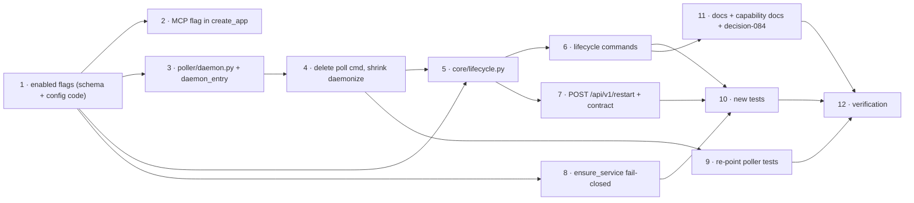

# Tasks: one `the-loop start` for every service the config enables

> Phase 3 of 3. A DAG, not a list. Each `_Test:_` names a row of
> [`testing-plan.md`](testing-plan.md).

## Tasks

- [x] **1. The `enabled` flags.** Add `service.enabled`, `service.mcp.enabled`,
  `webhooks.ghWebhook.enabled`, `polling.enabled` to both schema copies (byte-identical)
  and to `skills/the-loop/templates/cli-config.yaml`; resolve them in
  `api/config.service_config` and wherever the daemon blocks are read.
  _Requirements: R1.1, R5.3, NFR4_ · _Test: T6_
- [x] **2. MCP is mountable-off.** `create_app` skips building/mounting the MCP app and
  its lifespan when `service.mcp.enabled` is false; `/mcp` answers 404.
  _Requirements: R1.6_ · _Test: T4_
- [x] **3. The poller run loop moves.** New `poller/daemon.py` (options from config, run,
  status, stop — logic from `commands/poll.py`, messages renamed to `the-loop stop`/
  `status`); `daemon_entry poller [--once]` drives it directly.
  _Requirements: R2.2, R2.3, NFR1_ · _Test: T3_
- [x] **4. Remove the poll command.** Delete `commands/poll.py` and its registration;
  `cli.py`'s `_refresh_cli_config_paths` drops the import; `daemonize.py` shrinks to
  `open_logfile` (the double-fork existed for `poll start --daemon` only).
  _Requirements: R2.1_ · _Test: T3, T12_
- [x] **5. `core/lifecycle.py`.** `plan`, `start_all`, `stop_all`, `status_all`,
  `schedule_restart` as designed (D3); service spawn/health logic moved here from
  `service_cmd`, which now delegates.
  _Requirements: R1.1–R1.5, R3.1–R3.4, R4.4, R4.5_ · _Test: T1_
- [x] **6. The lifecycle commands.** `commands/lifecycle_cmd.py`: `start`, `stop`,
  `status --format`, `restart --with-upgrade` (planner from issue-152, `components=["cli"]`,
  upgrade failure does not abort the start half).
  _Requirements: R1, R3, R4.1–R4.3_ · _Test: T2_
- [x] **7. The restart API.** `POST /api/v1/restart` → `schedule_restart`; add the route
  to `docs/api-specs/openapi/the-loop.v1.yaml`; state the MCP exclusion in `api/mcp.py`.
  _Requirements: R4.4, R4.5_ · _Test: T4, T5_
- [x] **8. Fail-closed auto-start.** `client.ensure_service` refuses when
  `service.enabled` is false, naming the key.
  _Requirements: R5.2_ · _Test: T1_
- [x] **9. Re-point the poller tests.** The scenarios of `test_poll_command`,
  `test_poll_daemon_integration`, `test_poll_status` (and any other `poll start` driver)
  keep their Gherkin and assert via the new entry points; runlock/tmux/interaction tests
  updated where they shelled `the-loop poll`.
  _Requirements: R2.2, R2.4_ · _Test: T3_
- [x] **10. New tests.** `test_core_lifecycle.py`, `test_lifecycle_cmd.py`, restart-API
  and MCP-flag cases in the existing integration suites; contract parity.
  _Requirements: all_ · _Test: T1, T2, T4, T5_
- [x] **11. Docs.** Command pages (delete `poll.md`; add `start.md`, `stop.md`,
  `status.md`, `restart.md`; update `index.md`, `service.md`, `gh-webhook.md`), config
  option pages (`polling`, `webhook`, `service`), getting-started / installation /
  state, README + cli/README, capability docs (`cli.md`, `control-plane.md`,
  `webhook-triggers.md`, `interactive-sessions.md`), `reference/observability.md` +
  `reference/automation.md`, decision-084 + index row.
  _Requirements: NFR3_ · _Test: T6, T9(docs), T12_
- [x] **12. Verification.** Execute the plan, fill its Results column, commit evidence.
  _Requirements: all_ · _Test: T7–T12_

### Added on owner review (PR #229)

- [x] **13. Fold `gh-webhook` and `service` away.** Receiver run loop →
  `webhook/daemon.py`; both command modules deleted; `daemon_entry` drives both
  daemons directly; hints, docs (pages relocated to `/cli/service` and
  `/cli/receiver`), capability docs and tests re-pointed.
  _Requirements: R5.1 (superseded form)_ · _Test: T3, T7, T13_
- [x] **14. Dashboard restart.** `restart()` on the API client (live + demo), the
  Settings Service card, the config editor's "Restart now" on `restartRequired`;
  UI tests, lint, typecheck, build.
  _Requirements: R4.6_ · _Test: T13_
