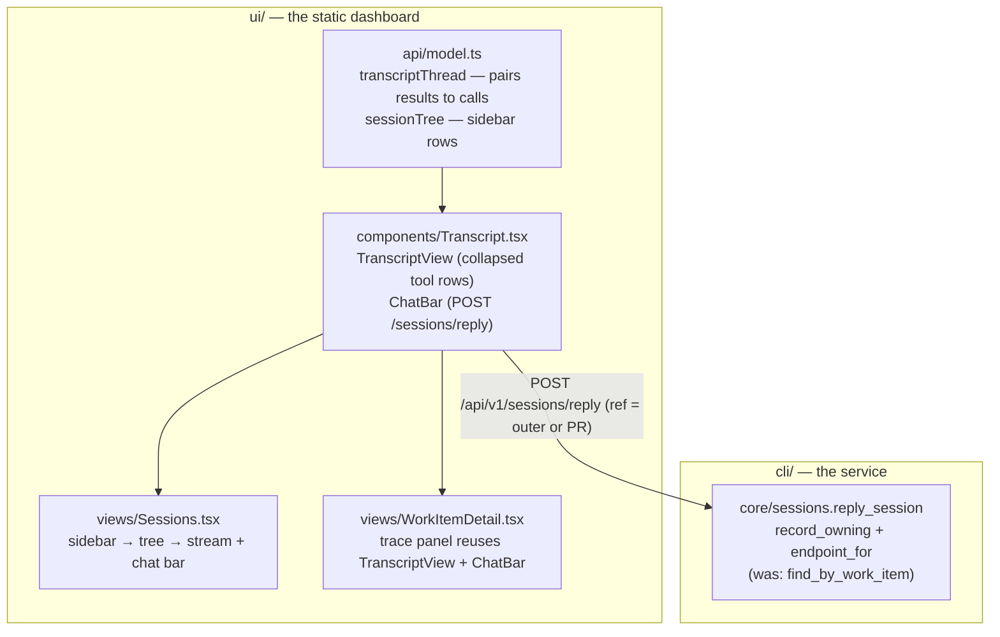
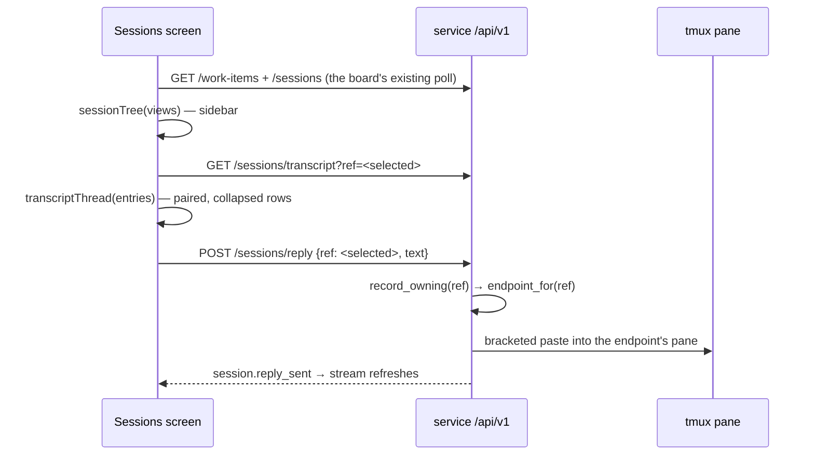

# Design: a readable session stream, a session tree, and a chat bar

> Phase 2 of 3. Derived from [`requirements.md`](requirements.md); reviewed together
> with [`testing-plan.md`](testing-plan.md).

## The shape of the change

One reworked projection, one shared stream component with a chat bar, one new screen,
and one narrowed-to-the-point service change on the reply route. Everything else —
routes, records, transports — already exists.



## 1. The projection: `transcriptThread`

`transcriptTurns` becomes `transcriptThread` (same file, same tolerance rules), and the
row model grows what the renderer needs:

```ts
interface ToolCallView {
  id: string;        // tool_use id, "" when absent
  name: string;
  summary: string;   // one line: Bash → command, Read/Write/Edit → file_path, …
  input: string;     // pretty-printed input JSON for the expanded view
  result: string;    // the paired tool_result's text, "" until matched
  isError: boolean;  // the paired result's is_error
}

interface ThreadRow {
  kind: "user" | "assistant" | "tool result" | "meta" | "malformed";
  time: string;
  text: string;           // user/assistant text; result text for an unmatched result
  thinking: string;       // assistant thinking blocks, joined
  label: string;          // meta rows: what the entry was ("summary", "system", …)
  tools: ToolCallView[];
}
```

Projection rules, in order (NFR1 — tolerate everything, throw on nothing):

1. `malformed` lines → `malformed` row (unchanged, R1.5).
2. An entry whose `message.content` carries `tool_result` blocks is **folded into the
   pending tool calls**: each block's text (string `content`, or nested
   `{type:"text"}` blocks joined) attaches to the `ToolCallView` whose `id` equals the
   block's `tool_use_id` (R1.1). Blocks with no match — the tail cut off the call —
   become one `tool result` row with the text (R1.2). A matched entry emits **no row**:
   the harness feeding output back is not a turn.
3. Assistant entries collect `text` blocks (→ `text`), `thinking` blocks
   (→ `thinking`, R1.3) and `tool_use` blocks (→ `tools`, with the per-tool summary
   table for R2.1). Pending-call registry: `id → ToolCallView`, kept across rows so the
   next result entry can pair.
4. Anything else with no derivable text — `summary` entries, `system` entries, unknown
   shapes — becomes a `meta` row labelled with its `type` (and the summary text when
   present), never a blank (R1.4).

The tool-summary table lives beside the projection as data, not switch-statements in
the component: `Bash` → `input.command`, `Read`/`Write`/`Edit`/`NotebookEdit` →
`input.file_path`, `Grep`/`Glob` → `input.pattern`, `Task`/`Agent` →
`input.description`, `WebFetch`/`WebSearch` → `input.url ?? input.query`, otherwise
compact JSON truncated to one line. An unknown tool degrades to the fallback, so the
table can lag the harness without breaking anything.

## 2. The renderer: `components/Transcript.tsx`

Two exports, both markup-only over the projection:

- **`TranscriptView`** — the rows. User/assistant text renders expanded. Tool calls,
  thinking and meta rows render as `<details>` (NFR4): the `<summary>` is the collapsed
  line (tool name + summary, `error` tag when `isError`), the body is the full input
  and result in `<pre>` blocks. React escapes all of it (see Security).
- **`ChatBar`** — a textarea + send button posting `api.replySession(ref, text)`. Props
  carry the viewed ref and its session state; anything but `active` disables the bar
  with the reason (R4.4). On success it clears and calls `onSent` so the owner can
  refresh.

`WorkItemDetail`'s trace panel swaps its inline `TurnRow` for `TranscriptView` and
gains a `ChatBar` bound to the currently selected trace tab — which is already the
outer ref or a PR ref, so the detail page gets R4.1's behaviour for free.

## 3. The screen: `views/Sessions.tsx`

Route: `#/sessions` and `#/sessions/<encoded session ref>` (R3.5) — one segment, the
**selected session's** ref (`encodeURIComponent`-encoded, so the ref's own `/` and `#`
survive). The owning work item is derived, not stored: the sidebar expands whichever
work item's tree contains the selected ref.

The sidebar is `sessionTree(views)` in `model.ts` — pure, testable:

```ts
interface SessionTreeItem {
  view: WorkItemView;
  adhoc: boolean;              // graph.loop is pdlc-adhoc-loop | pdlc-contribution-loop
  outer: { ref, label, state };
  inner: { ref, label, state }[];  // one per PR endpoint; empty when adhoc
}
```

An ad-hoc or contribution item renders as a single selectable row (R3.3); everything
else renders the work item header, its outer session, and the PR sessions indented one
level (R3.2 — the tree is exactly two levels because the registry's nesting is: a PR
does not have pull requests). The main pane is `TranscriptView` + `ChatBar` for the
selected ref, with the event-trail fallback the trace panel already implements when the
transcript route refuses (R3.4). `Nav` gains a Sessions tab.

## 4. The service: reply reaches PR endpoints

`reply_session` currently resolves with `find_by_work_item` — the ref's own record by
path — so a PR ref 404s even though the registry knows exactly which pane serves it.
The fix is to resolve the way dispatch and the transcript route already do:

```python
record = registry.record_owning(work_item)        # own record, else the scan
if record is None: raise LookupError(...)          # unchanged refusal
if record.is_paused: raise ValueError(...)         # unchanged refusal
endpoint = record.endpoint_for(work_item)
if endpoint is None or not endpoint.is_live:
    endpoint = record                              # closed PR endpoint → the record's
if endpoint.is_paused: raise ValueError(...)       #   own session (session_for's rule)
result = TmuxRunner().deliver(endpoint, _framed_reply(...))
```

Every refusal `reply_session` had is kept (R4.3); the change is only *which live
endpoint* is addressed. The `session.reply_sent` event and the marked report comment
carry the ref that was asked for — a PR ref's report lands on the PR, which is where
that inner loop's paper trail lives. The OpenAPI description of the route is updated to
say a PR ref resolves to its endpoint; the contract's shapes are unchanged.

## Data flow



## Error handling

- Transcript 404 (no session, no file, Cursor, old service) → the labelled fallback to
  the event trail, unchanged from issue-209.
- Reply refusals map as today: `LookupError` → 404, `ValueError` → 400; the chat bar
  renders the server's `detail` string.
- The projection never throws; unknown shapes are `meta` rows (NFR1).

## Security design

The boundaries from the requirements, enforced:

- **Transcript text is data, not markup.** `TranscriptView` renders every projected
  string through JSX text nodes and `<pre>`; no `dangerouslySetInnerHTML` anywhere in
  the change.
- **Reply resolution cannot widen past the registry.** `record_owning`/`endpoint_for`
  are the same functions dispatch trusts; a crafted record can at most name a pane the
  operator's own registry already names, and a dead pane still refuses
  (`session_missing`), so nothing is spawned to receive a reply.
- **No new authorization surface.** The route, its body and its exposure guard are
  issue-208's; `actor` stays an audit claim.

## Minimalism

- No new dependency; disclosure is `<details>`, state is the existing hash route.
- One projection replaces one projection; the old `TurnRow`/`TraceEntry` markup that
  duplicated it in `WorkItemDetail` is deleted, not kept alongside.
- The sidebar join reuses `WorkItemView` — no second fetch path, no new state hook.
