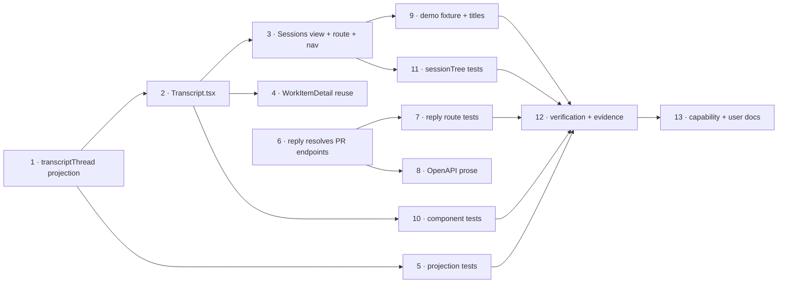

# Tasks: a readable session stream, a session tree, and a chat bar

> Phase 3 of 3. A DAG, not a list: tasks with the same dependencies can run in any
> order. Each `_Test:_` names a row of [`testing-plan.md`](testing-plan.md).

- [x] 1. **`transcriptThread` projection** — replace `transcriptTurns` in
  `ui/src/api/model.ts` with the paired, summarised row model from the design (R1, R2.1).
  _Test:_ T1.
- [x] 2. **`components/Transcript.tsx`** — `TranscriptView` (collapsed `
` tool
  rows, thinking, meta) and `ChatBar` (send / disabled-with-reason) (R2, R4.1, R4.4).
  _Test:_ T3.
- [x] 3. **Sessions view** — `views/Sessions.tsx`, `#/sessions[/<ref>]` route, Nav tab;
  sidebar from `sessionTree` (R3). _Test:_ T2, T8.
- [x] 4. **WorkItemDetail reuse** — trace panel renders `TranscriptView`; `ChatBar`
  bound to the selected trace tab; delete the superseded `TurnRow` markup. _Test:_ T3.
- [x] 5. **Projection tests** — pairing, orphans, thinking, meta, malformed, summaries
  (T1 rows) in `model.test.ts`. _Test:_ T1.
- [x] 6. **Reply resolves PR endpoints** — `reply_session` via
  `record_owning`/`endpoint_for` with the closed-endpoint fallback; refusals kept
  (R4.2, R4.3). _Test:_ T4.
- [x] 7. **Reply route tests** — PR-ref delivery, fallback, kept refusals in
  `cli/tests/test_ask_reply_integration.py`. _Test:_ T4.
- [x] 8. **OpenAPI prose** — `/sessions/reply` description says a PR ref resolves to its
  endpoint. _Test:_ T7.
- [x] 9. **Demo fixture** — transcript with ids + paired results + thinking + meta; an
  ad-hoc work item; titles (NFR3). _Test:_ T8.
- [x] 10. **Component tests** — `Transcript.test.tsx` for collapsed/expanded rows and
  chat-bar states. _Test:_ T3, T12.
- [x] 11. **`sessionTree` tests** — tree shape and ad-hoc flag in `model.test.ts`.
  _Test:_ T2.
- [x] 12. **Verification + evidence** — run the plan, fill its verification record,
  commit evidence. _Test:_ T5, T6, T14.
- [x] 13. **Capability + user docs** — `docs/capabilities/control-plane.md`,
  `ui/README.md`, execution log's Documentation section.
