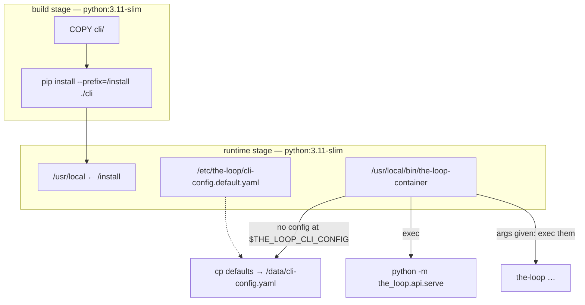
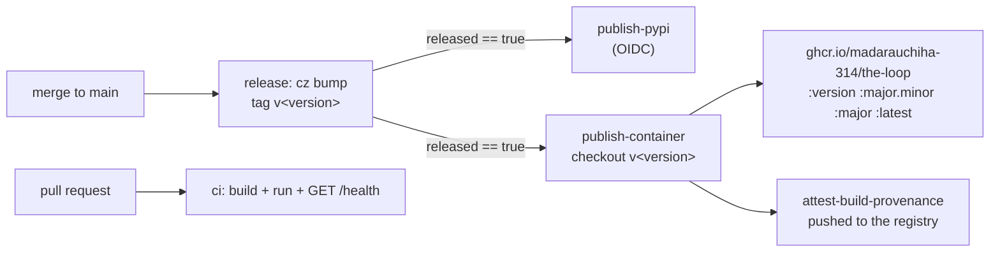

# Design: the-loop service as a container image on GHCR

## Overview

**Packaging only.** Not one line of `the_loop/` changes: the service already boots in the
foreground (`python -m the_loop.api.serve`), already creates the config file the dashboard
writes, and already resolves its config from `$THE_LOOP_CLI_CONFIG`. The image is a
two-stage `Containerfile` over `pip install ./cli`, a six-line entrypoint that seeds a
config file if there is none, and a release job that pushes the result to GHCR.

The one real decision is where the network boundary goes, and it is a *configuration*
answer rather than a code one — see [§ Security design](#security-design) and
[decision-102](../../decisions/decision-102.md).



## Architecture

Four files, and each one answers a question the other three do not:

| File | Question it answers |
|------|---------------------|
| `Containerfile` | What is in the image, and who runs it |
| `container/cli-config.default.yaml` | What "the default config" means **in a container** |
| `container/entrypoint.sh` | What happens on start — seed, warn, exec |
| `.github/workflows/release.yml` (new job) | When the image is built and where it is pushed |

`Containerfile`, not `Dockerfile`: `localOrchestration.containerRuntime` is `podman`,
which reads that name natively. Docker needs `-f Containerfile`, which the docs give.

### Why not a wheel from the release artifact

`release.yml` already builds a `dist/` the container job could install. Building the image
from **source** instead means one Containerfile serves both the PR-time validation build
(where no wheel exists) and the release build. The versions cannot drift: the release job
checks out the release tag, whose `cli/pyproject.toml` carries the bumped version, and
`/api/v1/health` reports the installed package's metadata — so the smoke test reads back
the version the image claims.

## Components & interfaces

### C1 — `Containerfile`

Two stages over `python:3.11-slim-bookworm` — the interpreter CI already runs, so the
image is not a third Python version nobody tests under.

- **build:** `COPY cli/`, then `pip install --no-cache-dir --prefix=/install ./cli`. Only
  the package directory is copied, so a docs or UI change never invalidates the layer.
- **runtime:** `COPY --from=build /install /usr/local`. No compiler, no `cli/` source,
  no `pip` cache, no harness binary (R5.3).
- **user:** `theloop`, uid 10001, owning `/data` (R5.1). A named volume inherits that
  ownership; a bind mount does not, which is why the docs give `--user "$(id -u)"` for it.
- `ENV THE_LOOP_CLI_CONFIG=/data/cli-config.yaml`, `WORKDIR /data`, `EXPOSE 4114`,
  `VOLUME /data`, and a `HEALTHCHECK` that reads `/api/v1/health` with the stdlib
  (`urllib`) rather than adding `curl` to the image.
- **Static OCI labels** for source, licence, title and description; the release job adds
  the version and revision labels from `docker/metadata-action`.

### C2 — `container/cli-config.default.yaml`

The whole of the container's opinion, and it is four keys:

```yaml
version: "0.6.0"        # the current config version, so the migration gate passes
state:
  root: /data/state     # R2.4 — state persists beside the config, in the volume
service:
  host: 0.0.0.0         # R1.3 — a loopback bind is unreachable through a published port
  exposed: true         # the guard in serve.py, cleared where the operator can see it
```

Everything else — the port, CORS, `hostIngresses`, the disabled receiver and poller, the
enabled MCP endpoint — is left **absent on purpose**, so the container inherits the
package's defaults and cannot drift from them (R5.2, R3.1). The file ships with the
comments explaining the two non-obvious lines, and `core.config`'s YAML splice preserves
them through every dashboard save.

It is a checked-in data file rather than a heredoc in the entrypoint precisely so it can
be *tested* against the packaged schema, the migration gate and the exposure guard —
which is what `cli/tests/test_container.py` does.

### C3 — `container/entrypoint.sh`

```sh
: "${THE_LOOP_CLI_CONFIG:=/data/cli-config.yaml}"
: "${THE_LOOP_CONTAINER_DEFAULT_CONFIG:=/etc/the-loop/cli-config.default.yaml}"
export THE_LOOP_CLI_CONFIG
[ -e "$THE_LOOP_CLI_CONFIG" ] || seed_it            # R2.1 / R2.2
warn_about_the_publish_flag                          # abuse case 1
[ "$#" -eq 0 ] && exec python -m the_loop.api.serve  # R1.1
exec "$@"                                            # R1.4
```

`exec` in both branches is what makes the service PID 1 and gives it the runtime's
`SIGTERM` directly (R1.2) — uvicorn's own handler then shuts the app down cleanly. The two
`:=` defaults are what make the script runnable outside a container, which is how the
integration tests drive it.

The banner is unconditional. A warning that fires only on the dangerous configuration
would have to *detect* the publish flag, and the container cannot see it — from inside,
`-p 127.0.0.1:4114:4114` and `-p 4114:4114` are the same bind.

### C4 — the release job, and the CI validation build



- **`publish-container`** sits beside `publish-pypi` — both `needs: release`, both gated on
  `released == 'true'` (R4.2), so a no-op release pushes neither. It checks out
  `refs/tags/v<version>` (R4.1), builds `linux/amd64,linux/arm64` through QEMU (R4.3),
  and pushes with `GITHUB_TOKEN` + `packages: write`. Nothing new is stored: GHCR takes
  the workflow's own token, as PyPI takes OIDC.
- **`actions/attest-build-provenance`** with `push-to-registry: true` (R4.4).
- **CI** gets a `container` job on the paths that can break the image, building it
  (single-arch, `load: true`), running it, and asserting `/api/v1/health` returns
  `"status": "ok"` and that the seeded config landed at `/data/cli-config.yaml` (R4.5).

## UI/UX design

N/A — no product UI. The dashboard is an unmodified client of the same service; the
container changes nothing it renders.

## Data models

No new persisted shape. `/data` holds two things the code already defines: the CLI config
(`cli-config.schema.json`) and the state root (`the_loop.state.StateLayout`).

```text
/data/
  cli-config.yaml        seeded once; the dashboard's writes land here
  state/
    portable/            work-item records
    local/               session handles
    logs/events.jsonl    the event log
```

## Error handling

| Failure | Behaviour | Why |
|---------|-----------|-----|
| `/data` not writable (bind mount owned by another uid) | `cp` fails, `set -e` exits non-zero, the runtime reports it | R1.5 — a container that "started" with no config would fail later and further from the cause |
| Config present but below `CURRENT_CONFIG_VERSION` | `serve.main` refuses via the migration gate; container exits 2 | abuse case 3 — the guard is the package's, unchanged |
| `service.host` non-loopback with `exposed: false` (operator edit) | `serve.main` refuses; container exits 2 | the exposure guard still means what it says |
| `allowOrigins: ["*"]` with `allowCredentials: true` | refused before the bind | unchanged |
| Port already published on the host | the runtime refuses the run; the image is not involved | — |

## Security design

**The threat the exposure guard was written for does not go away; the thing that answers
it does.** On a workstation the answer is `service.host`. In a container the answer is the
publish flag, because a loopback bind inside a network namespace is reachable by nothing
at all — so `host: 0.0.0.0` is not a relaxation, it is the only value that yields a
service, and `exposed: true` is the honest way to say so.

Three properties keep that defensible:

1. **It is written in a file, not compiled in.** No env var and no branch in `serve.py`
   clears the guard; the container simply ships a config that sets it. An operator can
   read it (`docker exec … cat /data/cli-config.yaml`), the dashboard shows it in
   Settings, and either can change it.
2. **Every start says what the boundary now is.** The banner names
   `-p 127.0.0.1:4114:4114` and says an exposed deployment needs the auth-terminating
   gateway PR #162 assumed.
3. **Nothing else is widened.** CORS keeps the shipped allowlist; the ingresses stay off;
   the container runs unprivileged; no credential is baked in.

Recorded as [decision-102](../../decisions/decision-102.md) because it re-sites a
security boundary that a previous decision (059, 077) placed elsewhere.

| Boundary | Enforced by | Negative test |
|----------|-------------|---------------|
| Who may connect | the operator's publish flag; the image warns, every start | T8 — the banner is asserted on every start, seeded or not |
| A config the service must not run on | `serve.main`'s guards, untouched | T8 — a downgraded/`"*"`+credentials config still refuses |
| Which browser origin may read | `service.cors`, absent from the seed → shipped default | T1 — the seed adds no `cors` key |
| What runs on start | `service.hostIngresses` over an empty `webhooks`/`polling` | T1 — the seed enables no ingress |
| The operator's file | `[ -e ]` before the copy | T2 — an existing config is byte-identical after a start |

## Testing strategy

Three layers, all runnable without a container runtime except the last:

- **T1 (unit, `cli/tests/test_container.py`)** — the seeded YAML is loaded and put through
  the *real* code that will judge it: `configschema` validation, `assert_current`,
  `service_config` + `is_loopback` (the exposure guard's own predicate), `cors_config`,
  `layout_from_config`. A container default that the service would refuse fails the build.
- **T2 (integration, `cli/tests/test_container_integration.py`)** — the entrypoint script
  is executed with `sh` against a temp directory, with Gherkin docstrings: seeds when
  absent, never overwrites, execs a given command, warns every time.
- **T3 (CI job)** — the image is built and run for real; `/api/v1/health` and the seeded
  path are asserted. This is the only layer that needs a runtime, which is why it lives in
  CI rather than in `pytest`.

## Trade-offs & decisions

| Choice | Alternative | Why not the alternative |
|--------|-------------|-------------------------|
| Ship `service.exposed: true` in the seed | Require an env var / `--exposed` opt-in on first run | "Download it and start it" (the issue's first line) would fail out of the box with an error about a guard the operator cannot have understood yet. The banner + docs carry the warning instead |
| Bind `0.0.0.0` in the container | Document `--network host` | Linux-only, and it hands the container the host's whole network stack — a strictly larger grant than one published port |
| Config as a checked-in data file, seeded by `cp` | Heredoc in the entrypoint; or generate it in Python | A file can be validated by the test suite against the real schema; a heredoc cannot without re-parsing shell |
| Install from source in the image | Install `the-loopy-one==<version>` from PyPI | Adds a release-ordering dependency (the image would wait for PyPI to serve the new version) and makes the PR-time validation build test a *different* artifact |
| One image, control plane only | An image that can also spawn sessions | Needs the harness binary, tmux, git and credentials — a different threat model, and out of scope |
| Push on release only | Push `main` on every merge (`:edge`) | A tag nobody asked for, published from unreleased code. Cheap to add later if an `:edge` is ever wanted |
| `python:3.11-slim` | `alpine` (smaller) | musl means no manylinux wheels: `pydantic-core` compiles from source, adding a Rust toolchain to the build and drift from the interpreter CI tests under |

## Open questions

1. The GHCR package's visibility is a one-time owner action after the first push
   (requirements § Open questions). Until then `docker pull` needs a login.

## Review comments
