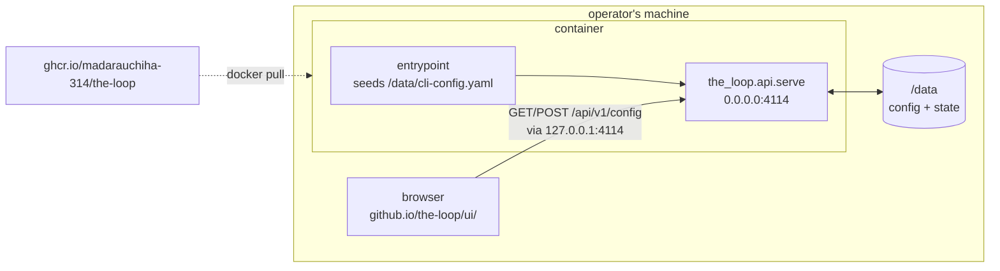

# Requirements: the-loop service as a container image on GHCR

## Introduction

[Issue #236](https://github.com/MadaraUchiha-314/the-loop/issues/236) asks for one
artifact the-loop does not ship today: a **container image** that starts the
control-plane service with a working default config, so somebody evaluating the-loop can
run it without a Python install, a config file, or a checkout — and then drive the rest
from the [control-plane dashboard](https://madarauchiha-314.github.io/the-loop/ui/).

Everything that image needs already exists. `pip install the-loopy-one` resolves the whole
service (no extras, PR #162), `python -m the_loop.api.serve` is the foreground boot
`the-loop start` spawns, an absent CLI config degrades to built-in defaults, and
`POST /api/v1/config` creates the file the dashboard's Settings editor writes. What is
missing is the packaging around them, and one property those pieces were designed
*against*: **the service binds loopback and refuses anything else** — inside a container,
that is a service nothing can reach.

So this work item is three things: an image, the container-shaped default config that
makes the service reachable through a published port, and the release job that pushes the
image to GHCR beside the PyPI publish.

## Requirements

### Requirement 1 — one command, a running service

**User story:** As an operator evaluating the-loop, I want to pull an image and run it,
so that I get a control-plane service without installing Python, writing a config, or
cloning anything.

#### Acceptance criteria (EARS)

1. WHEN the image is run with no arguments and no pre-existing configuration THEN the
   container SHALL start the control-plane service in the **foreground** as PID 1 and
   SHALL answer `GET /api/v1/health` with `{"status": "ok", "version": …}`.
2. WHEN the container receives `SIGTERM` THEN the service SHALL shut down and the
   container SHALL exit rather than be killed on the runtime's timeout.
3. WHERE the operator publishes the container's port to a host address
   (`-p 127.0.0.1:4114:4114`) THEN the service SHALL be reachable at that address —
   the in-container bind SHALL NOT be loopback-only.
4. WHEN the image is run with a command (`… the-loop --version`) THEN the entrypoint
   SHALL execute that command instead of the service, so the image doubles as the CLI.
5. WHEN the service fails to start THEN the container SHALL exit non-zero with the
   reason on stderr, never idle in a healthy-looking state.

### Requirement 2 — a default config that is a real file, seeded once

**User story:** As that operator, I want the container to start with the default config
and keep whatever I change, so that the dashboard's Settings editor is the way I
configure it — not a rebuild.

#### Acceptance criteria (EARS)

1. WHEN the container starts and no CLI config exists at the configured path THEN the
   entrypoint SHALL copy the image's container defaults there and SHALL say so on stderr.
2. IF a CLI config already exists at that path THEN the entrypoint SHALL leave it
   **byte-identical** — an operator's edits, and the dashboard's writes, survive every
   restart and every image upgrade.
3. The seeded config SHALL validate against the packaged `cli-config.schema.json` and
   SHALL carry the current config `version`, so `POST /api/v1/config` writes through the
   migration gate instead of refusing the file the image itself wrote.
4. The seeded config SHALL place `state.root` inside the container's data volume, so the
   event log, the work-item records and the session handles persist with the config
   rather than in the image's writable layer.
5. WHERE the operator supplies their own config — a bind-mounted file, or
   `THE_LOOP_CLI_CONFIG` pointing elsewhere — THEN the container SHALL use it unchanged.

### Requirement 3 — the dashboard drives it

**User story:** As that operator, I want the published control-plane UI to read and change
the container's config, so that I never hand-edit YAML to get started.

#### Acceptance criteria (EARS)

1. The seeded config SHALL keep the shipped CORS allowlist — the origin the-loop
   publishes its own dashboard to ([decision-077](../../decisions/decision-077.md)) — so
   the hosted page reaches a container on the same machine with nothing in between.
2. WHEN the dashboard saves a change THEN the write SHALL land in the data volume and the
   service SHALL pick it up without a restart, except for the keys `core.config` already
   reports as `restartRequired`.
3. WHERE a key is `restartRequired` (`service.host`, `service.port`, `service.exposed`,
   `service.cors`, `service.mcp`, `service.hostIngresses`) THEN restarting the
   **container** SHALL be the way to apply it, and the change SHALL survive that restart.

### Requirement 4 — published to GHCR on release, and only on release

**User story:** As a user of the-loop, I want the image versioned exactly like the CLI, so
that `:12.0.0` and `pip install the-loopy-one==12.0.0` are the same code.

#### Acceptance criteria (EARS)

1. WHEN `release.yml` cuts a release THEN it SHALL build the image from that release's tag
   and push it to `ghcr.io/madarauchiha-314/the-loop` tagged `<version>`,
   `<major>.<minor>`, `<major>` and `latest`.
2. IF the release job publishes nothing (no releasable commit) THEN no image SHALL be
   pushed — the tag set and the PyPI release stay in step.
3. The image SHALL be built for `linux/amd64` **and** `linux/arm64`.
4. The image SHALL carry OCI source/version/licence labels and a signed build
   provenance attestation, so its origin is checkable from the registry.
5. WHEN a pull request changes the container inputs THEN CI SHALL build the image and
   prove the service answers `/api/v1/health` from a freshly seeded config — the image is
   never first built on the release path.

### Requirement 5 — small, unprivileged, and inert until told otherwise

**User story:** As the operator running it, I want the container to do exactly the one
thing it advertises, so that running it is not a bet on what else it starts.

#### Acceptance criteria (EARS)

1. The container SHALL run as a **non-root** user.
2. The seeded config SHALL leave every ingress off — the webhook receiver, the poller and
   standing sessions are opt-ins (`the-loop start`'s contract) and an image that opened a
   port or polled GitHub on first run would break it.
3. The image SHALL contain the published package and its dependencies and no build
   toolchain, source tree, or harness binary.

## Non-functional requirements

- **Boot time.** A cold `docker run` SHALL answer `/health` within 30 seconds on CI's
  runner — the bound the CI smoke test asserts.
- **Observability.** The service logs to stdout/stderr (uvicorn's default), so
  `docker logs` is the trail; the structured event log lands under `state.root` in the
  volume.
- **Documentation.** The container is a distribution channel, so it is documented where
  the other two are: the CLI installation page, a page of its own, the README, and the
  `distribution` capability doc.

## Security considerations

- **Actors & trust.** The operator who runs the container is trusted. Everything that can
  reach the published port is **not**: the service carries no in-app authentication
  (owner decision, PR #162) and its API can spawn harness sessions with the container's
  credentials.
- **Trust boundaries & data.** The container image moves the network boundary. On a
  workstation the boundary is `service.host` — loopback unless `service.exposed: true`.
  Inside a container that guard protects nothing an operator wanted: a loopback bind is
  reachable only from the container's own namespace, so the *only* configuration that
  serves anybody is `0.0.0.0`, and the real boundary becomes the **publish flag** the
  operator passes (`-p 127.0.0.1:4114:4114` binds the host's loopback;
  `-p 4114:4114` puts it on every interface the host has). The image cannot enforce that
  choice, so it SHALL state it — in the seeded config's comments, in the startup banner,
  and in every documented `run` line.
- **Data at rest.** `/data` holds the CLI config (authorized logins, paths) and the state
  root (event log, work-item records). No secret is baked into the image; the webhook
  secret and any token stay environment-supplied, as they are today.
- **Abuse cases (EARS):**
  1. WHEN the operator publishes the port to every interface (`-p 4114:4114`) THEN the
     service SHALL still refuse nothing — it has no auth to refuse with — so the image
     SHALL warn on **every** start, naming the loopback-publish form and the gateway that
     any exposed deployment needs.
  2. WHEN a browser page on an origin outside `service.cors.allowOrigins` calls the
     container THEN the response SHALL be discarded by the browser, unchanged from the
     workstation behaviour — the container SHALL widen no CORS value.
  3. WHEN a hand-edited or downgraded config reaches the container THEN the service SHALL
     refuse to boot with the reason (the existing exposure, CORS-pairing and migration
     guards), rather than starting on a config it could not validate.
  4. WHEN an image is pulled from a name that is not `ghcr.io/madarauchiha-314/the-loop`
     THEN nothing here vouches for it; the provenance attestation on the published image
     is what makes the real one checkable (R4.4).
- **Fail closed.** The exposure guard stays in the code exactly as it is. The container
  clears it by **configuration written into a file the operator can read and the
  dashboard can change** — `service.exposed: true`, visible in Settings — never by a code
  path, an env override, or a special case in `serve.py`.

## Out of scope

- **Serving the dashboard from the container.** The service mounts no static files, and
  adding that is an API change, not packaging. The published page already reaches a
  container on the same machine (R3.1); a remote one is the `ssh -L` case `ui/README.md`
  documents. Worth its own work item, not this one.
- **A container that runs agent sessions.** Sessions need the harness binary, tmux, git
  and the operator's credentials. This image hosts the control plane; spawning sessions
  from inside a container is a different problem with a different threat model.
- **Compose files, Helm charts, or a systemd unit.** One image and its `run` line.
- **Publishing to Docker Hub.** GHCR is what `tooling.release.containers` declares.

## Open questions

1. **The GHCR package starts private.** The first push creates the package private, and
   only the owner can flip it to public — a one-time click that no workflow can do.
   Recorded here, and in the PR briefing, as an owner action.

## Review comments
