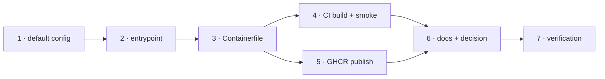

# Tasks: the-loop service as a container image on GHCR

## Task list

- [x] 1. The container's default config
  - `container/cli-config.default.yaml`: `version`, `state.root: /data/state`,
    `service.host: 0.0.0.0`, `service.exposed: true`, and the comments explaining the
    last two. Nothing else — every other key inherits the package default.
  - _Depends on:_ none
  - _Requirements:_ R2.3, R2.4, R1.3, R3.1, R5.2
  - _Test:_ T1 — `pytest tests/test_container.py` (red→green: the file does not exist yet)
- [x] 2. The entrypoint
  - `container/entrypoint.sh`: resolve the config path, seed from the image defaults when
    absent, print the boundary banner, `exec` the service or the given command.
  - _Depends on:_ 1
  - _Requirements:_ R1.1, R1.2, R1.4, R1.5, R2.1, R2.2, R2.5, abuse case 1
  - _Test:_ T2 — `pytest tests/test_container_integration.py` (red→green)
- [x] 3. The image
  - `Containerfile` (two stages, `python:3.11-slim-bookworm`, non-root uid 10001,
    `/data` volume, `EXPOSE 4114`, stdlib `HEALTHCHECK`, OCI labels) and a
    `.dockerignore` that keeps the build context to `cli/` and `container/`.
  - _Depends on:_ 1, 2
  - _Requirements:_ R1.1, R5.1, R5.3
  - _Test:_ T4 — the CI job builds and runs it
- [x] 4. CI builds and smoke-tests the image on every relevant pull request
  - a `container` job in `ci.yml`: buildx, `load: true`, run, poll `/api/v1/health`,
    assert the seeded config exists, print the banner.
  - _Depends on:_ 3
  - _Requirements:_ R4.5
  - _Test:_ T4 — the job itself, green on this PR
- [x] 5. The release publishes it
  - a `publish-container` job in `release.yml` beside `publish-pypi`: same
    `needs: release` gate, checkout the release tag, QEMU + buildx for
    `linux/amd64,linux/arm64`, `metadata-action` tags and labels, push to GHCR with
    `GITHUB_TOKEN`, then `attest-build-provenance --push-to-registry`.
  - _Depends on:_ 3
  - _Requirements:_ R4.1, R4.2, R4.3, R4.4
  - _Test:_ T12 — workflow YAML parses and the gate expression matches `publish-pypi`'s;
    the push itself is provable only on the release path (recorded as such)
- [x] 6. Documentation and the decision record
  - `docs/cli/container.md` (+ sidebar), `docs/cli/installation.md`, `README.md`,
    `docs/capabilities/distribution.md` and `release-publishing.md` history rows,
    `docs/decisions/decision-102.md` + the index row.
  - _Depends on:_ 1, 2, 3, 5
  - _Requirements:_ R4 (documented publish), NFR § Documentation, § Security considerations
  - _Test:_ T12 — `make lint` (markdownlint over every touched doc)
- [x] 7. Verification
  - Run every activity in `testing-plan.md`, tick it, record the results and commit
    `evidence/verification.md`.
  - _Depends on:_ 1–6
  - _Requirements:_ all
  - _Test:_ T1, T2, T8, T10, T11, T12

## Dependency graph (DAG)

## Checkpoints

- After **2**: T1 + T2 green (both written red first, against the absent file and the
  absent script).
- After **5**: `make check` — the full suite, both linters, the type check and the config
  validation.
- After **6**: `make lint` over the docs, and the `container` CI job on the pull request.
- After **7**: `testing-plan.md`'s activities all ticked with evidence committed.
