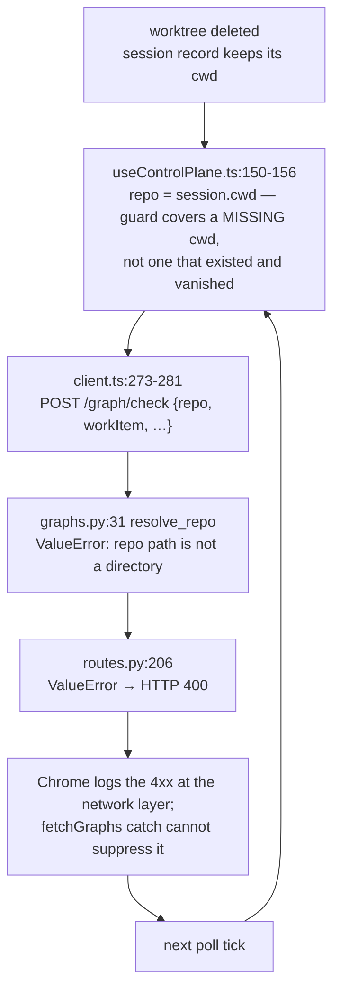

# Bugfix spec: control-plane UI floods the console with 400s from `/graph/check` when a session's `cwd` checkout is gone

> Phase 1 of 3 for a bug (bugfix → design → tasks). This phase MUST be reviewed and
> approved before the design is derived from it.

## Summary

A session record whose checkout has been deleted makes the control-plane UI POST a
repo path that no longer exists to `/api/v1/graph/check`, once per session per poll
tick, forever. The API answers `400`, and Chrome logs every one of them at the network
layer where a JavaScript `catch` cannot suppress it.

Nothing is user-visibly broken: `fetchGraphs` swallows the rejection on purpose and the
rail renders "no position known" from the frozen record either way. The cost is a devtools
console that accumulates red lines indefinitely — noise that buries real errors and reads
as a fault to anyone who opens it. Ticket:
[#238](https://github.com/MadaraUchiha-314/the-loop/issues/238).

## Steps to reproduce

1. Run a work item so a session record is written with a workspace worktree as its `cwd`.
2. Close the session and let the worktree be removed. The record survives with
   `"status": "closed"` and `cwd` unchanged.
3. Open the control-plane UI against that state root and leave it polling.

The stale record on the reporter's machine:

```json
{
  "workItem": { "ref": "github:MadaraUchiha-314/devbox#2", "number": 2 },
  "status": "closed",
  "cwd": "/Users/…/.worktrees/github.com/MadaraUchiha-314/devbox/github-MadaraUchiha-314-devbox-2"
}
```

Reproduced outside the browser, against the running service:

```console
$ curl -s -w " | HTTP %{http_code}\n" -X POST http://127.0.0.1:4114/api/v1/graph/check \
    -H 'Content-Type: application/json' \
    -d '{"repo":"/Users/…/github-MadaraUchiha-314-devbox-2","workItem":"issue-2","prRepo":"","recompute":false}'
{"detail":"repo path is not a directory: /Users/…/github-MadaraUchiha-314-devbox-2"} | HTTP 400
```

## Expected vs actual

- **Expected:** a checkout that is gone is expected state on a machine that has cleaned
  up. The UI either does not ask about it, or gets an ordinary answer meaning "no position
  known" — and the console stays clean.
- **Actual:** `POST http://127.0.0.1:4114/api/v1/graph/check 400 (Bad Request)` in the
  browser console on every poll tick, one line per stale session, without end.

## Root cause (confirmed)

Three facts compose. None is wrong alone; together they make a doomed request that is
re-sent forever.



1. **The record outlives the path it names.** Nothing clears or blanks `cwd` when the
   worktree goes, and `GET /api/v1/sessions` reports no signal about whether that path
   still resolves — so no caller can tell a live checkout from a vanished one without
   asking the filesystem itself.
2. **The UI's guard is for a different case.** `if (!repo || !spec) continue`
   (`ui/src/state/useControlPlane.ts:154`) skips a session that never had a `cwd`. Its own
   comment describes the unhandled case exactly: *"No checkout on this machine means no
   graph state to read."*
3. **An expected state is reported as caller error.** `resolve_repo`
   (`cli/the_loop/core/graphs.py:31`) raises `ValueError` for a path that is not a
   directory, and the route layer maps every `ValueError` to `400`
   (`cli/the_loop/api/routes.py:206`). A vanished checkout is not a malformed request.

Fixing only (1) or only (2) still leaves the window between the worktree disappearing and
the next reconcile, in which the request is sent and the console gets its 400.

## Requirements

### Requirement 1 — a checkout that is gone produces no failing request

**User story:** as a developer with the control-plane UI open in devtools, I want a
cleaned-up checkout to cost me nothing in the console, so that the errors I do see are
real.

#### Acceptance criteria (EARS)

1. WHEN the control-plane UI polls and a session record's `cwd` names a path that does not
   resolve to a directory THEN the system SHALL NOT produce a browser-logged 4xx or 5xx
   response for that session.
2. WHILE a session record's `cwd` names a path that does not resolve to a directory THE
   SYSTEM SHALL keep that behaviour on every subsequent poll tick, with no growth in
   logged responses over time.
3. WHEN the worktree is removed while the UI is already polling THEN the system SHALL
   satisfy criterion 1 from the first tick after the removal, without waiting for any
   reconcile, cleanup or restart.

### Requirement 2 — the work item still renders, and still says it does not know

**User story:** as the same developer, I want the quiet path to change nothing I can see,
so that the fix is provably a noise fix and not a behaviour change.

#### Acceptance criteria (EARS)

1. WHEN a session record's `cwd` does not resolve THEN the control plane SHALL render that
   work item's rail exactly as it does today — the position it can derive from the frozen
   record, and no position claimed beyond it.
2. WHEN a session record's `cwd` does resolve THEN the reported graph position SHALL be
   unchanged from the current behaviour, byte for byte in the response body.

### Requirement 3 — a malformed request is still refused

**User story:** as the maintainer of the API contract, I want "expected state" separated
from "caller error" rather than merged, so that quieting the console does not cost the
service its input validation.

#### Acceptance criteria (EARS)

1. WHEN `POST /api/v1/graph/check` receives a request whose `repo` is absent, blank, or of
   the wrong type THEN the API SHALL reject it as it does today.
2. WHEN `POST /api/v1/graph/check` receives a `repo` path that does not resolve to a
   directory THEN the API SHALL NOT pass that path to any core graph call.
3. The published OpenAPI contract (`docs/api-specs/openapi/the-loop.v1.yaml`) SHALL
   describe whatever response shape this change introduces, and SHALL be regenerated
   rather than hand-edited.

### Requirement 4 — the regression is pinned

**User story:** as a future maintainer, I want the vanished-checkout path covered by a
test, so that the console cannot quietly start filling again.

#### Acceptance criteria (EARS)

1. The fix SHALL include a regression test that fails before the fix and passes after it.
2. WHEN the test suite runs THEN it SHALL cover a session record whose `cwd` does not
   exist, and assert the absence of an error-status response for it.

## Security considerations

`resolve_repo` is a trust boundary, not a formatting nicety: its docstring names abuse
case 3 — *no core call on unvetted input* — and every mutating graph verb reaches core
through it. This change touches how that boundary **reports**, and must not touch what it
**admits**.

- **Untrusted actor:** any caller that can reach the loopback API can put an arbitrary
  filesystem path in `repo`. That is true today and unchanged here.
- **Trust boundary:** `resolve_repo` in `cli/the_loop/core/graphs.py`. Requirement 3.2
  states the invariant the fix must preserve — a path that does not resolve reaches no
  core graph call — so relaxing the *status code* must not relax the *check*. Fail-closed
  means an unresolvable path yields "position unknown", never a graph read rooted at some
  other directory.
- **Abuse case — probing the filesystem:** a 200 that distinguishes "no such directory"
  from other outcomes is a filesystem-existence oracle. It is not a new one: today's `400`
  body already echoes the path back with `repo path is not a directory: <path>`, so the
  same bit is already observable to the same caller for a path they supplied. The response
  this change introduces MUST NOT widen it — no directory listings, no parent-path
  probing, no error text beyond what the caller already sent.
- **Abuse case — a forged session record:** the session registry is a local file the agent
  can write, so a record could name any path. It could before this change too, and the
  boundary above is what contains it; no new attack surface, because the UI's decision to
  skip or send changes only *whether* a request is made, never *what* the server will
  admit.

## Out of scope

- **Pruning `cwd` when a worktree is removed** (the issue's suggested fix 3). It is a
  sound hygiene change and it does not close the window this bug lives in — the record can
  always be stale for one tick — so it is not required to satisfy Requirement 1.3. If the
  design takes it, it is an addition, not the fix.
- **The other `resolve_repo` callers.** `/graph`, `/graph/complete`, `/graph/advance`,
  `/graph/force` and `/graph/skip` share the same helper, but only `/graph/check` is
  polled, and the mutating verbs have a caller who wants to be told they named a
  nonexistent repository. Changing them is a separate decision.
- **`sessions cleanup`.** It already removes the record, and it is the documented
  workaround; nothing here changes it.

## Open questions

None blocking. One decision is deliberately deferred to `design.md` rather than settled
here: whether the fix is server-side (`/graph/check` answers "unknown" with a `200`),
client-side (the session listing reports whether `cwd` resolves and the UI skips those
jobs), or both.

Requirement 1.3 is the constraint that separates them. The client-side fix re-reads the
session listing every tick, so it does answer within one tick of the removal — but the
listing and the graph checks of a single tick are two reads of a filesystem that can
change between them, so a worktree removed in that gap still produces one 400. Only the
server-side answer is unconditional. Whether that residual window is worth a contract
change is the design's call, and the reviewer's.
