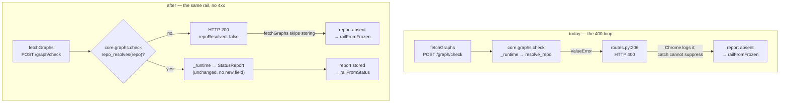

# Design: a vanished checkout is an answer, not an error

> Phase 2 of 3 (bugfix → design → tasks). Derives from the approved
> [`bugfix.md`](bugfix.md). MUST be reviewed and approved before tasks breakdown.

## Overview

**`/graph/check` answers "I do not know where this is" with a `200` instead of raising, and
the UI treats that answer exactly as it treats today's rejection: no report stored, rail
from the frozen record.** Two files carry the fix; a third carries the contract prose.

The open question `bugfix.md` deferred is settled **server-side only**. The client-side
alternative — teach `GET /api/v1/sessions` to report whether `cwd` resolves and let the UI
skip those jobs — is rejected below: it costs a second contract change to buy an
optimization, and it cannot satisfy R1.3 unconditionally because the session listing and
the graph checks of one poll tick are two filesystem reads with a gap between them.

| Requirement | Satisfied by |
|-------------|--------------|
| R1.1, R1.2, R1.3 | `core.graphs.check` returns `200` for a non-resolving `repo`, on every tick, with no reconcile in the path. |
| R2.1 | `fetchGraphs` stores no report when the answer says the repo did not resolve — the same `railFromFrozen` fallback as today. |
| R2.2 | The new field is **absent** when the repo resolves, so a normal response is byte-identical. |
| R3.1 | Untouched: the request model and `Path("").is_dir()` behaviour are exactly as before. |
| R3.2 | `check` returns **before** constructing a runtime, so no core graph call receives an unvetted path. |
| R3.3 | The `graphCheck` operation gains a `description`; response shapes are untouched, so the parity test stays green. |
| R4.1, R4.2 | A pytest over `core.graphs.check` and a vitest over `fetchGraphs`, both red before the change. |

## Architecture

The fix removes one edge from the loop in `bugfix.md` § Root cause and replaces it with a
normal return. Nothing else in the path moves.



The two `railFromFrozen` boxes are the same code reached the same way. That is the point of
the design: the *rendered* outcome for a vanished checkout is unchanged, and only the
transport stops being an error.

## Components & interfaces

### `cli/the_loop/core/graphs.py` — the boundary gets a predicate, and `check` asks it first

`resolve_repo` keeps its signature, its `ValueError` and every other caller. It gains one
sibling so the "is this a usable repo path?" test exists in exactly one place:

```python
def repo_resolves(repo: str) -> bool:
    """Does ``repo`` name a directory this process can use? The predicate behind
    :func:`resolve_repo`, exposed so a caller can ask without catching."""
    return Path(repo).expanduser().is_dir()


def resolve_repo(repo: str) -> Path:
    if not repo_resolves(repo):
        raise ValueError(f"repo path is not a directory: {repo}")
    return Path(repo).expanduser().resolve()
```

A separate predicate rather than a `try/except ValueError` around `_runtime` in `check`:
catching would make the quiet path depend on *which* `ValueError` came back, and
`_runtime` raises `ValueError` for other reasons too — a `check` that swallowed those
would turn a real fault into a silent "unknown". Asking first is the narrower instrument.

`check` returns early, and only `check`:

```python
def check(repo, work_item, recompute=False, pr=None, pr_repo=""):
    """`the-loop check` for one work item: the status report as a dict.

    A `repo` that does not resolve is answered, not raised: a checkout that has
    been cleaned up is expected state on the machine that cleaned it up, and the
    only honest report about it is "position unknown" (issue-238). Every other
    graph verb keeps `resolve_repo`'s ValueError — a caller asking to *advance* a
    nonexistent repository has made a mistake and wants to be told.
    """
    if not repo_resolves(repo):
        return {
            "workItem": work_item,
            "currentNode": "",
            "ok": False,
            "parked": None,
            "nodes": [],
            "repoResolved": False,
        }
    return _runtime(repo, pr, pr_repo, work_item).status(work_item, recompute=recompute).as_dict()
```

`StatusReport.as_dict` is **not** touched, so a resolving repo produces the same five keys
it always did (R2.2).

### `ui/src/state/useControlPlane.ts` — one branch, beside the existing skip

`fetchGraphs`'s worker stores a report only when the server actually knew something:

```ts
const status = await job.run(signal);
// `repoResolved: false` is the server saying the checkout is gone (issue-238).
// Storing it would replace railFromFrozen with an empty rail — so it is dropped
// here exactly as a rejection was dropped by the catch below.
if (status.repoResolved === false) continue;
if (job.outer) reports.outer[job.key] = status;
else reports.inner[job.key] = status;
```

The `catch` below it stays. It still covers an unreachable service, an aborted poll and a
malformed body, none of which this change addresses.

### `ui/src/api/types.ts` — one optional field

```ts
export interface GraphStatus {
  workItem: string;
  currentNode: string;
  ok: boolean;
  parked?: { node: string; reason: string; since?: string } | null;
  nodes: NodeReport[];
  /**
   * Present and `false` only when `repo` named a path that does not resolve to a
   * directory — the server knows nothing about this work item's position and is
   * saying so with a 200 rather than a 400 (issue-238). Absent on every normal
   * response, which keeps those byte-identical.
   */
  repoResolved?: boolean;
}
```

### `docs/api-specs/openapi/the-loop.v1.yaml` — prose, not shape

The `graphCheck` response is already `type: object, additionalProperties: true`, so an
added key needs no schema edit and the parity test (paths × methods × operationIds) is
unaffected. What the contract lacks is the *meaning*, so the operation gains a
`description` recording that a non-resolving `repo` is answered `200` with
`repoResolved: false`. This matches how issue-230 handled the same situation ("description
updated…; shapes untouched").

## UI/UX design

N/A. Nothing rendered changes — that is the design's central claim, asserted by R2.1 and
the vitest below. No new screen, state or component, so there is no visual artifact to
iterate with a designer.

## Data models

One optional boolean on an existing response, described above. No persisted state, no
schema file, no migration: `graph-state.json`, the session registry and the portable
record are all untouched.

## Error handling

| Input to `/graph/check` | Before | After |
|---|---|---|
| `repo` resolves | `200` + status report | unchanged, byte for byte |
| `repo` does not resolve | `400` `{"detail": "repo path is not a directory: <path>"}` | `200` `{…, "repoResolved": false}` |
| `repo` absent / wrong type | `422` from the request model | unchanged |
| `repo: ""` | resolves to the process cwd (`Path("")` is `.`) | unchanged — pre-existing, and R3.1 asks for today's behaviour, not a new rejection |
| `repo` resolves, graph state unreadable | whatever `_runtime`/`status` raises today | unchanged |

Observability is unchanged and deliberately so: the vanished-checkout answer is **not**
logged as a warning. It is the expected steady state of a machine that has cleaned up, and
a log line per session per poll tick would move the noise from the browser console to the
service log rather than removing it. The `api.request` audit event already records every
call with its status, which is where a reader counts them.

## Security design

The trust boundary from `bugfix.md` § Security considerations is `resolve_repo`, and this
design changes how it **reports** without changing what it **admits**.

- **AuthN/AuthZ:** unchanged. The API's authorization posture is the embedder's
  (`build_router(dependencies=[…])`); this change adds no operation and no new caller.
- **Input validation & injection surfaces:** the one untrusted ingress is `repo`, a
  caller-supplied filesystem path. It is validated by the same predicate as before —
  `repo_resolves` **is** the body of `resolve_repo`, factored out rather than duplicated,
  so the two cannot drift into disagreeing. Path injection is contained by the same fact
  as today: a path that does not resolve reaches no graph read, and one that does is
  `resolve()`d before use.
- **Secrets handling:** none involved. The response carries no path, no environment and no
  credential.
- **Least privilege:** unchanged. `check` remains a pure read (issue-109 R8.8: no adoption,
  no state write), and the early return makes it *strictly* less privileged for the
  vanished case — it touches the filesystem once and stops.
- **Fail-closed behaviour:** when the check cannot be made, the answer is "position
  unknown" with an empty node list and `ok: false`. It never falls back to a graph read
  rooted somewhere else, and never reports a position it did not read. R3.2's invariant is
  structural, not incidental: the `return` precedes the `_runtime(…)` call, so there is no
  path through the function that reaches core with an unvetted `repo`.
- **Abuse-case coverage:**

| Abuse case | Mechanism defeating it | Negative test |
|---|---|---|
| A caller probes the filesystem by watching status codes | The `200` body carries **no path and no error text** — strictly less than today's `400`, which echoes the path back. The observable bit (does this path exist?) is unchanged, and unchanged for a path the caller supplied in the first place. | Assert the unknown-position body contains neither `repo` nor any filesystem string. |
| A forged session record names an arbitrary path | Unchanged by this work item. The UI's decision to send or skip changes only *whether* a request is made; what the server admits is still governed by the predicate above. | Covered by the R3.2 test: a non-resolving path constructs no runtime. |

## Testing strategy

Requirement 1 and Requirement 3.2 are proved by one pytest against `core.graphs.check`
with a path that does not exist: it returns a dict with `repoResolved: False`, an empty
`nodes` list, and — asserted by monkeypatching `_runtime` to raise — never constructs a
runtime. Requirement 2.2 is proved by its sibling: a real repo produces a dict whose keys
are exactly the five `StatusReport.as_dict` has always emitted, with no `repoResolved`.
Requirement 2.1 is proved in the UI's own suite (vitest), where `fetchGraphs` is given a
stub client returning `repoResolved: false` and the resulting `GraphReports` is asserted
empty — the condition under which `buildViews` falls back to `railFromFrozen`. Requirement
3.3 is carried by the existing contract-parity test, which must stay green after the
`description` edit.

The manual reproduction from `bugfix.md` — the same `curl` against a stale worktree path,
now returning `200` — is the end-to-end evidence, and the console itself is the
acceptance: the UI open on a state root with a stale record, devtools showing no
`/graph/check` errors across several poll ticks.

The executable detail (which testing types apply, the environment, the evidence to
capture) belongs to `testing-plan.md`, derived from this design at `test-planning`.

## Trade-offs & decisions

**The rejected alternative: teach the session listing about `cwd`.** The issue's suggested
fix 1 — have `GET /api/v1/sessions` report whether each `cwd` still resolves, and have the
UI skip those jobs — is a real option and it is cheaper per tick, since no request is sent
at all. It is rejected for three reasons, in order of weight:

1. **It does not close the window.** The session listing and that tick's graph checks are
   two filesystem reads with time between them. A worktree removed in that gap still
   produces one `400`. R1.3 asks for the first tick after removal, unconditionally.
2. **It buys an optimization with a contract change.** A new `cwdExists` field on the
   session record is a second public shape to describe, version and keep true — for a
   saving of one loopback POST per stale session per tick.
3. **It leaves the wrong answer in place.** Even with no UI asking, `/graph/check` would
   still call a cleaned-up checkout a caller error. The next client to read a session
   record would rediscover this bug.

Nothing forbids adding it later as an optimization; it is not the fix.

**An absent field rather than `repoResolved: true`.** Emitting the field on every response
would be more regular, and it is rejected only because R2.2 asks for byte-identical normal
responses. The cost is a three-state boolean (`true` / `false` / absent) where absent and
`true` mean the same thing — a mild smell, contained by the client comparing `=== false`
explicitly rather than testing truthiness.

**Only `check` changes.** `/graph`, `/graph/complete`, `/graph/advance`, `/graph/force` and
`/graph/skip` share `resolve_repo` and keep their `400`. `check` is the only polled verb,
and a caller asking to *advance* a nonexistent repository has made a mistake worth being
told about. This asymmetry is deliberate and is the thing to disagree with if the reviewer
wants uniformity instead.

**No decision record.** This is a bug fix behind an existing contract, not a durable
architectural choice, so nothing is added under `docs/decisions/`. The asymmetry above is
recorded in the `check` docstring, where the next reader of that function will find it.

## Open questions

None. The one `bugfix.md` deferred — server-side, client-side or both — is answered above,
with the rejected option and its reasons recorded rather than dropped.

## Review comments

> Appended by the-loop's `record-feedback` hook when a human gate approves with
> comments (issue-109). Append-only and attributed.

### 2026-08-15 — approved

By @MadaraUchiha-314 —

approved
