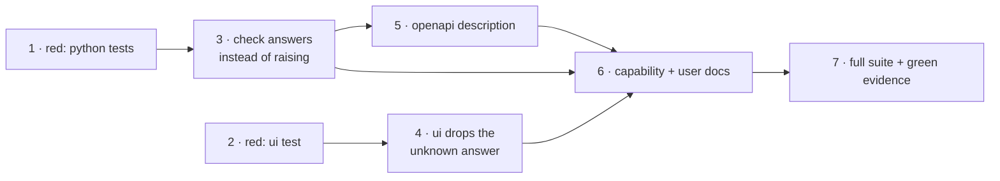

# Tasks: a vanished checkout is an answer, not an error

> The last spec artifact (bugfix → design → testing plan → tasks). Derived from the
> approved [`design.md`](design.md) and [`testing-plan.md`](testing-plan.md).

**Seven tasks, two independent red roots.** The Python side (1 → 3 → 5) and the UI side
(2 → 4) do not touch each other's files and can be worked in either order; they meet at
task 6. `tdd.mode: standard` holds throughout — every production change below is preceded
by the test that motivates it, and the red run is captured as evidence before any of it is
written.

## Task list

- [x] 1. Write the Python tests for the new behaviour, and watch them fail
  - Rewrite `test_check_malformed_repo_never_reaches_the_graph`
    (`cli/tests/test_core_graphs.py:37`) from "raises `ValueError`" to "returns
    `repoResolved: False`, `nodes: []`, `currentNode: ""`, and constructs no runtime"
    — the last part by monkeypatching `graphs._runtime` to raise if called.
  - Rewrite `test_graph_check_rejects_a_bad_repo_path`
    (`cli/tests/test_api_routers_integration.py:85`) to expect `200` with
    `repoResolved: false`, under a Gherkin docstring naming
    `Scenario: a control-plane client asks where a work item stands in a checkout that has been deleted`.
    Add its sibling for a checkout that is still there
    (`Scenario: a control-plane client asks about a checkout that is still there`),
    asserting the response carries **no** `repoResolved` key.
  - Add `test_repo_resolves_agrees_with_resolve_repo` covering directory, regular file and
    missing path — the shared predicate, on the same three cases
    `test_resolve_repo_rejects_non_directory` already uses.
  - Add the abuse-case negative test: the unknown-position body contains no substring of
    the supplied path and no filesystem string.
  - Run them against **unfixed** code and commit the failing output as `evidence/red.md`.
  - _Depends on:_ none
  - _Requirements:_ R4.1, R4.2
  - _Test:_ `T0 — uv run pytest cli/tests/test_core_graphs.py cli/tests/test_api_routers_integration.py` (red)

- [x] 2. Write the UI test for the dropped answer, and watch it fail
  - Export `fetchGraphs` from `ui/src/state/useControlPlane.ts`. It is module-private
    today and the test needs it addressable. **This is a production change the design did
    not name** — recorded here rather than done quietly; see § Deviations.
  - Add `ui/src/state/useControlPlane.test.ts`: given a stub `TheLoopApi` whose
    `graphCheck` resolves `{…, repoResolved: false}`, `fetchGraphs` returns
    `{outer: {}, inner: {}}`; given a normal answer, the report is stored under the ref.
  - Run against unfixed code and append the failing output to `evidence/red.md`.
  - _Depends on:_ none
  - _Requirements:_ R2.1, R4.1
  - _Test:_ `T0 — cd ui && bun run test` (red)

- [x] 3. Answer instead of raising, in `check` alone
  - `cli/the_loop/core/graphs.py`: add `repo_resolves(repo) -> bool` and make
    `resolve_repo` call it, so the predicate exists once.
  - `check` returns the unknown-position dict when `repo_resolves` is false, **before**
    `_runtime(...)` — the ordering is what makes R3.2 structural rather than incidental.
  - Docstring records why only `check` behaves this way, per `design.md` § Trade-offs.
  - Touch no other verb: `complete`, `advance`, `force` and `skip` keep the `ValueError`.
  - _Depends on:_ 1
  - _Requirements:_ R1.1, R1.2, R1.3, R2.2, R3.1, R3.2
  - _Test:_ `T1, T3, T9 — uv run pytest cli/tests/test_core_graphs.py cli/tests/test_api_routers_integration.py` (green)

- [x] 4. Drop the unknown answer client-side, exactly as the rejection was dropped
  - `ui/src/api/types.ts`: add `repoResolved?: boolean` to `GraphStatus`, documented as
    present-and-false only.
  - `ui/src/state/useControlPlane.ts`: in the worker, `if (status.repoResolved === false) continue;`
    before storing. Compare to `false` explicitly — absent must not be read as falsy.
  - Leave the `catch` below it alone; it still covers an unreachable service and an
    aborted poll.
  - _Depends on:_ 2
  - _Requirements:_ R2.1
  - _Test:_ `T2 — cd ui && bun run test` (green)

- [x] 5. Say it in the contract
  - `docs/api-specs/openapi/the-loop.v1.yaml`: give the `graphCheck` operation a
    `description` stating that a `repo` which does not resolve is answered `200` with
    `repoResolved: false`, reserving `4xx` for a malformed request.
  - Response schemas are untouched, so the parity assertion (paths × methods ×
    operationIds) is unaffected — confirm rather than assume.
  - _Depends on:_ 3
  - _Requirements:_ R3.3
  - _Test:_ `T4 — uv run pytest cli/tests/test_api_contract_parity.py`

- [x] 6. Update the docs the change makes wrong
  - `docs/capabilities/control-plane.md`: extend the `graph/check` behaviour bullet
    (line ~104) — an item whose `cwd` no longer resolves is answered rather than refused —
    and add the issue-238 history row.
  - Check `README.md` and the documentation site for any statement this change falsifies;
    record the finding either way in the execution log's `## Documentation` section, with
    the reason if nothing changed.
  - _Depends on:_ 3, 4, 5
  - _Requirements:_ none directly — the ready-to-ship gate (`reference/workflow.md`)
  - _Test:_ `npx markdownlint-cli2@0.18.1 <changed files>`

- [x] 7. Run everything the way CI runs it, and commit the green evidence
  - `uv run pre-commit run --all-files`, `uv run pytest`, and
    `cd ui && bun run lint && bun run test && bun run build` — the same commands
    `.github/workflows/ci.yml` runs.
  - Commit the output as `evidence/unit-and-integration.md` and `evidence/ui-tests.md`,
    redacted per `testing-plan.md` § Evidence plan.
  - _Depends on:_ 3, 4, 5, 6
  - _Requirements:_ R4.1, R4.2
  - _Test:_ full suite (green), paired with `evidence/red.md` from tasks 1–2

## Dependency graph (DAG)

Tasks 1 and 2 are independent roots; 3 and 4 are independent of each other. Everything
converges at 6 so the docs describe the finished behaviour rather than a half of it.

## Deviations from the approved design

One, recorded here because the design gate has already closed:

- **Task 2 exports `fetchGraphs`.** `design.md` § Testing strategy says the UI assertion
  runs against `fetchGraphs`, but the function is module-private today, so the export is
  needed to address it. The alternative — driving it through `useControlPlane` with
  `renderHook` — tests the polling effect, the abort wiring and the reducer as well, which
  makes a failure ambiguous about which of them broke. Exporting a pure function
  `(api, workItems, sessions, signal) => GraphReports` is the smaller instrument. Flagged
  on the PR at the next gate; it is an export, not a behaviour change.

## Checkpoints

After **task 1 and task 2** (the red roots): `evidence/red.md` exists and shows the new
assertions failing against unfixed code. This is the checkpoint the whole plan rests on —
if it is skipped, "the test was rewritten" has no counter-evidence.

After **task 3** and after **task 4**: their suites green, execution log appended, context
compacted per `contextManagement.taskBoundary`.

After **task 7**: the full suite green under CI's own commands.

Then the **verification** node executes `testing-plan.md` — including T12, the manual
`curl` and devtools-console check that reproduces the ticket's symptom — ticking each
activity and recording its command, outcome and committed evidence. Only then do the
review phases run the self and critic rounds and the **security review gate**
(`security.review`), recorded in the execution log, before the work item can be marked
ready.

## Review comments

> Appended by the-loop's `record-feedback` hook when a human gate approves with
> comments (issue-109). Append-only and attributed.
