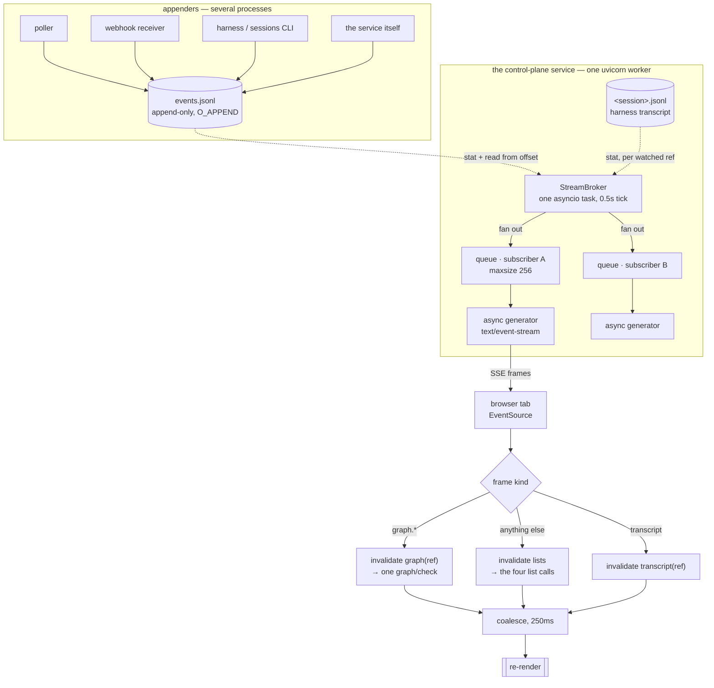

# Design: stream the-loop's service to the control plane

> Phase 2. Derives from the locked [`requirements.md`](requirements.md). Reviewed at the
> `design-approval` gate **together with** [`testing-plan.md`](testing-plan.md) — one
> human gate over the pair.

## Overview

**Server-Sent Events, one endpoint, one shared tailer.** The service grows
`GET /api/v1/stream`, an `async def` route returning `text/event-stream`. A single
background task tails `events.jsonl` from a byte offset and fans each new record out to
per-subscriber queues; the same task stats the transcript files that subscribers asked to
watch. The browser holds one `EventSource` per tab, maps each frame onto one of two
invalidation classes, and refreshes only what that class covers. Settings gains a
three-way refresh mode; polling and manual are unchanged behind it.

Four decisions carry the design, and they are the four things to review:

1. **SSE, not WebSocket** — the transport the ticket left open. Decided on CORS parity,
   the absence of any client→server need, and `Last-Event-ID`. Full comparison in
   [Trade-offs](#trade-offs--decisions).
2. **The stream never carries `api.request` or `mcp.call`.** It cannot: the control plane
   refreshing produces API requests, which produce `api.request` events, which would
   arrive on the stream and trigger another refresh. A self-feeding loop, permanently at
   full throttle. Excluded server-side, with no opt-in.
3. **The cursor is a byte offset**, validated against the file's current size, with a
   bounded replay window. Truncation, rotation and an over-wide gap all resolve to one
   `desync` frame that tells the client to do a full refresh — the only honest answer, and
   self-healing.
4. **Two invalidation classes, not one.** A `graph.*` frame re-runs `graph/check` for that
   one ref; everything else refetches the four list calls. Refreshing the whole board per
   frame would make streaming *more* expensive than the 15-second poll it replaces.

## Architecture



Three properties the diagram is drawn to make checkable:

- **The tailer is shared, the queues are not.** One file read per tick regardless of
  subscriber count (R5.3). Back-pressure is per subscriber, so a browser that stops
  reading harms only itself (abuse case 5).
- **The stream is read-only and derived.** It opens no new source of truth: every frame is
  a record already served by `GET /api/v1/events`, or a line count already served by
  `GET /api/v1/sessions/transcript`. Nothing is streamed that the REST surface would not
  answer.
- **Other processes are why this is a file tailer and not an in-process bus.** The poller
  and the webhook receiver may run hosted in this process (`service.hostIngresses`) or as
  separate ones; the harness and the `sessions` CLI always run elsewhere. The file is the
  only place all of them meet (decision-025).

## Components & interfaces

### Server

| Module | Change | Why here |
|---|---|---|
| `cli/the_loop/api/stream.py` | **new** — `StreamBroker` (tail, fan-out, watch), the SSE frame encoder | The only new concept; kept out of `routes.py`, which is transport-and-serialization only |
| `cli/the_loop/api/routes.py` | **+1 route** — `GET /api/v1/stream`, `operation_id: streamEvents` | One definition of the surface, shared by the app and the SDK (issue-212) |
| `cli/the_loop/api/lifespan.py` | start/stop the broker task | A live task, not an importable module — the same reason MCP's session manager is here |
| `cli/the_loop/api/config.py` | `stream_config(cli_config)` | Beside `service_config` / `cors_config`, resolved once at boot |
| `cli/the_loop/schemas/cli-config.schema.json` | `service.stream` | Three knobs, shaped exactly like `service.mcp` |
| `cli/the_loop/eventlog.py` | 4 new `EVENT_TYPES` | The catalog is the contract (`reference/observability.md`) |
| `docs/api-specs/openapi/the-loop.v1.yaml` | the endpoint + frame schemas | Contract-first (`apiSpecs`), R1.7 |

**The route must be `async def`.** Every existing route is a synchronous `def`, which
FastAPI runs in the anyio threadpool (40 slots by default). A synchronous generator held
open for hours would hold a threadpool slot for hours, and eight subscribers would take a
fifth of the pool. An `async def` route returning an async generator costs one task and no
thread — which is what makes R5.1 true rather than hoped for.

```python
@router.get(f"{API_PREFIX}/stream", operation_id="streamEvents")
async def stream_events(
    request: Request,
    workItem: List[str] = Query(default=[]),   # filter log frames; empty = all
    transcript: List[str] = Query(default=[]), # also watch these refs' transcripts
) -> Response: ...
```

### Wire format

One SSE frame per notification. `id` is the cursor; `event` is the frame kind.

```text
id: 148213
event: log
data: {"ts":"2026-08-16T16:35:48.114Z","source":"service","event":"graph.advanced",
       "level":"info","work_item":"github:MadaraUchiha-314/the-loop#239","node":"design"}

event: transcript
data: {"ref":"github:MadaraUchiha-314/the-loop#239","totalLines":412}

event: desync
data: {"reason":"replay window exceeded","cursor":148213}

: keep-alive
```

- **`log`** — one appended event-log record, verbatim in the shape
  `GET /api/v1/events` returns, so `ui/src/api/types.ts:EventRecord` already models it and
  the Events panel already renders it. `id` is the byte offset **after** the record's
  newline, so replaying from it yields exactly the records the client has not seen.
- **`transcript`** — carries no transcript content, only the ref and the new line count.
  The client then calls the existing `GET /api/v1/sessions/transcript`, which owns the
  path validation and the fail-closed rules (issue-209). Streaming the content would
  duplicate that boundary in a second place.
- **`desync`** — "your cursor cannot be honoured; refetch everything." Sent for a
  truncated or rotated file, a replay gap wider than 256 KiB, and a subscriber whose queue
  overflowed. One frame kind for all three because the client's correct response is
  identical.
- **`: keep-alive`** — an SSE comment every `keepAliveSeconds` (R1.4). Costs two bytes on
  the wire and keeps intermediaries from reaping an idle connection.

The server also emits `retry: 3000` once at connect, so `EventSource`'s built-in
reconnect starts at three seconds rather than the browser's default.

### Client

| File | Change |
|---|---|
| `ui/src/api/client.ts` | `stream(query, handlers): () => void` on `TheLoopApi`; `HttpApi` implements it with `EventSource` |
| `ui/src/demo/client.ts` | the same method, replaying fixture events on a timer, so demo mode is not a hole |
| `ui/src/state/settings.ts` | `refreshMode: "stream" \| "poll" \| "manual"` + the v1 migration |
| `ui/src/state/useControlPlane.ts` | mode-driven effect; `refreshGraph(ref)` for the targeted class |
| `ui/src/state/useStream.ts` | **new** — connection state machine, coalescing, failure counting, fallback |
| `ui/src/views/Settings.tsx` | the Refresh card becomes three modes |
| `ui/src/views/WorkItemDetail.tsx` | transcript invalidation; scroll-anchored trace panel |
| `ui/src/components/Banner.tsx` (or `Nav.tsx`) | the live / reconnecting / polling indicator |
| `ui/src/styles/app.css` | `.lp-trace` scrolls; `.lp-chat` sticks |

**`EventSource`, not a `fetch` reader.** It gives reconnection and `Last-Event-ID`
resubmission for free, and it cannot set headers — which costs nothing, because the
service has no in-app auth to send. What it does not give is a controllable backoff or a
way to stop trying, so `useStream` counts consecutive `onerror` events and, at five,
closes the source and drops to polling with a stated reason (R4.4).

The invalidation map is a small pure function, unit-testable without a browser:

```ts
type Invalidation = { lists: boolean; graphRefs: Set<string>; transcriptRefs: Set<string> };
```

`graph.*` → `graphRefs.add(work_item)`. Anything else with a `work_item`, and anything
unrecognised → `lists = true`. An unknown event type refreshing the lists is deliberate:
`EVENT_TYPES` grows, and a new type the UI has never heard of must not be invisible.

## UI/UX design

This work item has a user-facing surface, so the visual design is tracked as artifacts
(`design.uiArtifacts`, `format: html`, `selfContained: true`).

| Artifact | Type | Location / link | Covers (screen · requirement) | Status |
|----------|------|-----------------|-------------------------------|--------|
| `design/refresh-settings.html` | html-prototype | [`design/refresh-settings.html`](design/refresh-settings.html) | Settings → Refresh card, and the four connection-indicator states · R3, R4 | draft |
| `design/detail-layout.html` | html-prototype | [`design/detail-layout.html`](design/detail-layout.html) | Work-item detail → scrolling trace + sticky chat bar · R6 | draft |

- **Flows & states.** *Refresh mode*: three mutually exclusive choices; picking **polling**
  reveals the existing interval select, picking the others hides it. *Connection*: four
  states — `live` (streaming, with "last heard from the service" beside it), `reconnecting`
  (attempt n of 5), `fallback` (streaming failed, polling instead, with the reason), and
  `polling`/`manual` (no stream requested, no indicator noise).
- **Design system / tokens.** Reuses `ui/src/styles/app.css` and `industry.css` unchanged
  — `Blueprint`, `.lp-settings-card`, `.lp-settings-kicker`, `.lp-note`, `.btn`, and the
  `.lp-conn` / `.lp-conn-dot` pair the base-URL probe already uses for exactly this
  purpose. No new colour, no new component primitive.
- **Accessibility & responsiveness.** The mode control is a radio group, so a screen reader
  announces "1 of 3" and arrow keys move between modes; the connection state is text plus a
  dot, never the dot alone (R4.3, and `.lp-conn` already reads this way). `aria-live="polite"`
  on the indicator so a change is announced without stealing focus. The trace panel is a
  focusable scroll container (`tabindex="0"`, with an accessible name) so it is
  keyboard-scrollable; the sticky chat bar sits in normal flow and traps no focus. The trace
  panel's height is `clamp(240px, 55vh, 720px)`, which keeps both it and the chat bar usable
  down to a 600px-tall viewport (R6.5).
- **Evidence.** Rendered screenshots of the locked prototypes go under `evidence/` at the
  verification node (`design.uiArtifacts.screenshotEvidence`).

## Data models

### `service.stream` (CLI config)

Three knobs, and no more: everything else that could be a knob is a constant an operator
would have no basis to choose. Shaped after `service.mcp`, which is the same kind of
"one subsystem of the service, on or off" object.

```jsonc
"stream": {
  "type": "object",
  "description": "The server-push stream (issue-239): GET /api/v1/stream, text/event-stream. A read surface over the same records GET /api/v1/events serves, held open. Subject to service.cors like every other route.",
  "additionalProperties": false,
  "properties": {
    "enabled":          { "type": "boolean", "default": true,
                          "description": "Whether the service serves /api/v1/stream. False answers 404 and starts no tailer — a deployment that wants REST-only, matching service.mcp.enabled." },
    "maxSubscribers":   { "type": "integer", "default": 8, "minimum": 1,
                          "description": "Simultaneous open stream connections. Beyond this the service answers 503 rather than accepting a connection it cannot serve well; the bound is what keeps an open dashboard from starving the REST surface." },
    "keepAliveSeconds": { "type": "integer", "default": 15, "minimum": 1,
                          "description": "Interval between SSE keep-alive comments on an idle connection. Raise it only if an intermediary reaps idle connections faster than this." }
  }
}
```

Constants in `stream.py`, not config: tick `0.5s`, per-subscriber queue `256` frames,
replay window `256 KiB`, consecutive-failure limit `5` (client side).

### New `EVENT_TYPES`

```text
stream.subscribed    A client opened /api/v1/stream (subscribers: the count including
                     this one, work_items / transcripts: the filters it asked for).
stream.refused       A stream connection was refused (reason: disabled | at-capacity |
                     bad-cursor | bad-filter) — the connection was never accepted.
stream.desync        A subscriber was told to refetch everything (reason: truncated |
                     rotated | replay-window | queue-overflow). Not an error: the
                     self-healing path, and the signal that a subscriber is too slow or
                     the log was rotated under the service.
stream.disconnected  A subscriber's connection ended (duration_seconds, frames,
                     reason: client | shutdown | overflow).
```

### TypeScript

```ts
export type RefreshMode = "stream" | "poll" | "manual";

export interface Settings {
  baseUrl: string;
  mode: DataMode;          // live | demo — unchanged, unrelated
  refreshMode: RefreshMode;
  pollSeconds: number;     // kept: the interval used while refreshMode === "poll"
}

export type StreamFrame =
  | { kind: "log"; record: EventRecord; cursor: string }
  | { kind: "transcript"; ref: string; totalLines: number }
  | { kind: "desync"; reason: string };

export type StreamState =
  | { name: "live"; lastFrameAt: number }
  | { name: "reconnecting"; attempt: number }
  | { name: "fallback"; advice: string }
  | { name: "off" };
```

**The stored-settings migration (R3.6)** keeps the `the-loop:settings:v1` key rather than
minting a v2, so an existing viewer does not lose their base URL. `refreshMode` is absent
in a v1 document, and absence is resolved from the field that already exists:
`pollSeconds === 0` → `manual`, otherwise → `poll`. A viewer who had polling off gets
manual, a viewer who had it on keeps their interval, and nobody is silently switched to a
transport their tunnel may not carry.

## Error handling

| Failure | Where | Behaviour | Surfaced as |
|---|---|---|---|
| `service.stream.enabled: false` | route | `404` | Client shows "this service does not serve the stream", falls back to polling |
| Subscriber count at `maxSubscribers` | route | `503` + `Retry-After`, connection never accepted | `stream.refused reason=at-capacity`; client falls back to polling |
| Malformed `Last-Event-ID` / filter ref | route | `400` with the reason; **never** silently unfiltered | `stream.refused reason=bad-cursor\|bad-filter` (abuse case 3) |
| Log file absent, or removed while tailing | broker | Offset resets to 0 on next appearance; subscribers get `desync` | `stream.desync reason=rotated` |
| Log truncated (`offset > size`) | broker | Stream from current end; `desync` | `stream.desync reason=truncated` |
| Replay gap > 256 KiB | route, at connect | Stream from current end; `desync` | `stream.desync reason=replay-window` (abuse case 4) |
| Subscriber queue full | broker | Drain the queue, enqueue one `desync`, keep the connection | `stream.desync reason=queue-overflow` (abuse case 5) |
| Partial trailing line in the log | broker | Buffer it; emit only `\n`-terminated records | — (silent by design; the next tick completes it) |
| Transcript path unresolvable at subscribe | broker | Retried every 10 ticks, so a session registering later starts producing frames without a reconnect | — |
| Origin not in `service.cors.allowOrigins` | CORS middleware | Browser discards the response | `ApiError.kind === "network"`, and `ApiError.advice` already names this exact cause |
| Nothing listening / tunnel down | client | Five backoff attempts, then fallback | The `fallback` indicator with the advice string |
| Service restarts under a live stream | client | `EventSource` reconnects with `Last-Event-ID`; the broker replays from that offset | Momentary `reconnecting`, then `live` |

Every server-side row emits its event through the existing `eventlog`, at the same level
the rest of the service uses, and appears in `the-loop events` with no new tooling — the
dev/runtime parity `reference/observability.md` requires.

## Security design

The one trust boundary the requirements named is the moment a browser's request becomes a
connection the service holds open on its behalf. It is enforced at accept time — count,
origin, filter and cursor are all decided before any task, queue or file handle exists,
so a refused connection costs the service one rejected request. Each row below is that
boundary in one of its forms.

| Trust boundary / abuse case from requirements | Enforced by |
|---|---|
| R1.6 / abuse case 2 — origin allowlist parity with REST | Choosing SSE **is** the enforcement: the route is an ordinary `GET`, so the existing `CORSMiddleware` governs it with no new code. A WebSocket would have required a hand-written `Origin` check; see the trade-off below. |
| Abuse case 1 — connection exhaustion | `maxSubscribers`, counted at accept time, refused with `503` before any task or file handle is created. |
| Abuse case 3 — malformed filter or cursor | Parsed and validated in the route; `ValueError` → `400` through the existing `CoreRoute` translation. There is no "unfiltered" fallback path to fall into. |
| Abuse case 4 — unbounded replay | Replay is capped at 256 KiB of log; a wider gap answers `desync` instead of reading history without limit. |
| Abuse case 5 — a subscriber that stops reading | Bounded per-subscriber queue; overflow drains to a single frame. Memory per subscriber is bounded by the queue, not by the client's appetite. |
| Fail closed on absent config | `stream_config` resolves defaults from the schema; `enabled: false` and an unreadable config both mean **no stream**, never a permissive one. An empty `service.cors.allowOrigins` installs no CORS middleware today and is unchanged — no origin is allowed to read, which is the closed direction. |
| No new data exposure | Every `log` frame is a record `GET /api/v1/events` already serves; the `transcript` frame carries a line count and no content, and the client reads content through the existing route with its existing path validation (issue-209). The stream opens no new read of the filesystem. |
| Read-only | The route accepts no body and mutates nothing. The stream is not a control channel; replies keep going through `POST /api/v1/sessions/reply`. |

**Risk tier: 4.** `autonomy.inferFromChange` is true and `sensitivePaths` includes
`**/*schema*`; this change edits `cli/the_loop/schemas/cli-config.schema.json`. At tier 4
`security.review.humanSignOffMinTier: 4` applies, so the security-review node needs a
**named human sign-off** — not just the checklist. Recorded here so the gate is not a
surprise at the end.

**What this design does not fix.** The service still has no in-app authentication
(decision-059), so anyone who can reach the base URL and is allowed by CORS can read the
stream — exactly as they can already read `GET /api/v1/events`. Streaming makes that
cheaper to do continuously. The mitigation is the existing one: loopback by default,
`exposed: true` as a deliberate act, a gateway in front. This work item does not reopen it,
and should not be read as having reviewed it.

## Testing strategy

Detailed in [`testing-plan.md`](testing-plan.md); the shape:

- **Unit** — the invalidation map (pure), the cursor/replay arithmetic, the settings
  migration, `stream_config` defaults.
- **Integration (Gherkin docstring, `cli/tests/test_*_integration.py`)** — a real service
  over `httpx`/`TestClient`: append to the log, assert the frame arrives; reconnect with
  `Last-Event-ID` and assert exactly the missed records; exceed `maxSubscribers` and assert
  `503`; append `api.request` and assert **no** frame.
- **Contract** — the OpenAPI document validates, and describes the endpoint (R1.7).
- **UI** — `vitest` over the invalidation map, `useStream`'s state machine with a stubbed
  `EventSource`, and the settings migration; a rendered check for the sticky bar and the
  scroll anchoring.
- **Security/abuse-case** — one negative test per abuse case in the table above.
- **Manual** — the browser-driven pass that proves the thing the whole item is for: an
  agent's turn appearing on screen without a poll.

## Trade-offs & decisions

### SSE over WebSocket

| | SSE (`text/event-stream`) | WebSocket |
|---|---|---|
| CORS | Governed by the existing `service.cors` middleware | **Handshake is exempt from CORS** — needs a hand-written `Origin` check or the boundary silently disappears |
| Direction | Server→client only — exactly what is needed | Bidirectional — nothing needs it; replies already have a route |
| Resume | `Last-Event-ID` resent automatically on reconnect | Hand-rolled |
| Reconnect | Built into `EventSource` | Hand-rolled |
| Dependency | None — Starlette's `StreamingResponse` | `uvicorn[standard]` / `websockets` |
| Proxies | Ordinary HTTP response; a buffering proxy needs `X-Accel-Buffering: no` | `Upgrade` must survive the hop |
| Per-origin connections | Takes one of the browser's ~6 HTTP/1.1 sockets | Does not count against that pool |
| Framing | Text only, one field per line | Binary or text |

**Decided: SSE.** It wins the two that matter here — the security boundary comes for free
rather than being written by hand, and resume/reconnect are the browser's problem rather
than ours. It loses on the socket budget, which is the one real cost and is small enough
to measure: the board's round one issues five parallel calls, plus the stream is six, which
is exactly Chrome's HTTP/1.1 per-origin cap; round two's four workers then run against a
free pool of five. No queuing in either round. Recorded as a decision record because
"why not WebSocket" will be asked again.

### The `api.request` feedback loop

Every route emits `api.request`. A stream that carried it would deliver a frame for each
of the control plane's own calls, each frame triggering a refresh, each refresh producing
more calls — a loop that never idles and that gets worse the more it is watched. The
exclusion is server-side and has **no opt-in flag**: a flag would be a documented way to
build the loop, and `GET /api/v1/events` still serves those records to anyone who wants
them. `mcp.call` is excluded for the same reason.

### Full refresh vs two invalidation classes

Streaming that refreshed the whole board per frame would be a regression: today an idle
board costs one round trip set per 15s, and a busy work item emits several events per
second. Two classes keep the common case — an agent advancing its graph — down to a single
`POST /graph/check`. The cost is a second code path through `fetchGraphs`, which is why
that function was already exported and pure (issue-238); the per-ref call filters its two
inputs and merges into the held reports.

### 250ms coalescing

Long enough to collapse a burst (a dispatch emits four or five events in a few
milliseconds), short enough to stay an order of magnitude inside R1.2's 2 seconds. A
number, not a feeling: at 250ms the worst case is four board refreshes per second, and the
observed burst pattern makes it one.

### Polling is not deleted

It stays a first-class mode, unchanged. Over a flaky SSH tunnel a poll that fails is one
failed request; a stream that fails is a screen that stops updating. The viewer who knows
their network picks.

## Open questions

Settled here rather than left open, and flagged so the gate can overturn any of them:

1. **Default mode for a new viewer: `stream`.** Requirements left it open. Chosen because
   the shipped default base URL is loopback, where streaming always works, and because
   R4.1's fallback makes a wrong guess cost one failed connect and a stated reason rather
   than a dead screen. A reviewer who disagrees changes one constant.
2. **The transcript is in scope** (R2.3), implemented as a line-count notification rather
   than streamed content — roughly a fifth of the work, and the part an operator watching
   an agent actually sees.
3. **Requirement 6 stays in this work item.** It touches `WorkItemDetail.tsx` and
   `app.css` only, shares no module with the streaming work, and is one task in the DAG. If
   the gate wants it split, removing it costs nothing else.

## Review comments

> Appended by the-loop's `record-feedback` hook when a human gate approves with comments.
