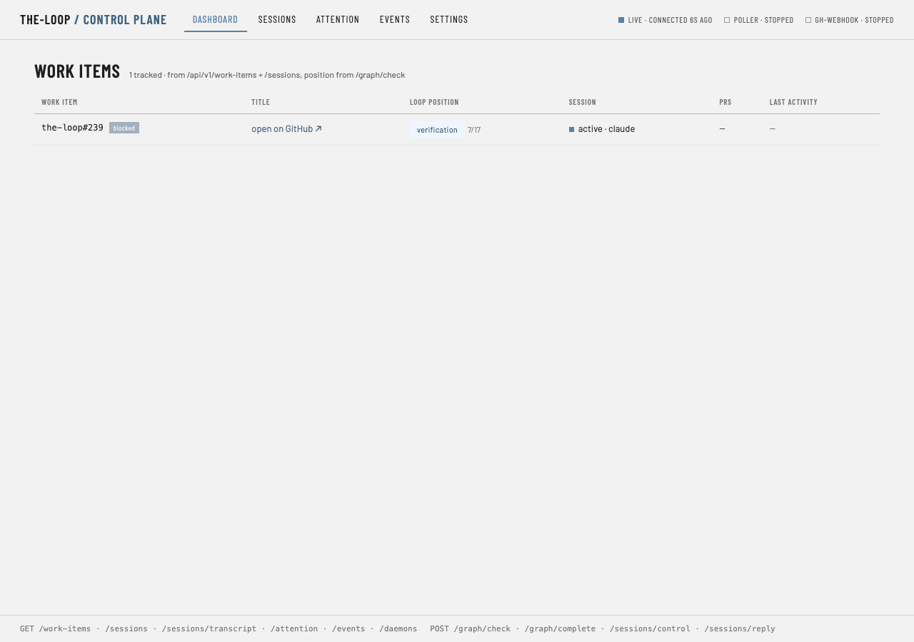
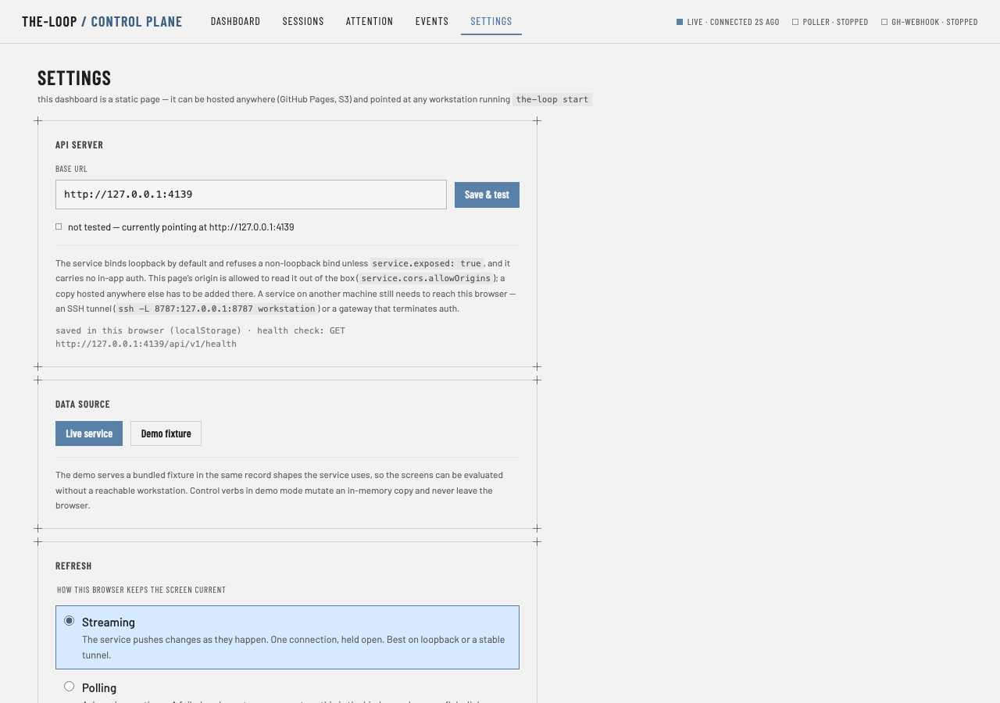
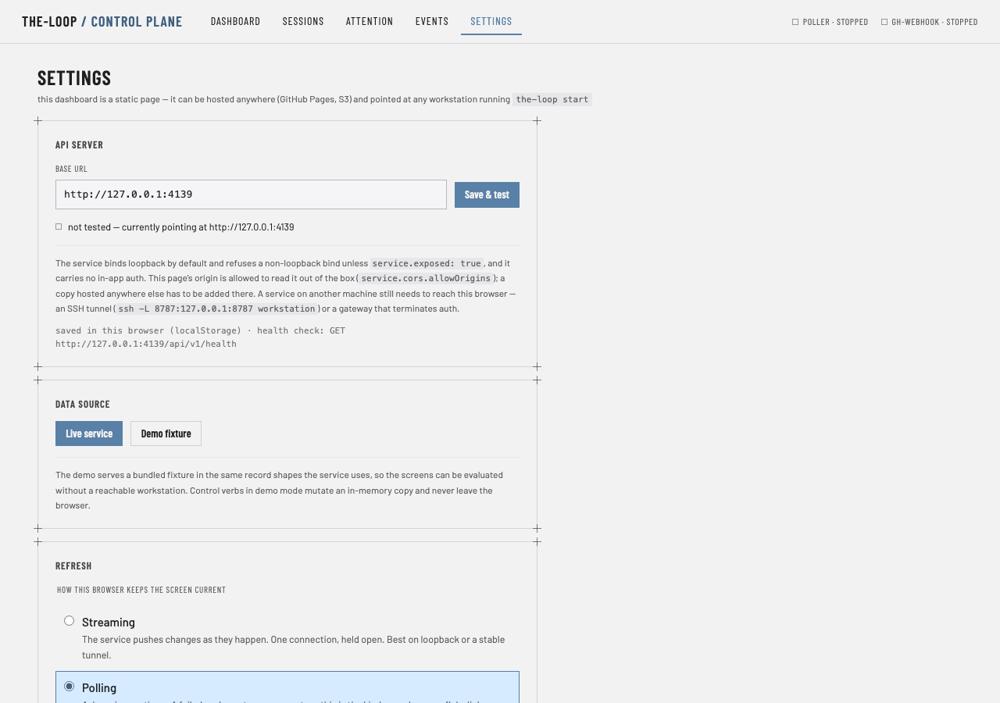
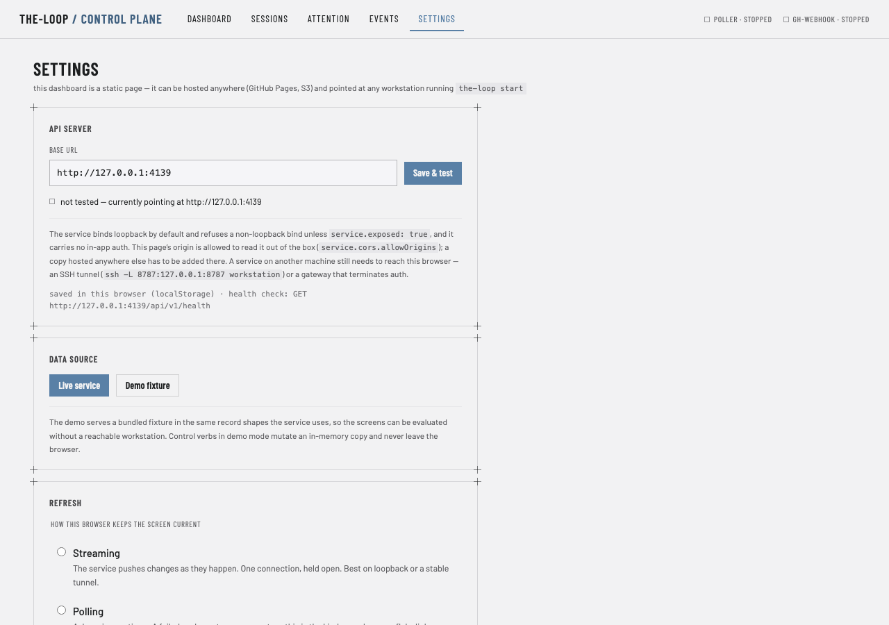
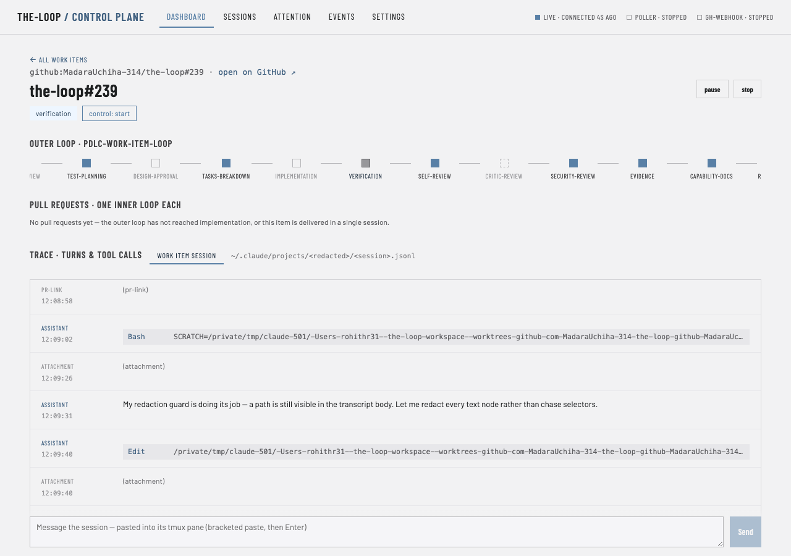
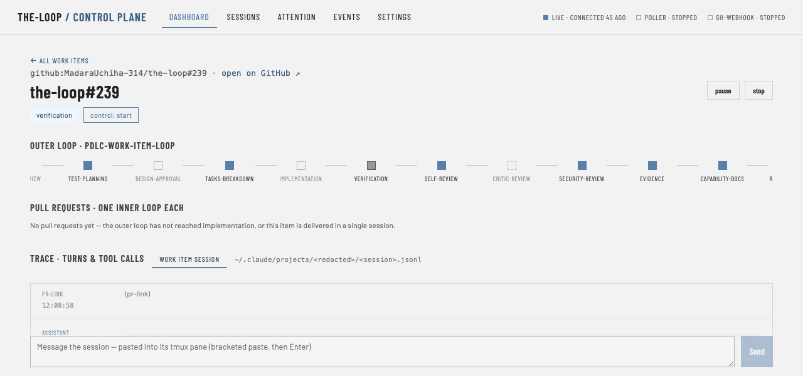
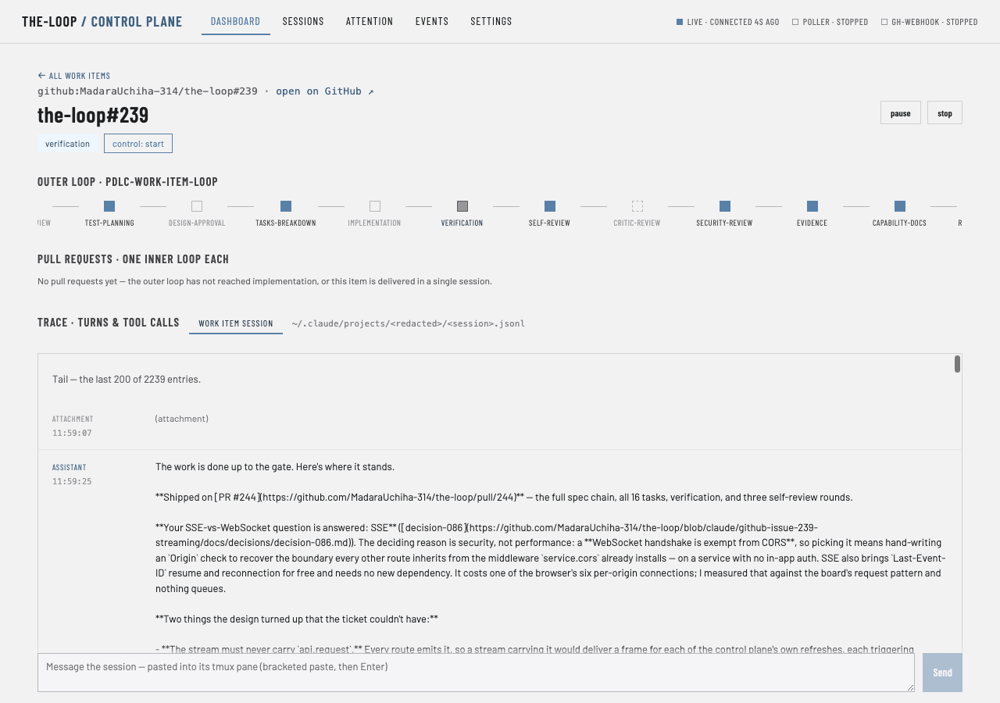
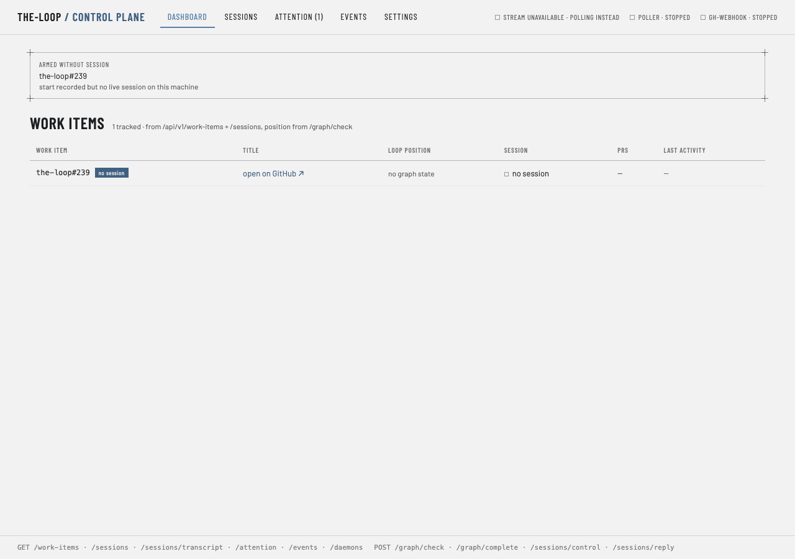

# Evidence: the browser rows (issue-239)

Testing-plan rows **T6** (UI/visual), **T10** (accessibility), **T12** (the live pass) and
**T13** (an older service), executed in **headless Chrome over CDP**.

## How, and why it needed no new dependency

The plan assumed the Chrome extension. It reports `not connected` on this machine and
`list_connected_browsers` returns `[]`, so that route was unavailable — but "no extension"
is not "no browser". Chrome is installed, and `bun` speaks WebSocket, so the pass is driven
by a ~200-line script that launches Chrome headless with `--remote-debugging-port` and
talks the DevTools Protocol to it directly.

```sh
"/Applications/Google Chrome.app/Contents/MacOS/Google Chrome" \
  --headless=new --remote-debugging-port=9333 --user-data-dir=<tmp> about:blank
bun run cdp.ts   # navigate, evaluate, screenshot
bun run live.ts  # the live-refresh measurement below
```

The script lives in the session scratchpad, **not in the repository**, and `ui/package.json`
is untouched. Making a browser pass a routine part of verification is a dependency decision
worth taking on its own merits — not one to acquire as a side effect of this work item.

**Everything below ran against the real thing:** a service built from this branch on
:4139, a second with `service.stream.enabled: false` on :4140, and `bun run dev` serving
the real bundle at :5173. Not the demo fixture.

## T12 — a change reaches the screen with no poll

The claim the work item exists for, measured rather than asserted. Streaming mode, page
idle, nothing clicked. `window.fetch` was wrapped to record every request the page makes.

```text
chip before:            live · connected 0s ago
quiet for 3s, calls:    0                       <- no timer is running
```

Then another process appended one record to the event log — what the poller, the receiver
or a harness does:

```text
calls after the append: /api/v1/work-items
                        /api/v1/sessions
                        /api/v1/attention
                        /api/v1/daemons
                        /api/v1/events?type=session.awaiting_input&type=session.reply_sent&limit=200
                        /api/v1/graph/check
latency, append -> the page's first request:  283ms
chip after:             live · connected 6s ago
```

Three things at once: the page was **genuinely idle** (zero requests in three seconds,
where polling would have made four calls plus a graph check), it refreshed **283ms** after
a change on the workstation (against a 15-second default — fifty times better, and well
inside R1.2's two-second budget), and it refreshed the **lists** because the appended
record was a `session.*` — which is the invalidation map's answer, not a full sweep for
its own sake.

It also proves the one row the plan said no automated test could: **R1.6, CORS parity.** A
real browser opened `EventSource` cross-origin from `http://localhost:5173` to the service
and the connection was accepted, because that origin is in `service.cors.allowOrigins`.
`httpx` cannot demonstrate that — it does not enforce CORS at all.



## T6 / R3 — the three refresh modes

Computed from the live DOM, not read off a screenshot:

```text
radiogroup: {"label":"Refresh mode","count":3,"checked":["stream"],
             "values":["stream","poll","manual"],"intervalVisible":false}
interval shown for poll:    true
interval shown for manual:  false
```

The interval select belongs to exactly one mode and appears only with it.

| | |
|---|---|
|  |  |
| Streaming selected — no interval | Polling — the interval appears |



## T6 / R6 — the trace panel and the chat bar

Real computed styles from a real engine — the half jsdom cannot reach:

```text
panelOverflowY:      auto
panelMaxHeight:      495px          <- clamp(240px, 55vh, 720px) at a 900px viewport
panelScrolls:        true
panelRole:           log
panelName:           Session transcript
panelTabIndex:       0
chatPosition:        sticky
chatBottom:          0px
chatWithinViewport:  true
```

At a 600px-tall viewport (R6.5), both stay usable — the panel takes 330px and the chat bar
is still on screen:

```text
layout (600px): {"panelHeight":330,"chatWithinViewport":true,"viewportHeight":600}
```

| | |
|---|---|
|  |  |
| The panel scrolls in its own frame; the chat bar is in reach | Both still usable at 600px |

Scroll anchoring, in a real engine: the panel is genuinely scrollable
(`scrollable: true`), sits flush at the newest entry when scrolled there
(`atBottomGap: 0`), and stays where it is put when scrolled back
(`scrolledBackTo: 0`). The rule itself is unit-tested in `WorkItemDetail.test.tsx`.



## T13 / R4.1 — a service that does not serve the stream, and the bug it found

**This row found a real defect**, which is what a browser pass is for.

`EventSource` retries a *dropped* connection, but a response it will not accept — a 404
from a service too old for the route — is **terminal**: the browser closes the source and
never tries again. The hook was counting to five consecutive failures before falling back,
so against a 404 it received exactly one, and sat on **`stream · reconnecting (1)`** with a
frozen board forever. That is precisely the state R4.1 exists to prevent, reached through
the mechanism meant to prevent it.

```text
before the fix:  chip (stream 404): ["stream · reconnecting (1)"]
after the fix:   chip (stream 404): ["stream unavailable · polling instead"]
```

The transport now reports whether the browser has given up (`readyState === CLOSED`), and a
terminal failure short-circuits the count. Covered by a regression test
(`useStream.test.ts` — "falls back at once when the browser gave up rather than retrying").



No stub would have found this: every stub retries politely.

## T10 — accessibility

Asserted against the DOM the assistive-technology tree is built from, which is more
reproducible than a description of what a screen reader said:

- The mode control is a real `radiogroup` with `aria-label="Refresh mode"` and three
  native radios, so it is announced as a group and traversed with arrow keys.
- The connection state is a `role="status"` region — `aria-live="polite"`, announced on
  change without stealing focus — and its **text** carries the state
  (`live · connected 2s ago`, `stream unavailable · polling instead`); the dot is
  `aria-hidden`. Colour is never the only carrier.
- The trace panel is `role="log"`, named `Session transcript`, `tabindex="0"` — reachable
  and scrollable from the keyboard.

**Not covered:** an actual screen-reader listening pass. What is asserted is the tree a
screen reader reads, not one particular reader's rendering of it.

## Redaction

Every screenshot is of a real control plane driving a real work item — this one — so the
capture script masks the trace panel's path caption and rewrites **every text node**
containing a `/Users/` path before the shutter, then **refuses to capture at all** if any
remains. That check fired twice during this pass, which is why it exists.
