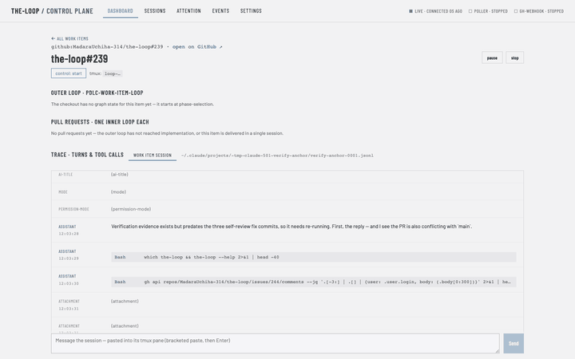
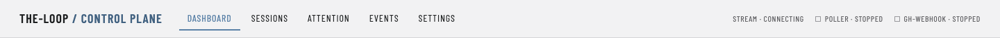
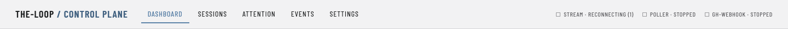

# Evidence: the two flows, and the two connection states the stills missed (issue-239)

[`browser.md`](browser.md) covers the browser rows as **states** — a screenshot per claim.
Two rows in the evidence plan are not states but *flows*, and a still cannot carry them:

> one animated capture each — both are **flows**, not states: the panel following a new
> entry, and a turn arriving with no poll — `ui/trace-anchor.gif`, `ui/live-turn.gif`

This file is those two captures, plus the two of R4.3's **four** connection states that
`browser.md`'s stills do not include. It was produced by a second Chrome pass (Playwright
driving the installed Chrome, rather than hand-rolled CDP) while the `#239` session was
verifying the same rows — see the note at the end.

## `live-turn.gif` — a turn appears, and nothing asked for it

The detail page in streaming mode, header reading `live · connected`, transcript panel
pinned to the newest entry. The first four frames are **idle on camera**; then another
process appends one line to the session transcript and the turn appears.

| | |
|---|---|
| idle recorded before the arrival | 7.3 s |
| API requests during that idle | **0** |
| requests caused by the arrival | one — `GET /api/v1/sessions/transcript` |
| entries in the panel | 46 → 47 |

A longer idle window, measured without the camera running, says the same thing more
strongly: **0 requests in 15 s**, then the first request **0.34 s** after the append, and
the held stream connection was never reopened (0 reconnects). Against the 15-second poll
this replaces, that is the whole work item in two numbers.

The first attempt at this capture is worth recording because it was **discarded**: it
watched the dashboard while a `graph.advanced` record arrived, and the record changed no
rendered value — the only pixels that moved across fourteen frames were the
`connected Ns ago` clock. A GIF that shows nothing is not evidence that something arrived,
so the capture moved to the surface where a turn is visible. The builder now refuses to
write a GIF whose frames never substantially change.

## `trace-anchor.gif` — the panel follows the newest entry

Same setup, pinned to the bottom, one entry appended:

| | scrollTop before | scrollTop after | at newest? |
|---|---|---|---|
| pinned (R6.3) | 3178 | 3240 | yes |
| scrolled back into history (R6.4) | 1244 | 1244 — **0px drift** | no, correctly |

**The measurement had to be taken with the camera off.** Screenshotting *inside* the window
between the re-render and the anchoring scroll forces layout and parks the panel mid-flight:
it read 434px every time, whatever offset it started from. Taken at face value that looks
like R6.4 failing by 810px — a scrolled-back panel yanked away from the reader. It is not:
with no screenshots in the loop the panel holds position exactly, and the pinned case
follows exactly. Frames for the GIF are therefore captured on a separate arrival that
nothing asserts against, and the assertions run untouched. A capture that changes the
behaviour under test is not evidence of it.

## R4.3 — the two remaining connection states

`browser.md` shows `live` and `fallback`. The requirement names four, and the middle two
are transient, so each was forced rather than waited for: `connecting` by holding the
stream response open unanswered, `reconnecting` by refusing it and capturing before the
fifth failure tips into fallback.

| State | What the header reads |
|---|---|
| connecting | `stream · connecting` |
| reconnecting | `stream · reconnecting (1)` |

Both are text beside the dot, in the same `role="status"` / `aria-live="polite"` region as
the other two — the property R4.3 is actually about, since a dot alone says nothing to a
reader who cannot see colour.

`ui/fallback-404.png` is the full page behind `browser.md`'s cropped header: the board
still rendered and still current by polling, which is the half of R4.1 a header crop cannot
show. `ui/a11y-modes-focused.png` is the refresh-mode group with the keyboard focus ring on
the checked radio, the visible counterpart to T10's assertions.

## Redaction

Every capture here went through the same rule as `browser.md`'s: mask the text of every
node, then **verify no match survives before the shutter**, and fail the run rather than
write a file that still holds a path. It reported zero survivors across all nine captures.
Masked: `/Users/<name>` paths, the project-slug form of them, and tmux target names.

## A harness note, not a product finding

These captures were made by the session working **PR #244** while the session working
**issue-239** was verifying the same four rows in the *same worktree* — two Claude Code
sessions, one branch, one working tree. It showed: services restarted under each other,
the session registry repointed mid-test, and `ui/src` changing while a measurement ran
against it. Nothing here is a defect in the streaming work, and the two sets of results
agree; but the overlap is luck rather than design, and it is escalated on PR #244 rather
than filed as a finding against this work item.
