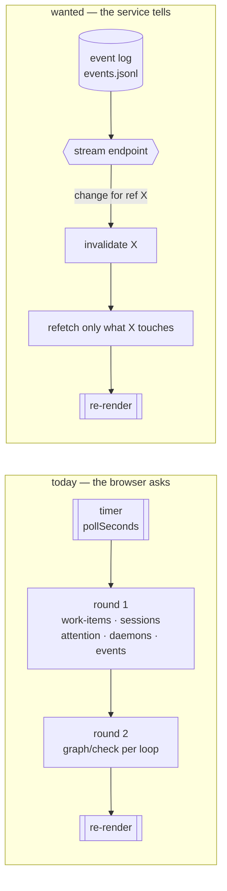

# Requirements: stream the-loop's service to the control plane

> Phase 1 of the spec chain. This work item declared `requirements-approval` **skipped**
> at `phase-selection` (@MadaraUchiha-314), so this document is not gated on its own
> approval — the next human gate is `design-approval`, which reviews `design.md` and
> `testing-plan.md` together. Anything below that is a judgement call rather than a
> reading of the ticket is called out in **Open questions**, so it can be overturned
> there.

## Introduction

The control plane learns nothing until it asks again. Every screen is driven by
[`useControlPlane`](../../../ui/src/state/useControlPlane.ts), a two-round poll on a
fixed timer: round one is four flat list calls, round two is one `POST /graph/check` per
loop. At the shipped default of 15s an operator watching an agent work sees each turn up
to 15 seconds late, and the cost of looking sooner is paid by the whole board — a shorter
interval multiplies *every* call, including the graph checks that build a runtime per
loop. Turning the interval down to be kind to a remote workstation is exactly what makes
the screen stale.

This work item ([#239](https://github.com/MadaraUchiha-314/the-loop/issues/239)) inverts
that for operators who want it: the service tells the control plane when something
changed, and the control plane re-renders. Polling stays — it is the right answer over a
flaky tunnel, and manual refresh is the right answer when the workstation is remote and
metered — so the three become a choice the viewer makes in Settings rather than a
constant in the bundle.

The ticket's [second comment](https://github.com/MadaraUchiha-314/the-loop/issues/239#issuecomment-5305156096)
adds an unrelated ask to the same item: on the work-item detail page, reaching the chat
bar means scrolling past the whole transcript. It is carried here as Requirement 6 —
independent of streaming, and separable if the design gate wants it split.

The diagram carries the load-bearing detail: a stream that only replays
`GET /api/v1/events` does **not** refresh the board, because a work item's position on
its loop comes from round two, which reads `graph-state.json` on disk and is not in the
event log's shape. Whatever the stream carries has to be enough to invalidate round two,
or the rail goes stale while the event list scrolls — a screen that looks live and lies.

## Requirements

### Requirement 1 — the service publishes a live stream of change

**User story:** As an operator watching a work item run, I want the service to push
changes to my browser, so that the screen reflects the workstation without me asking it
to.

#### Acceptance criteria (EARS)

1. WHEN the service is running THEN the service SHALL expose an `/api/v1` endpoint that
   holds a connection open and delivers control-plane change notifications to the client
   until either side closes it.
2. WHEN a record is appended to the event log THEN the service SHALL deliver a
   corresponding notification to every open, matching subscriber within 2 seconds.
3. WHEN a client supplies a work-item filter THEN the service SHALL deliver only
   notifications matching that filter.
4. WHILE a subscriber is connected and no change has occurred the service SHALL send a
   periodic keep-alive, so that an idle connection is not closed by an intermediary and
   the client can distinguish "quiet" from "dead".
5. WHEN a client reconnects supplying the cursor of the last notification it received
   THEN the service SHALL deliver the notifications appended after that cursor, or SHALL
   state that it cannot, so that the client never silently misses a change it can detect.
6. WHEN the endpoint is served THEN the service SHALL apply the same `service.cors`
   origin allowlist that governs every other `/api/v1` route (see **Security
   considerations** — this is not automatic for every transport).
7. WHEN the OpenAPI contract is generated THEN it SHALL describe the endpoint, its media
   type and its notification payload, per `apiSpecs` (contract-first,
   `docs/api-specs/openapi/the-loop.v1.yaml`).

### Requirement 2 — the control plane re-renders from the stream

**User story:** As an operator, I want the screen I am looking at to update as the agent
works, so that I stop reaching for a refresh.

#### Acceptance criteria (EARS)

1. WHEN a streamed notification names a work item that is on the board THEN the control
   plane SHALL refresh that work item's data, including its loop position, without
   waiting for a poll interval.
2. WHEN a streamed notification names a work item that is **not** on the board THEN the
   control plane SHALL refresh the board's list data, so that a newly spawned work item
   appears without a reload.
3. WHILE the work-item detail page is open the control plane SHALL apply streamed
   notifications for that work item to the panels the page shows, including its
   transcript.
4. WHEN notifications arrive faster than the screen can usefully redraw THEN the control
   plane SHALL coalesce them, so that a burst costs one refresh rather than one per
   notification.
5. WHEN a refresh triggered by the stream is already in flight THEN the control plane
   SHALL NOT start a second overlapping refresh of the same data.

### Requirement 3 — the viewer chooses how the screen refreshes

**User story:** As an operator, I want to pick streaming, polling or manual refresh in
Settings, so that the screen's cost matches how I am reaching the workstation.

#### Acceptance criteria (EARS)

1. WHEN the Settings page is open THEN it SHALL offer exactly three refresh modes:
   **streaming**, **polling** at a chosen interval, and **manual**.
2. WHEN the viewer selects a mode THEN the control plane SHALL apply it without a page
   reload and SHALL persist it in this browser, so that it survives a reload.
3. WHILE the mode is **manual** the control plane SHALL make no background request of any
   kind, and SHALL refresh only when the viewer asks.
4. WHILE the mode is **polling** the control plane SHALL behave exactly as it does today
   at the selected interval, and SHALL hold no stream connection open.
5. WHILE the mode is **streaming** the control plane SHALL hold at most one stream
   connection per browser tab.
6. WHEN settings written by an older version of the control plane are read THEN the
   control plane SHALL map them onto a valid mode rather than discarding them — an
   interval of 0 is **manual**, any other stored interval is **polling** at that interval.

### Requirement 4 — streaming degrades visibly, never silently

**User story:** As an operator, I want to be told when the stream is not working, so that
I never read a stale screen as a live one.

#### Acceptance criteria (EARS)

1. WHEN the stream cannot be established — the service is older than this endpoint, the
   origin is not in `service.cors.allowOrigins`, or nothing is listening — THEN the
   control plane SHALL show which of those it was, with the remedy, and SHALL fall back
   to polling rather than showing an unchanging screen.
2. WHEN an established stream drops THEN the control plane SHALL attempt to reconnect
   with a backoff, and SHALL show that it is reconnecting while it does.
3. WHILE the stream is connected the control plane SHALL show that the screen is live and
   when it last heard from the service, so that "nothing is happening" and "nothing is
   arriving" are distinguishable on the screen.
4. IF reconnection keeps failing THEN the control plane SHALL settle into the fallback
   mode and say so, rather than retrying invisibly forever.

### Requirement 5 — streaming must not degrade the rest of the service

**User story:** As an operator whose workstation also serves the CLI and the MCP
endpoint, I want an open dashboard tab to cost the service almost nothing, so that
watching a work item does not slow down working one.

#### Acceptance criteria (EARS)

1. WHILE any number of subscribers up to the configured maximum are connected the service
   SHALL continue to answer every other `/api/v1` route.
2. WHEN the number of open subscribers would exceed the configured maximum THEN the
   service SHALL refuse the new connection with a stated reason rather than accepting it
   and degrading.
3. WHILE subscribers are connected and idle the service SHALL NOT re-read the whole event
   log per subscriber per change.
4. WHEN a subscriber disconnects THEN the service SHALL release its resources, including
   any file handle and any background task opened on its behalf.

### Requirement 6 — the chat bar is reachable without scrolling the trace

**User story:** As an operator answering an agent, I want the message box in reach, so
that replying does not mean scrolling past the entire transcript.

> Carried from the ticket's second comment. Independent of Requirements 1–5.

#### Acceptance criteria (EARS)

1. WHILE the work-item detail page is open the chat bar SHALL remain visible without the
   viewer scrolling to it.
2. WHEN the trace panel holds more entries than fit THEN the panel SHALL scroll within
   its own bounds rather than extending the page.
3. WHEN a new transcript entry arrives while the trace panel is scrolled to its newest
   entry THEN the panel SHALL keep showing the newest entry.
4. IF the viewer has scrolled the trace panel away from its newest entry THEN an arriving
   entry SHALL NOT move the panel's scroll position.
5. WHEN the viewport is too short to show both a useful trace and the chat bar THEN the
   page SHALL still allow the viewer to reach both.

## Non-functional requirements

- **Latency.** A change on the workstation reaches an open, streaming control plane within
  2 seconds (R1.2). The number is deliberately loose: the win over the 15s default is an
  order of magnitude, and chasing tighter costs a filesystem watch this project does not
  need.
- **Cost of an idle tab.** A connected but idle subscriber does no repeated work per
  interval (R5.3). Today an idle board costs four list calls plus one runtime-building
  `graph/check` per loop every 15s; streaming that is *more* expensive than polling would
  be a regression wearing a feature's clothes.
- **Observability.** Subscribe, deliver-failure, refuse and disconnect are event-log
  event types with entries in `EVENT_TYPES`, per `reference/observability.md` — the same
  bar every other the-loop surface meets. The catalog is the contract: an
  instrumentation point without a registered type is not instrumented.
- **Accessibility.** The Settings mode control and the live/reconnecting indicator are
  reachable and announced by keyboard and screen reader; the sticky chat bar does not trap
  focus, and the scrollable trace panel is keyboard-scrollable. Colour is never the only
  carrier of the connection state (R4.3).
- **Demo mode.** `ui/src/demo/client.ts` answers the same interface from a fixture so the
  hosted page is explorable with no workstation. Streaming does not exempt itself: the
  demo client answers the stream too, or the mode is visibly unavailable in demo mode.

## Security considerations

> Threat-model-lite per `security.threatModel.required`. This work item **does add attack
> surface** — a new, long-lived, server-push channel on a service that carries no in-app
> authentication — so the analysis below is the substance of the design gate, not a
> formality.

- **Actors & trust.** The service binds loopback by default and carries **no in-app auth**
  (decision-059) — a deployment that exposes it puts an auth-terminating gateway in front.
  The untrusted actor is therefore *any page in a browser that can reach the base URL*,
  and any local process on the workstation. The stream is a **read** surface; it must not
  become a control surface.
- **Trust boundaries & data.** The notifications carry event-log material — work-item
  refs, actor handles, filesystem paths (`cwd`), tmux target names, and the text of
  questions agents asked. That data is *already* served by `GET /api/v1/events`, so the
  change is not the data but the **channel**: a push channel that a page can open once and
  keep, without the operator's per-request intent, and that an intermediary may buffer or
  log. No new secret is moved; nothing streamed may be more sensitive than what
  `/api/v1/events` already answers, and the stream must not become a way to read files the
  REST surface will not serve.
- **The transport choice is a security choice, not only an engineering one.** The ticket
  leaves SSE-vs-WebSocket open. They differ in a way that matters here: an
  `EventSource`/`fetch` request is governed by the CORS allowlist the service already
  enforces (`service.cors.allowOrigins`, issue-211), whereas the **WebSocket handshake is
  exempt from CORS** — the browser will send it from any origin, and the server alone
  decides. Choosing WebSocket therefore means writing an explicit `Origin` check against
  the same allowlist, and a design that omits it silently drops a boundary the REST
  surface has. This is stated as a requirement (R1.6) rather than left to the design
  author's memory.
- **Abuse cases (EARS):**
  1. WHEN a page opens more stream connections than the configured maximum THEN the
     service SHALL refuse the excess connections and SHALL continue to answer every other
     `/api/v1` route.
  2. WHEN a stream request arrives from an origin that is not in
     `service.cors.allowOrigins` THEN the service SHALL refuse it, for every transport,
     including one the browser does not pre-flight.
  3. WHEN a stream request carries a malformed or unsupported filter or cursor THEN the
     service SHALL refuse it with a stated reason and SHALL NOT fall back to streaming
     everything.
  4. WHEN a client requests replay from a cursor that would require reading an unbounded
     amount of history THEN the service SHALL bound what it replays and SHALL tell the
     client that it did.
  5. WHEN a subscriber stops reading but does not close the connection THEN the service
     SHALL bound what it buffers for that subscriber and SHALL drop it rather than growing
     memory without limit.
- **Fail closed.** Absent, ambiguous or unparseable configuration means **no stream**: an
  empty `service.cors.allowOrigins` installs no CORS middleware today and must not become
  a permissive default for the stream. A refused connection is refused with a reason on
  the wire and an event in the log; it is never downgraded to an unfiltered or
  unauthenticated one.

## Out of scope

- **Authentication for the stream.** The service's posture is decision-059 — network
  scoping, with a gateway owning auth. Streaming inherits it and does not reopen it.
- **Streaming the harness's output token by token.** R2.3 refreshes the transcript panel
  when the transcript changes; it does not introduce a character-level feed of a running
  agent.
- **Push to anything other than a browser.** No webhooks out, no notifications, no CLI
  `--follow`. The CLI's route to the same data stays `the-loop events`.
- **Replacing the poll.** Polling remains a first-class mode (R3.4), unchanged in
  behaviour.
- **A persistent event bus.** The event log is JSONL on disk by decision-025; this work
  item reads it, it does not replace it.

## Open questions

Raised on the ticket / to be settled at the `design-approval` gate:

1. **SSE or WebSocket** — deferred to `design.md` on purpose; the ticket asks for the
   choice to be made with reasons. The constraints it must answer to are already fixed
   above: R1.6 and abuse case 2 (CORS parity), R5.1 (the service runs a single uvicorn
   worker, and every existing route is a synchronous `def` served from the threadpool),
   and R1.5 (resume-from-cursor, which `EventSource` gives for free via `Last-Event-ID`).
2. **Is the transcript in scope for live refresh?** R2.3 says yes, reading the ticket's
   "re-render" as covering the panel an operator actually watches. It is the largest
   single piece of work in Requirement 2 and the cleanest thing to cut if the design gate
   wants this smaller.
3. **What is the default mode for a new viewer?** Written as an open question rather than
   assumed: streaming is the better default for a loopback service and the worse one for
   a page reaching a workstation over a tunnel it cannot test in advance. A design that
   picks streaming must satisfy R4.1 well enough that a viewer who cannot stream is not
   left staring at a dead board.
4. **Does Requirement 6 belong in this work item?** It arrived as a comment on this
   ticket and is carried here in full. It shares no code with Requirements 1–5 beyond the
   detail page, so it can be split into its own item without disturbing the rest.

## Review comments

> Appended by the-loop's `record-feedback` hook when a human gate approves with comments.
