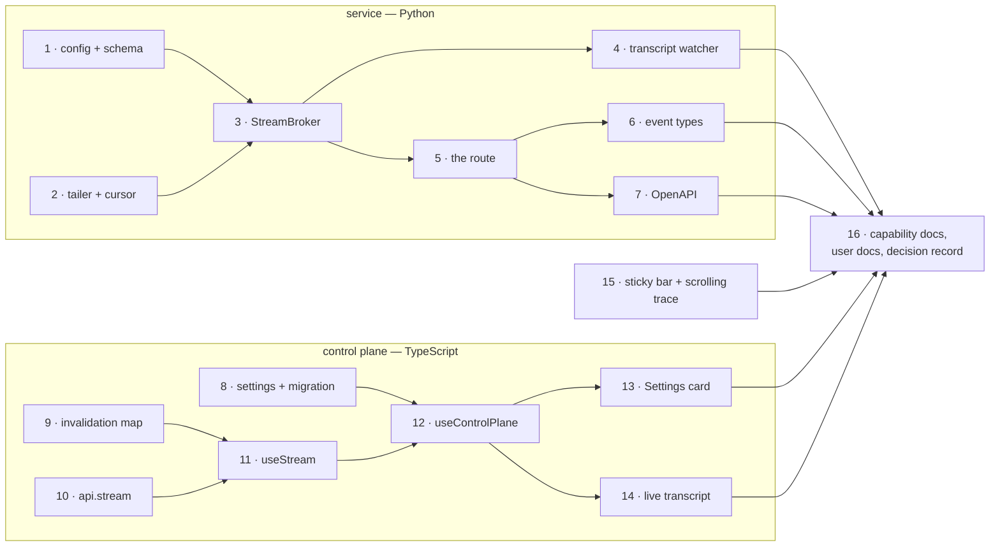

# Tasks: stream the-loop's service to the control plane

> The last spec artifact. Derived from the locked [`design.md`](design.md) and
> [`testing-plan.md`](testing-plan.md), both approved by @MadaraUchiha-314 at
> `design-approval` with no changes requested.

**Sixteen tasks in two independent chains that meet only at the documentation task.** The
service chain (1–7) and the control-plane chain (8–14) share no file, so a stall in one
does not block the other; task 15 (Requirement 6) depends on nothing at all. TDD holds
throughout (`tdd.mode: standard`): every task names the test written first and the
red→green transition recorded as evidence.

## Task list

### The service — `GET /api/v1/stream`

- [x] 1. `service.stream` config: schema entry and resolver
  - Add the `service.stream` object to `cli/the_loop/schemas/cli-config.schema.json` —
    `enabled` (default true), `maxSubscribers` (default 8, minimum 1), `keepAliveSeconds`
    (default 15, minimum 1), `additionalProperties: false`, shaped after `service.mcp`.
  - Add `stream_config(cli_config)` to `cli/the_loop/api/config.py`, beside
    `service_config` / `cors_config`: fills every default, clamps below the minimum, and
    treats an unreadable or absent section as the defaults rather than as "off".
  - **Security-relevant** — this is the file `autonomy.sensitivePaths` matches, and the
    reason the work item is risk tier 4. The negative case is the one to write first: a
    config that names an unknown key under `service.stream` is refused by the schema, not
    ignored.
  - _Depends on:_ none
  - _Requirements:_ R5.2, R1.4
  - _Test:_ T1 — `uv run --project cli python -m pytest -q cli -k stream_config` (red→green),
    plus `uv run python scripts/validate_config.py`

- [ ] 2. The log tailer and the cursor
  - New `cli/the_loop/api/stream.py`. A `LogTail` that owns an offset, reads only whole
    `\n`-terminated lines from it, buffers a partial trailing line until the next read, and
    yields parsed records with the offset **after** each record as its cursor.
  - Cursor resolution as its own pure function: an offset beyond the current size →
    `truncated`; a gap wider than the 256 KiB replay window → `replay-window`; otherwise
    the slice to replay. Constants (`_TICK_SECONDS = 0.5`, `_REPLAY_BYTES = 256 * 1024`,
    `_QUEUE_SIZE = 256`) live here, not in config.
  - The `api.request` / `mcp.call` exclusion is applied **here**, at the tailer, so no
    caller can route around it. Design § Trade-offs: no opt-in flag exists.
  - _Depends on:_ none
  - _Requirements:_ R1.5, R5.3
  - _Test:_ T1 — `pytest -q cli -k "tail or cursor"` (red→green). Write the
    partial-trailing-line case and the `api.request`-excluded case before the reader.

- [ ] 3. `StreamBroker`: one tailer task, per-subscriber bounded queues
  - Subscriber registry with a capacity check at registration; `asyncio.Queue(maxsize=256)`
    per subscriber; one `asyncio.Task` ticking every 0.5s that reads the log **once** and
    fans out to every matching queue.
  - On a full queue: drain it, enqueue a single `desync` frame, keep the connection.
  - On unregister: cancel nothing shared, release the subscriber's queue; the tailer task
    stops when the last subscriber leaves.
  - Wire start/stop into `cli/the_loop/api/lifespan.py` beside the MCP session manager and
    the hosted ingresses.
  - **Security-relevant** — abuse cases 1 and 5 (`design.md` §Security design).
  - _Depends on:_ 1, 2
  - _Requirements:_ R1.2, R5.1, R5.3, R5.4
  - _Test:_ T3, T9 — `pytest -q cli/tests/test_stream_integration.py -k "broker or abuse"`
    (red→green); the negative tests are capacity-refusal and queue-overflow-desyncs.

- [ ] 4. The transcript watcher
  - Inside the broker: for each ref a subscriber asked to watch, stat the transcript file
    resolved through the same path logic `core.sessions.get_transcript` uses, and emit a
    `transcript` frame carrying `{ref, totalLines}` when it grows. No content on the wire.
  - A ref whose path cannot be resolved yet (no session, no conversation id) is retried
    every 10 ticks, so a session registering later starts producing frames without a
    reconnect.
  - _Depends on:_ 3
  - _Requirements:_ R2.3
  - _Test:_ T3 — `pytest -q cli/tests/test_stream_integration.py -k transcript` (red→green)

- [ ] 5. The route: `GET /api/v1/stream`
  - `async def` — not `def`. A synchronous generator would hold an anyio threadpool slot
    for the life of the connection; this is the mechanism behind R5.1, so the test asserts
    the REST surface still answers with the stream at capacity.
  - `StreamingResponse` of `text/event-stream`, `Cache-Control: no-cache`,
    `X-Accel-Buffering: no`; `retry: 3000` sent once at connect; a keep-alive comment every
    `keepAliveSeconds`.
  - Validate `Last-Event-ID`, `workItem` and `transcript` before accepting: malformed →
    `400` with the reason (never a silent unfiltered fallback), at capacity → `503` with
    `Retry-After`, `enabled: false` → `404`.
  - **Security-relevant** — abuse cases 1, 3 and 4.
  - _Depends on:_ 3
  - _Requirements:_ R1.1, R1.3, R1.4, R1.5, R1.6, R5.1, R5.2
  - _Test:_ T3, T8, T9 — `pytest -q cli/tests/test_stream_integration.py` (red→green), with
    the Gherkin scenarios named in `testing-plan.md` § Scenarios

- [ ] 6. Observability: four `EVENT_TYPES` and their emission points
  - `stream.subscribed`, `stream.refused`, `stream.desync`, `stream.disconnected`, with
    the field lists `design.md` § Data models gives, registered in
    `cli/the_loop/eventlog.py` and emitted from the route and the broker.
  - The catalog is the contract: a point without a registered type is not instrumented.
  - _Depends on:_ 5
  - _Requirements:_ the observability non-functional requirement
  - _Test:_ T3 — `pytest -q cli -k "event_types or stream_events"`; assert every emitted
    type is in `EVENT_TYPES`, which is the check that catches the next one somebody forgets

- [ ] 7. The OpenAPI contract
  - Describe `streamEvents` in `docs/api-specs/openapi/the-loop.v1.yaml`: the `GET`, its
    two query parameters, the `text/event-stream` response, the `log` / `transcript` /
    `desync` frame schemas, and the `400` / `404` / `503` responses.
  - Contract-first (`apiSpecs`): the document is authored, the docs are generated from it.
  - _Depends on:_ 5
  - _Requirements:_ R1.7
  - _Test:_ T4 — the repo's OpenAPI validation step

### The control plane

- [ ] 8. Settings: `refreshMode` and the v1 migration
  - `ui/src/state/settings.ts` gains `refreshMode: "stream" | "poll" | "manual"`, default
    `stream`; `pollSeconds` is kept as the interval used while the mode is `poll`.
  - Migration reads the existing `the-loop:settings:v1` key rather than minting a v2, so no
    viewer loses their base URL: `refreshMode` absent and `pollSeconds === 0` → `manual`,
    absent otherwise → `poll` at that interval.
  - _Depends on:_ none
  - _Requirements:_ R3.2, R3.6
  - _Test:_ T2, T11 — `cd ui && bun run test` (red→green); write the migration cases first

- [ ] 9. The invalidation map
  - A pure function in `ui/src/api/model.ts` (or a new `stream.ts` beside it): frame →
    `{lists, graphRefs, transcriptRefs}`. `graph.*` → that one ref; anything else carrying
    a `work_item`, and any **unrecognised** event type → `lists`.
  - The unknown-type case is deliberate and gets its own test: `EVENT_TYPES` grows, and a
    type the UI has never heard of must not be invisible.
  - _Depends on:_ none
  - _Requirements:_ R2.1, R2.2
  - _Test:_ T2 — `cd ui && bun run test -t invalidation` (red→green)

- [ ] 10. `TheLoopApi.stream` on both clients
  - Add `stream(query, handlers): () => void` to the interface; `HttpApi` implements it
    with `EventSource` (which resends `Last-Event-ID` on its own), returning an
    unsubscribe.
  - `DemoApi` implements the same method against the bundled fixture on a timer, so demo
    mode is not a hole in the feature (the non-functional requirement says so explicitly).
  - _Depends on:_ none
  - _Requirements:_ R1.1, R3.5
  - _Test:_ T2 — `cd ui && bun run test` with a stubbed `EventSource` (red→green)

- [ ] 11. `useStream`: connection state machine, coalescing, fallback
  - New `ui/src/state/useStream.ts`. States `live` / `reconnecting` / `fallback` / `off`;
    invalidations accumulated over a 250ms window and flushed as one; five consecutive
    `onerror` events close the source and settle into polling with the reason.
  - _Depends on:_ 9, 10
  - _Requirements:_ R2.4, R4.2, R4.3, R4.4
  - _Test:_ T2 — `cd ui && bun run test -t useStream` (red→green); assert the five-failure
    fallback and that two frames inside the window cost one flush

- [ ] 12. `useControlPlane`: mode-driven, with a targeted graph refresh
  - The effect branches on `refreshMode`: `poll` keeps today's timer exactly, `manual`
    starts nothing, `stream` subscribes and refreshes on flush.
  - Add the targeted path: `fetchGraphs` filtered to one ref, merged into the held reports,
    so a `graph.*` frame costs one `POST /graph/check` rather than a board sweep.
  - The existing in-flight `AbortController` guard covers R2.5 unchanged — assert it rather
    than rewriting it.
  - _Depends on:_ 8, 11
  - _Requirements:_ R2.1, R2.2, R2.5, R3.3, R3.4
  - _Test:_ T2 — `cd ui && bun run test` (red→green)

- [ ] 13. The Settings Refresh card and the connection indicator
  - Rebuild the Refresh card as the three-mode radio group from
    [`design/refresh-settings.html`](design/refresh-settings.html); the interval select
    appears only for `poll`. Reuses `.lp-settings-card`, `.lp-conn`, `.lp-conn-dot` — no new
    primitive, no new colour.
  - The indicator renders the four states as text plus a dot, in an `aria-live="polite"`
    region.
  - _Depends on:_ 12
  - _Requirements:_ R3.1, R3.2, R4.1, R4.3
  - _Test:_ T2, T6, T10 — vitest for the mode switch; the browser pass for the rendered
    states and the keyboard/screen-reader check

- [ ] 14. Detail page: the transcript refreshes from the stream
  - `WorkItemDetail.tsx` subscribes the viewed ref as a `transcript` watch and refetches
    `GET /api/v1/sessions/transcript` when a frame says it grew. Changing the viewed tab
    reconnects with the new watch; `Last-Event-ID` makes that lossless.
  - _Depends on:_ 12
  - _Requirements:_ R2.3
  - _Test:_ T2, T12 — vitest for the invalidation wiring; the live pass for the thing itself

### Requirement 6 — the ticket's second comment

- [ ] 15. Sticky chat bar, scrolling trace, scroll anchoring
  - `.lp-trace` gets `max-height: clamp(240px, 55vh, 720px)`, `overflow-y: auto`,
    `overscroll-behavior: contain`, `tabindex="0"` and an accessible name; `.lp-chat` gets
    `position: sticky; bottom: 0` in normal flow, so it traps no focus and covers nothing.
  - Scroll anchoring: capture whether the panel is within 24px of its bottom **before**
    appending, and only then scroll to the new bottom. Prototyped in
    [`design/detail-layout.html`](design/detail-layout.html).
  - Independent of tasks 1–14 — it shares no module with the streaming work.
  - _Depends on:_ none
  - _Requirements:_ R6.1, R6.2, R6.3, R6.4, R6.5
  - _Test:_ T6, T10 — the browser pass, with `trace-anchor.gif` as the evidence that
    R6.3 and R6.4 are both true

### Documentation

- [ ] 16. Capability docs, user-facing docs, and the decision record
  - `docs/capabilities/control-plane.md` — the refresh modes and the stream, with history
    rows tracing to this work item; `docs/capabilities/observability.md` — the four new
    event types.
  - User-facing: `ui/README.md` (the refresh modes, and what demo mode does with the
    stream) and the configuration reference for `service.stream`. The execution log's
    `## Documentation` section records what changed, with the reason for anything that did
    not.
  - `docs/decisions/decision-<nnn>.md` — **SSE over WebSocket**, recording the CORS
    asymmetry as the deciding reason. "Why not WebSocket" will be asked again; the answer
    should not have to be reconstructed from a PR comment.
  - _Depends on:_ 7, 13, 14, 15
  - _Requirements:_ all — this is the ready-to-ship gate's documentation item
  - _Test:_ T1 (markdownlint via `make lint`); the `capability-docs` node gates the rest

## Dependency graph (DAG)



Three roots in the service chain's left column (1, 2), three in the UI's (8, 9, 10), and
task 15 standing alone — six things can start at once. The two chains meet only at task 16,
which is the honest shape: nothing in the browser waits on the endpoint existing, because
tasks 10 and 11 are written against a stubbed `EventSource` either way.

## Checkpoints

Checkpoint after **every** task: tick it here, append the execution-log entry with a
concrete **Next**, record the red→green transition, and commit. Then reset per
`contextManagement.taskBoundary` (compact).

Run the full suite as CI runs it after task 7 (the service chain closes), after task 14
(the UI chain closes), and after task 16:

```sh
make check
cd ui && bun run lint && bun run test && bun run build
```

After the last task the **verification** node executes `testing-plan.md` — every activity
ticked only once run, with its command, outcome and committed evidence. Only then do
`self-review`, the **security review gate** and `human-approval` run. Two things about that
gate are known now rather than at the end:

- `critic-review` was declared skipped at `phase-selection`, so `self-review` is the whole
  automated review chain (`reviews.selfReviewCount: 3`).
- The work item is **risk tier 4** (task 1 edits a file matching
  `autonomy.sensitivePaths`), and `security.review.humanSignOffMinTier` is 4, so the
  security review needs a **named human sign-off** — not the checklist alone.

## Review comments

> Appended by the-loop's `record-feedback` hook when a human gate approves with comments.
