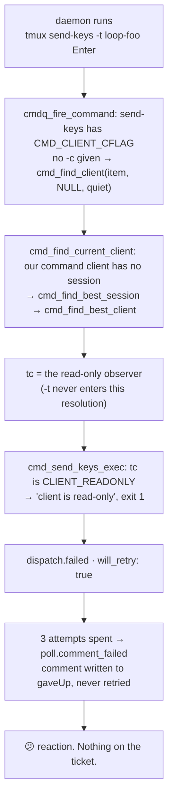

# Bugfix spec: a read-only tmux observer blocks every comment the poller forwards, and the give-up is silent

> Phase 1 of 3 for a bug (bugfix → design → tasks). This phase MUST be reviewed and
> approved before the design is derived from it.

## Summary

`the-loop sessions attach --read-only` is the documented safe way to watch a session — the
session announcement itself prints it. On tmux **3.7 and newer** it breaks the session's
only input path: every comment the poller forwards fails with `client is read-only`, the
poller spends its three attempts in about three minutes, and then abandons the comment
permanently. The only thing the human sees is a 😕 reaction on their own comment.

Two defects, one report. The first is the delivery: the loop's submit keystroke is refused
while an observer is attached. The second is what happens after: a comment abandoned by the
retry budget produces **no comment on the ticket**, so a human who told an agent to do
something has no way to learn it was never told. Ticket:
[#240](https://github.com/MadaraUchiha-314/the-loop/issues/240); the real occurrence is
[#238 (comment)](https://github.com/MadaraUchiha-314/the-loop/issues/238#issuecomment-5305150694).

## Steps to reproduce

1. Run a work item so a tmux-mode session exists.
2. Attach read-only from another terminal and leave it attached:
   `the-loop sessions attach --work-item <ref> --read-only` (i.e. `tmux attach-session -r`).
3. Post a comment on the ticket and wait out three poll cycles.

Observed in `.the-loop/logs/events.jsonl` (from the reporter, tmux 3.7b / macOS 15.6):

```json
{"event": "reaction.added", "state": "started", "content": "eyes", "target": "comment"}
{"event": "dispatch.failed", "harness": "claude", "via": "tmux",
 "gh_event": "issue_comment", "delivery_id": "poll-comment-IC_kwDO…",
 "error": "tmux send-keys exited 1: client is read-only", "will_retry": true}
{"event": "reaction.added", "state": "error", "content": "confused", "target": "comment"}
…
{"event": "poll.comment_failed", "comment_id": "IC_kwDO…", "attempts": 3, "will_retry": false}
```

## Expected vs actual

- **Expected:** an observer is an observer. A read-only client changes what *that terminal*
  can do and nothing else; the daemon's own delivery is a separate tmux client and is
  unaffected. If a comment is nevertheless abandoned, the ticket says so.
- **Actual:** on tmux ≥ 3.7 every delivery into the session fails while any read-only
  client is attached, and the abandonment is recorded only in the local event log and as a
  😕 reaction.

## Root cause (confirmed, and not the one the ticket proposed)

`TmuxRunner.deliver` (`cli/the_loop/runner.py:637-641`) submits the pasted prompt with three
tmux commands, the last of which is `send-keys -t <session> Enter`. In tmux ≥ 3.7,
`send-keys` gained an exec-time guard on the **target client**:

```c
/* cmd-send-keys.c (master, rev 1.81 — 2026-06-11) */
struct client *tc = cmdq_get_target_client(item);
…
if (tc != NULL && tc->flags & CLIENT_READONLY && !args_has(args, 'X')) {
        cmdq_error(item, "client is read-only");
        return (CMD_RETURN_ERROR);
}
```

`tc` is **not** derived from `-t`. `send-keys` carries `CMD_CLIENT_CFLAG`, so
`cmdq_fire_command` (`cmd-queue.c:599`) resolves it as
`cmd_find_client(item, args_get(args, 'c'), quiet)` — and with no `-c` that is
`cmd_find_current_client`, which for a command client with no session of its own falls
through to `cmd_find_best_session(NULL, …)` → `cmd_find_best_client(s)`: the
most-recently-active client attached to the session. That is the read-only observer.



Two consequences the ticket did not have:

1. **It is version-gated, not universal.** `send-keys` acquired both `CMD_READONLY` and the
   guard above only after 3.6. Fetching `cmd-send-keys.c` at each release tag and counting
   the string gives `3.4: 0`, `3.5a: 0`, `3.6: 0`, `master: 1` — and reproducing on tmux
   3.4 locally, with a read-only client genuinely attached
   (`tmux list-clients -F '#{client_readonly}'` → `1`), `send-keys` exits **0**. So the
   defect appears when an operator upgrades tmux, with no the-loop change involved.
2. **The ticket's suggested fix 1 does not work.** "Resolve and cache the concrete pane id
   (`%N`) and send to that" addresses `-t`, which sets `item->target` (a pane) and has no
   part in the `item->target_client` resolution above. A `send-keys -t %0` is refused by
   exactly the same branch.

The second defect is independent of tmux. `Poller._process_comment`
(`cli/the_loop/poller/poller.py:964-985`) logs, emits `poll.comment_failed`, and calls
`resolve_comment(…, gave_up=True)`. Nothing writes to the ticket. The reaction machinery
sets 😕 on the *dispatch* failure, which is a different event and says nothing about the
comment having been abandoned.

## Requirements

### Requirement 1 — a read-only observer does not block delivery

**User story:** as an operator watching a session over SSH, I want to attach read-only
precisely because it cannot disturb the session, so that observing costs me nothing.

#### Acceptance criteria (EARS)

1. WHEN the poller or webhook dispatcher delivers an event into a tmux session AND a
   read-only client is attached to that session THEN the system SHALL deliver the prompt
   and submit it, exiting successfully.
2. The delivery path SHALL NOT invoke `tmux send-keys` for the submit keystroke, because no
   invocation of it can avoid the target-client resolution described above.
3. WHEN the prompt is delivered THEN the system SHALL still paste the prompt **bracketed**,
   so the harness TUI receives it as a single message rather than as typed input.
4. WHEN the submit is delivered THEN it SHALL arrive **unbracketed**, so the TUI reads it as
   a submit rather than as literal text inside the pasted message.
5. WHILE no client is attached at all THE SYSTEM SHALL deliver exactly as it does today —
   the ordinary case must not regress.

### Requirement 2 — an abandoned comment is reported to the human who wrote it

**User story:** as a collaborator who told the agent to do something on the ticket, I want
to be told when that instruction was never delivered, so that I can act instead of waiting
for a session that never heard me.

#### Acceptance criteria (EARS)

1. WHEN the poller abandons a comment after exhausting `polling.maxRetries` THEN it SHALL
   post a comment on that work item naming the abandoned comment, the number of attempts,
   and the fact that it will not be retried.
2. The posted comment SHALL carry the loop-prevention marker
   (`<!-- the-loop:agent-comment -->`) and a visible attribution line, so the poller's own
   notice is never read back as human input.
3. The posted comment SHALL state the recovery, in terms the reader can act on without
   editing any file the-loop owns.
4. WHEN posting fails for any reason — no `gh` on PATH, a non-GitHub work item, an API
   error — THEN the give-up SHALL still be recorded exactly as it is today, and the poll
   cycle SHALL continue. Notifying is best-effort; the ledger is not.
5. Exactly one such comment SHALL be posted per abandoned comment.
6. The notice SHALL contain no text taken from the abandoned comment's body, so no
   payload-controlled content is echoed back into a comment the-loop authors.

### Requirement 3 — nothing else about delivery changes

**User story:** as the maintainer of the dispatch path, I want the fix confined to how the
submit byte is written, so that a delivery bug cannot hide behind it.

#### Acceptance criteria (EARS)

1. WHEN the target session is absent, or every pane in it is dead THEN `deliver` SHALL
   report `session_missing` exactly as it does today, so the dispatcher still respawns.
2. WHEN any tmux command in the delivery fails for a non-terminal reason THEN `deliver`
   SHALL return that failure without `session_missing`, exactly as it does today.
3. The temporary file carrying the prompt SHALL still be removed on every path, including
   failures.
4. The delivery SHALL leave no tmux paste buffer behind.

### Requirement 4 — the regression is pinned

**User story:** as a future maintainer, I want a test that fails if `send-keys` comes back
into the delivery path, so that this cannot regress silently on somebody's tmux upgrade.

#### Acceptance criteria (EARS)

1. The fix SHALL include a regression test that fails before the fix and passes after it.
2. A test SHALL assert the exact tmux argv sequence the delivery issues, so re-introducing
   `send-keys` fails the suite rather than only failing on tmux ≥ 3.7.
3. A test SHALL assert that a give-up posts exactly one notice, and that a failure to post
   it does not change the ledger.

## Security considerations

This change touches two surfaces that write outside the process: a tmux argv, and a comment
posted with the operator's own GitHub credentials.

- **Untrusted actors.** (a) Anyone who can comment on a watched ticket controls the comment
  body and its author login. (b) Anyone with a shell on the machine running the daemon can
  attach to a tmux session. Neither is new here.
- **Trust boundary — the tmux argv.** `deliver` builds a command line. The prompt already
  travels via `mkstemp` → `load-buffer` so its bytes never reach an argv, and this change
  keeps that: the submit is a second buffer whose content is a **constant** carriage return,
  not caller data. The target keeps the `_LOOP_TARGET_RE`-shaped name minted by
  `target_for`. No payload-derived string enters an argv, before or after.
- **Trust boundary — the posted notice.** `the_loop.comments` posts with the operator's
  credentials, which is why R2.6 forbids echoing the abandoned comment's body: the notice is
  built from the comment **id**, the attempt count and the work-item ref, all of which are
  either the-loop's own values or already-validated coordinates. `mark_self_authored` is
  applied to text the-loop wrote in full, never to foreign text — the rule
  `announce.py` already states.
- **Abuse case — a forged marker.** A commenter can write `<!-- the-loop:agent-comment -->`
  into their own comment and be ignored by the poller. That is true today for every comment
  the-loop posts and is unchanged; the marker is loop prevention, not authentication, and
  authorization is `authorized_users`.
- **Abuse case — notice flooding.** A ticket where every delivery fails would post one
  notice per abandoned comment. Bounded by the same budget that bounds the retries
  (`maxRetries` attempts per comment, and a comment is abandoned at most once — R2.5), so
  the notice rate cannot exceed the rate at which authorized users comment.
- **Does the fix widen what a read-only client can do?** No, and this is the question worth
  asking, because the bug is *tmux refusing a write*. The read-only flag is a property of a
  client, and the daemon's delivery is a different client that was never read-only. Nothing
  here clears `CLIENT_READONLY`, detaches an observer, or passes `-c`; the observer's own
  keyboard stays as inert after the fix as before it.
- **Fail-closed.** A delivery that cannot be written still fails, and a failure still spends
  a retry. The notice is best-effort in one direction only: it can fail to appear, and it
  can never cause a comment to be treated as delivered (R2.4).

## Out of scope

- **Caching the pane id and targeting `%N`** (the ticket's fix 1). Proven ineffective
  above: `-t` is not what resolves the target client.
- **A pre-flight `tmux list-clients -F '#{client_readonly}'` probe** (the ticket's fix 2).
  It would add a tmux round-trip to every dispatch in order to produce a better message for
  a failure that, after Requirement 1, cannot occur. If a read-only rejection ever reaches
  the log again it will name a command the-loop no longer issues, which is itself the
  diagnostic.
- **Expiring `gaveUp` entries so a later cycle retries** (the ticket's fix 3). issue-146
  made the re-arm gate a **CLI version change** on purpose: `poll --once` from cron would
  otherwise re-forward abandoned comments every minute, turning a bounded give-up into the
  endless retry the budget exists to prevent. Two recoveries already exist and neither needs
  the state file touched — upgrading re-arms every comment an older version abandoned
  (`rearm_gave_up_comments`), and **posting the instruction again** is a new comment id with
  a full budget. What was missing is that nobody was told; that is Requirement 2, and the
  notice names both. Changing the gate itself is a separate decision.
- **The 😕 reaction on dispatch failure.** It is about a dispatch, not about a give-up, and
  it stays as it is.

## Open questions

None blocking. One choice is deferred to `design.md`: which tmux mechanism carries the
submit byte, given that `send-keys` is ruled out by R1.2. The candidates are a second,
unbracketed `paste-buffer`, and `run-shell`-style indirection; the design settles it against
R1.4 and against what tmux actually guarantees for each.
