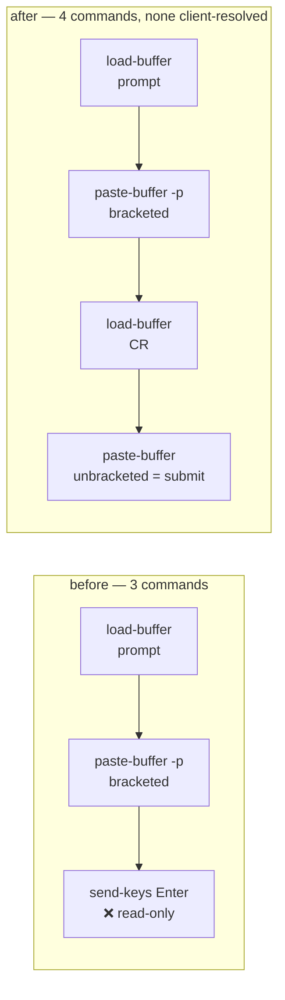
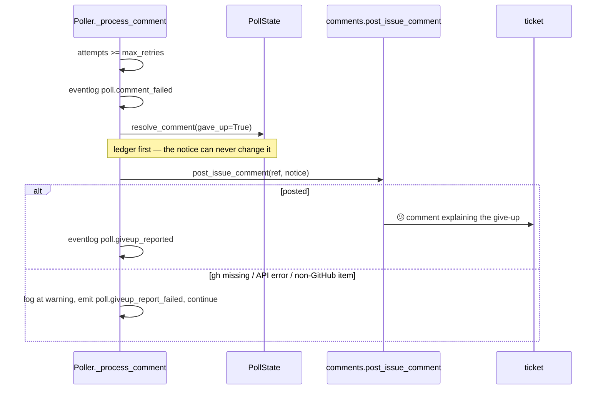

# Design: submit with a paste, and say so on the ticket when a comment is lost

> Phase 2 of 3 (bugfix → design → tasks). Derives from [`bugfix.md`](bugfix.md).
> MUST be reviewed and approved before tasks breakdown.

## Overview

**The submit keystroke stops being a keystroke.** `TmuxRunner.deliver` already moves the
prompt through a tmux paste buffer; the trailing `send-keys … Enter` becomes a second
buffer holding one carriage return, pasted **unbracketed**. `paste-buffer` writes straight
into the target pane and never consults a target client, so a read-only observer is
irrelevant to it — on every tmux version.

**And a comment the poller abandons now says so on the ticket.** `Poller._process_comment`
posts one best-effort notice at the moment it gives up, naming the comment, the attempts,
and the two recoveries that need no state file edited.

The question `bugfix.md` deferred — which mechanism carries the submit byte — is settled as
**a second, unbracketed `paste-buffer`**. The alternatives are recorded as rejected below.

| Requirement | Satisfied by |
|-------------|--------------|
| R1.1, R1.2 | The delivery issues `load-buffer`/`paste-buffer` only. `send-keys` leaves `runner.py` entirely. |
| R1.3 | The prompt paste keeps `-p` (bracketed). |
| R1.4 | The submit paste omits `-p`, so tmux writes the byte without the `\033[200~` wrapper. |
| R1.5 | With no client attached the argv is the same shape it always was; only the third command changed. |
| R2.1, R2.2, R2.3 | `_giveup_notice` composes the body; `post_issue_comment` posts it; `mark_self_authored` marks it. |
| R2.4 | The post is wrapped so no failure can escape, and it runs **after** the ledger is written. |
| R2.5 | The give-up branch runs once per comment — it baselines the comment on the way out. |
| R2.6 | The body is built from the comment id, the attempt count and the ref. The comment body is never read. |
| R3.1–R3.4 | Untouched: the liveness probe, the `session_missing` branch, the `finally: unlink`, and `-d` on both pastes. |
| R4.1, R4.2, R4.3 | An argv-sequence assertion, plus poller tests over the notice and its failure path. |

## Architecture

### Delivery: what changes, and why it is enough

Today's three commands, and what each is answerable to:

| # | Command | Consults a target client? | Refused by a read-only observer (tmux ≥ 3.7)? |
|---|---------|---------------------------|-----------------------------------------------|
| 1 | `load-buffer -b the-loop-evt <file>` | no — it is a server-side buffer write | no |
| 2 | `paste-buffer -p -d -b the-loop-evt -t <target>` | no — `cmd_paste_buffer_exec` writes to `wp->event` | no |
| 3 | `send-keys -t <target> Enter` | **yes** — `CMD_CLIENT_CFLAG` → `cmd_find_current_client` | **yes** |

Only row 3 is the defect, and only row 3 changes. The replacement is row 2's mechanism
without `-p`:



Why an unbracketed paste is a submit and a bracketed one is not: with `-p` tmux emits
`\033[200~` … `\033[201~` around the data *when the pane has bracketed-paste mode on*, and
a TUI that honours the sequence treats everything inside as literal text — which is exactly
why the Enter had to be a separate command in the first place. Without `-p` the bytes are
written raw, so the `\r` arrives as the Return the TUI acts on. The two pastes therefore
keep the property the current code has: one message, then one submit.

The carriage return survives tmux's escaping. `cmd_paste_buffer_paste` runs the data
through `utf8_stravisx(…, VIS_SAFE|VIS_NOSLASH)`, and `VIS_SAFE` is documented to leave
"space, tab, newline, backspace, bell, and return" unencoded. Verified on a live tmux
rather than inferred — see `testing-plan.md` T1.

`\r` and not `\n` on purpose: `\r` is the byte a terminal sends for Return and the byte
`send-keys … Enter` produced, and it is what `paste-buffer`'s own default line separator
already is (`sepstr = "\r"` when neither `-s` nor `-r` is given). `\n` would be a line feed,
which several TUIs bind to "insert a newline" rather than "submit".

A second buffer name (`the-loop-submit`) rather than reusing `the-loop-evt`: both pastes
carry `-d`, which deletes the buffer after use, so reuse would work — but a distinct name
makes the two commands independently readable in `tmux list-buffers` while a delivery is in
flight, and removes any ordering assumption between the delete of one and the load of the
next. The constant is one line.

The submit buffer's content is a module constant, never caller data, so nothing about the
prompt reaches it.

#### Rejected alternatives for the submit

- **`send-keys -t %<pane-id>`** (the ticket's fix 1). Ineffective. `-t` resolves
  `item->target` (the pane); the read-only test is on `item->target_client`, resolved from
  `-c`/current-client and never from `-t`. Traced in `bugfix.md` § Root cause.
- **`send-keys -c <client>` naming a non-read-only client.** When the only attached client
  is the observer there is no such client to name, so the fix would work exactly when the
  bug is absent.
- **Keeping `send-keys` and retrying without it on failure.** Two paths to maintain, one of
  which is only ever exercised on tmux ≥ 3.7 with an observer attached — the least-tested
  path in the most-load-bearing function.
- **Putting the `\r` inside the bracketed prompt buffer.** Cheapest of all, and wrong: the
  whole point of `-p` is that the TUI must not act on the content. It would make the submit
  depend on the TUI *not* honouring bracketed paste.
- **`run-shell` indirection.** Same client resolution problem one level down, plus a shell.

### Notification: where the give-up is announced

`Poller._process_comment` already has everything the notice needs at the moment it decides:
the work item, the comment id, the attempt count. The only new dependency is a way to post,
and `the_loop.comments.post_issue_comment` is the shared, best-effort, injectable-runner
helper that `announce.py` and `control.py` already use.



Ordering is the design decision: **the ledger is written before the notice is attempted.**
The reverse would let a slow or hanging `gh` sit between "we gave up" and "it is recorded",
and a process killed in that window would retry a comment it had already announced as
abandoned. R2.4 is satisfied structurally, not by a `try` alone.

**One notice per abandoned comment** (R2.5) follows from the existing control flow rather
than from new bookkeeping: the give-up branch ends with `resolve_comment(…, gave_up=True)`,
which baselines the id into `seenComments`, and the candidate loop skips seen ids on every
later cycle. The one path that un-resolves it is `rearm_gave_up_comments`, which needs a
different CLI version — and a comment re-armed by an upgrade that then fails three more
times has genuinely been abandoned twice.

#### The notice body

Composed by a module-level pure function, `giveup_notice`, so it is testable without a
poller and so the "no payload text" rule (R2.6) is checkable by reading one function. It
states, in the four-part spine the writing skill asks for:

- **what happened** — a comment could not be delivered to the session, after *n* attempts;
- **what it means** — the loop is not retrying it, so the session never saw it;
- **what to do** — post the instruction again (a new comment id gets a full retry budget),
  and check the session is up with `the-loop sessions list`;
- **why it might have happened** — a pointer to the local event log's `dispatch.failed`
  entries, which carry the actual tmux error.

It names the comment by **URL** when the provider gave one (`Comment.url`) and by id
otherwise. A URL from the provider is a GitHub-issued link, not free text; it is still
emitted inside a markdown link with no other formatting, and R2.6's prohibition on the
comment *body* is what keeps commenter-controlled prose out.

#### Which `gh`, and no new config

The binary comes from `self.dispatcher.config.announce.gh_binary`, the same resolved value
the session announcer uses — one `integrations.github.cli.binary` setting, honoured
everywhere the-loop shells out to `gh`.

No new config key. A switch to disable the notice would be a switch to make a lost
instruction silent again, which is the defect. `routing.announce.enabled` is deliberately
**not** reused: it governs the per-session "here is how to attach" announcement, an
informational message an operator may reasonably not want, whereas this is an error report
about work that did not happen.

## Components and interfaces

| Component | Change |
|---|---|
| `cli/the_loop/runner.py` | `_SUBMIT_BUFFER` and `_SUBMIT_BYTES` constants; `deliver` writes both buffers through the existing tempfile helper and issues four commands, none of them `send-keys`. |
| `cli/the_loop/poller/poller.py` | `giveup_notice(...)` (module-level, pure); `Poller._report_giveup(...)` (best-effort post); one call at the end of the give-up branch. |
| `cli/the_loop/comments.py` | unchanged — used as-is. |
| `docs/capabilities/interactive-sessions.md` | delivery mechanics + the read-only guarantee. |
| `docs/capabilities/*` (poller) | the give-up notice as observable behaviour. |

`deliver`'s signature, return type and every failure mode are unchanged; the dispatcher is
not touched.

### `deliver`, after

```text
if not target                      -> TmuxResult(session_missing=True)   # unchanged
if not has_live_session(target)    -> TmuxResult(session_missing=True)   # unchanged
write prompt to a tempfile
  load-buffer  -b the-loop-evt     <prompt file>
  paste-buffer -p -d -b the-loop-evt    -t <target>
  load-buffer  -b the-loop-submit  <submit file>
  paste-buffer    -d -b the-loop-submit -t <target>
  (first failure returns that TmuxResult, as today)
finally: unlink both tempfiles                                           # unchanged shape
```

Two tempfiles rather than one, both removed in the same `finally`, so R3.3 holds on every
path including a failure between them.

## Error handling

| Failure | Behaviour |
|---|---|
| Prompt paste fails | Returned as-is (no `session_missing`) — as today. The submit is not attempted. |
| Submit paste fails | Same. The prompt is in the TUI unsubmitted; the retry re-pastes it, which is exactly what a `send-keys` failure did before. |
| Pane died between the two pastes | tmux answers `target pane has exited` (≥ 3.7) or writes into a dead pane (older). The next cycle's `has_live_session` probe reports the session missing and the dispatcher respawns — unchanged. |
| `gh` missing when posting the notice | `post_issue_comment` returns `(False, "gh CLI 'gh' not found on PATH")`. Logged once per poller process at warning; the give-up stands. |
| Work item is not GitHub | Same shape, logged at debug — a Jira provider has no `gh` endpoint and this is not an error. |
| `post_issue_comment` raises anything at all | Caught. A notice must never end a poll cycle. |

## Testing strategy

Derived in full in [`testing-plan.md`](testing-plan.md). The two load-bearing tests:

1. **The exact argv sequence** `deliver` issues (R4.2). Assert the full list, not just the
   absence of `send-keys`, so a future edit that reintroduces a client-resolved command
   fails on any machine rather than only on tmux ≥ 3.7 with an observer attached.
2. **A live tmux round trip** (T1): paste a command bracketed, submit it with the CR paste,
   and assert the pane ran it — first with no client attached, then with a genuine
   `tmux attach -r` client attached. This is the only test that proves the *mechanism*
   rather than the argv.

## Minimalism

Ladder applied. No new dependency, no new module, no new config key, no new state. The
delivery change is two constants and one command in a list; the notice reuses the existing
comment helper, the existing event log and the existing best-effort convention. The three
mechanisms the ticket proposed that would have added surface — a cached pane id, a
pre-flight probe, and a give-up expiry policy — are rejected in `bugfix.md` § Out of scope
with reasons, not silently dropped.

## Security design

Enforcing the boundaries `bugfix.md` § Security considerations names:

- **No payload data in an argv.** Both buffers are loaded from files. The prompt keeps its
  existing `mkstemp` path; the submit file's content is `_SUBMIT_BYTES`, a module constant.
  The only interpolated argv values remain the buffer names (constants) and `target`, which
  is the `loop-<slug>` name `target_for` minted.
- **No foreign text in a comment the-loop authors.** `giveup_notice` takes the ref, the
  comment id, the URL and the attempt count. It has no parameter that could carry a comment
  body, which makes R2.6 a property of the signature.
- **`mark_self_authored` on text the-loop wrote in full**, per `announce.py`'s rule, so the
  notice cannot resume the session it is describing.
- **Fail-closed on the ledger.** The notice is attempted only after `resolve_comment` has
  recorded the give-up, so no failure mode can leave a comment counted as delivered.
- **No new attack surface, stated rather than implied.** The fix removes one tmux command
  and adds one; both are already-used verbs with constant buffer names. The notice adds a
  new *occasion* on which the-loop posts a comment, using the same helper, the same
  credentials and the same marker as the three occasions that exist — with the rate bounded
  by authorized users' own commenting (`bugfix.md` § abuse case).
- **Unchanged:** what a read-only client may do. Nothing clears `CLIENT_READONLY`, detaches
  a client, or passes `-c`.

## Trade-offs

- **Four tmux commands instead of three.** One extra round trip per delivered event, on a
  path that already does a liveness probe and a tempfile write. Bought: delivery that does
  not depend on which clients happen to be attached.
- **The submit is no longer expressed as a key.** `send-keys … Enter` reads more obviously
  as "press Return" than a paste of `\r` does, which is why the constant is named
  `_SUBMIT_BYTES` and carries the reason in a comment above it.
- **The notice can be posted for a comment the human already knows about.** If the operator
  is watching the log, the ticket comment is redundant. Accepted: the failure mode being
  fixed is precisely the operator who was *not* watching.
- **A ticket comment costs a `gh` invocation on a failure path.** Bounded by R2.5 and
  best-effort, so a wedged `gh` delays one item's cycle by the 30 s timeout at most.
