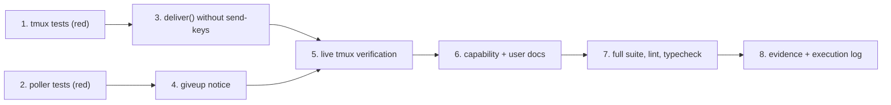

# Tasks: submit with a paste, and say so on the ticket when a comment is lost

> The last spec artifact (bugfix → design → testing plan → tasks). Derived from
> [`design.md`](design.md) and [`testing-plan.md`](testing-plan.md).

**Eight tasks, two independent red roots.** The tmux side (1 → 3) and the poller side
(2 → 4) touch different files and can be worked in either order; they meet at task 6.
`tdd.mode: standard` holds throughout: every production change below is preceded by the
test that motivates it, and the red run is committed before any of it is written.

## Task list

- [ ] 1. Write the tmux delivery tests, and watch them fail
  - Rewrite `test_deliver_pastes_with_bracketed_paste_then_enter`
    (`cli/tests/test_tmux_runner.py:308`) as
    `test_deliver_pastes_bracketed_then_submits_without_send_keys`: assert the **exact**
    four-command argv sequence, that no command is `send-keys`, and that both pastes
    carry `-d`.
  - Add `test_deliver_removes_both_temporary_files`: both `mkstemp` paths are gone
    afterwards, including when the second paste fails.
  - Update the sequence assertion in `cli/tests/test_tmux_runner_integration.py:313`
    under its existing Gherkin docstring.
  - Run against **unfixed** code and capture the failing output for `evidence/red.md`.
  - _Depends on:_ none
  - _Requirements:_ R4.1, R4.2
  - _Test:_ `T2, T5` (red)

- [ ] 2. Write the give-up notice tests, and watch them fail
  - `cli/tests/test_poller.py`: `giveup_notice` carries the self-comment marker, a visible
    attribution line, the attempt count, the comment link and the recovery; and — the
    abuse case — contains none of an adversarial comment body, which it has no parameter
    to receive.
  - `cli/tests/test_poller_integration.py`: Gherkin-documented scenarios for a give-up
    that posts exactly one notice, for the ledger being written even when the post fails,
    and for a second cycle posting nothing more.
  - Run against unfixed code and append the failing output for `evidence/red.md`.
  - _Depends on:_ none
  - _Requirements:_ R4.1, R4.3
  - _Test:_ `T3, T4, T6` (red)

- [ ] 3. Submit with an unbracketed paste instead of `send-keys`
  - `cli/the_loop/runner.py`: add `_SUBMIT_BUFFER` and `_SUBMIT_BYTES` beside
    `_EVENT_BUFFER`, with the reason (`\r`, not `\n`; a constant, never caller data).
  - `deliver`: write both buffers through one tempfile helper, issue the four commands,
    return the first failure unchanged, and unlink both files in `finally`.
  - Leave every other branch — the empty-target guard, `has_live_session`,
    `session_missing`, `kill` — untouched.
  - _Depends on:_ 1
  - _Requirements:_ R1.1–R1.5, R3.1–R3.4
  - _Test:_ `T2, T5`

- [ ] 4. Report a give-up on the ticket
  - `cli/the_loop/poller/poller.py`: add module-level `giveup_notice(...)` (pure,
    `mark_self_authored`, no parameter that can carry a comment body) and
    `Poller._report_giveup(...)` (best-effort; catches everything; emits
    `poll.giveup_reported` / `poll.giveup_report_failed`).
  - Call it at the end of the give-up branch, **after** `resolve_comment(gave_up=True)`.
  - Take the `gh` binary from `self.dispatcher.config.announce.gh_binary`; add no config
    key.
  - _Depends on:_ 2
  - _Requirements:_ R2.1–R2.6
  - _Test:_ `T3, T4, T6`

- [ ] 5. Verify the mechanism against a live tmux
  - Execute T1 and T11 of the testing plan and write `evidence/manual.md`: session set-up,
    a genuine `tmux attach -r` client with `#{client_readonly}=1`, the bracketed paste, the
    CR paste, the pane's own output, and the per-release `cmd-send-keys.c` guard counts.
  - _Depends on:_ 3
  - _Requirements:_ R1.1, R1.3, R1.4
  - _Test:_ `T1, T11`

- [ ] 6. Update the capability docs and the user-facing docs
  - `docs/capabilities/interactive-sessions.md`: how an event is delivered, and the
    read-only guarantee stated as behaviour with an issue-240 history row.
  - The poller capability doc: a give-up is reported on the ticket, and what the notice
    says.
  - Any user-facing page describing `--read-only` or the delivery mechanics.
  - _Depends on:_ 4, 5
  - _Requirements:_ ready-to-ship gate
  - _Test:_ `markdownlint`

- [ ] 7. Run what CI runs
  - `make lint`, `make format-check`, `make typecheck`, `make test`.
  - _Depends on:_ 6
  - _Requirements:_ R3.1, R3.2
  - _Test:_ `T15`

- [ ] 8. Complete the evidence and the execution log
  - `evidence/red.md`, `evidence/unit-and-integration.md`, `evidence/manual.md`;
    `testing-plan.md` § Verification results; `execution-log.md`.
  - _Depends on:_ 7
  - _Requirements:_ evidence gate
  - _Test:_ n/a — the record itself

## Deviations

> Production changes made that the design did not name, recorded here **before** they are
> done rather than explained afterwards.

_None so far._
