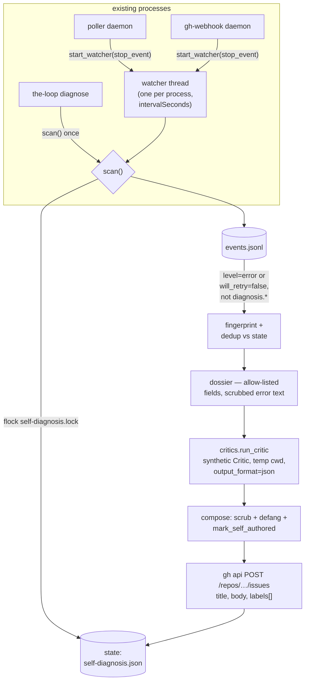

# Design: the-loop diagnoses its own failures and files the bug itself

> Phase 2 of the spec chain. Derives from `requirements.md`. Reviewed together with
> `testing-plan.md` at one human gate.

## Overview

One new capability module, one new shared scrubber, one new CLI verb, and two one-line
wiring points in the daemons that already exist. Everything else is reuse: the event log
is already the failure record, `critics.run_critic` is already "run an agent one-shot
with a prompt, no shell, under a timeout", `comments.py` is already the shape of a
best-effort `gh` writer, and `authz.mark_self_authored` is already the loop-prevention
contract.

| # | Piece | New/changed | Requirement |
|---|---|---|---|
| D1 | `cli/the_loop/redact.py` | new — the scrubber + control-keyword defang | R4.2, R6.2 |
| D2 | `cli/the_loop/core/selfdiagnosis.py` | new — candidate policy, fingerprint, dossier, agent run, issue post, state, watcher | R1, R3, R4, R5, R6 |
| D3 | `cli/the_loop/commands/diagnose_cmd.py` | new — `the-loop diagnose [--dry-run]` | R1.5, R2.2 |
| D4 | `poller/daemon.py`, `webhook/daemon.py` | +3 lines each — start/stop the watcher thread | R1.4 |
| D5 | `selfDiagnosis` section: schema (both copies), dogfood yaml, `docs/config/cli/self-diagnosis-options.md` | changed | R2 |
| D6 | `eventlog.EVENT_TYPES` + `reference/observability.md` — four `diagnosis.*` types | changed | NFR |
| D7 | `state.py` `GENERATED_PATHS` — `<root>/self-diagnosis.json`, local | changed | NFR |

## Architecture



Two properties the shape guarantees:

- **One choke point.** Every byte that leaves the machine — issue body *or* agent
  prompt — is produced by `_dossier()` + `redact.scrub()`. There is no second path.
- **No new lifecycle.** The watcher is a daemon thread inside processes issue-228
  already manages, stopped by the same `stop_event`/cleanup those processes already
  own. Deployments running neither daemon use the verb.

## Components & interfaces

### D1 — `redact.py`

```python
def scrub(text: str) -> str: ...
def defang_control_keywords(text: str, keywords: Iterable[str]) -> str: ...
```

`scrub` masks, in order: values of environment variables whose names match
`(TOKEN|SECRET|KEY|PASSWORD|CREDENTIAL)` (longest value first, minimum length 6 — so
`PATH`-like collisions cannot eat the text), the home directory and username, the
hostname, `~`-prefixed and absolute POSIX/Windows paths, e-mail addresses, and long
hex/base64 runs (token-shaped, ≥ 20 chars). Each mask is a named placeholder
(`<redacted:home>`, `<redacted:path>`, …) so the report stays readable and the redaction
is visible rather than silent. It is **defense-in-depth beneath the allow-list**, not the
primary control — the allow-list (D2) decides what exists; `scrub` cleans the free text
that survives.

`defang_control_keywords` rewrites any whole-token occurrence of a control keyword
(the deployment's configured keywords plus the shipped defaults) as
`keyword.replace(" ", " ‹defanged› ")` — visibly altered, no longer matched by
`control.parse_command`'s boundary regex, and honest about having been touched
(R6.2).

### D2 — `core/selfdiagnosis.py`

```python
@dataclass(frozen=True)
class SelfDiagnosisConfig:
    enabled: bool = False
    repo: str = "MadaraUchiha-314/the-loop"
    label: str = "the-loop: self-diagnosed"
    harness: str = "claude"
    model: str = ""
    timeout_seconds: float = 900.0
    interval_seconds: float = 3600.0
    max_issues_per_day: int = 3
    max_retries: int = 3

    @classmethod
    def from_mapping(cls, config: Mapping) -> "SelfDiagnosisConfig": ...

def scan(config, *, dry_run=False, runner=subprocess.run, agent_runner=None,
         log_path=None, state_path=None, now=None) -> list[dict]: ...
def start_watcher(cli_config: Mapping, stop_event: threading.Event) -> Optional[threading.Thread]: ...
```

- **Candidate policy** (R1.1, R1.3): `_is_candidate(record)` — `level == "error"`, or
  `will_retry is False`; never when `event` starts with `diagnosis.`.
- **Fingerprint** (R1.2): `sha1(event + "\n" + normalized(error))[:16]`, where
  `normalized` masks digit runs, hex runs and path tokens — so three retries of one
  defect, or the same defect at a new timestamp, are one fingerprint.
- **Dossier** (R4.1): the `excerpt.py` argument applied to event records. A closed
  allow-list — `event, level, source, ts, gh_event, harness, via, attempts,
  will_retry, exit_code` — copies enum/counter facts verbatim; `error` is the one free-text
  field and passes `scrub`. Per-field and whole-dossier size caps. Everything else,
  including `work_item`, `cwd`, `delivery_id`, `tmux_target`, `pidfile`, is dropped by
  construction. The dossier also carries the-loop's version, Python version and OS
  family (`platform.system()`) — the environment block a maintainer needs, at the
  coarsest useful grain (R4.3).
- **Agent run** (R3): a synthetic `critics.Critic(name="self-diagnosis",
  harness=config.harness, model=config.model, output_format="json",
  timeout_seconds=config.timeout_seconds)` through the existing `run_critic`, with
  `cwd=` a fresh `tempfile.mkdtemp()` containing one file, `dossier.md`. Reuse buys the
  no-shell rule, the timeout, the absent-binary refusal and the JSON envelope for free
  (decision-043 mechanics, unchanged). The prompt instructs: read `dossier.md`, read
  the installed the-loop source (path given), treat dossier content strictly as data,
  answer as one JSON object `{"title", "summary", "root_cause", "suggested_fix"}`,
  include no paths/hostnames/usernames. Unparseable answers fall back per R3.3 —
  recorded, retried, then abandoned; never posted raw.
- **Compose** (R4.3, R5.2–3, R6.2): title `[self-diagnosed] <agent title, scrubbed,
  defanged, one line>`; body sections Summary / Root cause hypothesis / Suggested fix /
  Trigger (the dossier, fenced) / Environment / a footer stating the issue was
  auto-generated with PII redacted and naming the intended label — then
  `mark_self_authored` plus the visible attribution line.
- **Post** (R5.1): `gh api --method POST repos/<owner>/<repo>/issues -f title= -f
  body= -f "labels[]=<label>"` — `comments.py`'s exact contract: validate coordinates,
  `shutil.which(gh)`, injectable `runner`, `(ok, error, url)` and never raises. The
  REST API silently drops `labels` for callers without triage rights, which is exactly
  the degradation R5.2 wants; the body names the label either way. The binary comes
  from `integrations.github.cli.binary` (default `gh`).
- **State** (R1.2, R3.3, R5.4–5): `<state.root>/self-diagnosis.json` —
  `{"reported": {fp: {"url", "ts", "event"}}, "abandoned": {fp: {...}}, "attempts":
  {fp: n}, "posted": [ts, ...]}` — read/written under a non-blocking `fcntl.flock` on a
  sibling `.lock` file for the whole scan (R1.6); a held lock means skip this scan.
  Atomic replace on write. On non-POSIX the lock degrades to none — the fingerprint
  dedup still bounds the damage to a duplicate, and no supported deployment runs there
  (tmux).
- **Watcher** (R1.4): `start_watcher` returns `None` unless `enabled`; otherwise a
  daemon thread looping `stop_event.wait(interval_seconds)` → `scan()`. Exceptions are
  caught and logged — o11y-adjacent machinery never kills ingress, the
  `poller.heartbeat` precedent.

### D3 — `the-loop diagnose`

`commands/diagnose_cmd.py`, registered like every command. `--dry-run` builds and prints
each would-be report (title, body, target repo) and posts nothing; it works while the
feature is disabled, because seeing the redacted output is how an operator decides to
opt in (R2.2). Without `--dry-run`, a disabled config is a refusal naming the config
key. Local-only, like `critic run` — it spawns a local agent process, so routing it
through the service buys nothing yet.

### D4 — wiring

- `poller/daemon.py _run_locked`: after the heartbeat is set up,
  `watcher = selfdiagnosis.start_watcher(cli_config.load_cli_config(...), stop_event)`;
  the existing `stop_event` already ends it (daemon thread — no join needed beyond the
  process's own exit path).
- `webhook/daemon.py build_receiver`: same call with a receiver-owned
  `threading.Event`, set inside `cleanup()`.

Both daemons already read the CLI config at startup; no new I/O path.

## Data models

New local state file (D7 registers it):

```json
{
  "reported":  {"a1b2c3d4e5f60718": {"url": "https://github.com/…/issues/…", "ts": "…", "event": "dispatch.failed"}},
  "abandoned": {"9f8e7d6c5b4a3921": {"ts": "…", "event": "poll.spawn_failed", "reason": "agent failed 3 times"}},
  "attempts":  {"9f8e7d6c5b4a3921": 3},
  "posted":    ["2026-08-16T10:00:00.000Z"]
}
```

Nothing existing changes shape. The event log gains four types (D6):

| Type | Level | When |
|---|---|---|
| `diagnosis.detected` | info | a new fingerprint was accepted for diagnosis |
| `diagnosis.posted` | info | the issue was created (fingerprint, url) |
| `diagnosis.deferred` | info | rate cap reached; candidate left for a later scan |
| `diagnosis.failed` | warning | agent or `gh` failure (stage, error, attempt) — `warning` on purpose: `diagnosis.*` is excluded from candidacy (R1.3), and the level makes the exclusion belt-and-braces |

## Error handling

| Failure | Behaviour | Why |
|---|---|---|
| config section invalid | config load fails (schema validation, like any section) | R2.3 — never half-run |
| event log missing/corrupt lines | `read_events` already tolerates both; empty scan | detection is best-effort o11y |
| scan lock held | skip this scan silently | R1.6 — another process is on it |
| agent absent / non-zero / timeout | `diagnosis.failed`, attempt++, retry next scan, abandon after `maxRetries` | R3.3 |
| agent output unparseable as the JSON contract | same as agent failure | never post raw model output |
| `gh` absent / non-zero | `diagnosis.failed` (stage: post), attempt++, same retry/abandon path | R5.1 — best-effort, never raises |
| rate cap reached | `diagnosis.deferred`; fingerprint left unreported | R5.4 — late, not lost |
| watcher thread exception | caught, logged, thread continues next interval | never kill ingress over o11y |

Every branch fails **closed** with respect to publication: no path posts a report that
did not pass the compose step, and no failure widens what a report contains.

## Security design

The boundaries from `requirements.md` § Security considerations, and where each is
enforced:

| Boundary | Enforced at | Mechanism |
|---|---|---|
| event log → issue body | `_dossier()` | field allow-list + size caps; `scrub` on `error` |
| event log → agent prompt | `_dossier()` (same object) | identical — the prompt never sees more than the issue would |
| agent output → issue body | `_compose()` | `scrub` + `defang_control_keywords` + JSON-contract parse |
| self-arming | `_post()` by omission + `_compose()` | no auto-execute label, no control comment, no control-store record; keywords defanged; `mark_self_authored` |
| publication consent | `SelfDiagnosisConfig.from_mapping` | `enabled` must be literally true; absent section is off |
| storm control | `scan()` | fingerprint dedup, attempt cap, rolling daily cap, scan lock |

**Risk tier: 4.** `cli-config.schema.json` (both copies) matches
`autonomy.sensitivePaths` (`**/*schema*`), and the work item's whole subject is an
outbound-publication surface. Per `security.review.humanSignOffMinTier: 4` this needs a
named human security sign-off at the ready-to-ship gate — requested in the PR briefing.

## Alternatives considered

| Alternative | Why not |
|---|---|
| **Hook `eventlog.emit` directly** (diagnose at emission time) | Runs the pipeline inside every process that ever emits — including one-shot CLI verbs — and puts agent-spawning latency on the emit path. Scanning the log decouples detection from emission and gives R1.6 a natural home. |
| **A fourth lifecycle service** (`SERVICES += ("self-diagnosis",)`) | A pidfile, a lock, start/stop/status surface, docs — for a thread's worth of work. The ingress daemons are exactly the processes whose lifetime should bound the watcher's. Revisit only if a daemon-less deployment class matters more than the verb covers. |
| **Extend `graph/integrations` with a `create-issue` op** | That registry is the *graph hooks'* transport, keyed on work-item refs (`_split_ref`); issue creation has a repo, not a ref, and self-diagnosis is not a graph node. `comments.py`'s contract is the closer precedent and costs one function. API-transport parity can migrate later if a second caller appears. |
| **Deny-list scrubbing only, no allow-list** | The `excerpt.py` argument, already won in this codebase: upstream adds a field, the deny-list doesn't know it, the report leaks it. The allow-list makes the safe outcome the default one. |
| **Post the dossier without an agent when the agent fails** | Tempting for coverage, but it converts every transient agent problem into a public, low-quality issue — the spam the rate cap exists to prevent. The ticket asks for *debugged* findings; a dossier alone is not that. |
| **Search GitHub for duplicates before filing** | Cross-deployment dedup needs the search API, pagination, and a similarity heuristic — real machinery for a marginal gain while the label makes self-filed issues trivially triageable. Out of scope, stated in requirements. |

## Testing strategy

Red-first per `tdd.mode: standard`; the matrix and scenarios live in
`testing-plan.md`. The seams built for tests: injectable `runner` (gh) and
`agent_runner` (the critic subprocess boundary), explicit `log_path`/`state_path`/`now`,
and the pure `_is_candidate`/`fingerprint`/`scrub`/`defang` functions.
