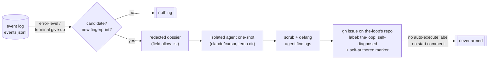

# Requirements: the-loop diagnoses its own failures and files the bug itself

> Phase 1 of the spec chain. This work item started from the owner's request in a cloud
> session (the ticket is the brief), so the artifacts arrive together on one PR for one
> human gate — see `execution-log.md` § Deviations from the standard gates.

## Introduction

When the-loop breaks, the evidence is already written down — and then thrown away.
[#240](https://github.com/MadaraUchiha-314/the-loop/issues/240) is the canonical case: a
read-only tmux observer made every `tmux send-keys` fail, the poller retried three times
per comment, gave up permanently, and the whole story sat in `.the-loop/logs/events.jsonl`
as `dispatch.failed` ×3 → `poll.comment_failed (will_retry: false)`. Nothing looked at
that trail until a human did, reconstructed the failure by hand, and wrote the issue
themselves. The harness had every fact and filed nothing.

This work item ([#242](https://github.com/MadaraUchiha-314/the-loop/issues/242)) closes
that gap: the-loop watches its **own** telemetry for harness-level failures — errors in
the-loop, not in the work item it is running — hands the redacted evidence to an
**isolated** agent one-shot to debug, and posts the findings as a well-formed issue on
the-loop's own GitHub repository, labeled `the-loop: self-diagnosed`. Strictly **opt-in,
default off**, with **all PII and environment data redacted** before anything leaves the
machine, and built so a self-filed issue can **never arm itself** for autonomous
execution.

The diagram carries the two load-bearing boundaries: the **event log is the detection
surface** (everything in it is the-loop's own operational telemetry, never work-item
content — which is exactly the "the-loop's error, not the work item's" distinction the
ticket asks for), and **redaction sits between the log and everything that leaves the
machine** — both the issue body and the prompt fed to the diagnosis agent are built from
the same allow-listed, scrubbed dossier.

## Requirements

### Requirement 1 — detection is a policy over the-loop's own telemetry

**User story:** As the-loop's maintainer, I want deployments that hit a harness bug to
notice it from the evidence the harness already writes, so that bugs like #240 stop
depending on a human replaying a JSONL file.

#### Acceptance criteria (EARS)

1. WHEN an event-log record carries `level: error`, or records a terminal give-up
   (`will_retry: false`), THEN the-loop SHALL treat it as a self-diagnosis candidate.
2. WHEN a candidate's normalized fingerprint (event type plus its error text with
   volatile tokens — digits, hex runs, paths — masked) matches one already reported or
   abandoned THEN the-loop SHALL NOT diagnose it again.
3. WHEN a record's event type belongs to self-diagnosis itself (`diagnosis.*`) THEN the
   record SHALL never be a candidate, so the feature cannot recurse on its own failures.
4. WHILE self-diagnosis is enabled, the long-running ingress daemons (the poller and the
   gh-webhook receiver) SHALL scan for candidates periodically on a background thread,
   and a scan SHALL NOT block event dispatch or a poll cycle.
5. WHEN `the-loop diagnose` is run THEN one scan SHALL run synchronously in the calling
   process, so deployments running neither daemon still have the capability.
6. WHEN two processes would scan concurrently THEN at most one SHALL proceed, so one
   failure never yields two issues.

### Requirement 2 — opt-in, default off

**User story:** As an operator, I want the-loop to post nothing anywhere on my behalf
unless I explicitly turned this on, so that enabling the daemons never becomes consent to
publishing my failure logs.

#### Acceptance criteria (EARS)

1. WHEN the CLI config carries no `selfDiagnosis` section, or carries one without
   `enabled: true`, THEN the-loop SHALL run no scan, start no watcher thread, spawn no
   agent and post nothing.
2. WHEN `the-loop diagnose` is run while the feature is disabled THEN it SHALL refuse
   with the enabling instruction — except `--dry-run`, which SHALL build and print the
   redacted report without posting, so an operator can see exactly what would leave the
   machine **before** opting in.
3. WHEN the `selfDiagnosis` section is present THEN it SHALL validate against the CLI
   config schema like every other section on the surfaces that validate (the config
   editor, onboarding); WHEN a malformed section reaches a runtime reader anyway THEN
   the feature SHALL resolve to **disabled with a logged error** — fail closed, never
   half-enabled — matching the ingress rule that a broken config never breaks the
   daemons.

### Requirement 3 — the diagnosis runs in an isolated agent harness

**User story:** As the-loop's maintainer, I want a fresh agent — not the session that was
doing the work — to read the evidence and reason about the failure, so that the bug
report carries a debugged hypothesis and a suggested fix, not just a log excerpt.

#### Acceptance criteria (EARS)

1. WHEN a new candidate is accepted THEN the-loop SHALL run one configured agent harness
   (claude or cursor, per the existing adapter set) as a **one-shot subprocess**: argv
   list, never a shell, under a configured timeout, in a private temporary working
   directory that is not the operator's project checkout.
2. WHEN the agent is invoked THEN its prompt SHALL contain only the redacted dossier,
   the installed the-loop version and package location, and the reporting instructions —
   never the raw event log, the operator's config, or work-item content.
3. WHEN the agent run fails (missing binary, non-zero exit, timeout, unparseable output)
   THEN the-loop SHALL post nothing for that candidate, record the failure in the event
   log, and retry on a later scan at most `maxRetries` times before abandoning the
   fingerprint — an abandoned fingerprint is recorded and never retried.
4. WHEN the agent's output parses THEN the-loop SHALL take from it a title and a body
   (findings and potential fix) and SHALL treat both as untrusted text subject to
   Requirement 4.

### Requirement 4 — everything that leaves the machine is redacted

> Formal register: these criteria are the contract the security review gates on.

#### Acceptance criteria (EARS)

1. WHEN the dossier is built from candidate records THEN the-loop SHALL copy **only**
   fields on a named allow-list (event type, level, source, timestamp, retry counters
   and enum-valued routing facts), SHALL bound each field and the whole dossier in
   size, and SHALL drop every other field — so a field added upstream later can never
   leak by default.
2. WHEN free text (an `error` string, agent output) enters the dossier or the issue
   body THEN the-loop SHALL pass it through a scrubber that masks the home directory,
   the local username, the hostname, absolute filesystem paths, e-mail addresses,
   token-shaped strings, and the values of sensitive-named environment variables.
3. WHEN the issue body is composed THEN it SHALL be built only from the redacted
   dossier, the scrubbed agent findings, the installed the-loop version, the Python
   version and the OS family — never from raw records, payloads, or configuration.
4. IF a report cannot be built within these rules THEN the-loop SHALL post nothing —
   redaction failure fails closed, never open.

### Requirement 5 — a well-formed issue on the-loop's own repository

**User story:** As the-loop's maintainer, I want the self-filed issue to read like #240
— summary, trigger evidence, root-cause hypothesis, suggested fix, environment — so that
it is actionable the moment it lands.

#### Acceptance criteria (EARS)

1. WHEN a diagnosis succeeds THEN the-loop SHALL create the issue on the configured
   repository (default `MadaraUchiha-314/the-loop`) through the operator's own `gh`
   CLI, best-effort: a missing or failing `gh` is a recorded failure, never a crash.
2. WHEN the issue is created THEN the-loop SHALL request the label
   `the-loop: self-diagnosed` (configurable); WHEN the operator's credentials cannot
   apply labels on the target repository (GitHub drops the request silently for
   non-triage users) THEN the issue SHALL still be created and the body SHALL name the
   intended label, so the marker survives the permission gap.
3. WHEN the body is composed THEN it SHALL carry the loop-prevention marker
   (`<!-- the-loop:agent-comment -->`) and a visible attribution line naming
   self-diagnosis and the-loop's version, so both ingress paths recognise it as
   the-loop's own text.
4. WHEN more issues than `maxIssuesPerDay` would be posted in a rolling day THEN the
   excess candidates SHALL be deferred to a later scan, not dropped and not posted.
5. WHEN an issue is posted THEN its URL SHALL be recorded against the fingerprint in
   local state and in the event log, so the operator can trace every issue the feature
   ever filed from their own machine.

### Requirement 6 — a self-filed issue can never arm itself

> Formal register: these criteria are the contract the security review gates on.

#### Acceptance criteria (EARS)

1. WHEN the-loop creates a self-diagnosed issue THEN it SHALL NOT apply the
   auto-execute label (`routing.autoExecuteLabel`), SHALL NOT post any control
   keyword comment (`the-loop start` or any configured equivalent), and SHALL NOT
   record a control-store arming for the created issue.
2. WHEN the composed title or body would contain a control keyword as a parseable
   token (the agent's prose may legitimately mention one) THEN the-loop SHALL defang
   it so `control.parse_command` no longer matches it.
3. WHEN a self-diagnosed issue's creation or its body later re-enters the-loop through
   the webhook or the poller THEN the self-authored marker SHALL cause it to be dropped
   before the authorized-actor check, per the existing issue-104 contract.

## Non-functional requirements

- **Observability.** Detection, posting, deferral and failure are event-log event types
  registered in `EVENT_TYPES` and mirrored in `reference/observability.md` — the same
  bar every other surface meets. `diagnosis.failed` is emitted at `warning`, and
  `diagnosis.*` is excluded from candidacy (R1.3), so the feature cannot storm itself.
- **No new dependencies.** stdlib only, like the rest of the CLI (decision-005).
- **State is local, not portable.** What this machine has reported is a fact about this
  machine's failures; it lives under `state.root` beside the other local state and is
  registered in the generated-paths registry.
- **Cost.** A scan with no candidates is one file read; the agent runs only for a new
  fingerprint, at most `maxIssuesPerDay` successful posts per day.

## Security considerations

> Threat-model-lite per `security.threatModel.required`. This work item **adds attack
> surface twice over**: it publishes machine-derived text to a public repository, and it
> feeds attacker-influenceable text to an agent with local filesystem access. Both flows
> pass one choke point — the dossier — and that is the design's job to enforce.

- **Actors & trust boundaries.** Untrusted: anyone who can cause an error record whose
  text embeds their content (a crafted comment that fails dispatch, a branch name in a
  git error), and — transitively — the diagnosis agent's output, since its input
  includes that text. Trusted: the operator's config and credentials. The two boundaries
  are (1) event log → outbound issue body, and (2) event log → agent prompt.
- **Exfiltration via the report.** Error strings routinely embed absolute paths,
  usernames and occasionally tokens. Mitigation is R4: an **allow-list** decides which
  fields exist at all (the `excerpt.py` argument — a deny-list rots as fields are
  added), and the scrubber masks what free text may still carry. Work-item refs and
  repository names are **not** on the allow-list: an operator's private repo name is
  environment data.
- **Prompt injection into the diagnosis agent.** A crafted error string reaches the
  agent's prompt. The agent runs isolated (temp dir, no work-item session, no ticket
  context, one-shot, timeout), its permissions are whatever the operator's harness
  grants — stated in the docs — and its **output** is treated as untrusted: scrubbed
  (R4.2), defanged (R6.2), and marked self-authored (R5.3). Residual risk is accepted
  and documented; the feature is opt-in precisely because of it.
- **Self-arming / loop closure.** A the-loop deployment may be watching the very repo it
  files to (this one dogfoods that). Three independent stops: no auto-execute label is
  ever applied (the poller's discovery filter never lists the issue), no control keyword
  is ever posted or parseable from the body (R6.1–2), and the marker drops the text at
  ingress (R6.3). Each stop alone suffices; all three are asserted by tests.
- **Issue-creation storms.** Fingerprint dedup (R1.2), retry cap (R3.3) and the rolling
  daily cap (R5.4) bound what a crash loop can post. The cap defers rather than drops,
  so a real bug is late, not lost.
- **Fail closed.** No config section → off. Invalid section → config load fails.
  Unbuildable report → nothing posted. Concurrent scan → one proceeds (R1.6).

## Out of scope

- **Auto-fixing.** The agent proposes a fix in prose; nothing applies patches, opens
  PRs, or modifies the installed package.
- **A new daemon.** Detection rides the processes that already exist (the two ingress
  daemons and the manual verb); no fourth lifecycle service.
- **Non-GitHub trackers.** The target is the-loop's own GitHub repo; `ticketing.system`
  abstraction is untouched.
- **The control-plane API/MCP surface.** `the-loop diagnose` is CLI-only for now; a
  route can be added when something needs it.
- **Deduplication against issues already on GitHub.** Dedup is per-machine state. Two
  *machines* hitting the same bug may each file once; cross-deployment dedup would need
  a search API dependency and is deliberately deferred.

## Review comments

> Appended by the-loop's `record-feedback` hook when a human gate approves with comments.
