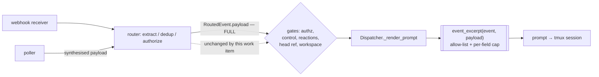
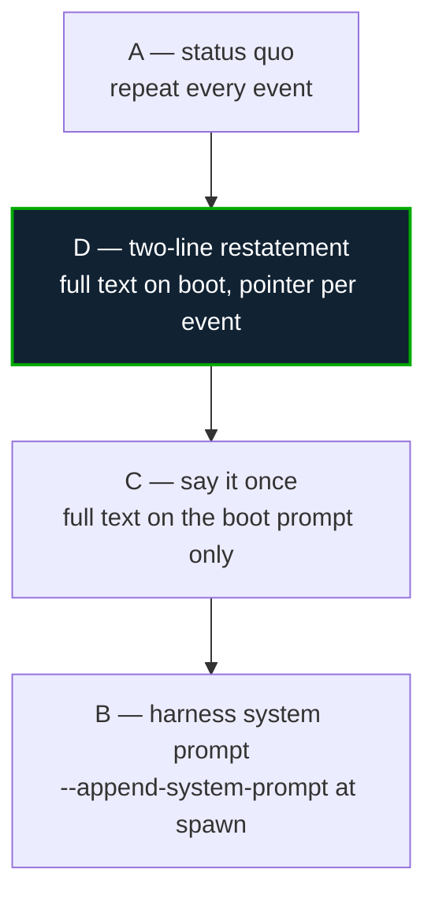

# Design: a forwarded event carries the instruction, not GitHub's metadata

> Phase 2 of 3. Derived from the approved [`requirements.md`](requirements.md).

## Overview

One function changes. `payload_excerpt(payload)` today copies **whole container objects**
out of the webhook payload and JSON-dumps them under a 4,000-character guillotine. It
becomes `event_excerpt(event, payload)`: a **field-level allow-list per container**, with
free text capped per field so the guillotine never falls on an address.

Three properties follow from that one shape, and they are the reason it is an allow-list
rather than a deny-list of noisy keys:

- **New GitHub fields cost nothing.** GitHub adds keys to payload objects routinely
  (`user_view_type` and `sub_issues_summary` are both recent). A deny-list would silently
  re-inflate; an allow-list does not move.
- **Truncation stops being structural.** Capping `body` before the dump keeps the JSON
  parseable, so nothing else in the excerpt can be lost to a long comment.
- **The distiller is one seam.** Both ingresses render through `Dispatcher._render_prompt`
  (R4.2), so there is one place to test and one place to change.



The dashed edge is the point of R5: everything that *acts* on an event keeps reading the
full payload. Only the last hop — the text a human-language model reads — is distilled.

## Architecture

### Where the code lives

A new module, `cli/the_loop/webhook/excerpt.py`, holding the tables and the function;
`dispatcher.py` imports it and re-exports `payload_excerpt` for compatibility.

The alternative was to keep it inside `dispatcher.py`, where `payload_excerpt` lives
today. Rejected: that module is 2,563 lines and is the busiest file in the CLI, and the
distiller is a **pure `(event, payload) → str`** function of the same family as
`router.py`'s extractors — which already live in their own module for exactly this reason
(“pure functions … no I/O, so extraction is unit-testable per event type”). The
re-export keeps `from .dispatcher import payload_excerpt` working for anything outside
this repository that imported it.

### The distillation tables

Two tables, both data:

```python
_CONTAINERS: Dict[str, Tuple[str, ...]]      # container key  -> fields, in emission order
_EVENT_CONTAINERS: Dict[str, Tuple[str, ...]] # event name    -> containers to read
```

| Container | Fields carried, in order | Why this set |
|---|---|---|
| `comment` | `path`, `line`, `body`, `html_url` | Anchor first (issue-246's rule, now guaranteed by R3.3 as well as by order); `path`/`line` are simply absent on a conversation comment |
| `review` | `state`, `body`, `html_url` | `state` is carried as context, as issue-246 decided; nothing acts on it |
| `issue` | `number`, `title`, `state`, `html_url` | What a lifecycle event (`opened`, `closed`, `labeled`) is *about* |
| `pull_request` | `number`, `title`, `state`, `draft`, `merged`, `html_url` | Adds the two booleans that change what the session should do |
| `label` | `name` | On `labeled`/`unlabeled` the label **is** the event |
| `workflow_run` | `name`, `event`, `status`, `conclusion`, `head_branch`, `html_url` | Enough to diagnose and to open the run |
| `check_run` | `name`, `status`, `conclusion`, `output`, `html_url`, `details_url` | `output` is `{title, summary}` — the failure message itself |
| `check_suite` | `status`, `conclusion`, `head_branch`, `head_sha` | A suite has no `html_url` and no name |

Each container additionally carries `author` — `user.login` flattened to a string (R1.5) —
and never the `user` object.

| Event | Containers read |
|---|---|
| `issue_comment`, `pull_request_review_comment` | `comment` |
| `pull_request_review` | `review` |
| `issues` | `issue`, `label` |
| `pull_request`, `pull_request_review_thread` | `pull_request`, `label` |
| `workflow_run` / `check_run` / `check_suite` | the same-named container (plus `pull_request`? **no** — see below) |
| `status` | none; `status` fields sit at the payload root, so a third table entry carries `state`, `context`, `description`, `target_url` |
| anything else (operator-configured event) | every container in `_CONTAINERS` the payload happens to carry (R2.6) |

An `issue_comment` therefore drops the `issue` object entirely, which is the ticket's
central ask: *“The url of the comment already has the URL of the PR or the issue.”* The
session also already knows its work item — the prompt's first line names it.

CI events do **not** pull in the `pull_request` container even when GitHub nests a
`pull_requests` array: those entries carry no title and no state, only numbers and API
URLs, and the branch (`head_branch`) is both present and more useful.

### The actor

The top-level `sender` object is dropped, and the acting login is carried inside its
container as `author`. For an `issues`/`pull_request` lifecycle event the containers have
no `user` that means "who acted" — GitHub's `issue.user` is the *opener*, not the actor —
so those events carry a top-level `"actor"` taken from `router.event_actor(event,
payload)`. Reusing that function rather than re-reading `sender.login` keeps one
definition of “who is responsible for this event”, the same one authorization uses.

## Components & interfaces

```python
# cli/the_loop/webhook/excerpt.py

TEXT_MAX_CHARS = 3_500          # per free-text field
EXCERPT_MAX_CHARS = 4_000       # defensive backstop on the whole rendered string

def event_excerpt(event: str, payload: dict) -> str:
    """The distilled, JSON-formatted summary of ``event`` for a prompt."""

def payload_excerpt(payload: dict) -> str:
    """Backwards-compatible alias: distil without an event name (R2.6 path)."""
```

`Dispatcher._render_prompt` passes `routed.event`; nothing else in the call chain changes.
The function is total: it raises nothing, and returns `"{}"` for a payload it recognises
nothing in (R2.7).

## Data models

The rendered excerpt for the ticket's own worked example — a conversation comment:

```json
{
  "comment": {
    "body": "the-loop execute\n\nPlease keep the anchor for inline comments.",
    "html_url": "https://github.com/o/r/issues/243#issuecomment-9876543210",
    "author": "reviewer"
  }
}
```

238 characters, against 4,014 today, for the same event.

## Error handling

| Situation | Behaviour | Why |
|---|---|---|
| Container missing, `None`, or not a mapping | That container contributes nothing | A payload shape the-loop has not seen must not cost an authorized event its delivery (R2.7) |
| Field missing or `None` | Omitted from the excerpt | An explicit `"line": null` is noise; absence says the same thing |
| Field present but huge (`body`, `description`, `summary`, `output.summary`) | Truncated at `TEXT_MAX_CHARS` with `… (truncated)` inside the string value | R3.1/R3.2 — the JSON stays parseable |
| Whole excerpt still over `EXCERPT_MAX_CHARS` | Chopped as today, with the marker | Defensive only: reachable in theory (a pathological label set), never in the measured cases |
| Unknown event name | Distil every known container present | R2.6 — an operator's extra `routing.events` entry still gets a lean, safe excerpt |

## Security design

The trust boundary is unchanged in position and **narrower in width**. Concretely:

| Boundary crossing | Before | After |
|---|---|---|
| Attacker-controlled free text entering the prompt | comment body, issue title, issue body, review body, label descriptions, every `user` object's login-derived URLs (×2 objects × 18 URLs) | comment/review body, plus entity title on lifecycle events, plus a bare login |
| Bound on that text | one 4,000-char cut across the whole excerpt, which could remove the URL and the anchor | 3,500 chars **per field**, with URL and anchor structurally outside it |
| Structural forgery (a body that mimics excerpt JSON) | contained by `json.dumps` escaping | unchanged — still contained, and now with fewer sibling fields to imitate |

Two properties are asserted by negative tests rather than argued:

1. **No API URL and no `user` object reaches a prompt.** The excerpt is searched for
   `api.github.com` and for `avatar_url` and must contain neither.
2. **The gates are untouched.** `is_authorized`, `is_self_authored`, control parsing and
   `reactions.target_from_event` all read `RoutedEvent.payload`; a test dispatches an
   event whose excerpt omits the fields those gates read and asserts they still decide
   correctly.

Fail-safe, not fail-closed, is the deliberate choice for the renderer (`requirements.md`
§ Security considerations): by the time `_render_prompt` runs, a human-authored,
authorized event exists, and refusing to render it would drop the instruction.

## The constant text (the ticket's second question)

> *“Additionally, we are sending a HUGE prompt with each comment, is that necessary? Can
> we just have all the different interaction patterns in the system prompt? Or will that
> get lost during the long execution of the work item? Present pros/cons.”*

### What is actually constant, and what it costs

After this work item's change, a delivered comment prompt is ~2,900 characters, of which
the constant part is:

| Block | Chars | Varies? |
|---|---:|---|
| Template shell (header, “react to this event per the-loop's rules”, UNTRUSTED framing) | 748 | Only the 4 header values |
| `$interaction_directive` (`work-item` mode) | 1,542 | Constant per mode; re-read from config on reload |
| `$graph_context` | ~372 | **Yes** — current node, phase, gate verdict, resume command |
| Distilled excerpt | ~240 | Yes |

So ~2,290 characters (~570 tokens) per event are byte-identical to the previous event's.
At 50 events on a work item that is ~29k tokens — real, but an order of magnitude below
what the excerpt was costing before this change, and roughly one-fiftieth of a single
context window.

### The options



**A. Status quo — repeat the constant text on every event.**
*Pros:* the rules are the most recent thing the model read before acting, which is where
instruction-following is strongest; survives compaction, `/clear`, and a `--resume` into a
conversation whose early turns are gone; template-driven, so an operator can change it
without touching the-loop; one code path for both ingresses and for spawn-vs-deliver.
*Cons:* ~580 tokens per event, forever; the reader sees the same 1,542-character directive
above every comment, which is noise for a human attached to the tmux pane.

**B. Move it into the harness system prompt.**
*Pros:* stated once per session; a system prompt is outside the conversation, so
compaction cannot drop it; prompt caching makes the repeated tokens near-free on the
provider side.
*Cons, and they are the decisive ones:*
- **the-loop does not have this capability today.** `ClaudeCodeAdapter` builds
  `["--session-id", id] + extra_args + [prompt]`; nothing passes
  `--append-system-prompt`, and `extra_args` is the *operator's* `harnessArgs`, not a
  place the-loop may write. Adding it is a new adapter interface.
- **It would be a Claude-Code-specific mechanism behind a harness-agnostic interface.**
  `HarnessAdapter` is the seam every harness comes through, and today only
  `ClaudeCodeAdapter` implements the interactive methods at all — `CursorAgentAdapter`
  raises `UnsupportedRunnerError` for them and serves as a critic harness only. So B
  works *now* by accident of there being one interactive adapter; the next one has to
  provide a system-prompt channel or silently lose a rule that decision-051 calls a gate.
  Option A and option D need nothing from an adapter.
- **It freezes at spawn.** `Dispatcher.reload` re-reads `routing.interaction.mode` and
  every subsequent prompt reflects the change. A system prompt set at spawn cannot; an
  operator switching `work-item` → `cli` would have to kill every live session.
- **It is invisible in the paper trail.** The delivered prompt is what the tmux pane
  shows and what a human debugging “why did it not ask me?” reads. A system prompt is not
  in the scrollback.
- **`--resume` is a different process.** The resume path re-execs the harness; whether an
  appended system prompt is restored is a harness implementation detail the-loop would be
  betting on, silently, per version.

**C. State it once, on the boot/spawn prompt, and never again.**
*Pros:* no new adapter surface; costs one prompt; keeps the text visible in the
scrollback.
*Cons:* the boot prompt is an ordinary conversation turn — compaction and `--resume` can
and do lose it, and `contextManagement` **tells** sessions to clear at phase boundaries.
The failure is silent and looks like the agent “deciding” to ask interactively.

**D. Recommended — full text at spawn, a two-line restatement per event.**
Keep the full directive in the spawn template; replace it in the *event* template with a
short standing reminder that names the mode and the one action it implies (“ask by
running `the-loop ask …`; never block on this terminal”), plus the UNTRUSTED framing,
which must stay adjacent to the untrusted data it frames.
*Pros:* keeps the rule salient and recent (the reason A works); recovers ~1,200 of the
~1,540 directive characters per event; no new adapter interface; unchanged for operators
with custom templates, since it is a template edit plus a shorter constant.
*Cons:* two texts to keep in sync per mode (mitigated: both are generated from the same
`interaction.py` mode table, and `test_interaction.py` already asserts template/constant
parity); a session that clears context between events sees the short form only — which is
why the short form must be *sufficient*, not merely a pointer to text that may be gone.

### Recommendation

**Do D, but not in this work item.** The distillation above removes ~3,800 characters per
event; D removes a further ~1,200 for a change that touches a stated invariant
(decision-051: *every* rendered prompt states where the session takes its answers from)
and the shipped templates operators may have copied. That is the owner's call, and per R6
it is posted on the ticket rather than taken here. **B is not recommended at all** until
`CursorAgentAdapter` has an equivalent and the resume behaviour is pinned by a test.

## Testing strategy

Unit tests own the tables (one per event family, plus the negative assertions about API
URLs and `user` objects) and the cap behaviour (a 10 KB body: the field is truncated, the
excerpt still parses, the URL survives). Integration tests own the two things unit tests
cannot see: that a webhook event and the poller's synthesised event for the same object
render the same fields (R4.1), and that the gates still decide correctly on an event whose
excerpt no longer shows their inputs (R5.1). Full matrix: [`testing-plan.md`](testing-plan.md).

## Trade-offs & decisions

| Decision | Alternative rejected | Why |
|---|---|---|
| Field allow-list per container | Deny-list of noisy keys (`*_url`, `user`, `reactions`) | GitHub adds keys; a deny-list re-inflates silently |
| New module `webhook/excerpt.py` | Keep it in `dispatcher.py` | 2,563-line module; this is a pure function in `router.py`'s family |
| Keep `$payload_excerpt` placeholder and its framing | Rename to `$event_summary` | It is a contract with operator-authored templates (R5.2); the rename buys nothing |
| Cap per field, keep the global cap as a backstop | Replace the global cap | Cheap insurance against a shape nobody predicted; costs one branch |
| `check_run.output` carried | Dropped as metadata | It is the failure message — dropping it forces a second lookup for the most common CI event |
| Answer the constant-text question, do not act on it | Implement option D here | It weakens a stated invariant (decision-051); the ticket asked for pros/cons |

## Open questions

Only R6's, which is the owner's to close: adopt option D, or leave the constant text as
it is.

## Review comments

*None yet.*
